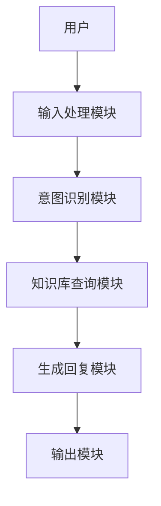
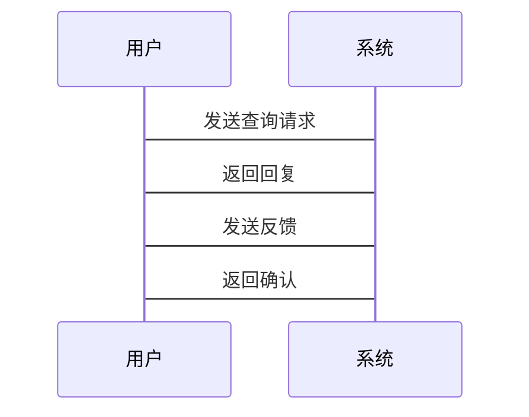

                 


# AI Agent的对话系统在智能客服中的进阶应用

> 关键词：AI Agent，对话系统，智能客服，自然语言处理，机器学习，知识库

> 摘要：本文深入探讨了AI Agent对话系统在智能客服中的应用，从基础概念到进阶技术，结合实际案例和系统架构设计，详细讲解了如何利用AI技术提升智能客服的效率和用户体验。

---

## 第一部分: AI Agent与对话系统的背景介绍

### 第1章: AI Agent的基本概念

#### 1.1 AI Agent的定义与特点

##### 1.1.1 AI Agent的基本概念
AI Agent（人工智能代理）是指能够感知环境并采取行动以实现目标的智能实体。它可以是一个软件程序，也可以是一个物理设备，通过传感器和执行器与外部环境交互。

##### 1.1.2 AI Agent的核心特点
- **自主性**：能够独立决策和行动，无需人工干预。
- **反应性**：能够实时感知环境变化并做出反应。
- **目标导向**：所有行动都围绕实现特定目标展开。
- **学习能力**：通过数据和经验不断优化自身行为。

##### 1.1.3 AI Agent与传统客服的区别
传统的客服依赖人工操作，而AI Agent通过自动化处理，能够24/7提供服务，且能够同时处理多个请求。

---

#### 1.2 对话系统的概述

##### 1.2.1 对话系统的定义
对话系统是一种能够理解和生成自然语言的系统，能够在人与计算机之间进行有效交流。

##### 1.2.2 对话系统的分类
- **基于规则的对话系统**：通过预定义的规则和模板生成回复。
- **基于统计的对话系统**：利用大数据和机器学习技术生成回复。
- **基于模型的对话系统**：使用深度学习模型（如Transformer）生成回复。

##### 1.2.3 对话系统的应用场景
- 客服支持
- 信息查询
- 购物推荐
- 健康咨询

---

### 第2章: AI Agent在智能客服中的应用背景

#### 2.1 智能客服的发展历程

##### 2.1.1 传统客服模式的局限性
- 人工成本高
- 服务时间受限
- 无法同时处理大量请求

##### 2.1.2 AI技术对智能客服的推动作用
- 提供24/7服务
- 处理复杂查询
- 提高客户满意度

##### 2.1.3 当前智能客服的现状与趋势
- 现状：基于规则的系统占据主流，基于模型的系统逐渐兴起。
- 趋势：向更智能化、个性化方向发展。

---

#### 2.2 对话系统在智能客服中的价值

##### 2.2.1 提高客户满意度
通过准确理解客户需求，提供个性化服务，提升客户体验。

##### 2.2.2 提升服务效率
自动化处理大量请求，减少人工干预，提高服务效率。

##### 2.2.3 降低企业运营成本
通过自动化减少人力成本，同时提高服务效率。

---

#### 2.3 智能客服中的AI Agent进阶应用

##### 2.3.1 多轮对话处理
通过上下文理解和记忆，能够处理复杂的多轮对话，确保对话连贯性。

##### 2.3.2 情境理解与推理
基于上下文和历史记录，理解用户意图，并进行推理和判断。

##### 2.3.3 个性化服务推荐
根据用户历史行为和偏好，推荐个性化服务或产品。

---

## 第二部分: AI Agent对话系统的核心概念与技术

### 第3章: 对话系统的架构与实现

#### 3.1 对话系统的整体架构

##### 3.1.1 输入处理模块
负责接收用户输入，并进行初步的文本处理，如分词、词性标注等。

##### 3.1.2 意图识别模块
通过自然语言处理技术，识别用户的意图和需求。

##### 3.1.3 生成回复模块
根据意图理解和知识库内容，生成合适的回复。

##### 3.1.4 反馈优化模块
根据用户反馈不断优化对话系统，提高回复准确率。

---

#### 3.2 自然语言处理技术

##### 3.2.1 分词与词性标注
- 分词：将连续文本分割成词语或短语。
- 词性标注：为每个词语标注其词性（如名词、动词、形容词等）。

##### 3.2.2 情感分析与语义理解
- 情感分析：判断文本的情感倾向（如正面、负面、中性）。
- 语义理解：理解文本的深层含义，提取关键信息。

##### 3.2.3 对话上下文管理
通过维护对话历史，理解上下文关系，确保对话连贯性。

---

#### 3.3 知识库与领域建模

##### 3.3.1 知识库的构建与管理
- 数据来源：包括企业知识库、公开数据集、用户反馈等。
- 数据清洗：去除噪声数据，确保数据质量。
- 数据标注：对数据进行分类和标签化处理。

##### 3.3.2 领域模型的建立
- 基于知识图谱构建领域模型，描述实体及其关系。
- 使用领域模型进行意图理解和实体识别。

##### 3.3.3 知识图谱的应用
- 知识图谱是一种结构化的知识表示方式，能够帮助对话系统更好地理解用户意图。

---

### 第4章: 对话系统的训练与优化

#### 4.1 数据收集与预处理

##### 4.1.1 数据来源与采集方法
- 数据来源：包括用户日志、客服记录、公开数据集等。
- 数据采集方法：日志挖掘、用户调研、爬虫技术等。

##### 4.1.2 数据清洗与标注
- 数据清洗：去除重复数据、噪声数据等。
- 数据标注：对数据进行分类、打标签等处理。

##### 4.1.3 数据增强技术
- 数据增强：通过数据扩展技术（如同义词替换、数据合成）增加数据多样性。

---

#### 4.2 对话模型的训练

##### 4.2.1 基于Seq2Seq的对话模型
- Seq2Seq模型：一种基于编码器-解码器结构的模型，广泛应用于机器翻译和对话生成。
- 模型结构：编码器将输入序列映射到一个固定长度的向量，解码器根据编码结果生成输出序列。

##### 4.2.2 基于BERT的对话模型
- BERT模型：基于Transformer的预训练模型，具有强大的语义理解能力。
- BERT在对话中的应用：通过微调BERT模型，使其适应对话任务。

##### 4.2.3 模型训练的优化策略
- 参数调整：如学习率、批次大小等。
- 模型融合：将多种模型的结果进行融合，提高准确性。

---

#### 4.3 对话系统的评估与优化

##### 4.3.1 评估指标的选择
- 常见评估指标：准确率、召回率、F1分数、BLEU分数等。

##### 4.3.2 基于反馈的优化
- 用户反馈：收集用户对系统回复的评价，用于优化模型。
- A/B测试：通过对比不同策略的效果，选择最优方案。

##### 4.3.3 持续学习与进化
- 持续学习：系统通过不断学习新数据，适应新的对话场景。
- 模型进化：通过遗传算法等技术，优化模型结构和参数。

---

## 第三部分: 对话系统的算法原理

### 第5章: 基于Seq2Seq的对话模型

#### 5.1 Seq2Seq模型的工作原理

##### 5.1.1 编码器部分
- 输入序列通过编码器转换为一个固定长度的向量。
- 编码器内部使用多层的Transformer结构，提取文本的语义信息。

##### 5.1.2 解码器部分
- 解码器根据编码器输出的向量，逐步生成输出序列。
- 解码器内部也使用多层的Transformer结构，同时通过自注意力机制，确保生成的回复与输入相关。

##### 5.1.3 注意力机制
- 注意力机制：用于计算输入序列中每个位置的重要性，帮助模型关注关键信息。

---

#### 5.2 基于Seq2Seq的对话模型实现

##### 5.2.1 模型训练代码示例
```python
import tensorflow as tf
from tensorflow.keras.layers import Dense, Input, LSTM, Bidirectional, Dropout, GRU
from tensorflow.keras.models import Model, load_model
from tensorflow.keras import layers

# 定义编码器
encoder_input = Input(shape=(max_seq_length,))
encoder_lstm = GRU(units=128, return_sequences=True, return_state=True)(encoder_input)
encoder_output, _, _ = encoder_lstm

# 定义解码器
decoder_input = Input(shape=(None,))
decoder_lstm = GRU(units=128, return_sequences=True)(decoder_input, initial_state=[encoder_output])
decoder_dense = Dense(vocab_size, activation='softmax')(decoder_lstm)

# 定义模型
model = Model(inputs=[encoder_input, decoder_input], outputs=decoder_dense)
model.compile(optimizer='adam', loss='sparse_categorical_crossentropy', metrics=['accuracy'])
```

##### 5.2.2 模型训练与优化
- 损失函数：交叉熵损失函数。
- 优化器：Adam优化器。
- 模型训练：使用训练数据进行监督学习，不断优化模型参数。

---

### 第6章: 基于BERT的对话模型

#### 6.1 BERT模型的工作原理

##### 6.1.1 BERT的预训练目标
- MaskedLM任务：随机遮蔽部分单词，要求模型预测被遮蔽的单词。
- NSP任务：判断两个句子是否为下一个句子。

##### 6.1.2 BERT的中文适配
- 使用中文预训练模型（如BERT-wwm-ext）
- 微调模型：在特定任务上进行微调，使其适应对话生成任务。

---

#### 6.2 基于BERT的对话模型实现

##### 6.2.1 模型结构
```python
import tensorflow as tf
from tensorflow.keras.layers import Input, Dense, Dropout, Lambda
from tensorflow.keras.models import Model

# 定义输入
input_ids = Input(shape=(max_seq_length,), dtype='int32')
token_type_ids = Input(shape=(max_seq_length,), dtype='int32')
attention_mask = Input(shape=(max_seq_length,), dtype='int32')

# BERT编码器
bert_encoder = BertEncoder(...)
encoded_sequence = bert_encoder(input_ids, token_type_ids, attention_mask)

# 解码器
decoder_output = Dense(128, activation='relu')(encoded_sequence)
output = Dense(vocab_size, activation='softmax')(decoder_output)

# 定义模型
model = Model(inputs=[input_ids, token_type_ids, attention_mask], outputs=output)
model.compile(optimizer='adam', loss='sparse_categorical_crossentropy', metrics=['accuracy'])
```

##### 6.2.2 模型训练与调优
- 使用中文大规模语料库进行预训练。
- 在特定任务上进行微调，如客服对话生成。

---

## 第四部分: 系统架构与设计

### 第7章: 系统架构设计

#### 7.1 项目介绍

##### 7.1.1 项目背景
- 某电商平台的智能客服系统升级项目。
- 目标：提高客户满意度，降低人工成本。

##### 7.1.2 项目需求
- 多轮对话处理
- 情境理解与推理
- 个性化服务推荐

---

#### 7.2 系统功能设计

##### 7.2.1 领域模型设计
- 实体识别：识别文本中的关键实体（如产品名称、订单号等）。
- 关系抽取：抽取实体之间的关系（如“订单号”与“客户ID”之间的关系）。

##### 7.2.2 功能模块设计
- 用户输入处理模块
- 意图识别模块
- 知识库查询模块
- 生成回复模块

---

#### 7.3 系统架构设计

##### 7.3.1 系统架构图


##### 7.3.2 接口设计
- 输入接口：接收用户的文本输入。
- 输出接口：返回生成的回复文本。
- 知识库接口：提供知识查询服务。

---

#### 7.4 系统交互设计

##### 7.4.1 交互流程


---

## 第五部分: 项目实战

### 第8章: 项目实战

#### 8.1 环境搭建

##### 8.1.1 安装依赖
```bash
pip install tensorflow==2.5.0
pip install numpy==1.21.0
pip install mermaid
```

##### 8.1.2 环境配置
- 配置Python版本：Python 3.8+
- 配置GPU支持（可选）。

---

#### 8.2 核心代码实现

##### 8.2.1 意图识别模块

```python
import numpy as np
from sklearn.feature_extraction.text import TfidfVectorizer
from sklearn.naive_bayes import MultinomialNB

# 数据准备
X = [...]  # 文本数据
y = [...]  # 标签

# 特征提取
vectorizer = TfidfVectorizer()
X_vec = vectorizer.fit_transform(X)

# 模型训练
model = MultinomialNB()
model.fit(X_vec, y)

# 预测
def predict_intent(text):
    vec = vectorizer.transform([text])
    return model.predict(vec)[0]
```

##### 8.2.2 知识库查询模块

```python
import sqlite3
from sqlite3 import Connection

# 数据库连接
conn = sqlite3.connect('knowledge_base.db')

# 查询函数
def query_knowledge_base(question):
    cursor = conn.cursor()
    cursor.execute("SELECT answer FROM knowledge WHERE question LIKE ?", (f"%{question}%",))
    result = cursor.fetchone()
    return result[0] if result else None
```

##### 8.2.3 对话生成模块

```python
import tensorflow as tf
from tensorflow.keras.models import load_model

# 加载模型
model = load_model('dialog_model.h5')

# 生成回复
def generate_response(input_text):
    input_ids = tokenizer.encode(input_text, add_special_tokens=True)
    input_ids = input_ids.unsqueeze(0)
    output = model.generate(input_ids, max_length=50)
    return tokenizer.decode(output[0].tolist(), skip_special_tokens=True)
```

---

#### 8.3 案例分析

##### 8.3.1 案例场景
- 用户咨询产品信息
- 用户反馈订单问题

##### 8.3.2 案例分析
- 用户输入：“我的订单在哪里？”
- 系统处理：
  1. 意图识别：识别出用户的意图是查询订单状态。
  2. 知识库查询：从知识库中检索订单查询的相关信息。
  3. 生成回复：生成回复文本，指导用户如何查询订单。

---

## 第六部分: 最佳实践与小结

### 第9章: 最佳实践

#### 9.1 实践总结

##### 9.1.1 数据的重要性
- 数据质量直接影响模型性能，需重视数据清洗和标注工作。

##### 9.1.2 模型的选择
- 根据具体任务选择合适的模型，如Seq2Seq适合生成任务，BERT适合语义理解任务。

##### 9.1.3 系统优化
- 不断收集用户反馈，优化系统性能和用户体验。

---

#### 9.2 小结

AI Agent对话系统在智能客服中的应用前景广阔，随着技术的不断进步，对话系统将变得更加智能化和个性化。通过合理设计系统架构，选择合适的算法和模型，可以显著提升智能客服的效率和客户满意度。

---

## 参考文献

- [1] Vaswani, A., et al. "Attention Is All You Need." arXiv Preprint arXiv:1706.03798, 2017.
- [2] Devlin, J., et al. "BERT: Pre-training of Deep Bidirectional Transformers for Natural Language Processing." arXiv Preprint arXiv:1810.04699, 2018.
- [3] Liu, Y., et al. "A survey on deep learning techniques for intent classification." Neural Networks, 2020.

---

## 作者

作者：AI天才研究院/AI Genius Institute & 禅与计算机程序设计艺术 /Zen And The Art of Computer Programming

