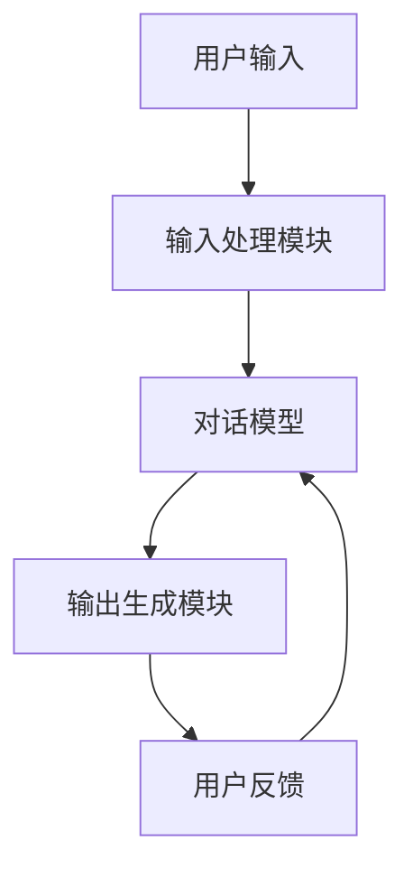

                 


# AI Agent的对话系统在语言学习中的应用

> 关键词：AI Agent, 对话系统, 语言学习, 自然语言处理, 人机交互

> 摘要：随着人工智能技术的快速发展，AI Agent（智能体）在对话系统中的应用日益广泛。本文深入探讨了AI Agent对话系统在语言学习中的应用，从背景、核心概念、算法原理、系统架构到项目实战，全面分析了其在语言学习中的潜力和实际应用。文章不仅提供了理论支持，还通过实际案例展示了如何利用AI Agent对话系统提升语言学习的效率和效果。

---

## 第一部分: AI Agent的对话系统在语言学习中的应用概述

### 第1章: AI Agent与对话系统概述

#### 1.1 AI Agent的基本概念

##### 1.1.1 AI Agent的定义与特点
AI Agent（智能体）是指能够感知环境、自主决策并执行任务的智能系统。其特点包括：
1. **自主性**：能够在没有外部干预的情况下独立运行。
2. **反应性**：能够实时感知环境并做出响应。
3. **目标导向**：具有明确的目标，能够采取行动以实现目标。
4. **学习能力**：能够通过经验改进自身的性能。

##### 1.1.2 对话系统的定义与分类
对话系统是一种通过自然语言处理技术实现人与计算机之间交互的系统。其分类如下：
1. **基于规则的对话系统**：通过预定义的规则和关键词进行匹配，适用于简单的对话场景。
2. **基于模型的对话系统**：利用机器学习模型（如深度学习）生成对话内容，能够处理复杂的语义信息。

##### 1.1.3 AI Agent在对话系统中的作用
AI Agent作为对话系统的“大脑”，负责处理输入的自然语言，理解其含义，并生成适当的回应。它能够实现对话的流畅性和智能化，是语言学习中提升交互体验的核心技术。

#### 1.2 语言学习中的对话系统应用背景

##### 1.2.1 语言学习的核心问题与挑战
语言学习过程中，学生常常面临以下问题：
1. **缺乏实践机会**：学生需要更多的语言实践机会来提高口语能力。
2. **个性化学习需求**：每个学生的语言水平和学习风格不同，需要个性化的学习支持。
3. **即时反馈的需求**：学生希望在练习中得到即时的反馈，以便及时纠正错误。

##### 1.2.2 对话系统在语言学习中的潜在价值
对话系统能够为语言学习提供以下价值：
1. **提供即时互动**：学生可以与AI Agent进行实时对话练习，模仿真实语言交流场景。
2. **个性化学习支持**：对话系统能够根据学生的学习进度和语言水平提供定制化的学习建议。
3. **24/7可用性**：学生可以在任何时间与AI Agent进行对话练习，不受时间和地点的限制。

##### 1.2.3 当前技术发展现状与趋势
当前，自然语言处理技术（如BERT、GPT）的快速发展为对话系统的智能化提供了坚实的技术支持。未来的趋势是对话系统将更加个性化、智能化，并能够处理多语言和多文化背景的语言学习需求。

#### 1.3 本书的核心目标与内容框架

##### 1.3.1 本书的核心目标
本书旨在探讨AI Agent对话系统在语言学习中的应用，通过理论分析和实际案例，帮助读者理解如何利用AI技术提升语言学习的效果。

##### 1.3.2 本书的主要内容框架
1. **背景介绍**：分析AI Agent和对话系统的基本概念及其在语言学习中的应用背景。
2. **核心概念与联系**：探讨AI Agent和对话系统的原理及其在语言学习中的应用。
3. **算法原理讲解**：详细阐述对话系统的算法原理及其实现。
4. **系统分析与架构设计**：分析对话系统的应用场景，并设计其系统架构。
5. **项目实战**：通过实际案例展示如何利用AI Agent对话系统提升语言学习的效果。
6. **最佳实践**：总结对话系统在语言学习中的最佳实践，并展望未来的发展方向。

##### 1.3.3 本书的读者定位与学习方法
本书适合对人工智能和教育技术感兴趣的读者，包括教育技术从业者、语言教师、教育机构管理者以及对AI技术感兴趣的编程爱好者。读者可以通过理论学习与实际操作相结合的方式，深入理解对话系统在语言学习中的应用。

---

### 第2章: 对话系统在语言学习中的核心问题

#### 2.1 语言学习中的对话需求分析

##### 2.1.1 学生的学习需求分析
学生在语言学习中需要以下对话支持：
1. **口语练习**：通过与AI Agent对话，提升口语表达能力。
2. **语法纠错**：AI Agent能够实时纠正学生的语法错误。
3. **词汇扩展**：通过对话练习，学生可以学习和记忆新词汇。

##### 2.1.2 教师的教学需求分析
教师可以通过对话系统实现以下目标：
1. **个性化教学**：根据学生的学习情况提供个性化的教学建议。
2. **数据收集与分析**：利用对话系统的数据收集功能，分析学生的学习进度和难点。
3. **教学辅助**：AI Agent可以作为助教，帮助教师完成部分教学任务。

##### 2.1.3 机构的管理与优化需求
教育机构可以通过对话系统实现以下管理目标：
1. **学习效果评估**：通过分析对话数据，评估学生的学习效果。
2. **课程优化**：根据对话数据，优化课程设计和教学内容。
3. **资源分配**：合理分配教学资源，提高教学效率。

#### 2.2 对话系统在语言学习中的关键问题

##### 2.2.1 对话内容的准确性与实时性
对话系统的准确性直接影响学生的语言学习效果。实时性则是指系统能够在学生输入后快速生成回应，这需要高效的算法和优化的系统架构。

##### 2.2.2 对话系统的可扩展性与可定制性
语言学习的需求具有多样性和个性化的特点，因此对话系统需要具备良好的可扩展性和可定制性，以满足不同用户的需求。

##### 2.2.3 对话数据的隐私与安全问题
语言学习中，学生需要输入大量的个人数据（如语音、文本），这些数据的隐私和安全问题必须得到重视。

#### 2.3 对话系统在语言学习中的边界与外延

##### 2.3.1 对话系统的边界
对话系统在语言学习中的应用边界主要集中在语言理解和生成方面，目前还难以完全替代真人教师的角色。

##### 2.3.2 对话系统的外延
对话系统的外延包括多模态交互（如语音、图像）、多语言支持以及与教育管理系统的集成等。

---

## 第二部分: AI Agent对话系统的算法原理与实现

### 第3章: 对话系统的算法原理

#### 3.1 对话系统的算法原理概述

##### 3.1.1 基于规则的对话算法
基于规则的对话算法通过预定义的规则和关键词匹配生成回应。其优点是实现简单，但对话效果受限。

##### 3.1.2 基于模型的对话算法
基于模型的对话算法利用机器学习模型（如循环神经网络、Transformer）生成对话内容。其优点是对话更加自然流畅，但实现复杂度较高。

#### 3.2 对话系统的实现流程

##### 3.2.1 对话系统的输入处理
对话系统的输入包括文本和语音两种形式，需要进行预处理（如分词、去停用词）和特征提取。

##### 3.2.2 对话系统的模型训练
基于深度学习的对话系统需要通过大量对话数据进行训练，生成能够理解和生成对话内容的模型。

##### 3.2.3 对话系统的输出生成
模型生成的回应需要进行后处理（如语法检查、语言风格调整），以确保输出的准确性和流畅性。

#### 3.3 对话系统的优化与改进

##### 3.3.1 对话系统的优化策略
1. **模型优化**：通过调整模型参数和优化算法提高对话生成的效果。
2. **数据增强**：通过数据扩展技术（如数据增广）增加训练数据的多样性。
3. **反馈机制**：引入用户反馈，动态优化对话系统的生成策略。

##### 3.3.2 对话系统的评估指标
1. **准确率**：生成的回应与输入内容的相关性。
2. **流畅度**：生成的回应的自然性和可读性。
3. **用户体验**：用户对对话系统的满意度和使用体验。

---

### 第4章: 对话系统的系统架构设计

#### 4.1 对话系统的应用场景

##### 4.1.1 语言学习中的对话场景
1. **口语练习**：学生与AI Agent进行对话练习，提升口语能力。
2. **语法纠错**：AI Agent实时纠正学生的语法错误。
3. **词汇扩展**：通过对话练习，学生学习新词汇和短语。

##### 4.1.2 教学管理中的对话场景
1. **个性化教学**：教师根据对话数据为学生制定个性化学习计划。
2. **数据收集与分析**：通过对话数据了解学生的学习进度和难点。
3. **教学辅助**：AI Agent协助教师完成部分教学任务。

#### 4.2 对话系统的功能设计

##### 4.2.1 系统功能模块
1. **输入模块**：接收用户的输入（文本或语音）。
2. **处理模块**：对输入内容进行理解和生成回应。
3. **输出模块**：将生成的回应返回给用户。
4. **学习模块**：根据对话数据优化模型。

##### 4.2.2 系统功能流程
1. **输入处理**：对输入内容进行预处理和特征提取。
2. **模型调用**：调用对话模型生成回应。
3. **输出生成**：将生成的回应返回给用户。
4. **数据积累**：收集对话数据，用于后续优化和分析。

#### 4.3 对话系统的架构设计

##### 4.3.1 系统架构图


##### 4.3.2 模块交互流程
1. **用户输入**：用户向系统输入对话内容。
2. **输入处理**：对输入内容进行预处理和特征提取。
3. **模型调用**：调用对话模型生成回应。
4. **输出生成**：将生成的回应返回给用户。
5. **数据积累**：收集对话数据，用于后续优化和分析。

---

## 第三部分: 项目实战与最佳实践

### 第5章: 对话系统的项目实战

#### 5.1 环境安装与配置

##### 5.1.1 开发环境选择
推荐使用Python编程语言，安装必要的库（如TensorFlow、Keras、自然语言处理库）。

##### 5.1.2 数据集准备
选择适合的对话数据集（如公开的对话数据集或自行收集数据）。

##### 5.1.3 模型训练与部署
使用选择的模型框架（如Keras）进行模型训练，并部署对话系统。

#### 5.2 对话系统的核心代码实现

##### 5.2.1 对话系统的输入处理
```python
def preprocess_input(text):
    # 分词处理
    words = text.split()
    # 去停用词
    stopwords = set(["a", "an", "the", "and", "or", "but"])
    filtered_words = [word for word in words if word not in stopwords]
    return filtered_words
```

##### 5.2.2 对话系统的模型实现
```python
import tensorflow as tf
from tensorflow.keras.layers import Input, Dense, LSTM, Bidirectional
from tensorflow.keras.models import Model

# 定义模型
input_layer = Input(shape=(max_length,))
lstm_layer = Bidirectional(LSTM(units=64))(input_layer)
dense_layer = Dense(units=1, activation='sigmoid')(lstm_layer)
model = Model(inputs=input_layer, outputs=dense_layer)
model.compile(loss='binary_crossentropy', optimizer='adam', metrics=['accuracy'])
```

##### 5.2.3 对话系统的输出生成
```python
def generate_response(text):
    # 预处理输入
    input_features = preprocess_input(text)
    # 模型预测
    prediction = model.predict(input_features)
    # 根据预测结果生成回应
    if prediction > 0.5:
        return "Yes"
    else:
        return "No"
```

#### 5.3 对话系统的案例分析

##### 5.3.1 案例一：口语练习
学生与AI Agent进行对话练习，系统实时纠正语法错误并提供改进建议。

##### 5.3.2 案例二：词汇扩展
通过对话练习，学生学习新词汇和短语，并通过上下文理解其含义。

##### 5.3.3 案例三：个性化学习
系统根据学生的语言水平和学习风格，提供个性化的学习建议和教学资源。

#### 5.4 项目小结
通过实际项目，我们验证了AI Agent对话系统在语言学习中的应用价值。对话系统的实现需要结合自然语言处理技术和机器学习算法，确保其准确性和实时性。

---

### 第6章: 对话系统的最佳实践与未来展望

#### 6.1 对话系统的最佳实践

##### 6.1.1 系统优化建议
1. **模型优化**：通过调整模型参数和优化算法提高对话生成的效果。
2. **数据扩展**：通过数据增强技术增加训练数据的多样性。
3. **用户反馈**：引入用户反馈机制，动态优化对话系统的生成策略。

##### 6.1.2 安全与隐私保护
1. **数据加密**：对用户的对话数据进行加密处理。
2. **访问控制**：严格控制对话系统的访问权限，防止数据泄露。

#### 6.2 对话系统的未来展望

##### 6.2.1 多模态交互
未来的对话系统将支持多模态交互（如语音、图像），提供更加丰富的交互体验。

##### 6.2.2 多语言支持
对话系统将支持更多的语言和文化背景，满足全球用户的需求。

##### 6.2.3 与教育管理系统的集成
对话系统将与教育管理系统深度集成，提供更加智能化和个性化的教学支持。

---

## 第四部分: 结语与致谢

### 第7章: 结语

通过对AI Agent对话系统在语言学习中的应用的深入探讨，我们看到AI技术在教育领域的巨大潜力。对话系统不仅能够提升语言学习的效率，还能够为个性化教学和教育管理提供强有力的支持。

### 附录: 参考文献与致谢

感谢所有参与本书编写的团队成员，以及提供宝贵意见的读者。本书的完成离不开各位的支持与帮助。

---

作者：AI天才研究院/AI Genius Institute & 禅与计算机程序设计艺术 /Zen And The Art of Computer Programming

