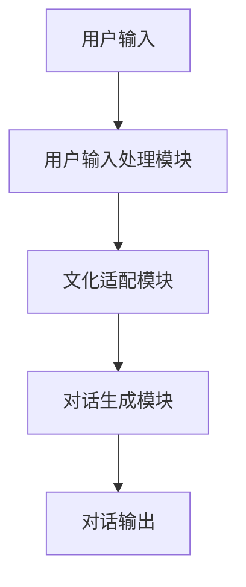

                 


# AI Agent的对话系统在跨文化交流中的应用

> 关键词：AI Agent，对话系统，跨文化交流，自然语言处理，文化适应性，多语言支持，情感分析

> 摘要：本文探讨了AI Agent对话系统在跨文化交流中的应用，分析了跨文化交际中的问题与挑战，介绍了对话系统的核心技术和文化适配模块的设计，详细讲解了算法原理和系统架构，并通过实际案例展示了AI Agent在跨文化对话中的应用潜力。

---

# 引言: 跨文化交际与AI Agent的结合

## 1.1 背景介绍
随着全球化的发展，跨文化交流变得越来越频繁。然而，跨文化交流中常常存在语言障碍和文化差异，导致对话失败或误解。AI Agent（人工智能代理）作为一种智能对话系统，能够通过自然语言处理技术，帮助人们实现跨语言和跨文化的高效沟通。

## 1.2 问题与挑战
跨文化交流中的主要问题包括语言差异、文化背景差异和情感表达差异。AI Agent需要具备文化适配能力，才能在不同文化背景下准确理解用户的需求并生成合适的回应。

## 1.3 目标与意义
本文旨在探讨AI Agent对话系统在跨文化交流中的应用，提出一种文化适配的对话模型，以解决跨文化交际中的问题，提升跨语言对话的准确性和用户体验。

---

# 第二章: 对话系统的自然语言处理基础

## 2.1 自然语言处理（NLP）的核心技术
### 2.1.1 分词与词性标注
分词是将连续的文本分割成词语的过程，词性标注是对每个词语进行词性分类的过程。例如，中文中的“今天天气很好”会被分词为“今天”、“天气”、“很好”，并标注为名词、名词、形容词。

### 2.1.2 语法分析与语义理解
语法分析是对句子的语法结构进行分析，语义理解是理解句子的含义。例如，句子“我想吃 pizza”不仅需要理解语法结构，还需要理解“pizza”在不同文化背景下的含义差异。

### 2.1.3 对话生成与响应
对话生成是根据输入生成合适的回复，对话响应是根据用户输入生成准确的回答。例如，在跨文化对话中，AI Agent需要根据用户的文化背景调整语言风格和表达方式。

## 2.2 跨文化对话中的语义分析
### 2.2.1 跨文化语境下的语义差异
不同文化背景下，同一个词语或表达方式可能具有不同的含义。例如，“yes”在某些文化中可能表示肯定，而在其他文化中可能表示礼貌的回应。

### 2.2.2 多语言对话系统的挑战
多语言对话系统需要处理多种语言的语法和语义差异，同时还需要考虑文化背景对对话的影响。例如，中文和英文在时间表达上存在差异，AI Agent需要能够准确理解并转换这些差异。

### 2.2.3 跨文化对话中的情感分析
情感分析是识别文本中的情感倾向，例如积极、消极或中性。在跨文化对话中，情感分析需要考虑不同文化背景下情感表达的差异。例如，某些文化中使用更多的间接表达方式，可能会影响情感分析的准确性。

## 2.3 对话系统的文化适应性
### 2.3.1 文化适应性对话模型
文化适应性对话模型是一种能够根据用户的文化背景调整对话内容和表达方式的模型。例如，AI Agent可以根据用户的文化背景选择合适的语言风格和表达方式。

### 2.3.2 跨文化对话中的语言风格调整
语言风格调整是根据用户的文化背景调整对话的语气和用词。例如，在正式场合，AI Agent需要使用正式的语言；在非正式场合，AI Agent可以使用更随意的语言。

### 2.3.3 文化知识库的构建与应用
文化知识库是存储不同文化背景下语言习惯、表达方式和文化背景信息的数据库。例如，AI Agent可以根据用户的文化背景从知识库中提取相关信息，生成适合的对话内容。

---

# 第三章: 跨文化对话系统的架构设计

## 3.1 跨文化对话系统的总体架构
### 3.1.1 系统功能模块划分
跨文化对话系统的功能模块包括：用户输入处理模块、文化适配模块、对话生成模块和输出模块。

### 3.1.2 系统输入与输出设计
系统输入包括用户输入的文本和用户的文化背景信息，系统输出包括生成的对话内容和对话结果。

### 3.1.3 系统交互流程图
以下是一个跨文化对话系统的交互流程图：



## 3.2 对话系统的文化适配模块
### 3.2.1 文化知识库的构建
文化知识库需要包含不同文化背景下的语言习惯、表达方式和文化背景信息。例如，中文和英文在问候语和结束语上的差异。

### 3.2.2 对话内容的文化适配算法
文化适配算法是根据用户的文化背景调整对话内容的算法。例如，AI Agent可以根据用户的文化背景选择合适的话题和表达方式。

### 3.2.3 文化适配模块的实现
文化适配模块的实现需要结合自然语言处理技术和文化知识库，生成适合用户文化背景的对话内容。

## 3.3 跨文化对话系统的多语言支持
### 3.3.1 多语言对话系统的实现
多语言对话系统需要支持多种语言的对话，例如中文、英文、法语等。AI Agent需要能够识别用户输入的语言，并生成相应语言的回复。

### 3.3.2 多语言对话中的语义一致性
在多语言对话中，语义一致性是指不同语言之间表达相同意思的语义一致性。例如，“你好”在中文中是问候语，而“hello”在英文中也是问候语。

### 3.3.3 多语言对话中的语言风格调整
在多语言对话中，AI Agent需要根据用户的语言和文化背景调整对话的语气和用词。例如，中文对话中可能更注重礼貌和间接表达，而英文对话中可能更直接。

---

# 第四章: 跨文化对话系统的算法与实现

## 4.1 跨文化对话系统

### 4.1.1 背景介绍
跨文化对话系统需要解决跨语言和跨文化背景下的对话问题。例如，用户可能使用不同的语言或文化背景进行对话。

### 4.1.2 对话生成算法
对话生成算法是根据用户输入生成对话内容的算法。例如，基于序列到序列模型的对话生成算法，可以生成适合用户需求的对话内容。

### 4.1.3 文化适配算法
文化适配算法是根据用户的文化背景调整对话内容的算法。例如，AI Agent可以根据用户的文化背景选择合适的话题和表达方式。

---

## 4.2 算法原理讲解
### 4.2.1 对话生成算法的数学模型
对话生成算法的数学模型可以表示为：

$$ P(y|x) = \prod_{i=1}^{n} P(y_i | y_{<i}, x) $$

其中，$x$ 是输入，$y$ 是输出，$y_{<i}$ 是之前生成的输出。

### 4.2.2 文化适配算法的实现
文化适配算法的实现需要结合自然语言处理技术和文化知识库，生成适合用户文化背景的对话内容。

### 4.2.3 代码实现
以下是一个基于Python的对话生成算法的示例代码：

```python
def generate_response(user_input, culture_info):
    # 根据用户输入生成对话内容
    response = ""
    # 根据文化背景调整语言风格
    if culture_info == "Chinese":
        response += "您想了解什么？"
    elif culture_info == "English":
        response += "What would you like to know?"
    return response
```

---

## 4.3 系统架构设计方案
### 4.3.1 问题场景介绍
跨文化对话系统的应用场景包括跨国会议、国际商务谈判、跨文化教育等。

### 4.3.2 系统功能设计
系统功能包括用户输入处理、文化适配、对话生成和输出。

### 4.3.3 系统架构设计
系统架构设计包括前端界面、后端逻辑和数据库设计。

### 4.3.4 系统接口设计
系统接口设计包括用户输入接口、文化适配接口和对话生成接口。

### 4.3.5 系统交互设计
系统交互设计包括用户与系统之间的交互流程和对话历史记录。

---

# 第五章: 项目实战: 跨文化对话系统的设计与实现

## 5.1 项目介绍
本项目旨在设计并实现一个支持多语言和文化适配的对话系统。

## 5.2 系统核心实现源代码
以下是系统核心实现的Python代码：

```python
class CulturalAdapter:
    def __init__(self, culture_knowledge_base):
        self.culture_knowledge_base = culture_knowledge_base

    def adapt_dialogue(self, dialogue, culture_info):
        # 根据文化背景调整对话内容
        adapted_dialogue = ""
        for sentence in dialogue.split("\n"):
            adapted_sentence = self.culture_knowledge_base.get_adapted_sentence(sentence, culture_info)
            adapted_dialogue += adapted_sentence + "\n"
        return adapted_dialogue

class DialogueGenerator:
    def __init__(self, model, culture_adapter):
        self.model = model
        self.culture_adapter = culture_adapter

    def generate_response(self, user_input, culture_info):
        response = self.model.generate(user_input)
        adapted_response = self.culture_adapter.adapt_dialogue(response, culture_info)
        return adapted_response
```

## 5.3 代码应用解读与分析
上述代码实现了文化适配模块和对话生成模块。文化适配模块根据用户的文化背景调整对话内容，对话生成模块根据用户输入生成对话内容并进行文化适配。

## 5.4 实际案例分析
以下是一个实际案例：

### 5.4.1 案例背景
用户使用中文输入：“我今天很高兴。”

### 5.4.2 对话系统处理
文化适配模块根据用户的文化背景（中文）调整对话内容，生成适合的回复：“您有什么好消息吗？”

### 5.4.3 对话结果
AI Agent的回复是：“您有什么好消息吗？”

---

# 第六章: 最佳实践与小结

## 6.1 最佳实践 tips
- 在跨文化对话中，文化适配是关键。
- 对话系统需要支持多种语言和文化背景。
- 对话生成算法需要结合文化知识库进行优化。

## 6.2 小结
本文探讨了AI Agent对话系统在跨文化交流中的应用，分析了跨文化交际中的问题与挑战，介绍了对话系统的核心技术和文化适配模块的设计，详细讲解了算法原理和系统架构，并通过实际案例展示了AI Agent在跨文化对话中的应用潜力。

## 6.3 注意事项
- 数据隐私和文化敏感性需要注意。
- 对话系统需要不断优化和更新。

## 6.4 拓展阅读
建议读者进一步阅读相关领域的最新研究成果，例如多语言对话系统和文化适配算法。

---

# 结论

AI Agent对话系统在跨文化交流中的应用前景广阔。通过文化适配模块和多语言支持，AI Agent能够帮助人们实现高效、准确的跨文化沟通。未来，随着自然语言处理技术和文化知识库的不断进步，AI Agent对话系统将在跨文化交流中发挥更大的作用。

---

作者：AI天才研究院/AI Genius Institute & 禅与计算机程序设计艺术 /Zen And The Art of Computer Programming

