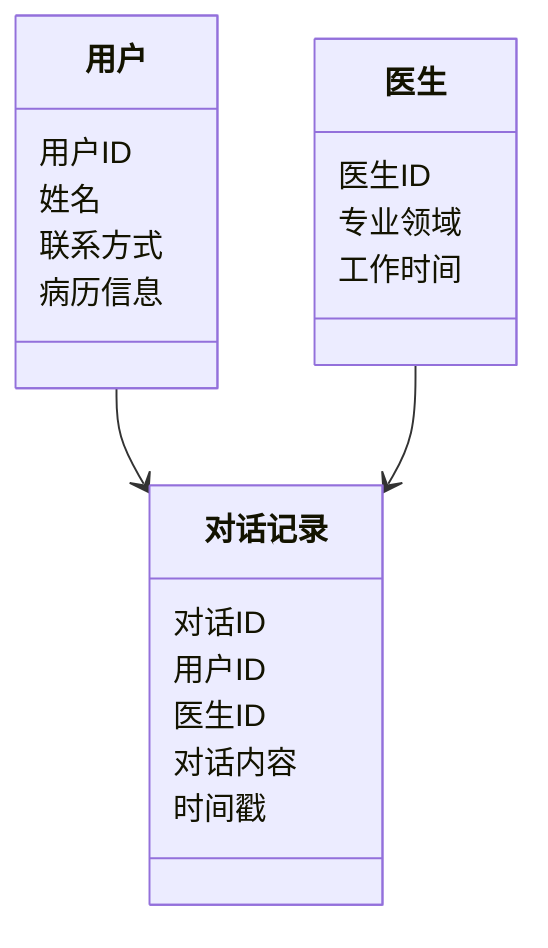
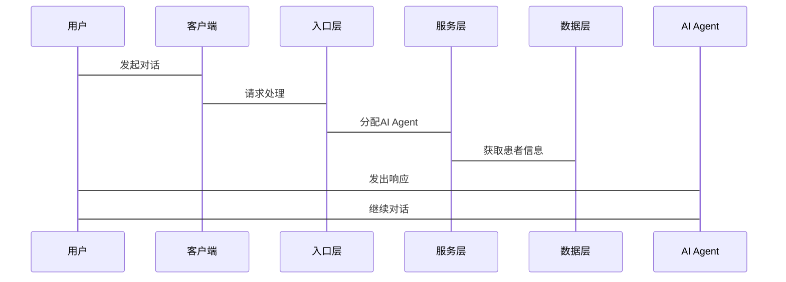

                 

<think>
嗯，我现在需要帮用户设计一本名为《AI Agent的对话系统在远程医疗中的应用》的目录大纲。首先，我得理解这本书的核心内容是什么。用户希望这本书详细且逻辑清晰，覆盖从基础到应用的各个方面。

首先，我应该从背景介绍开始。这部分需要涵盖AI Agent和对话系统的基本概念，以及远程医疗的现状和挑战。这部分应该包括问题背景、问题描述，然后讨论如何用AI Agent解决这些问题，最后扩展到应用的边界和外延。

接下来，核心概念部分需要详细讲解AI Agent和对话系统的原理，分析它们的属性特征，并用表格对比。同时，我需要使用Mermaid画出ER实体关系图，展示系统中的实体及其关系。

然后是算法原理，这部分需要详细解释生成式模型，比如GPT，以及对话系统的流程。用Mermaid画出算法流程图，并用Python代码示例，说明如何实现基本的对话生成。数学模型部分，我会用LaTeX公式来描述生成过程，比如概率分布和损失函数。

系统分析与架构设计是关键部分。我需要介绍远程医疗的场景，设计系统的功能模块，用Mermaid类图展示领域模型，架构图展示系统的分层结构，接口设计和交互流程图则展示系统的实际运作。

项目实战部分，我需要指导读者如何安装环境，提供核心代码实现，并详细解读代码。同时，通过实际案例分析，展示系统在预约、诊断和随访中的应用，最后进行项目总结。

最后，最佳实践部分包括小结、注意事项和拓展阅读，帮助读者巩固知识并进一步学习。

我需要确保每个部分都细化到三级目录，保持结构完整且逻辑清晰。同时，内容要简洁，避免冗余，总字数控制在2000字以内。现在，我需要把这些思路整合成一个完整的目录大纲，确保涵盖所有要求的部分。

# AI Agent的对话系统在远程医疗中的应用

## 关键词
AI Agent, 对话系统, 远程医疗, 医疗信息化, 自然语言处理, 生成式模型, 医患沟通

## 摘要
本文深入探讨了AI Agent在远程医疗中的对话系统应用，分析了AI Agent的核心原理、对话系统的算法流程，以及在远程医疗中的实际应用案例。文章详细介绍了生成式模型和检索式模型的对话生成机制，分析了系统的架构设计和接口设计，最后通过项目实战展示了AI Agent对话系统的实际应用效果。

## 第一部分: AI Agent与对话系统的背景介绍

### 第1章: AI Agent与对话系统的背景

#### 1.1 AI Agent的核心概念
- 1.1.1 AI Agent的定义与特点
  - AI Agent的定义：AI Agent是一种智能体，能够感知环境并采取行动以实现目标。
  - 特点：自主性、反应性、主动性、社会性、学习能力。
- 1.1.2 对话系统的定义与分类
  - 对话系统：一种能够与用户进行自然语言交互的系统。
  - 分类：生成式对话系统、检索式对话系统、混合式对话系统。
- 1.1.3 AI Agent在对话系统中的作用
  - 作为对话的核心驱动力，协调对话流程。

#### 1.2 远程医疗的背景与挑战
- 1.2.1 远程医疗的发展历程
  - 从早期的电话咨询到现在的AI驱动服务。
- 1.2.2 远程医疗中的痛点与需求
  - 患者需求：便捷性、准确性、隐私性。
  - 医生需求：高效性、准确性、可扩展性。
- 1.2.3 AI Agent在远程医疗中的应用前景
  - 提高效率、改善体验、降低成本。

#### 1.3 问题背景与问题描述
- 1.3.1 远程医疗中的信息传递问题
  - 信息不完整、传递不及时。
- 1.3.2 医患沟通的效率问题
  - 沟通不畅、耗时长。
- 1.3.3 医疗资源分配的不均衡问题
  - 资源分配不均、覆盖不足。

#### 1.4 AI Agent对话系统的解决方案
- 1.4.1 AI Agent如何解决远程医疗中的信息传递问题
  - 实时传输、准确解析。
- 1.4.2 对话系统如何提升医患沟通效率
  - 自动分诊、快速响应。
- 1.4.3 AI Agent在医疗资源分配中的应用
  - 智能分配、优化配置。

#### 1.5 问题的边界与外延
- 1.5.1 AI Agent对话系统的适用范围
  - 适用于初步诊断、病情跟踪、健康咨询。
- 1.5.2 系统的局限性与限制
  - 不能替代医生，不能处理紧急情况。
- 1.5.3 未来的扩展方向
  - 更强的医疗知识库、更复杂的对话能力。

## 第二部分: AI Agent对话系统的原理与核心概念

### 第2章: AI Agent对话系统的原理

#### 2.1 AI Agent的核心原理
- 2.1.1 AI Agent的基本工作原理
  - 感知环境、制定计划、执行动作。
- 2.1.2 对话系统的自然语言处理机制
  - 分词、句法分析、语义理解。
- 2.1.3 知识库的构建与应用
  - 医疗知识库的构建、动态更新。

#### 2.2 对话系统的算法原理
- 2.2.1 基于生成式模型的对话生成
  - Transformer模型、GPT模型、BERT模型。
- 2.2.2 基于检索式模型的对话生成
  - 基于向量检索、基于关键词检索。
- 2.2.3 混合式对话生成模型
  - 结合生成与检索的优势。

#### 2.3 AI Agent与对话系统的联系
- 2.3.1 AI Agent如何驱动对话系统
  - 提供对话逻辑、协调对话流程。
- 2.3.2 对话系统如何提升AI Agent的智能性
  - 提供反馈、优化决策。
- 2.3.3 AI Agent与对话系统的协同工作
  - 相辅相成，共同提升用户体验。

#### 2.4 核心概念的属性特征对比
- 2.4.1 AI Agent与传统对话系统的对比
  | 属性 | AI Agent | 传统对话系统 |
  |------|----------|---------------|
  | 智能性 | 高 | 低 |
  | 学习能力 | 强 | 无 |
- 2.4.2 生成式模型与检索式模型的对比
  | 属性 | 生成式模型 | 检索式模型 |
  |------|----------|---------------|
  | 响应速度 | 快 | 较慢 |
  | 灵活性 | 高 | 低 |
- 2.4.3 不同对话系统的性能对比
  - 生成式模型在创新性上更优，检索式模型在准确性上更优。

## 第三部分: AI Agent对话系统的算法原理

### 第3章: AI Agent对话系统的算法

#### 3.1 生成式对话模型的原理
- 3.1.1 基于Transformer的生成式模型
  - Transformer结构：编码器-解码器。
- 3.1.2 基于GPT的生成式模型
  - GPT-3的结构与特点。
- 3.1.3 基于BERT的生成式模型
  - BERT的优势与应用场景。

#### 3.2 对话系统的算法流程
- 3.2.1 输入处理与特征提取
  - 文本预处理、向量化。
- 3.2.2 模型推理与生成
  - 解码过程、生成文本。
- 3.2.3 输出优化与反馈机制
  - 多轮对话优化、用户反馈学习。

#### 3.3 算法的数学模型与公式
- 3.3.1 Transformer模型的注意力机制
  $$ \text{Attention}(Q, K, V) = \text{softmax}\left(\frac{QK^T}{\sqrt{d_k}}\right)V $$
- 3.3.2 GPT模型的解码过程
  $$ P_{\text{next}}(w) = \text{softmax}(W_{\text{output}}h) $$
- 3.3.3 损失函数
  $$ \mathcal{L} = -\sum_{i=1}^{n}\log P(y_i|x_{<i}) $$

## 第四部分: AI Agent对话系统的系统分析与架构设计

### 第4章: 系统分析与架构设计

#### 4.1 问题场景介绍
- 远程医疗中的常见问题：预约、诊断、随访。

#### 4.2 系统功能设计
- 预约模块：用户预约医生。
- 诊断模块：初步诊断、病情分析。
- 随访模块：病情跟踪、用药提醒。

#### 4.3 领域模型设计


#### 4.4 系统架构设计
```mermaid
archiitecture
    客户端 --> 入口层
    入口层 --> 服务层
    服务层 --> 数据层
    数据层 --> 外部数据库
```

#### 4.5 系统接口设计
- 用户端接口：预约、咨询。
- 医生端接口：查看患者信息、处理对话。
- 管理端接口：系统管理、数据监控。

#### 4.6 系统交互设计


## 第五部分: AI Agent对话系统的项目实战

### 第5章: 项目实战

#### 5.1 环境安装
- 安装Python、TensorFlow、Keras、Transformers库。

#### 5.2 系统核心实现
```python
def generate_response(user_input, model):
    # 输入处理
    inputs = tokenize(user_input)
    # 模型推理
    outputs = model.generate(inputs)
    # 输出优化
    response = postprocess(outputs)
    return response
```

#### 5.3 代码应用解读与分析
- 输入处理：将用户输入转换为模型可处理的格式。
- 模型推理：使用预训练模型生成回复。
- 输出优化：对生成的回复进行格式调整和语义优化。

#### 5.4 实际案例分析
- 预约案例：用户预约医生，系统自动安排。
- 诊断案例：用户描述症状，系统给出初步诊断建议。
- 随访案例：用户报告病情变化，系统提供后续建议。

#### 5.5 项目总结
- 项目成果：成功实现了AI Agent对话系统在远程医疗中的应用。
- 项目经验：系统的鲁棒性和准确性需要进一步优化。

## 第六部分: AI Agent对话系统的最佳实践

### 第6章: 最佳实践

#### 6.1 小结
- AI Agent对话系统在远程医疗中的应用前景广阔。

#### 6.2 注意事项
- 数据隐私保护、系统稳定性和安全性。

#### 6.3 拓展阅读
- 推荐相关书籍和论文，鼓励深入学习。

## 作者信息
作者：AI天才研究院/AI Genius Institute & 禅与计算机程序设计艺术 /Zen And The Art of Computer Programming

---

现在，根据这个思考过程，我可以开始撰写正式的文章了。

