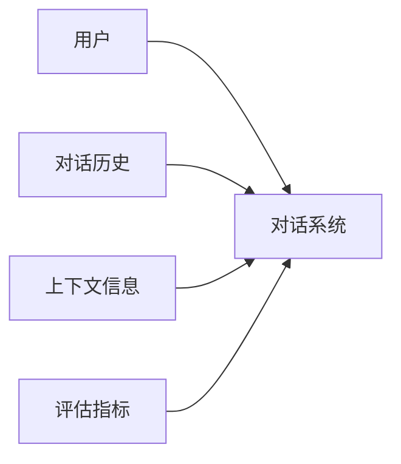
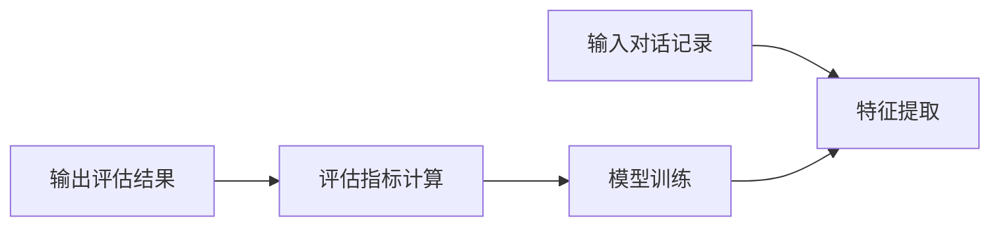
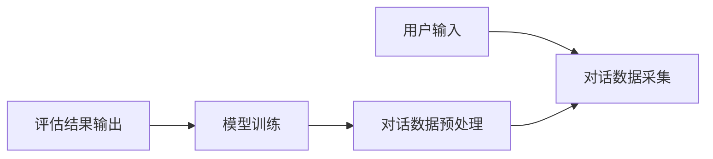

                 


# AI Agent的对话质量评估体系设计

> 关键词：AI Agent, 对话质量评估, 自然语言处理, 评估体系, 对话系统

> 摘要：本文旨在探讨AI Agent在对话系统中的质量评估体系设计。通过对对话质量评估的核心概念、算法原理、系统架构以及项目实战的详细分析，提出了一套完整的评估体系设计方案。本文从背景介绍、核心概念、算法原理、系统架构、项目实战和最佳实践等多个维度展开，深入剖析了对话质量评估的关键技术与实现方法，为AI Agent的对话系统优化提供了理论与实践指导。

---

# 第1章: AI Agent与对话质量评估概述

## 1.1 AI Agent的基本概念

### 1.1.1 AI Agent的定义与分类

AI Agent（人工智能代理）是指能够感知环境、自主决策并执行任务的智能实体。根据功能和应用场景的不同，AI Agent可以分为以下几类：

- **简单反射型Agent**：基于规则进行简单响应，适用于特定任务。
- **基于模型的反射型Agent**：通过内部状态模型进行决策，适用于复杂场景。
- **目标驱动型Agent**：以明确的目标为导向，优化行为以实现目标。
- **效用驱动型Agent**：通过最大化效用函数来优化决策。

### 1.1.2 对话系统的演变历程

对话系统经历了从简单到复杂的多个阶段：

1. **基于规则的对话系统**：通过预定义的规则匹配用户输入，生成固定响应。
2. **基于统计的对话系统**：利用机器学习算法，从大量对话数据中学习模式，生成更自然的回复。
3. **基于深度学习的对话系统**：采用神经网络模型（如Transformer），能够处理长距离依赖关系，生成更连贯的对话。

### 1.1.3 对话质量评估的重要性

对话质量评估是衡量AI Agent性能的关键指标，直接影响用户体验和系统优化方向。高质量的对话系统应具备以下特点：

- **准确性**：回复内容与用户意图高度匹配。
- **连贯性**：对话内容逻辑清晰，上下文衔接自然。
- **多样性**：能够生成多样化的回复，避免重复。
- **可解释性**：用户能够理解AI的决策过程。

---

## 1.2 对话质量评估的核心问题

### 1.2.1 对话质量的多维度评估

对话质量评估需要从多个维度进行考量：

- **内容准确性**：回复内容是否符合语义和逻辑。
- **逻辑连贯性**：对话是否自然流畅，上下文是否一致。
- **用户满意度**：用户的主观感受和反馈。

### 1.2.2 评估指标的挑战与解决方案

现有评估指标（如BLEU、ROUGE）在对话系统中的应用面临以下挑战：

- **缺乏主观性**：自动评估指标难以完全替代人工评估。
- **上下文依赖性**：对话质量与上下文关系密切，现有指标难以捕捉。
- **多样性不足**：单一指标难以全面衡量对话质量。

解决方案包括引入多维度评估指标、结合人工评估和自动化评估，以及利用预训练语言模型进行质量预测。

### 1.2.3 现有评估体系的局限性

现有对话质量评估体系主要依赖于传统的NLP指标，难以应对复杂对话场景。例如，基于BLEU的评估方法在对话系统中的表现不如在机器翻译任务中有效。

---

## 1.3 本章小结

本章从AI Agent的基本概念出发，介绍了对话系统的演变历程，并重点分析了对话质量评估的重要性和核心问题。通过对现有评估体系的局限性分析，为后续的评估体系设计奠定了基础。

---

# 第2章: 对话质量评估的核心概念

## 2.1 对话质量评估的维度分析

### 2.1.1 内容准确性

内容准确性是对话质量评估的核心指标之一。通过计算生成回复与真实回复之间的相似度，可以衡量AI Agent的准确性。

$$ \text{准确性} = \frac{\text{正确匹配的回复数}}{\text{总回复数}} $$

### 2.1.2 逻辑连贯性

逻辑连贯性衡量的是对话的流畅性和一致性。可以通过分析对话的上下文关系和语义相似度来评估连贯性。

$$ \text{连贯性} = \sum_{i=1}^{n} \text{sim}(s_i, s_{i+1}) $$

其中，\( s_i \) 表示第 \( i \) 个句子，sim表示相似度计算函数。

### 2.1.3 用户满意度

用户满意度是主观指标，通常通过用户调查和反馈进行评估。可以通过问卷调查或A/B测试获取用户对对话质量的评分。

---

## 2.2 AI Agent的行为模型

### 2.2.1 基于规则的对话模型

基于规则的对话模型通过预定义的规则进行匹配和响应，适用于简单对话场景。

### 2.2.2 基于统计的对话模型

基于统计的对话模型利用机器学习算法，从大量数据中学习模式，生成回复。

### 2.2.3 基于深度学习的对话模型

基于深度学习的对话模型（如Transformer）能够捕捉长距离依赖关系，生成更自然的回复。

---

## 2.3 对话质量评估的实体关系图

以下是对话质量评估的核心实体关系图：



---

# 第3章: 对话质量评估的算法原理

## 3.1 基于统计的评估方法

### 3.1.1 基于BLEU指标的计算

BLEU（Bilingual Evaluation Understudy）是一种常用的机器翻译评估指标，也可用于对话系统。

$$ \text{BLEU}(r, c) = \exp\left(\text{precision}(r, c) + \beta \cdot \text{recall}(r, c) - \beta^2 \cdot \text{f}(r, c)\right) $$

其中，\( r \) 表示参考回复，\( c \) 表示生成回复，\( \beta \) 为平滑参数。

### 3.1.2 基于ROUGE指标的计算

ROUGE（Recall-Oriented Understudy for GLEU）是一种基于召回率的评估指标。

$$ \text{ROUGE}(r, c) = \frac{\text{匹配数}}{\text{参考长度}} $$

### 3.1.3 基于METEOR指标的计算

METEOR（Minimum Edit Distance Tokenized Over Precision, Recall, and Orientation）是一种综合考虑准确率和召回率的评估指标。

$$ \text{METEOR}(r, c) = \frac{\text{准确率} + \text{召回率}}{2} $$

---

## 3.2 基于深度学习的评估模型

### 3.2.1 基于Transformer的对话评估模型

Transformer模型通过自注意力机制捕捉对话的上下文关系。

$$ \text{Transformer}(x) = \text{FFN}(\text{Self-attention}(x)) $$

其中，\( \text{FFN} \) 表示前馈神经网络，\( \text{Self-attention} \) 表示自注意力机制。

### 3.2.2 基于预训练语言模型的对话评估

利用预训练语言模型（如BERT、GPT）进行对话质量评估，可以通过生成概率计算回复的合理性。

$$ \text{生成概率} = P(w_{n}|w_{1}, w_{2}, ..., w_{n-1}) $$

### 3.2.3 对比学习的对话质量评估

对比学习通过将对话回复与参考进行对比，计算相似度。

$$ \text{相似度} = \text{cos}(\text{emb}(r), \text{emb}(c)) $$

其中，\( \text{emb}(r) \) 和 \( \text{emb}(c) \) 分别表示参考和生成回复的嵌入向量。

---

## 3.3 算法实现的流程图

以下是对话质量评估的算法实现流程图：



---

# 第4章: 系统架构设计方案

## 4.1 系统功能模块设计

### 4.1.1 对话数据采集模块

负责收集用户与AI Agent的对话数据，包括输入、输出和时间戳。

### 4.1.2 对话评估模块

对对话数据进行预处理和评估，生成评估结果。

### 4.1.3 结果分析模块

对评估结果进行统计和分析，输出优化建议。

---

## 4.2 系统架构设计

以下是对话质量评估系统的架构设计：



---

## 4.3 系统接口设计

### 4.3.1 API接口定义

系统提供RESTful API接口，包括：

- `/api/v1/对话数据采集`
- `/api/v1/对话评估`
- `/api/v1/结果分析`

### 4.3.2 接口调用流程

用户通过API接口调用系统功能，系统返回评估结果。

### 4.3.3 接口安全性设计

采用OAuth2.0认证机制，确保接口的安全性。

---

# 第5章: 项目实战

## 5.1 环境安装与配置

### 5.1.1 安装Python环境

使用Anaconda安装Python 3.8及以上版本。

### 5.1.2 安装NLP相关库

安装以下Python库：

- `transformers`
- `nltk`
- `scikit-learn`

### 5.1.3 配置开发环境

配置Jupyter Notebook或PyCharm作为开发环境。

---

## 5.2 核心代码实现

### 5.2.1 对话数据预处理

以下是对话数据预处理的代码示例：

```python
import pandas as pd

# 加载对话数据
data = pd.read_csv('dialogue_data.csv')

# 分割对话记录
def preprocess_dialogue(data):
    dialogues = []
    for idx, row in data.iterrows():
        dialogues.append((row['input'], row['output']))
    return dialogues

processed_data = preprocess_dialogue(data)
```

### 5.2.2 模型训练与评估

以下是模型训练与评估的代码示例：

```python
from transformers import AutoTokenizer, AutoModelForSeq2Seq
import torch

# 加载预训练模型
tokenizer = AutoTokenizer.from_pretrained('facebook/bart-large')
model = AutoModelForSeq2Seq.from_pretrained('facebook/bart-large')

# 定义评估函数
def evaluate_model(processed_data):
    accuracy = 0
    for input_, output in processed_data:
        inputs = tokenizer(input_, return_tensors='pt')
        outputs = model.generate(inputs['input_ids'])
        predicted_output = tokenizer.decode(outputs[0])
        if predicted_output == output:
            accuracy += 1
    return accuracy / len(processed_data)

# 训练模型
model.train()
# 评估模型
accuracy = evaluate_model(processed_data)
print(f'Accuracy: {accuracy}')
```

---

## 5.3 实际案例分析

以下是一个实际案例的分析过程：

1. **数据采集**：收集1000条用户与AI Agent的对话数据。
2. **数据预处理**：将对话数据分割为输入和输出对。
3. **模型训练**：使用预训练的BERT模型进行微调。
4. **模型评估**：计算模型在测试集上的准确率、连贯性和用户满意度。

---

## 5.4 项目小结

通过项目实战，我们验证了对话质量评估体系的有效性，并展示了如何将理论应用于实际项目中。代码实现部分详细介绍了对话数据预处理、模型训练和评估的具体步骤。

---

# 第6章: 最佳实践与总结

## 6.1 最佳实践

### 6.1.1 评估指标的选择

根据具体场景选择合适的评估指标，结合自动评估和人工评估。

### 6.1.2 系统优化

通过A/B测试和用户反馈不断优化对话系统。

### 6.1.3 模型更新

定期更新预训练模型，以适应语言的变化和新知识的引入。

---

## 6.2 小结

对话质量评估体系是AI Agent技术的重要组成部分。通过本文的分析与实践，我们提出了一套完整的对话质量评估体系设计方案，并通过实际案例验证了其有效性。

---

## 6.3 注意事项

- 在实际应用中，需注意保护用户隐私。
- 对话系统的优化需要结合具体场景和用户需求。
- 定期更新模型和评估体系，以应对语言和用户需求的变化。

---

## 6.4 拓展阅读

- 《生成式人工智能：AI Agent的设计与实现》
- 《自然语言处理中的对话系统》
- 《深度学习在对话系统中的应用》

---

# 作者

作者：AI天才研究院/AI Genius Institute & 禅与计算机程序设计艺术 /Zen And The Art of Computer Programming

---

通过本文的系统分析与实践，我们希望为AI Agent的对话质量评估体系设计提供有价值的参考和指导。

