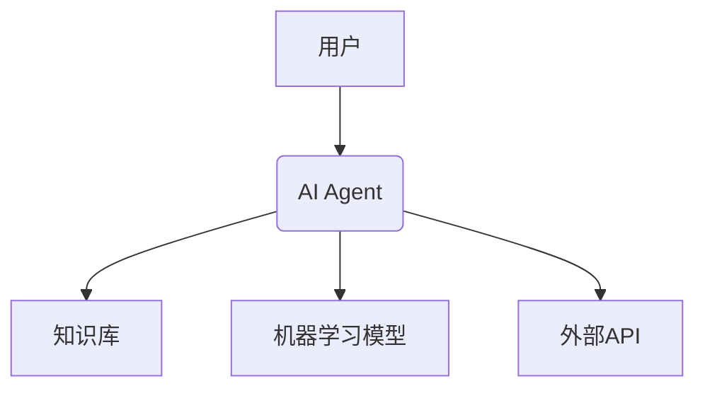
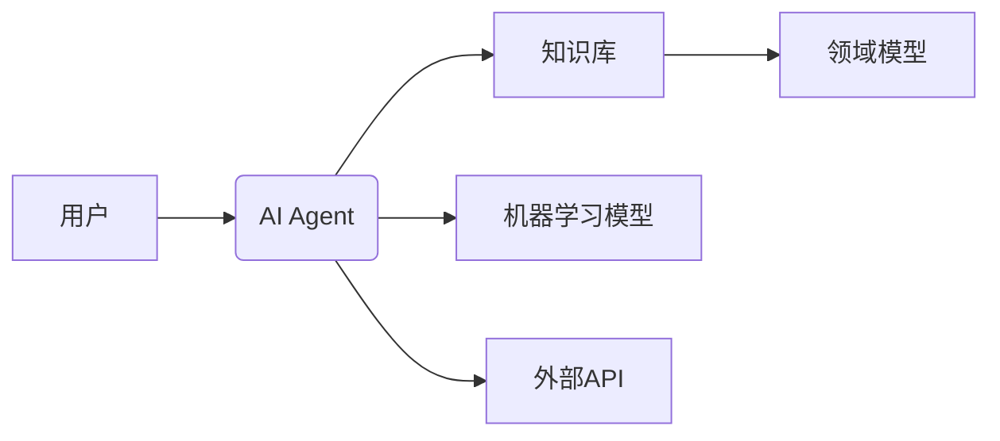
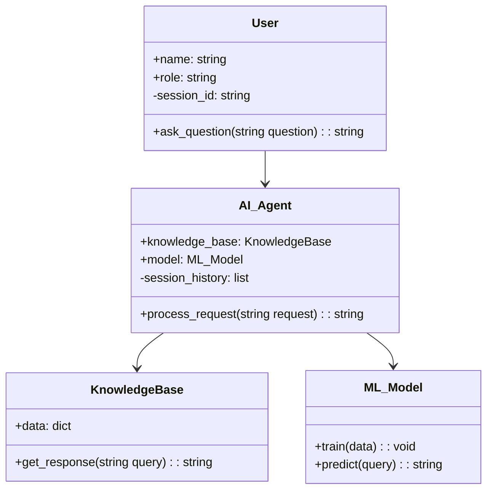

                 


# AI Agent的应用场景：从客服到创意助手

## 关键词：AI Agent, 人工智能, 自然语言处理, 机器学习, 知识图谱

## 摘要：  
本文详细探讨了AI Agent（人工智能代理）的应用场景，从客服到创意助手的转变，揭示了其背后的技术原理和架构设计。文章首先介绍了AI Agent的基本概念和核心要素，随后分析了其在不同场景中的应用，如客服系统和创意生成。接着，从技术角度详细讲解了AI Agent的算法原理，包括感知、决策和执行机制，并通过Mermaid流程图和Python代码示例进行展示。最后，本文总结了AI Agent的系统架构设计和实际案例，展望了其未来的发展趋势。

---

## 第1章：AI Agent的基本概念与应用场景

### 1.1 AI Agent的核心概念  
AI Agent（人工智能代理）是一种能够感知环境、自主决策并执行任务的智能系统。它结合了自然语言处理、机器学习和知识图谱等技术，具备以下核心要素：  
- **智能性**：能够理解上下文并生成有意义的回应。  
- **自主性**：无需外部干预即可完成任务。  
- **反应性**：能够实时感知环境变化并做出调整。  
- **社交能力**：能够与人类或其他系统进行有效交互。  

### 1.2 AI Agent的应用场景  
AI Agent的应用场景广泛，以下是两个典型领域的详细介绍：  

#### 1.2.1 客服领域的AI Agent  
在客服系统中，AI Agent通常以聊天机器人或语音助手的形式出现。它们能够处理客户的常见问题，提供产品信息，协助订单跟踪等。例如，银行可以通过AI Agent实时解答客户的账户查询和交易问题，显著提升服务效率。  

#### 1.2.2 创意助手的AI Agent  
在创意领域，AI Agent可以作为文案生成器、灵感助手或内容推荐系统。例如，作家可以使用AI Agent生成故事大纲或润色文本；设计师可以利用AI Agent快速获取灵感和素材。  

### 1.3 AI Agent的技术背景与发展趋势  
AI Agent的发展离不开以下技术的支持：  
- **自然语言处理（NLP）**：使AI Agent能够理解并生成人类语言。  
- **机器学习（ML）**：用于训练AI Agent的学习模型，使其能够从数据中提取模式。  
- **知识图谱**：构建领域知识，帮助AI Agent更好地理解上下文。  

未来，AI Agent将朝着更智能化、个性化和多模态的方向发展，进一步拓展其应用场景。

---

## 第2章：AI Agent的核心概念与联系

### 2.1 AI Agent的核心原理  
AI Agent的工作流程可以分为三个主要阶段：感知、决策和执行。  

#### 2.1.1 感知阶段  
AI Agent通过自然语言处理技术（如分词、句法分析和情感分析）来理解输入的文本或语音信息。  

#### 2.1.2 决策阶段  
基于感知到的信息，AI Agent利用机器学习模型（如决策树、随机森林或深度学习模型）生成响应。  

#### 2.1.3 执行阶段  
AI Agent根据生成的响应执行任务，例如发送邮件、创建日程或调用外部API。  

### 2.2 AI Agent与相关技术的对比  
以下是AI Agent与其他AI技术的对比：  

| 技术         | 定义                     | 应用场景                           | 与AI Agent的关系             |
|--------------|--------------------------|------------------------------------|------------------------------|
| 机器学习     | 数据驱动的模式识别技术   | 分析数据，预测结果                 | AI Agent的核心技术之一       |
| 深度学习     | 多层神经网络技术         | 图像识别、语音识别                 | 支持AI Agent的感知能力       |
| 知识图谱     | 结构化知识表示技术       | 实体识别、关系推理                 | 提供AI Agent的知识基础       |

### 2.3 AI Agent的实体关系图  
以下是AI Agent的实体关系图：  



---

## 第3章：AI Agent的算法原理讲解

### 3.1 算法原理概述  
AI Agent的核心算法包括基于规则的推理和基于模型的推理。  

#### 3.1.1 基于规则的推理  
基于规则的推理是一种简单但有效的推理方法，适用于规则明确的场景。例如，在客服系统中，AI Agent可以根据预设的规则生成标准回答。  

#### 3.1.2 基于模型的推理  
基于模型的推理依赖于机器学习模型，能够处理复杂场景下的不确定性。例如，使用深度学习模型进行情感分析时，AI Agent可以根据上下文生成更自然的回应。  

### 3.2 算法实现与代码示例  
以下是一个基于规则的AI Agent示例代码：  

```python
class AI_Agent:
    def __init__(self, knowledge_base):
        self.knowledge_base = knowledge_base

    def perceive(self, input_text):
        # 假设input_text是用户输入的文本
        # 这里进行简单的关键词提取
        keywords = input_text.split()
        return keywords

    def decide(self, keywords):
        # 根据关键词生成回应
        response = ""
        for keyword in keywords:
            if keyword in self.knowledge_base:
                response += self.knowledge_base[keyword] + " "
        return response

    def execute(self, response):
        # 假设response是生成的回应
        print(response)

# 示例使用
knowledge_base = {
    "帮助": "我能为您提供什么帮助？",
    "问题": "请告诉我您遇到的问题，我会尽力解决。",
    "感谢": "不客气，很高兴能帮到您！"
}

agent = AI_Agent(knowledge_base)
input_text = "我需要帮助"
keywords = agent.perceive(input_text)
response = agent.decide(keywords)
agent.execute(response)
```

### 3.3 数学模型与公式  
以下是一个简单的条件概率公式：  

$$ P(A|B) = \frac{P(B|A) \cdot P(A)}{P(B)} $$  

该公式用于计算在已知事件B发生的条件下，事件A发生的概率。

---

## 第4章：系统分析与架构设计

### 4.1 系统架构设计  
AI Agent的系统架构可以分为以下几部分：  



### 4.2 领域模型设计  
领域模型的类图如下：  



### 4.3 系统接口设计  
以下是AI Agent的系统接口设计：  

- **输入接口**：接受用户的文本或语音输入。  
- **输出接口**：生成并返回自然语言的回应。  
- **外部API接口**：调用外部服务（如天气查询API）。  

---

## 第5章：项目实战

### 5.1 智能客服系统的实现  
#### 5.1.1 环境安装  
需要安装以下库：  
- `python`  
- `numpy`  
- `scikit-learn`  
- `transformers`  

#### 5.1.2 核心代码实现  
以下是智能客服系统的实现代码：  

```python
from transformers import pipeline

class CustomerServiceAgent:
    def __init__(self):
        self.nlp = pipeline("question-answering")

    def answer_question(self, question, context):
        answer = self.nlp(question=question, context=context)
        return answer["answer"]

# 示例使用
agent = CustomerServiceAgent()
question = "如何更改密码？"
context = "您可以通过访问设置菜单来更改密码。"
response = agent.answer_question(question, context)
print(response)
```

#### 5.1.3 代码解读与分析  
上述代码利用了`transformers`库中的问题回答模型，能够根据上下文生成回答。  

### 5.2 创意生成系统的实现  
#### 5.2.1 核心代码实现  
以下是创意生成系统的实现代码：  

```python
from transformers import AutoTokenizer, AutoModelForSeq2Seq

class CreativeAssistant:
    def __init__(self):
        self.tokenizer = AutoTokenizer.from_pretrained("facebook/cubert2")
        self.model = AutoModelForSeq2Seq.from_pretrained("facebook/cubert2")

    def generate_idea(self, prompt):
        inputs = self.tokenizer(prompt, return_tensors="np")
        outputs = self.model.generate(**inputs, max_length=50)
        response = self.tokenizer.decode(outputs[0], skip_special_tokens=True)
        return response

# 示例使用
assistant = CreativeAssistant()
prompt = "写一篇关于人工智能的文章。"
response = assistant.generate_idea(prompt)
print(response)
```

#### 5.2.2 代码解读与分析  
上述代码利用了`facebook/cubert2`模型进行创意生成，能够根据提示生成高质量的文本内容。  

---

## 第6章：小结与展望

### 6.1 小结  
本文详细介绍了AI Agent的应用场景、技术原理和系统架构设计。通过实际案例分析，展示了AI Agent在客服和创意助手中的应用潜力。  

### 6.2 注意事项  
在实际应用中，需要注意以下几点：  
- 数据安全与隐私保护。  
- 模型的可解释性与透明性。  
- 系统的可扩展性和维护性。  

### 6.3 拓展阅读  
建议深入学习以下内容：  
- 自然语言处理技术的最新进展。  
- 基于知识图谱的智能系统设计。  
- 多模态AI Agent的研究方向。  

---

## 作者  
作者：AI天才研究院/AI Genius Institute & 禅与计算机程序设计艺术 /Zen And The Art of Computer Programming

