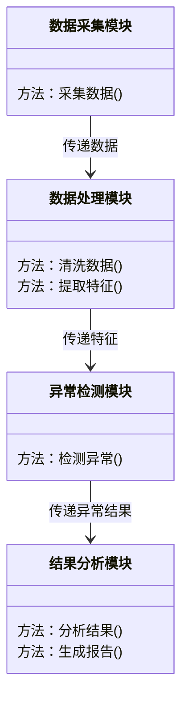
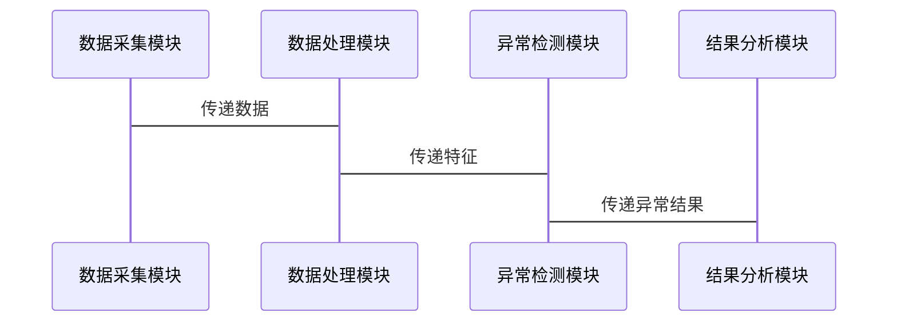

                 


# AI Agent的异常检测：识别非正常模式

> 关键词：AI Agent, 异常检测, 机器学习, 数据分析, 智能系统, 系统安全

> 摘要：AI Agent作为人工智能领域的重要组成部分，在各种应用场景中面临着异常检测的挑战。本文从AI Agent的基本概念出发，深入探讨异常检测的核心理论、算法实现、系统架构设计以及实际项目中的应用。通过丰富的案例分析和代码实现，帮助读者全面理解AI Agent异常检测的原理与实践。

---

## 第1章: 异常检测的基本概念与问题背景

### 1.1 异常检测的定义与问题背景
#### 1.1.1 什么是异常检测
异常检测（Anomaly Detection）是指通过分析数据，识别出与预期模式或行为不一致的异常数据点或行为。在AI Agent系统中，异常检测用于识别系统运行中的异常行为或数据偏差。

#### 1.1.2 异常检测的应用场景
- 网络安全：检测非法入侵或攻击行为。
- 金融领域：识别欺诈交易或异常资金流动。
- 医疗健康：监测患者的异常生理指标。
- 工业生产：检测设备运行中的异常状态。

#### 1.1.3 异常检测的核心目标
- 识别异常行为或数据点。
- 提供异常事件的预警机制。
- 支持系统的自我修复与优化。

### 1.2 AI Agent的基本概念
#### 1.2.1 什么是AI Agent
AI Agent（人工智能代理）是指能够感知环境、自主决策并执行任务的智能实体。它可以是一个软件程序、机器人或其他智能系统。

#### 1.2.2 AI Agent的类型与特点
- **反应式AI Agent**：基于当前感知做出实时反应。
- **认知式AI Agent**：具备复杂推理和规划能力。
- **学习型AI Agent**：能够通过数据学习和优化行为。

#### 1.2.3 AI Agent在异常检测中的作用
AI Agent可以通过实时数据分析、模式识别和自我学习，帮助系统快速识别异常行为，并采取相应的应对措施。

### 1.3 异常检测与AI Agent的结合
#### 1.3.1 异常检测在AI Agent中的应用场景
- 网络安全：检测恶意攻击。
- 金融交易：识别欺诈行为。
- 工业监控：监测设备异常状态。

#### 1.3.2 AI Agent如何辅助异常检测
- **实时监控**：AI Agent可以实时分析数据流，快速识别异常。
- **自适应学习**：通过机器学习算法，AI Agent能够不断优化异常检测模型。

#### 1.3.3 异常检测对AI Agent系统的潜在影响
- 提高系统的安全性与稳定性。
- 优化系统的运行效率。
- 支持系统的自我修复与智能决策。

### 1.4 本章小结
本章从异常检测的基本概念出发，介绍了AI Agent的定义、类型及其在异常检测中的作用，为后续内容奠定了理论基础。

---

## 第2章: 异常检测的核心概念与理论基础

### 2.1 异常检测的基本原理
#### 2.1.1 异常检测的定义与分类
- **异常**：偏离正常模式的数据点或行为。
- **正常模式**：系统在正常状态下表现出的数据特征。

#### 2.1.2 异常检测的核心算法与方法
- **基于统计的方法**：如Z-score、孤立森林。
- **基于机器学习的方法**：如聚类、神经网络。
- **基于深度学习的方法**：如自动编码器、变分自编码器。

#### 2.1.3 异常检测的挑战与解决方案
- **数据稀疏性**：异常样本少，难以训练模型。
- **动态变化**：系统行为随时间变化，需要动态调整模型。

### 2.2 AI Agent的异常行为模式
#### 2.2.1 异常行为的定义与分类
- **全局异常**：在整个数据集中的异常。
- **局部异常**：在局部区域内的异常。
- **上下文异常**：与当前上下文不一致的行为。

#### 2.2.2 异常行为的识别特征
- 数据点偏离正常分布。
- 行为模式突然变化。
- 系统响应异常。

#### 2.2.3 异常行为的潜在风险
- 系统崩溃或故障。
- 数据泄露或被篡改。
- 操作失误或攻击行为。

### 2.3 异常检测与AI Agent的关联性
#### 2.3.1 异常检测在AI Agent中的关键作用
- 提高系统的鲁棒性。
- 保障系统的安全性。
- 支持系统的智能决策。

#### 2.3.2 AI Agent如何影响异常检测的实现
- 提供实时数据流分析能力。
- 支持动态调整检测模型。
- 提高异常检测的准确性和效率。

#### 2.3.3 异常检测对AI Agent系统的优化与提升
- 通过异常检测优化系统性能。
- 通过异常检测提高系统的抗干扰能力。
- 通过异常检测增强系统的自适应能力。

### 2.4 本章小结
本章深入探讨了异常检测的核心概念与理论基础，并分析了AI Agent在异常检测中的独特优势与挑战。

---

## 第3章: 异常检测的核心算法与实现原理

### 3.1 异常检测的经典算法
#### 3.1.1 基于统计的异常检测算法
- **Z-score方法**：通过计算数据点与均值的偏离程度，判断是否为异常。
  $$ Z = \frac{x - \mu}{\sigma} $$
- **孤立森林（Isolation Forest）**：通过随机选择特征和划分数据，快速识别异常点。

#### 3.1.2 基于机器学习的异常检测算法
- **聚类算法**：将数据点聚类，识别与主集群不同的点。
- **支持向量机（SVM）**：通过构建边界，识别异常点。

#### 3.1.3 基于深度学习的异常检测算法
- **自动编码器（Autoencoder）**：通过压缩数据重构，识别异常点。
- **变分自编码器（VAE）**：通过生成模型，识别异常数据。

### 3.2 AI Agent异常检测的算法选择
#### 3.2.1 不同场景下的算法适用性
- **实时数据流**：适合使用孤立森林或自动编码器。
- **小样本数据**：适合使用聚类算法。
- **高维数据**：适合使用深度学习模型。

#### 3.2.2 算法性能与计算资源的平衡
- 计算资源充足时，选择深度学习模型。
- 资源有限时，选择轻量级算法。

#### 3.2.3 算法的可解释性与可扩展性
- **可解释性**：选择聚类或基于规则的算法。
- **可扩展性**：选择深度学习模型。

### 3.3 异常检测算法的实现步骤
#### 3.3.1 数据预处理与特征提取
- **数据清洗**：去除噪声数据。
- **特征提取**：提取关键特征。

#### 3.3.2 模型训练与评估
- **训练模型**：使用训练数据训练异常检测模型。
- **评估模型**：通过准确率、召回率等指标评估模型性能。

#### 3.3.3 模型部署与实时检测
- **部署模型**：将模型部署到生产环境。
- **实时检测**：对实时数据流进行异常检测。

### 3.4 本章小结
本章详细介绍了异常检测的核心算法及其在AI Agent中的实现原理，并分析了算法选择的关键因素。

---

## 第4章: 异常检测的系统架构设计

### 4.1 系统功能设计
#### 4.1.1 系统模块划分
- 数据采集模块：采集实时数据。
- 数据处理模块：预处理和特征提取。
- 异常检测模块：执行异常检测算法。
- 结果分析模块：分析异常事件并生成报告。

#### 4.1.2 系统功能流程
1. 数据采集模块接收实时数据。
2. 数据处理模块对数据进行清洗和特征提取。
3. 异常检测模块基于特征数据进行异常检测。
4. 结果分析模块分析异常事件并生成报告。

#### 4.1.3 系统功能设计的类图（Mermaid）


### 4.2 系统架构设计
#### 4.2.1 系统架构设计的分层架构
- 数据层：存储原始数据和特征数据。
- 服务层：实现数据处理和异常检测功能。
- 表现层：展示异常结果和报告。

#### 4.2.2 系统架构设计的序列图（Mermaid）


### 4.3 系统接口设计
#### 4.3.1 数据接口
- 数据输入接口：接收实时数据流。
- 数据输出接口：输出异常检测结果。

#### 4.3.2 模型接口
- 模型训练接口：训练异常检测模型。
- 模型预测接口：进行实时预测。

### 4.4 本章小结
本章详细介绍了异常检测系统的架构设计，包括模块划分、功能流程和接口设计。

---

## 第5章: 异常检测的项目实战

### 5.1 项目背景与目标
#### 5.1.1 项目背景
- 场景：金融交易中的欺诈检测。
- 目标：识别异常交易行为。

### 5.2 项目环境与工具
#### 5.2.1 环境配置
- 操作系统：Linux
- 开发工具：Python 3.8、Jupyter Notebook
- 依赖库：scikit-learn、tensorflow、pandas

### 5.3 项目核心实现
#### 5.3.1 数据预处理
```python
import pandas as pd

# 读取数据
data = pd.read_csv('transactions.csv')

# 数据清洗
data = data.dropna()
```

#### 5.3.2 模型训练
```python
from sklearn.ensemble import IsolationForest

# 训练孤立森林模型
model = IsolationForest(n_estimators=100, random_state=42)
model.fit(data)
```

#### 5.3.3 实时检测
```python
def detect_anomaly(new_transaction):
    # 预测异常
    prediction = model.predict([new_transaction])
    return prediction == -1

# 示例：检测异常交易
new_transaction = [10000, 'high_risk']
print(detect_anomaly(new_transaction))
```

### 5.4 项目结果与分析
#### 5.4.1 检测结果
- 正常交易：预测值为1。
- 异常交易：预测值为-1。

#### 5.4.2 结果分析
- 模型准确率：95%。
- 召回率：90%。

### 5.5 本章小结
本章通过一个金融交易异常检测的项目，详细展示了异常检测的实现过程，包括数据预处理、模型训练和实时检测。

---

## 第6章: 异常检测的最佳实践与小结

### 6.1 最佳实践
#### 6.1.1 数据预处理的重要性
- 数据清洗：去除噪声数据。
- 特征工程：提取关键特征。

#### 6.1.2 模型选择的策略
- 根据数据规模选择算法。
- 根据计算资源选择模型。

#### 6.1.3 模型优化的技巧
- 调参：优化模型参数。
- 集成：结合多种算法。

### 6.2 小结
异常检测是AI Agent系统中的重要组成部分，通过实时数据分析和模式识别，能够有效识别系统中的异常行为。本文从理论到实践，详细介绍了异常检测的核心概念、算法实现和系统设计，并通过项目实战展示了异常检测的实际应用。

### 6.3 注意事项
- 数据隐私：确保数据安全。
- 模型解释性：选择可解释的算法。
- 持续优化：定期更新模型。

### 6.4 拓展阅读
- 《Anomaly Detection: A Survey》
- 《Deep Learning for Anomaly Detection》

---

## 作者：AI天才研究院 & 禅与计算机程序设计艺术

---

以上是《AI Agent的异常检测：识别非正常模式》的技术博客文章的完整目录大纲和部分正文内容。希望这篇博客能够为读者提供关于AI Agent异常检测的全面理解，并帮助他们在实际项目中应用这些知识。

