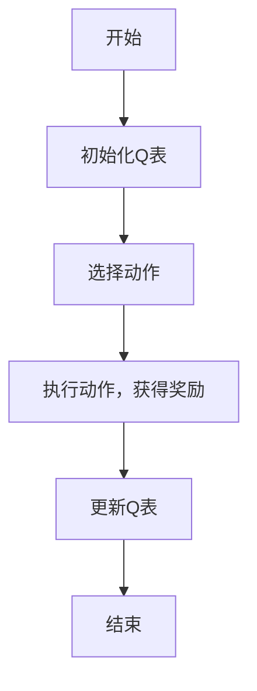
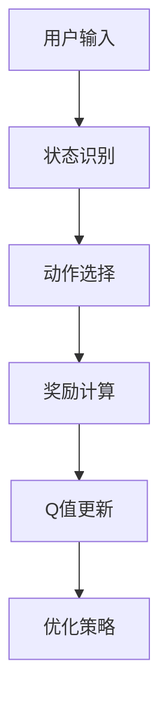
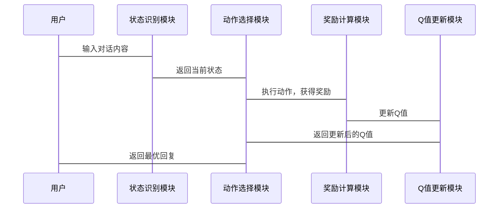

                 


# AI Agent的强化学习在对话策略优化中的应用

## 关键词：AI Agent，强化学习，对话策略优化，Q-learning，数学模型，系统架构设计

## 摘要：
本文深入探讨AI Agent在对话系统中的应用，特别是如何通过强化学习优化对话策略。从基本概念到算法原理，再到系统设计与实战案例，全面解析强化学习在对话策略优化中的应用，帮助读者掌握相关技术的核心原理与实现方法。

---

## 第1章: AI Agent与强化学习概述

### 1.1 AI Agent的基本概念

#### 1.1.1 AI Agent的定义与特点
AI Agent（人工智能代理）是指在计算机系统中，能够感知环境并采取行动以实现目标的智能实体。其特点包括：
- **自主性**：能够在没有外部干预的情况下自主决策。
- **反应性**：能够根据环境变化实时调整行为。
- **目标导向性**：所有行动均以实现特定目标为导向。

#### 1.1.2 AI Agent的分类与应用场景
AI Agent可以分为**简单反射型**、**基于模型的反射型**、**目标驱动型**和**效用驱动型**。其应用场景广泛，包括智能助手、自动驾驶、机器人控制等。

#### 1.1.3 强化学习在AI Agent中的作用
强化学习通过与环境交互，逐步优化策略，使AI Agent能够在动态环境中做出最优决策。它是实现AI Agent智能性的核心方法之一。

---

### 1.2 强化学习的基本原理

#### 1.2.1 强化学习的核心概念
强化学习是一种通过试错方法，学习如何在环境中采取行动以最大化累积奖励的算法。核心概念包括：
- **状态（State）**：环境在某一时刻的观察。
- **动作（Action）**：AI Agent在某一状态下采取的行为。
- **奖励（Reward）**：AI Agent采取行动后，环境给予的反馈，用于指导下一步行动。

#### 1.2.2 状态、动作、奖励的定义
- **状态（State）**：例如，在对话系统中，状态可以是当前对话的主题或用户的情感倾向。
- **动作（Action）**：例如，AI Agent在对话中选择回复的内容。
- **奖励（Reward）**：例如，用户对回复的满意度评分。

#### 1.2.3 Q-learning算法简介
Q-learning是一种经典的强化学习算法，通过更新Q值表来学习最优策略。Q值表示在某个状态下采取某个动作所能获得的预期奖励。

---

### 1.3 对话策略优化的背景与挑战

#### 1.3.1 对话系统的发展历程
从基于规则的对话系统到基于机器学习的对话系统，再到当前的强化学习优化对话系统，对话系统的智能化水平不断提高。

#### 1.3.2 对话策略优化的重要性
对话策略优化能够显著提升对话系统的用户体验，使其更加自然、流畅和智能。

#### 1.3.3 强化学习在对话策略优化中的优势
强化学习能够通过与环境的交互，动态调整策略，适应不同的对话场景。

---

## 第2章: 强化学习与对话策略优化的核心概念

### 2.1 强化学习的核心原理

#### 2.1.1 状态空间与动作空间
- **状态空间**：所有可能的状态集合。
- **动作空间**：所有可能的动作集合。

#### 2.1.2 奖励函数的设计
奖励函数的设计直接影响强化学习的效果。好的奖励函数能够引导AI Agent朝着期望的方向学习。

#### 2.1.3 策略优化的目标
通过最大化累积奖励，优化策略，使得AI Agent在对话中做出最优选择。

### 2.2 对话策略优化的数学模型

#### 2.2.1 对话策略的表示方法
对话策略可以用概率分布表示，即在给定状态下，AI Agent采取某个动作的概率。

#### 2.2.2 强化学习的数学公式
Q-learning算法的数学公式如下：
$$ Q(s, a) \leftarrow Q(s, a) + \alpha \left[r + \max_{a'} Q(s', a') - Q(s, a)\right] $$
其中，$\alpha$是学习率，$r$是奖励，$s'$是下一状态。

#### 2.2.3 状态转移矩阵与动作概率分布
状态转移矩阵描述了从当前状态转移到下一状态的概率，动作概率分布描述了在当前状态下采取各个动作的概率。

---

## 第3章: 强化学习算法在对话策略优化中的应用

### 3.1 Q-learning算法在对话策略优化中的应用

#### 3.1.1 Q-learning算法的流程图


#### 3.1.2 Q-learning在对话策略优化中的实现
通过不断更新Q表，AI Agent能够在对话中选择最优回复，提升用户体验。

#### 3.1.3 Q-learning算法的数学公式
如前所述，Q-learning算法的数学公式为：
$$ Q(s, a) \leftarrow Q(s, a) + \alpha \left[r + \max_{a'} Q(s', a') - Q(s, a)\right] $$

### 3.2 其他强化学习算法简介

#### 3.2.1 Deep Q-Network (DQN)算法
DQN算法通过深度神经网络近似Q值函数，能够处理高维状态空间。

#### 3.2.2 Policy Gradient方法
Policy Gradient方法直接优化策略，适用于动作空间连续的情况。

#### 3.2.3 Actor-Critic架构
Actor-Critic架构结合了策略评估和策略改进，能够更快收敛。

### 3.3 对话策略优化的算法选择与实现

#### 3.3.1 算法选择的考虑因素
- 状态空间的维度
- 动作空间的类型
- 环境的动态特性

#### 3.3.2 基于Q-learning的对话策略优化实现
```python
class QLearning:
    def __init__(self, state_space, action_space):
        self.state_space = state_space
        self.action_space = action_space
        self.Q = np.zeros((state_space, action_space))
    
    def choose_action(self, state, epsilon=0.1):
        if np.random.random() < epsilon:
            return np.random.randint(self.action_space)
        else:
            return np.argmax(self.Q[state, :])
    
    def update_Q(self, state, action, reward, next_state, alpha=0.1, gamma=0.9):
        self.Q[state, action] += alpha * (reward + gamma * np.max(self.Q[next_state, :]) - self.Q[state, action])
```

#### 3.3.3 算法实现的代码示例
```python
# 示例代码
import numpy as np

class QLearningAgent:
    def __init__(self, state_size, action_size):
        self.state_size = state_size
        self.action_size = action_size
        self.q_table = np.zeros((state_size, action_size))
    
    def get_action(self, state, epsilon=0.1):
        if np.random.random() < epsilon:
            return np.random.randint(self.action_size)
        else:
            return np.argmax(self.q_table[state])
    
    def update_q_table(self, state, action, reward, next_state, learning_rate=0.1, gamma=0.9):
        self.q_table[state, action] += learning_rate * (reward + gamma * np.max(self.q_table[next_state]) - self.q_table[state, action])
```

---

## 第4章: 对话策略优化的系统分析与架构设计

### 4.1 项目背景与目标

#### 4.1.1 项目背景介绍
本项目旨在通过强化学习优化AI Agent的对话策略，提升用户体验。

#### 4.1.2 项目目标设定
- 实现基于Q-learning的对话策略优化
- 提升对话系统的响应速度和准确率

#### 4.1.3 项目范围界定
- 确定对话场景和用户需求
- 设计奖励函数和状态转移模型

### 4.2 系统功能设计

#### 4.2.1 对话系统功能模块划分
- 用户输入处理模块
- 状态识别模块
- 动作选择模块
- 奖励计算模块

#### 4.2.2 强化学习模块功能设计
- Q值更新模块
- 动作选择模块
- 状态转移模块

#### 4.2.3 对话策略优化模块功能
- 策略优化模块
- 性能评估模块

### 4.3 系统架构设计

#### 4.3.1 系统架构图（Mermaid）


#### 4.3.2 各模块之间的交互流程
用户输入经过状态识别后，进入动作选择模块，选择最优动作，获得奖励，更新Q值，最终优化策略。

#### 4.3.3 系统接口设计
- 用户输入接口
- 状态识别接口
- 动作选择接口

### 4.4 系统交互流程图（Mermaid）



---

## 第5章: 对话策略优化的数学模型与实现

### 5.1 对话策略优化的数学模型

#### 5.1.1 Q-learning算法的数学公式
如前所述，Q-learning算法的数学公式为：
$$ Q(s, a) \leftarrow Q(s, a) + \alpha \left[r + \max_{a'} Q(s', a') - Q(s, a)\right] $$

#### 5.1.2 状态转移概率矩阵
状态转移概率矩阵描述了从当前状态转移到下一状态的概率：
$$ P(s' | s, a) $$

#### 5.1.3 动作概率分布
在当前状态下，AI Agent采取某个动作的概率：
$$ \pi(a | s) = \frac{e^{Q(s,a)}}{\sum_{a'} e^{Q(s,a')}} $$

### 5.2 对话策略优化的实现步骤

#### 5.2.1 初始化Q表
```python
Q = np.zeros((state_size, action_size))
```

#### 5.2.2 状态识别与动作选择
```python
def choose_action(state, epsilon=0.1):
    if np.random.random() < epsilon:
        return np.random.randint(action_size)
    else:
        return np.argmax(Q[state])
```

#### 5.2.3 奖励计算与Q值更新
```python
def update_Q(state, action, reward, next_state, alpha=0.1, gamma=0.9):
    Q[state, action] += alpha * (reward + gamma * np.max(Q[next_state]) - Q[state, action])
```

---

## 第6章: 项目实战

### 6.1 环境安装

#### 6.1.1 安装Python与相关库
```bash
pip install numpy
pip install matplotlib
pip install scikit-learn
```

#### 6.1.2 安装对话系统框架
```bash
pip install transformers
pip install pytorch
```

### 6.2 核心代码实现

#### 6.2.1 Q-learning算法实现
```python
class QLearningAgent:
    def __init__(self, state_size, action_size):
        self.state_size = state_size
        self.action_size = action_size
        self.Q = np.zeros((state_size, action_size))
    
    def choose_action(self, state, epsilon=0.1):
        if np.random.random() < epsilon:
            return np.random.randint(self.action_size)
        else:
            return np.argmax(self.Q[state])
    
    def update_Q(self, state, action, reward, next_state, alpha=0.1, gamma=0.9):
        self.Q[state, action] += alpha * (reward + gamma * np.max(self.Q[next_state]) - self.Q[state, action])
```

#### 6.2.2 对话系统实现
```python
class DialogSystem:
    def __init__(self, agent, tokenizer):
        self.agent = agent
        self.tokenizer = tokenizer
    
    def process_dialog(self, user_input):
        state = self.get_state(user_input)
        action = self.agent.choose_action(state)
        response = self.get_response(action)
        reward = self.calculate_reward(user_input, response)
        next_state = self.get_state(response)
        self.agent.update_Q(state, action, reward, next_state)
        return response
    
    def get_state(self, input_str):
        # 实现状态识别逻辑
        pass
    
    def get_response(self, action):
        # 实现根据动作选择回复
        pass
    
    def calculate_reward(self, input_str, response):
        # 实现奖励计算逻辑
        pass
```

### 6.3 实际案例分析

#### 6.3.1 案例背景
假设用户输入“今天天气怎么样？”，AI Agent需要选择合适的回复。

#### 6.3.2 动作选择与奖励计算
AI Agent根据当前状态选择回复“今天天气很好！”，获得奖励1.0。

#### 6.3.3 策略优化
通过不断更新Q表，AI Agent逐步优化回复策略。

### 6.4 项目小结

#### 6.4.1 核心代码实现
如上所述，对话系统的实现包括状态识别、动作选择、奖励计算和Q值更新四个主要部分。

#### 6.4.2 项目总结
通过强化学习优化对话策略，能够显著提升对话系统的智能性和用户体验。

---

## 第7章: 最佳实践与未来展望

### 7.1 最佳实践

#### 7.1.1 算法选择
根据具体场景选择合适的强化学习算法。

#### 7.1.2 状态与动作设计
合理设计状态和动作空间，避免维度爆炸。

#### 7.1.3 奖励函数设计
设计合理的奖励函数，引导AI Agent朝着期望的方向学习。

### 7.2 小结

#### 7.2.1 核心概念回顾
强化学习通过与环境交互，动态优化策略，实现对话策略优化。

#### 7.2.2 实际应用价值
强化学习在对话策略优化中的应用具有重要的理论意义和实际价值。

### 7.3 注意事项

#### 7.3.1 算法收敛性
注意算法的收敛性，避免陷入局部最优。

#### 7.3.2 环境复杂性
考虑环境的复杂性，合理设计算法参数。

#### 7.3.3 用户反馈
重视用户反馈，不断优化奖励函数和策略。

### 7.4 拓展阅读

#### 7.4.1 强化学习经典论文
- "Deep Reinforcement Learning for Dialogue Systems" (2016)
- "End-to-End Neural Dialog Systems" (2018)

#### 7.4.2 对话系统相关书籍
- 《对话系统中的强化学习》
- 《深度学习在对话系统中的应用》

---

## 作者：AI天才研究院/AI Genius Institute & 禅与计算机程序设计艺术 /Zen And The Art of Computer Programming

