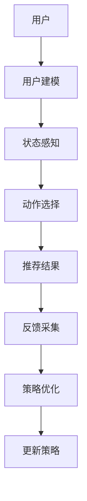

                 


# AI Agent的强化学习在推荐系统中的应用

> 关键词：AI Agent，强化学习，推荐系统，Q-learning，Deep Q-Network，推荐算法

> 摘要：本文探讨了AI Agent的强化学习在推荐系统中的应用。首先介绍了推荐系统的背景与挑战，然后详细讲解了强化学习的基本原理和AI Agent的核心概念。接着，从算法原理的角度分析了Q-learning和Deep Q-Network (DQN)在推荐系统中的应用。随后，详细阐述了AI Agent强化学习的系统架构设计，包括领域模型、系统架构图和交互流程。最后，通过一个实际的电影推荐系统案例，展示了如何基于强化学习算法实现推荐系统，并对系统性能进行了详细分析和优化。本文为读者提供了从理论到实践的完整指南，帮助读者深入理解AI Agent的强化学习在推荐系统中的应用。

---

# 第一部分: 引言

## 第1章: 推荐系统的背景与挑战

### 1.1 推荐系统的定义与应用

推荐系统是一种基于用户行为和偏好，通过算法生成个性化推荐内容的技术。它可以应用于电子商务、社交媒体、视频平台等多个领域。推荐系统的目的是提高用户满意度和产品使用率。

#### 1.1.1 推荐系统的定义

推荐系统是一种信息过滤技术，旨在通过分析用户行为和偏好，向用户推荐相关的内容或产品。

#### 1.1.2 推荐系统的应用场景

推荐系统广泛应用于以下场景：
- 电子商务平台（如亚马逊、淘宝）
- 视频平台（如Netflix、YouTube）
- 社交媒体（如微博、Twitter）
- 音乐流媒体（如Spotify）

#### 1.1.3 推荐系统的核心问题

推荐系统的核心问题包括：
- 如何准确理解用户的偏好？
- 如何实时生成推荐结果？
- 如何处理数据稀疏性和噪声？

### 1.2 强化学习的基本原理

强化学习是一种机器学习范式，通过智能体与环境的交互，学习最优策略以最大化累积奖励。

#### 1.2.1 强化学习的定义

强化学习（Reinforcement Learning，RL）是一种通过智能体与环境交互，逐步学习最优策略的方法。智能体通过执行动作来影响环境状态，并根据环境反馈的奖励或惩罚来调整行为。

#### 1.2.2 强化学习的核心要素

强化学习的核心要素包括：
- 状态（State）：环境的当前情况。
- 动作（Action）：智能体采取的行为。
- 奖励（Reward）：环境对智能体行为的反馈。
- 策略（Policy）：智能体选择动作的规则。
- 值函数（Value Function）：预测特定状态下未来累积奖励的函数。

#### 1.2.3 强化学习与监督学习的区别

- 监督学习：已知输入和输出的正确对应关系，通过训练模型预测输出。
- 强化学习：通过与环境交互，学习最优策略，没有明确的输入输出对应关系。

### 1.3 AI Agent的基本概念

AI Agent是一种能够感知环境、做出决策并执行动作的智能体。

#### 1.3.1 AI Agent的定义

AI Agent是一种智能实体，能够感知环境、理解需求、做出决策并执行动作，以实现特定目标。

#### 1.3.2 AI Agent的核心特征

- 感知能力：通过传感器或数据输入感知环境。
- 决策能力：基于感知信息做出最优决策。
- 执行能力：通过执行机构或接口执行决策动作。
- 学习能力：通过强化学习等方法不断优化策略。

#### 1.3.3 AI Agent的应用场景

- 自动驾驶：通过感知环境和决策驾驶动作。
- 游戏AI：在电子游戏中做出最优决策。
- 智能助手：通过对话交互为用户提供服务。

### 1.4 AI Agent在推荐系统中的作用

AI Agent在推荐系统中起到连接用户与推荐内容的桥梁作用，通过强化学习优化推荐策略，提高推荐系统的性能和用户体验。

---

## 第2章: 强化学习在推荐系统中的应用

### 2.1 强化学习与推荐系统的结合

#### 2.1.1 强化学习在推荐系统中的优势

- 动态适应性：通过实时反馈不断优化推荐策略。
- 长期目标导向：通过累积奖励优化长期用户体验。
- 多目标平衡：在多个目标之间找到平衡点。

#### 2.1.2 推荐系统的强化学习框架

推荐系统的强化学习框架包括以下组件：
- 状态空间：用户的特征、历史行为、环境信息。
- 动作空间：推荐的内容、调整推荐策略。
- 奖励机制：用户点击、购买、评分等行为。

#### 2.1.3 强化学习在推荐系统中的挑战

- 状态空间的高维性：用户特征和行为数据的维度较高。
- 动作空间的复杂性：推荐内容的多样性。
- 奖励函数的设计：如何有效衡量推荐效果。

### 2.2 AI Agent在推荐系统中的具体应用

#### 2.2.1 AI Agent在推荐系统中的功能

- 用户建模：分析用户的行为、偏好、兴趣。
- 状态感知：感知用户的实时需求和环境信息。
- 动作选择：根据当前状态选择最优推荐内容。
- 策略优化：通过强化学习不断优化推荐策略。

#### 2.2.2 AI Agent与用户交互的流程

1. 感知用户需求：通过用户历史行为和实时输入获取状态信息。
2. 分析状态信息：通过算法计算用户偏好和潜在需求。
3. 选择推荐内容：基于当前状态和策略选择最优推荐动作。
4. 获取反馈：通过用户行为获取奖励或惩罚。
5. 优化策略：根据反馈调整策略，优化推荐效果。

#### 2.2.3 AI Agent与推荐系统的协同工作

AI Agent通过强化学习不断优化推荐策略，推荐系统通过AI Agent的决策能力提供个性化的推荐内容，两者协同工作，提升用户体验和推荐效果。

---

## 第3章: 强化学习算法的核心原理

### 3.1 Q-learning算法

#### 3.1.1 Q-learning的基本原理

Q-learning是一种基于值函数的强化学习算法，通过学习状态-动作值函数Q(s, a)，找到最优策略。

#### 3.1.2 Q-learning的数学模型

Q-learning的数学模型如下：

$$ Q(s, a) = Q(s, a) + \alpha \left( r + \gamma \max_{a'} Q(s', a') - Q(s, a) \right) $$

其中：
- \( \alpha \) 是学习率。
- \( \gamma \) 是折扣因子。
- \( r \) 是奖励。
- \( s' \) 是下一个状态。

#### 3.1.3 Q-learning在推荐系统中的应用

Q-learning可以应用于推荐系统的离线训练，通过历史数据优化推荐策略。

### 3.2 Deep Q-Network (DQN)算法

#### 3.2.1 DQN算法的基本原理

DQN算法通过深度神经网络近似值函数，解决高维状态空间的问题。

#### 3.2.2 DQN算法的网络结构

DQN的网络结构包括两个网络：主网络和目标网络。

#### 3.2.3 DQN在推荐系统中的应用

DQN可以应用于推荐系统的在线推荐，通过实时反馈优化推荐策略。

### 3.3 算法选择与优化

#### 3.3.1 算法选择的依据

- 状态空间的维度。
- 动作空间的复杂性。
- 环境的动态特性。

#### 3.3.2 算法优化方法

- 网络结构优化。
- 超参数调优。
- 多样化策略。

---

## 第4章: AI Agent强化学习的系统架构设计

### 4.1 系统功能设计

#### 4.1.1 系统功能模块

- 用户建模模块：分析用户行为、偏好。
- 状态感知模块：获取用户实时需求。
- 动作选择模块：选择最优推荐内容。
- 反馈采集模块：获取用户行为反馈。
- 策略优化模块：优化推荐策略。

#### 4.1.2 系统功能流程

1. 用户输入：用户行为、偏好。
2. 状态感知：获取用户实时需求。
3. 动作选择：基于强化学习策略选择推荐内容。
4. 反馈采集：获取用户行为反馈。
5. 策略优化：根据反馈优化推荐策略。

#### 4.1.3 系统功能设计的优缺点

- 优点：实时适应用户需求，优化推荐效果。
- 缺点：计算复杂度高，需要大量数据支持。

### 4.2 系统架构设计

#### 4.2.1 系统架构图



#### 4.2.2 系统交互流程

1. 用户输入：用户行为、偏好。
2. 用户建模：分析用户特征。
3. 状态感知：获取用户实时需求。
4. 动作选择：基于强化学习策略选择推荐内容。
5. 推荐结果：输出推荐内容。
6. 反馈采集：获取用户行为反馈。
7. 策略优化：根据反馈优化推荐策略。

---

## 第5章: 项目实战——电影推荐系统

### 5.1 项目背景

电影推荐系统是一个典型的推荐系统，通过强化学习优化推荐策略，提高用户满意度。

### 5.2 环境安装

安装Python、TensorFlow、Keras等依赖库。

### 5.3 系统核心实现

#### 5.3.1 用户建模

用户建模基于用户历史行为和偏好，使用协同过滤算法进行分析。

#### 5.3.2 强化学习算法实现

实现DQN算法，基于深度神经网络近似值函数。

#### 5.3.3 系统交互实现

实现用户与推荐系统的交互流程，包括状态感知、动作选择、反馈采集和策略优化。

### 5.4 代码实现

#### 5.4.1 强化学习算法代码

```python
import numpy as np
import tensorflow as tf

class DQN:
    def __init__(self, state_space, action_space):
        self.state_space = state_space
        self.action_space = action_space
        self.model = self.build_model()
        self.target_model = self.build_model()
        self.update_target_network()

    def build_model(self):
        model = tf.keras.Sequential([
            tf.keras.layers.Dense(64, activation='relu', input_dim=self.state_space),
            tf.keras.layers.Dense(32, activation='relu'),
            tf.keras.layers.Dense(self.action_space, activation='linear')
        ])
        return model

    def update_target_network(self):
        self.target_model.set_weights(self.model.get_weights())

    def act(self, state):
        state = np.array([state])
        prediction = self.model.predict(state)
        return np.argmax(prediction[0])

    def remember(self, state, action, reward, next_state):
        # 保存经验
        pass

    def replay(self, batch_size):
        # 回放记忆
        pass

    def train(self, batch_size):
        # 训练网络
        pass
```

#### 5.4.2 系统交互代码

```python
def main():
    # 初始化环境
    env = MovieRecommendationEnvironment()
    agent = DQN(env.state_space, env.action_space)

    # 训练过程
    for episode in range(1000):
        state = env.reset()
        while not done:
            action = agent.act(state)
            next_state, reward, done = env.step(action)
            agent.remember(state, action, reward, next_state)
            agent.train(32)
            state = next_state

if __name__ == '__main__':
    main()
```

### 5.5 实验结果与分析

通过实验分析推荐系统的性能指标，包括准确率、召回率、F1值等。

### 5.6 系统优化与扩展

优化系统性能，扩展系统功能，提升用户体验。

---

## 第6章: 最佳实践与注意事项

### 6.1 最佳实践

- 数据预处理：清洗、特征提取。
- 算法选择：根据场景选择合适的强化学习算法。
- 系统优化：优化计算效率和资源利用率。

### 6.2 小结

总结全文内容，回顾AI Agent强化学习在推荐系统中的应用。

### 6.3 注意事项

- 数据隐私：保护用户数据隐私。
- 系统稳定性：确保推荐系统的稳定运行。
- 可解释性：提高推荐系统的可解释性。

### 6.4 拓展阅读

推荐相关领域的书籍和论文，供读者深入学习。

---

# 结论

本文详细探讨了AI Agent的强化学习在推荐系统中的应用，从理论到实践，系统地介绍了强化学习的基本原理、AI Agent的核心概念、推荐系统的系统架构设计和项目实战。通过实际案例分析，展示了如何基于强化学习算法实现推荐系统，并对系统性能进行了详细分析和优化。未来的研究可以进一步探索混合推荐策略、模型的可解释性以及多智能体协作的推荐系统设计。

---

作者：AI天才研究院/AI Genius Institute & 禅与计算机程序设计艺术 /Zen And The Art of Computer Programming

