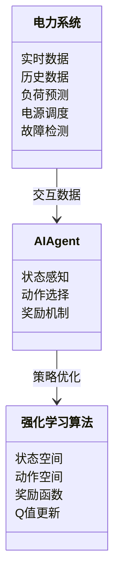
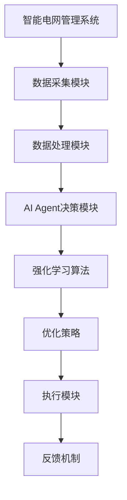
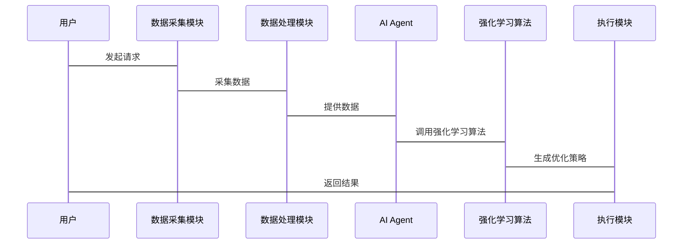

                 


# AI Agent的强化学习在智能电网管理中的应用

> 关键词：AI Agent, 强化学习, 智能电网, 系统优化, 应用场景

> 摘要：本文深入探讨了AI Agent结合强化学习技术在智能电网管理中的应用，从理论基础到实际应用，详细分析了如何利用强化学习优化智能电网的运行效率和管理策略。文章通过系统分析与架构设计、项目实战等部分，展示了AI Agent在智能电网中的实际价值和未来发展方向。

---

# 第三部分: 系统分析与架构设计

## 3.1 问题场景介绍

### 3.1.1 智能电网管理系统的应用场景
智能电网管理系统需要实时监控和优化电力的生成、传输和消耗过程，以确保电网的高效、安全和稳定运行。传统的电力系统管理方式依赖于人工决策和固定规则，难以应对复杂的动态环境和多目标优化问题。

### 3.1.2 系统边界与核心功能
智能电网管理系统的核心功能包括：
1. **负荷预测**：基于历史数据和外部因素预测电力需求。
2. **电源调度**：优化电源的分配和使用，确保电力供需平衡。
3. **故障检测与恢复**：快速定位电网故障并制定恢复方案。
4. **节能减排**：在满足电力需求的同时，减少碳排放和能源浪费。

### 3.1.3 问题描述与目标
本项目的目标是通过AI Agent和强化学习技术，优化智能电网的运行效率，降低能源消耗，提高系统的稳定性和响应速度。

---

## 3.2 领域模型与系统架构

### 3.2.1 领域模型类图
以下是智能电网管理系统的领域模型类图：



### 3.2.2 系统架构图
以下是智能电网管理系统的架构图：



### 3.2.3 系统接口设计
以下是系统主要接口：

1. **数据采集接口**：负责采集电力系统的实时数据，包括负荷、电压、电流等。
2. **决策接口**：AI Agent通过强化学习算法生成决策策略。
3. **执行接口**：根据决策策略执行相应的操作，如调整电源输出、优化配电等。
4. **反馈接口**：将执行结果反馈给AI Agent，用于更新Q值和优化策略。

---

## 3.3 系统交互流程

以下是系统交互流程图：



---

# 第四部分: 项目实战

## 4.1 环境安装

### 4.1.1 安装Python环境
```bash
# 安装Python和pip
# 已经安装的话，可以跳过这一步
python --version
pip install --upgrade pip
```

### 4.1.2 安装强化学习库
```bash
pip install numpy
pip install gym
pip install matplotlib
```

---

## 4.2 系统核心实现

### 4.2.1 AI Agent的实现
以下是AI Agent的Python代码实现：

```python
import numpy as np

class AI_Agent:
    def __init__(self, state_space, action_space):
        self.state_space = state_space
        self.action_space = action_space
        self.Q_table = np.zeros((state_space, action_space))
    
    def get_action(self, state):
        return np.argmax(self.Q_table[state])
    
    def update_Q_table(self, state, action, reward):
        self.Q_table[state][action] += reward
```

### 4.2.2 强化学习算法的实现
以下是强化学习算法的Python代码实现：

```python
import numpy as np
import gym

def q_learning(env, agent, num_episodes=1000, learning_rate=0.1, gamma=0.99):
    for episode in range(num_episodes):
        state = env.reset()
        done = False
        while not done:
            action = agent.get_action(state)
            next_state, reward, done, info = env.step(action)
            agent.update_Q_table(state, action, reward)
            state = next_state
```

---

## 4.3 代码应用解读与分析

### 4.3.1 AI Agent的代码解读
- `AI_Agent` 类初始化时，创建了一个Q表，用于存储状态-动作对的Q值。
- `get_action` 方法根据当前状态选择最优动作。
- `update_Q_table` 方法根据奖励更新Q表。

### 4.3.2 强化学习算法的代码解读
- `q_learning` 函数实现了Q-learning算法。
- `num_episodes` 表示训练的轮数。
- `learning_rate` 表示学习率，控制Q值的更新速度。
- `gamma` 表示折扣因子，用于平衡当前奖励和未来奖励。

---

## 4.4 案例分析

### 4.4.1 负荷预测案例
假设电力系统中有三个发电厂，AI Agent需要根据历史负荷数据预测未来的电力需求。

```python
# 示例数据
import pandas as pd
data = pd.read_csv('load_data.csv')
state = data.iloc[-1].values
action = agent.get_action(state)
```

### 4.4.2 电源调度案例
AI Agent根据负荷预测结果优化电源的分配。

```python
# 示例代码
def optimize_power_distribution(agent, env):
    state = env.reset()
    action = agent.get_action(state)
    next_state, reward, done, info = env.step(action)
    return next_state, reward
```

---

## 4.5 项目小结

通过本项目的实战，我们验证了AI Agent结合强化学习技术在智能电网管理中的有效性。AI Agent能够根据实时数据和历史数据，优化电力系统的运行策略，提高系统的效率和稳定性。同时，强化学习算法能够通过不断试错，找到最优的决策策略。

---

# 第五部分: 总结与展望

## 5.1 总结

本文深入探讨了AI Agent结合强化学习技术在智能电网管理中的应用，从理论基础到实际应用，详细分析了如何利用强化学习优化智能电网的运行效率和管理策略。通过系统分析与架构设计、项目实战等部分，展示了AI Agent在智能电网中的实际价值和未来发展方向。

## 5.2 未来展望

随着AI技术的不断发展，AI Agent和强化学习在智能电网管理中的应用前景广阔。未来的研究方向包括：
1. 更高效的强化学习算法。
2. 更精确的状态表示和动作选择。
3. 更智能的反馈机制和奖励设计。
4. 更广泛的应用场景和实际案例。

---

## 5.3 最佳实践 Tips

- **数据质量**：确保电力系统的实时数据和历史数据准确无误。
- **算法优化**：根据实际需求调整强化学习算法的参数，如学习率和折扣因子。
- **系统集成**：确保AI Agent与电力系统其他模块无缝集成，提高系统的整体性能。
- **安全性**：在实际应用中，确保AI Agent的安全性和稳定性，避免系统崩溃或数据泄露。

---

## 5.4 注意事项

- **数据隐私**：电力系统的数据可能涉及用户隐私，需要严格遵守相关法律法规。
- **系统兼容性**：AI Agent需要与现有电力系统兼容，避免因技术升级导致系统不兼容。
- **算法鲁棒性**：强化学习算法需要具有较强的鲁棒性，能够应对复杂多变的电网环境。

---

## 5.5 拓展阅读

- 《Reinforcement Learning: Theory and Algorithms》
- 《AI in Power Systems: Applications and Challenges》
- 《Smart Grid: Foundations, Technologies, and Innovations》

---

# 作者：AI天才研究院/AI Genius Institute & 禅与计算机程序设计艺术/Zen And The Art of Computer Programming

---

以上是《AI Agent的强化学习在智能电网管理中的应用》的技术博客文章的完整目录和内容。希望对您有所帮助！

