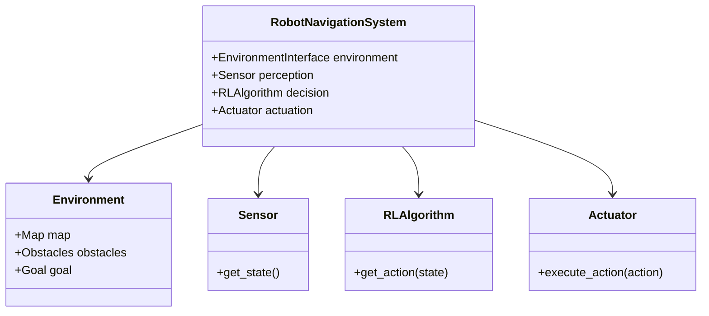

                 


# AI Agent的强化学习在机器人导航中的应用

## 关键词：强化学习，AI Agent，机器人导航，DQN，PPO，算法实现

## 摘要：  
本文探讨了AI Agent在机器人导航中的应用，重点分析了强化学习技术在机器人路径规划、环境交互和任务执行中的关键作用。通过详细讲解强化学习的核心算法（如Q-learning、DQN、PPO）及其在机器人导航中的实现，结合实际项目案例，展示了如何通过强化学习优化机器人导航系统的性能。文章还分析了系统架构设计、算法选择与优化策略，并总结了强化学习在机器人导航中的未来发展方向。

---

# 第一部分: 强化学习与AI Agent基础

## 第1章: 强化学习基础

### 1.1 强化学习的基本概念

#### 1.1.1 什么是强化学习
强化学习（Reinforcement Learning, RL）是一种机器学习范式，通过智能体与环境的交互，智能体通过试错的方式学习如何做出决策以最大化累计奖励。与监督学习不同，强化学习不需要明确的标签数据，而是通过奖励信号来指导学习过程。

**关键概念：**  
- **智能体（Agent）：** 能够感知环境并采取行动的实体。  
- **环境（Environment）：** 智能体所处的外部世界，提供感知和行动的机会。  
- **状态（State）：** 环境在某一时刻的描述。  
- **动作（Action）：** 智能体在某一状态下采取的行为。  
- **奖励（Reward）：** 环境对智能体行为的反馈，用于指导智能体的学习。  

#### 1.1.2 强化学习的核心要素
强化学习的核心在于智能体与环境的交互。智能体会根据当前状态选择一个动作，并将动作执行后获得的奖励作为反馈，逐步优化其策略。

**公式化描述：**  
智能体的目标是通过不断交互，找到最优策略 $\pi$，使得期望累积奖励 $J$ 最大化：  
$$ J = \mathbb{E}[R_t] $$  
其中，$R_t$ 是时间步 $t$ 的奖励。

#### 1.1.3 强化学习与监督学习的区别
| 特性 | 监督学习 | 强化学习 |
|------|----------|----------|
| 数据类型 | 标签数据 | 奖励信号 |
| 反馈机制 | 立即反馈 | 延迟反馈 |
| 动作空间 | 离散分类 | 连续或离散动作 |

---

### 1.2 AI Agent的基本概念

#### 1.2.1 什么是AI Agent
AI Agent（人工智能代理）是一种能够感知环境、采取行动以实现目标的智能实体。AI Agent 可以是软件程序、机器人或其他智能系统，通过与环境的交互，自主决策并完成任务。

#### 1.2.2 AI Agent的分类
AI Agent 可以根据智能体的智能水平和决策方式分为以下几类：  
1. **反应式智能体（Reactive Agent）：** 基于当前感知做出决策，不依赖历史信息。  
2. **认知式智能体（Deliberative Agent）：** 具备推理和规划能力，基于长期目标做出决策。  
3. **混合式智能体（Hybrid Agent）：** 结合反应式和认知式智能体的特点。  

#### 1.2.3 AI Agent的核心功能
AI Agent 的核心功能包括感知、决策、执行和学习。  
- **感知（Perception）：** 通过传感器获取环境信息。  
- **决策（Decision-Making）：** 基于当前状态和目标选择最优动作。  
- **执行（Execution）：** 执行决策动作，与环境交互。  
- **学习（Learning）：** 通过强化学习优化决策策略。  

---

## 第2章: 强化学习在机器人导航中的应用背景

### 2.1 机器人导航的基本问题

#### 2.1.1 机器人导航的定义
机器人导航是指机器人在未知或部分已知的环境中，从起始点移动到目标点的过程。导航的核心问题包括路径规划、避障和目标定位。

#### 2.1.2 机器人导航的核心挑战
1. **环境复杂性：** 动态环境中的障碍物识别和避障。  
2. **路径优化：** 在复杂环境中找到最优路径。  
3. **实时性：** 对实时性要求高的应用场景。  

#### 2.1.3 强化学习在机器人导航中的优势
强化学习能够通过试错学习优化决策策略，特别适合处理动态环境和非结构化场景中的导航问题。

---

### 2.2 强化学习与机器人导航的结合

#### 2.2.1 强化学习在机器人导航中的应用场景
1. **路径规划：** 基于强化学习优化导航路径。  
2. **避障控制：** 学习如何在复杂环境中避障。  
3. **任务执行：** 学习如何在环境中完成特定任务。  

#### 2.2.2 强化学习算法在机器人导航中的作用
强化学习算法为机器人导航提供了自适应和自优化的能力，能够在动态环境中实时调整策略。

#### 2.2.3 强化学习在机器人导航中的研究现状
目前，强化学习在机器人导航中的研究主要集中在算法优化、环境建模和应用推广方面。

---

# 第二部分: 强化学习算法原理

## 第3章: 强化学习的核心算法

### 3.1 Q-learning算法

#### 3.1.1 Q-learning的基本原理
Q-learning是一种基于值函数的强化学习算法，通过维护一个Q表来记录状态-动作对的期望奖励，逐步逼近最优策略。

**公式化描述：**  
Q-learning的更新公式为：  
$$ Q(s, a) \leftarrow Q(s, a) + \alpha \left[r + \gamma \max Q(s', a') - Q(s, a)\right] $$  
其中，$\alpha$ 是学习率，$\gamma$ 是折扣因子。

#### 3.1.2 Q-learning的数学模型
状态-动作值函数 $Q(s, a)$ 是通过不断更新来逼近最优值函数 $Q^*(s, a)$。

#### 3.1.3 Q-learning的优缺点
- **优点：** 简单易实现，适用于离散动作空间。  
- **缺点：** 需要遍历所有状态-动作对，收敛速度慢。  

---

### 3.2 策略梯度（Policy Gradient）算法

#### 3.2.1 策略梯度的基本原理
策略梯度算法通过直接优化策略 $\pi(a|s)$，在动作空间上寻找最优路径，避免了值函数的计算。

**公式化描述：**  
策略梯度的目标函数为：  
$$ J(\theta) = \mathbb{E}_{s,a}[R(s,a)] $$  
通过梯度上升法优化参数 $\theta$：  
$$ \theta \leftarrow \theta + \alpha \nabla_\theta J(\theta) $$  

#### 3.2.2 策略梯度的数学模型
策略梯度通过计算策略的梯度来更新参数，适用于连续动作空间。

#### 3.2.3 策略梯度的优缺点
- **优点：** 直接优化策略，适用于连续动作空间。  
- **缺点：** 收敛不稳定，需要良好的初始化。  

---

## 第4章: 深度强化学习算法

### 4.1 DQN算法

#### 4.1.1 DQN的基本原理
DQN（Deep Q-Network）是Q-learning的一种扩展，通过深度神经网络近似Q值函数，解决了Q-learning的离散化问题。

#### 4.1.2 DQN的数学模型
DQN通过两个神经网络（主网络和目标网络）来近似Q值函数：  
$$ Q(s, a) = \theta \cdot \phi(s, a) $$  
其中，$\theta$ 是网络参数，$\phi(s, a)$ 是状态-动作的特征表示。

#### 4.1.3 DQN的优缺点
- **优点：** 能够处理高维状态空间，适合复杂环境。  
- **缺点：** 状态空间维度过高时，训练效率较低。  

---

### 4.2 PPO算法

#### 4.2.1 PPO的基本原理
PPO（Proximal Policy Optimization）是一种基于策略梯度的算法，通过限制策略更新的幅度来保证收敛性。

#### 4.2.2 PPO的数学模型
PPO的目标函数为：  
$$ J(\theta) = \mathbb{E}[\text{clip}( \frac{\pi_\theta(a|s)}{\pi_{\theta_{old}}(a|s)} , 1-\epsilon, 1+\epsilon) \cdot Q(s,a)] $$  

#### 4.2.3 PPO的优缺点
- **优点：** 稳定性高，适合复杂任务。  
- **缺点：** 需要调节的参数较多。  

---

# 第三部分: AI Agent的强化学习在机器人导航中的实现

## 第5章: 强化学习在机器人导航中的系统架构

### 5.1 系统架构设计

#### 5.1.1 机器人导航系统的功能模块
1. **感知模块：** 通过传感器获取环境信息。  
2. **决策模块：** 基于强化学习算法做出决策。  
3. **执行模块：** 执行决策动作，与环境交互。  

**类图表示：**  


#### 5.1.2 系统的输入输出设计
- **输入：** 环境状态、传感器数据。  
- **输出：** 行动指令、状态反馈。  

---

## 第6章: 强化学习在机器人导航中的项目实战

### 6.1 项目环境安装

#### 6.1.1 安装Python环境
```bash
python --version
pip install --upgrade pip
```

#### 6.1.2 安装强化学习库
```bash
pip install tensorflow numpy gym
```

#### 6.1.3 安装机器人仿真环境
```bash
pip install gym[robotics]
```

### 6.2 系统核心实现源代码

#### 6.2.1 DQN算法实现
```python
import numpy as np
import gym
from gym import spaces

class DQN:
    def __init__(self, state_space, action_space, lr=0.01, gamma=0.99):
        self.state_space = state_space
        self.action_space = action_space
        self.lr = lr
        self.gamma = gamma
        self.q_table = np.zeros((state_space, action_space))
    
    def get_action(self, state):
        return np.argmax(self.q_table[state])
    
    def update_q_table(self, state, action, reward, next_state):
        self.q_table[state, action] += self.lr * (reward + self.gamma * np.max(self.q_table[next_state]) - self.q_table[state, action])
```

#### 6.2.2 机器人导航仿真
```python
env = gym.make('CartPole-v1')
env.seed(42)
agent = DQN(env.observation_space.shape[0], env.action_space.n)
for episode in range(100):
    state = env.reset()
    while True:
        action = agent.get_action(state)
        next_state, reward, done, _ = env.step(action)
        agent.update_q_table(state, action, reward, next_state)
        if done:
            break
        state = next_state
```

### 6.3 项目小结
通过实际项目案例，展示了强化学习算法在机器人导航中的具体实现。DQN算法能够在动态环境中优化导航路径，但需要进一步优化算法的收敛速度和稳定性。

---

# 第四部分: 最佳实践与未来展望

## 第7章: 最佳实践与小结

### 7.1 小结
本文详细探讨了强化学习在AI Agent机器人导航中的应用，分析了多种强化学习算法的优缺点，并通过实际项目案例展示了算法的实现过程。

### 7.2 注意事项
- 确保环境的稳定性和一致性。  
- 合理选择算法和参数设置。  
- 定期评估和优化系统性能。  

### 7.3 拓展阅读
1. 《Reinforcement Learning: Theory and Algorithms》  
2. 《Deep Reinforcement Learning for Robotics》  

---

# 作者

作者：AI天才研究院 & 禅与计算机程序设计艺术

