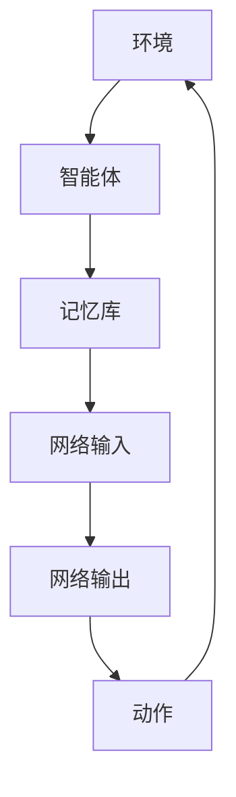

                 


# AI Agent的强化学习在机器人控制中的应用

> 关键词：AI Agent，强化学习，机器人控制，马尔可夫决策过程，DQN，多智能体协作

> 摘要：本文详细探讨了AI Agent在机器人控制中的强化学习应用。通过分析强化学习的基本原理、AI Agent的设计与实现、机器人控制系统架构，以及实际项目案例，深入阐述了强化学习在机器人运动控制和任务执行中的应用。文章还探讨了多智能体协作、实时性优化和人机协作等扩展内容，为读者提供了全面的理论和实践指导。

---

# 第一部分: AI Agent的强化学习基础

## 第1章: 强化学习基础

### 1.1 强化学习的概念与特点

#### 1.1.1 强化学习的定义
强化学习是一种机器学习范式，通过智能体与环境的交互，学习如何采取一系列行动以最大化累积的奖励。其核心在于通过试错机制优化决策策略。

#### 1.1.2 强化学习的核心特点
- **延迟奖励**：奖励可能在多个动作后才给出。
- **探索与利用**：平衡探索新策略和利用已知好策略。
- **序贯决策**：每个动作影响后续状态。

#### 1.1.3 强化学习与监督学习的区别
| 特性 | 强化学习 | 监督学习 |
|------|---------|----------|
| 数据 | 环境交互 | 标签数据 |
| 目标 | 最大化奖励 | 分类/回归 |
| 挑战 | 探索性高 | 确定性高 |

### 1.2 马尔可夫决策过程（MDP）

#### 1.2.1 状态、动作、奖励的定义
- **状态（State）**：环境中的情况，如机器人的位置和传感器数据。
- **动作（Action）**：智能体采取的行为，如移动或抓取。
- **奖励（Reward）**：对动作的反馈，通常为数值。

#### 1.2.2 策略与价值函数
- **策略（Policy）**：状态到动作的映射，记为 $\pi(a|s)$。
- **价值函数（Value Function）**：评估状态或动作的价值，如Q值。

#### 1.2.3 动态规划与策略评估
动态规划用于计算最优价值函数：
$$ V_{\pi}(s) = \mathbb{E}[R_t | s, \pi] $$

### 1.3 强化学习算法简介

#### 1.3.1 Q-learning算法
Q-learning通过更新Q表学习最优策略：
$$ Q(s, a) \leftarrow Q(s, a) + \alpha [r + \gamma \max Q(s', a') - Q(s, a)] $$

#### 1.3.2 深度Q网络（DQN）
DQN结合神经网络和经验回放：
- 网络结构：输入层（状态）→ 隐藏层 → 输出层（Q值）。
- 经验回放：存储$(s, a, r, s')$样本，随机抽取训练。

#### 1.3.3 政策梯度方法
通过优化策略的参数，直接最大化奖励的期望：
$$ \nabla \theta \leftarrow \nabla \log \pi(a|s) \cdot Q(s, a) $$

### 1.4 强化学习的数学模型

#### 1.4.1 状态转移概率矩阵
状态转移概率 $P(s' | s, a)$ 表示从状态$s$采取动作$a$后转移到状态$s'$的概率。

#### 1.4.2 Q值更新公式
$$ Q(s, a) = Q(s, a) + \alpha (r + \gamma \max Q(s', a') - Q(s, a)) $$

#### 1.4.3 损失函数与优化目标
使用均方误差损失：
$$ L = \mathbb{E}[(y - Q(s, a))^2] $$
优化目标是最小化$L$。

---

## 第2章: AI Agent的基本原理

### 2.1 AI Agent的定义与分类

#### 2.1.1 AI Agent的定义
AI Agent是能够感知环境、自主决策的智能体，广泛应用于机器人、自动驾驶等领域。

#### 2.1.2 基于强化学习的AI Agent
通过强化学习算法优化决策策略，如DQN和策略梯度方法。

#### 2.1.3 AI Agent的分类
- **简单反射型**：基于当前状态直接决策。
- **基于模型型**：维护环境模型辅助决策。
- **无模型型**：不依赖环境模型。

### 2.2 AI Agent的决策机制

#### 2.2.1 状态感知与处理
- **感知**：通过传感器获取环境信息，如激光雷达、摄像头。
- **处理**：将感知数据转换为状态表示，如位置、障碍物信息。

#### 2.2.2 动作选择策略
- **ε-贪心策略**：以概率ε选择随机动作，否则选择Q值最大动作。
- **策略网络**：通过神经网络输出动作概率。

#### 2.2.3 奖励机制设计
- **奖励函数**：定义清晰的目标，如到达终点奖励1，碰撞惩罚-1。
- **奖励 shaping**：设计奖励函数引导学习过程。

### 2.3 多智能体强化学习

#### 2.3.1 多智能体系统的定义
多个智能体协作或竞争完成任务，如协作式路径规划。

#### 2.3.2 多智能体强化学习的挑战
- **通信与协调**：智能体间如何通信。
- **策略同步**：避免竞争导致的效率低下。

#### 2.3.3 协作与竞争机制
- **协作**：共享信息，共同优化目标。
- **竞争**：通过奖励机制平衡个体与全局目标。

---

## 第3章: 强化学习在机器人控制中的应用

### 3.1 机器人控制的基本概念

#### 3.1.1 机器人控制的定义
通过算法控制机器人执行任务，如移动、抓取。

#### 3.1.2 机器人控制的分类
- **轨迹跟踪**：沿预定路径移动。
- **行为控制**：基于当前状态决策动作。

### 3.2 强化学习在机器人运动控制中的应用

#### 3.2.1 基于强化学习的路径规划
- **环境建模**：二维网格或连续空间。
- **算法选择**：DQN或政策梯度方法。

#### 3.2.2 基于强化学习的避障算法
- **传感器数据处理**：处理激光雷达或摄像头数据。
- **动作选择**：选择避开障碍物的动作。

#### 3.2.3 基于强化学习的轨迹跟踪
- **状态表示**：当前位姿与目标位姿的偏差。
- **奖励函数**：距离目标越近，奖励越大。

### 3.3 强化学习在机器人任务执行中的应用

#### 3.3.1 基于强化学习的抓取控制
- **状态感知**：物体位置和形状。
- **动作选择**：选择抓取点和姿态。

#### 3.3.2 基于强化学习的物体识别与操作
- **视觉感知**：通过CNN识别物体。
- **任务执行**：智能体学习操作步骤。

#### 3.3.3 基于强化学习的多任务协作
- **任务分配**：智能体协作完成复杂任务，如分拣和装配。

---

## 第4章: 基于强化学习的AI Agent算法实现

### 4.1 算法实现的基础框架

#### 4.1.1 环境与智能体的交互接口
- **环境接口**：提供状态、接受动作、返回奖励。
- **智能体接口**：接收状态，输出动作。

#### 4.1.2 状态空间与动作空间的定义
- **状态空间**：连续或离散空间。
- **动作空间**：离散动作或连续控制。

#### 4.1.3 奖励函数的设计
- **设计原则**：明确、可量化、引导性。
- **示例**：到达目标奖励1，每步惩罚0.1。

### 4.2 基于DQN的AI Agent实现

#### 4.2.1 DQN算法的网络结构
- 输入层：状态向量。
- 隐藏层：全连接层，ReLU激活。
- 输出层：动作值。

#### 4.2.2 状态编码与动作解码
- **状态编码**：将传感器数据转换为状态向量。
- **动作解码**：从Q值选择动作。

#### 4.2.3 算法流程图



---

## 第5章: 扩展与展望

### 5.1 强化学习的扩展应用

#### 5.1.1 多模态数据融合
- **视觉与触觉结合**：提升感知能力。
- **强化学习与 imitation learning 结合**：加速学习过程。

#### 5.1.2 实时性优化
- **在线学习**：实时更新策略。
- **分布式计算**：提升计算效率。

#### 5.1.3 人机协作
- **人机交互**：结合人类反馈优化策略。
- **安全机制**：确保人机协作的安全性。

### 5.2 当前研究热点与未来方向

#### 5.2.1 指定领域研究
- **工业机器人**：优化生产流程。
- **服务机器人**：提升用户体验。

#### 5.2.2 新技术与方法
- **深度强化学习**：结合深度学习提升性能。
- **元强化学习**：学习如何学习。

### 5.3 最佳实践 tips

#### 5.3.1 系统设计
- **模块化设计**：便于维护和扩展。
- **接口标准化**：便于集成不同模块。

#### 5.3.2 项目开发
- **版本控制**：使用Git管理代码。
- **测试驱动开发**：确保功能正确。

#### 5.3.3 注意事项
- **数据质量**：确保训练数据的多样性和代表性。
- **算法选择**：根据任务选择合适的算法。

---

## 项目实战：基于强化学习的机器人避障系统

### 5.4.1 环境搭建
- **工具链**：安装Python、TensorFlow、OpenAI Gym。
- **环境选择**：使用Gym库或自定义环境。

### 5.4.2 系统核心实现源代码

```python
import gym
import numpy as np
import random

class DQNAgent:
    def __init__(self, state_size, action_size, learning_rate=0.01, gamma=0.99):
        self.state_size = state_size
        self.action_size = action_size
        self.learning_rate = learning_rate
        self.gamma = gamma
        self.q_network = self.build_network()

    def build_network(self):
        import tensorflow as tf
        model = tf.keras.Sequential([
            tf.keras.layers.Dense(24, activation='relu', input_shape=(self.state_size,)),
            tf.keras.layers.Dense(self.action_size, activation='linear')
        ])
        model.compile(optimizer=tf.keras.optimizers.Adam(self.learning_rate), loss='mse')
        return model

    def act(self, state):
        if random.random() < 0.1:
            return random.randint(0, self.action_size-1)
        q_values = self.q_network.predict(np.array([state]))[0]
        return np.argmax(q_values)

    def train(self, state, action, reward, next_state):
        target = self.q_network.predict(np.array([state]))[0]
        next_q = self.q_network.predict(np.array([next_state]))[0]
        target[action] = reward + self.gamma * np.max(next_q)
        self.q_network.fit(np.array([state]), np.array([target]), epochs=1, verbose=0)

# 初始化环境和智能体
env = gym.make('CartPole-v0')
state_size = env.observation_space.shape[0]
action_size = env.action_space.n
agent = DQNAgent(state_size, action_size)

# 训练过程
episodes = 1000
for episode in range(episodes):
    state = env.reset()
    total_reward = 0
    while True:
        action = agent.act(state)
        next_state, reward, done, _ = env.step(action)
        agent.train(state, action, reward, next_state)
        total_reward += reward
        state = next_state
        if done:
            break
    print(f'Episode {episode}, Total Reward: {total_reward}')
```

### 5.4.3 代码应用解读与分析

#### 5.4.3.1 状态空间与动作空间
- 状态空间：CartPole-v0的4维状态（位置、速度、角度、角速度）。
- 动作空间：2个动作（向左或向右）。

#### 5.4.3.2 神经网络结构
- 输入层：4个神经元。
- 隐藏层：24个神经元，ReLU激活。
- 输出层：2个神经元，线性激活。

#### 5.4.3.3 训练过程
- 初始化智能体。
- 循环训练 episodes 次。
- 每次与环境交互，采取动作，更新Q值。

### 5.4.4 实际案例分析

#### 5.4.4.1 环境与智能体交互
- 每次训练中，智能体接收状态，选择动作。
- 环境返回新的状态和奖励，智能体更新Q值。

#### 5.4.4.2 训练结果分析
- 随着训练次数增加，累计奖励逐步提升。
- 表明智能体逐渐掌握避障策略。

### 5.4.5 项目总结

#### 5.4.5.1 项目小结
- 成功实现了基于DQN的机器人避障系统。
- 验证了强化学习在机器人控制中的有效性。

#### 5.4.5.2 改进方向
- **网络结构优化**：增加隐藏层或改变激活函数。
- **奖励机制优化**：设计更复杂的奖励函数。
- **实时性优化**：减少训练时间，提升实时性。

---

## 第5章: 扩展与展望

### 5.1 强化学习的扩展应用

#### 5.1.1 多模态数据融合
- **视觉与触觉结合**：提升感知能力。
- **强化学习与 imitation learning 结合**：加速学习过程。

#### 5.1.2 实时性优化
- **在线学习**：实时更新策略。
- **分布式计算**：提升计算效率。

#### 5.1.3 人机协作
- **人机交互**：结合人类反馈优化策略。
- **安全机制**：确保人机协作的安全性。

### 5.2 当前研究热点与未来方向

#### 5.2.1 指定领域研究
- **工业机器人**：优化生产流程。
- **服务机器人**：提升用户体验。

#### 5.2.2 新技术与方法
- **深度强化学习**：结合深度学习提升性能。
- **元强化学习**：学习如何学习。

### 5.3 最佳实践 tips

#### 5.3.1 系统设计
- **模块化设计**：便于维护和扩展。
- **接口标准化**：便于集成不同模块。

#### 5.3.2 项目开发
- **版本控制**：使用Git管理代码。
- **测试驱动开发**：确保功能正确。

#### 5.3.3 注意事项
- **数据质量**：确保训练数据的多样性和代表性。
- **算法选择**：根据任务选择合适的算法。

---

## 作者：AI天才研究院/AI Genius Institute & 禅与计算机程序设计艺术 /Zen And The Art of Computer Programming

---

### 总结
本文系统地探讨了AI Agent的强化学习在机器人控制中的应用，从理论基础到实际案例，全面分析了强化学习在机器人运动控制和任务执行中的应用。通过详细讲解算法实现和项目实战，为读者提供了深入的理解和实践指导。未来，随着技术的发展，强化学习在机器人控制中的应用将更加广泛和深入。

