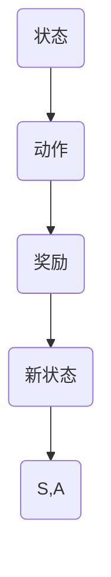
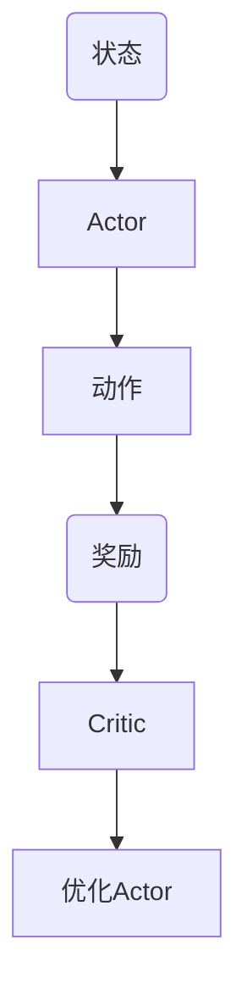
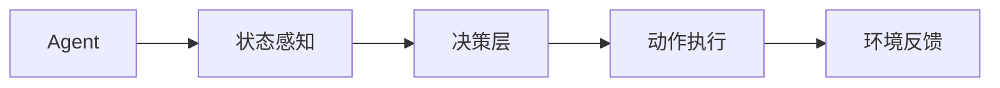
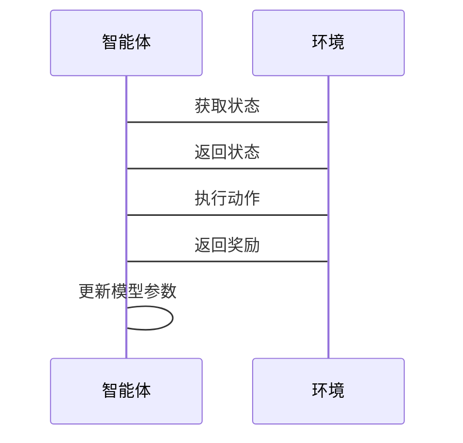

                 


# AI Agent的强化学习在游戏AI中的应用

## 关键词：AI Agent，强化学习，游戏AI，Q-Learning，DQN，Actor-Critic

## 摘要：本文深入探讨了AI Agent在游戏AI中的应用，特别是强化学习的原理和实现。通过详细讲解核心算法，分析系统架构，并结合实际案例，展示了如何利用强化学习提升游戏AI的智能水平。文章还提供了代码示例和系统设计，帮助读者全面理解这一技术。

---

# 第1章 AI Agent与强化学习概述

## 1.1 AI Agent的基本概念

### 1.1.1 什么是AI Agent
AI Agent（智能体）是能够感知环境并采取行动以实现目标的实体。在游戏AI中，Agent可以控制角色，做出决策，如移动、攻击或互动。

### 1.1.2 AI Agent的核心特征
- **自主性**：无需外部干预，自主决策。
- **反应性**：实时感知环境并响应。
- **目标导向**：根据目标选择行动。
- **学习能力**：通过经验改进性能。

### 1.1.3 AI Agent在游戏中的应用场景
- NPC行为控制
- 自动决策系统
- 竞技游戏AI

## 1.2 强化学习的基本概念

### 1.2.1 强化学习的定义
强化学习（Reinforcement Learning, RL）是通过试错，智能体在环境中学习策略以最大化累积奖励。

### 1.2.2 强化学习的核心要素
- **环境**：智能体所在的场景。
- **状态**：环境的实时信息。
- **动作**：智能体的行动。
- **奖励**：对行动的反馈。

### 1.2.3 强化学习与监督学习的区别
- **监督学习**：基于正确答案的学习。
- **强化学习**：基于奖励的学习，具有探索性。

## 1.3 游戏AI中的强化学习应用

### 1.3.1 游戏AI的基本类型
- **简单脚本**：固定逻辑，如巡逻。
- **有限状态机**：基于状态切换的行为。
- **强化学习AI**：通过试错学习策略。

### 1.3.2 强化学习在游戏AI中的优势
- **自适应性**：能根据环境调整策略。
- **复杂决策**：处理多步骤决策问题。
- **可扩展性**：适用于不同规模的游戏。

### 1.3.3 实际案例分析
- 游戏《星际争霸II》中的AI，通过强化学习掌握复杂的战术。

---

# 第2章 强化学习的核心算法

## 2.1 Q-Learning算法

### 2.1.1 Q-Learning的基本原理
Q-Learning通过学习状态-动作值函数，选择使累积奖励最大的动作。

### 2.1.2 Q-Learning的数学模型
$$ Q(s,a) = Q(s,a) + \alpha (r + \gamma \max Q(s',a') - Q(s,a)) $$
其中：
- $Q(s,a)$：当前状态s下动作a的值。
- $\alpha$：学习率。
- $\gamma$：折扣因子。
- $r$：奖励。

### 2.1.3 Q-Learning的优缺点
- **优点**：简单易实现。
- **缺点**：难以处理高维状态空间。

### 2.1.4 Q-Learning的流程图


## 2.2 Deep Q-Networks (DQN)

### 2.2.1 DQN的基本原理
DQN结合深度学习，使用神经网络近似Q值函数，解决高维状态问题。

### 2.2.2 DQN的网络结构
- **输入层**：接收状态信息。
- **隐藏层**：处理数据。
- **输出层**：输出Q值。

### 2.2.3 DQN在游戏AI中的应用
例如，在Atari游戏中，DQN通过神经网络学习策略，实现人类水平的 gameplay。

### 2.2.4 DQN的代码示例
```python
import numpy as np
import torch
import torch.nn as nn

class DQN(nn.Module):
    def __init__(self, input_dim, hidden_dim, output_dim):
        super(DQN, self).__init__()
        self.fc1 = nn.Linear(input_dim, hidden_dim)
        self.fc2 = nn.Linear(hidden_dim, output_dim)
    
    def forward(self, x):
        x = torch.relu(self.fc1(x))
        x = self.fc2(x)
        return x
```

## 2.3 Actor-Critic算法

### 2.3.1 Actor-Critic的基本原理
Actor-Critic同时学习策略（Actor）和价值函数（Critic），通过两者协作优化。

### 2.3.2 Actor-Critic的网络结构
- **Actor**：生成动作。
- **Critic**：评估状态值。

### 2.3.3 Actor-Critic的优势
- **稳定性**：同时优化策略和价值函数。
- **实时反馈**：Actor根据Critic的反馈调整策略。

### 2.3.4 Actor-Critic的流程图


---

# 第3章 游戏AI中的强化学习实现

## 3.1 游戏环境的构建

### 3.1.1 游戏环境的定义
游戏环境定义智能体的交互规则和状态变化。

### 3.1.2 游戏环境的状态空间
状态空间表示所有可能的状态，如位置、生命值等。

### 3.1.3 游戏环境的动作空间
动作空间表示智能体可执行的动作，如移动、攻击。

### 3.1.4 游戏环境的奖励机制
奖励机制定义智能体行为的反馈，引导学习方向。

## 3.2 强化学习的训练过程

### 3.2.1 数据采集
通过模拟游戏环境，收集状态、动作和奖励数据。

### 3.2.2 模型训练
使用训练数据更新模型参数，优化Q值或策略。

### 3.2.3 模型评估
在测试环境中评估模型性能，调整参数。

## 3.3 强化学习在游戏AI中的实际应用

### 3.3.1 游戏AI的行为树
行为树结合强化学习，实现复杂决策。

### 3.3.2 多智能体协作
在MOBA游戏中，多个AI Agent协作完成任务。

### 3.3.3 自适应难度调整
根据玩家水平动态调整游戏AI强度。

---

# 第4章 强化学习的系统架构设计

## 4.1 系统功能设计

### 4.1.1 领域模型
使用mermaid类图展示系统组件及其关系。

```mermaid
classDiagram
    class AI-Agent {
        +状态空间
        +动作空间
        +奖励函数
        -Q值网络
        -策略网络
        方法 {
            act()
            getReward()
        }
    }
    class 环境 {
        +状态
        +动作
        +奖励
    }
    AI-Agent --> 环境: 交互
```

### 4.1.2 系统架构
系统架构采用分层设计，包括感知层、决策层和执行层。

## 4.2 系统架构设计图

### 4.2.1 系统架构图


### 4.2.2 接口设计
- **输入接口**：接收游戏状态。
- **输出接口**：发送动作指令。
- **反馈接口**：接收奖励信息。

## 4.3 系统交互设计

### 4.3.1 交互流程


---

# 第5章 项目实战

## 5.1 环境安装

### 5.1.1 安装Python
- 安装Python 3.8或更高版本。
- 安装必要的库，如numpy、torch。

### 5.1.2 安装游戏引擎
- 使用Unity或Unreal Engine构建游戏环境。

## 5.2 系统核心实现

### 5.2.1 强化学习算法实现
实现DQN算法，包括神经网络和训练循环。

### 5.2.2 训练循环代码
```python
def train(env, agent, num_episodes=1000):
    for episode in range(num_episodes):
        state = env.reset()
        while not done:
            action = agent.act(state)
            next_state, reward, done = env.step(action)
            agent.memorize(state, action, reward, next_state)
            agent.replay()
```

## 5.3 代码应用解读与分析

### 5.3.1 代码结构
- **环境类**：定义游戏环境。
- **Agent类**：实现强化学习算法。
- **训练函数**：执行训练循环。

### 5.3.2 代码实现细节
- **环境类**：处理状态、动作和奖励。
- **Agent类**：包含神经网络和训练方法。

## 5.4 实际案例分析

### 5.4.1 案例介绍
以简单游戏为例，展示强化学习的应用。

### 5.4.2 案例实现
实现一个简单的迷宫导航问题，训练AI Agent走出迷宫。

## 5.5 项目小结

### 5.5.1 项目总结
强化学习在游戏AI中的应用效果显著，但仍需解决高维状态和多智能体协作问题。

### 5.5.2 经验总结
- **数据质量**：高质量数据是训练成功的关键。
- **算法选择**：根据问题选择合适的算法。
- **硬件资源**：充足资源加速训练。

---

# 第6章 最佳实践与小结

## 6.1 最佳实践 tips

### 6.1.1 系统设计
- 明确目标和约束条件。
- 选择合适的算法和工具。

### 6.1.2 代码实现
- 保持代码简洁，便于维护。
- 使用版本控制工具管理代码。

## 6.2 小结

### 6.2.1 总结全文
本文详细介绍了AI Agent的强化学习在游戏AI中的应用，从理论到实践，展示了如何利用强化学习提升游戏AI的智能水平。

### 6.2.2 未来展望
未来，随着深度学习和强化学习的发展，游戏AI将更加智能，实现更复杂的任务。

## 6.3 注意事项

### 6.3.1 系统设计中的常见问题
- **状态空间爆炸**：处理高维状态空间。
- **探索与利用平衡**：避免过早收敛。

### 6.3.2 代码实现中的注意事项
- **数据预处理**：确保数据质量。
- **模型调参**：合理设置超参数。

## 6.4 拓展阅读

### 6.4.1 推荐书籍
- 《强化学习（第四版）》
- 《深度强化学习入门》

### 6.4.2 推荐论文
- "Deep Q-Networks"（DQN论文）
- "Actor-Critic方法研究"

---

# 作者：AI天才研究院/AI Genius Institute & 禅与计算机程序设计艺术 /Zen And The Art of Computer Programming

