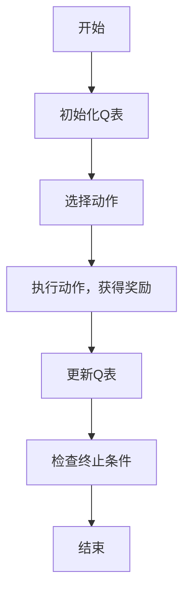
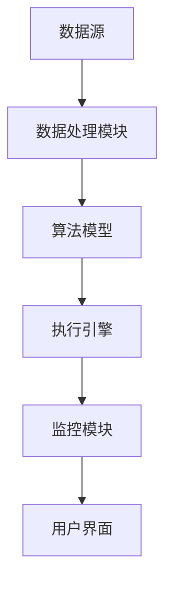

                 

# AI Agent的强化学习在自动化交易中的应用

> 关键词：AI Agent，强化学习，自动化交易，Q-learning，Deep Q-Network（DQN）

> 摘要：本文探讨了AI Agent在自动化交易中的应用，重点分析了强化学习技术，如Q-learning和DQN算法，及其在交易策略中的实现。通过系统架构设计和项目实战，展示了如何利用强化学习提升交易系统的决策能力。

---

# 第一部分: AI Agent的强化学习基础

## 第1章: AI Agent与强化学习概述

### 1.1 AI Agent的基本概念

#### 1.1.1 AI Agent的定义与特点

AI Agent（智能体）是指能够感知环境并采取行动以实现目标的智能系统。其特点包括自主性、反应性、目标导向和学习能力。AI Agent能够通过与环境交互，不断优化自身行为以达到预设目标。

#### 1.1.2 AI Agent的类型与应用场景

AI Agent主要分为简单反射型、基于模型的反射型、目标驱动型和效用驱动型。在金融领域，AI Agent常用于自动化交易、风险管理等场景，帮助机构快速做出决策。

#### 1.1.3 强化学习在AI Agent中的作用

强化学习通过奖励机制，使AI Agent在与环境的交互中学习最优策略。这种学习方式无需大量标注数据，适用于动态变化的金融环境。

### 1.2 强化学习的基本原理

#### 1.2.1 强化学习的定义与特点

强化学习是一种机器学习方法，通过智能体与环境的交互，学习最优策略。其特点是基于经验学习、目标导向和奖励驱动。

#### 1.2.2 状态、动作、奖励的核心概念

- **状态（State）**：环境在某一时刻的描述，如当前的市场价格。
- **动作（Action）**：智能体在某一状态下采取的行为，如买入或卖出。
- **奖励（Reward）**：智能体采取动作后获得的反馈，用于指导学习方向。

#### 1.2.3 策略与价值函数的定义

- **策略（Policy）**：描述智能体在不同状态下选择动作的概率分布。
- **价值函数（Value Function）**：评估某状态下采取某一动作的未来期望收益。

---

## 第2章: 强化学习的核心算法

### 2.1 Q-learning算法

#### 2.1.1 Q-learning的基本原理

Q-learning是一种基于值的强化学习算法，通过更新Q值表来学习最优策略。Q值表示某状态下采取某动作的未来期望奖励。

#### 2.1.2 Q-learning的数学模型

Q-learning的更新公式为：
$$ Q(s, a) \leftarrow Q(s, a) + \alpha [r + \gamma \max_{a'} Q(s', a') - Q(s, a)] $$
其中，$\alpha$为学习率，$\gamma$为折扣因子。

#### 2.1.3 Q-learning的优缺点

优点：简单易实现，适合离散动作空间。缺点：在连续动作空间中表现不佳，且需要探索所有可能状态。

#### 2.1.4 Q-learning的Mermaid流程图

### 2.2 Deep Q-Network (DQN) 算法

#### 2.2.1 DQN的基本原理

DQN通过深度神经网络近似Q值函数，适用于高维状态空间和连续动作空间。

#### 2.2.2 DQN的网络结构与训练过程

DQN包括两个网络：主网络和目标网络。主网络用于选择动作，目标网络用于评估目标值。

#### 2.2.3 DQN的数学模型

目标网络的更新公式为：
$$ Q_{target}(s', a') = r + \gamma Q_{main}(s', a') $$

#### 2.2.4 DQN的优缺点

优点：适用于复杂环境，性能稳定。缺点：训练时间较长，需要处理经验回放等技术。

---

## 第3章: 强化学习的数学模型与公式

### 3.1 贝尔曼方程

#### 3.1.1 贝尔曼方程的定义

贝尔曼方程描述了某状态下最优价值函数的期望值，是强化学习的基础。

#### 3.1.2 贝尔曼方程的数学表达式

$$ V(s) = \max_a [ r(s,a) + \gamma E[V(s')] ] $$

其中，$r(s,a)$为即时奖励，$V(s')$为后续状态的价值函数。

### 3.2 策略梯度方法

#### 3.2.1 策略梯度的基本原理

策略梯度方法直接优化策略，通过梯度上升法寻找最优策略。

#### 3.2.2 策略梯度的数学公式

策略梯度的优化目标为：
$$ \theta \leftarrow \theta + \alpha \nabla_\theta J(\theta) $$
其中，$J(\theta)$为目标函数，$\nabla_\theta J(\theta)$为梯度。

---

# 第二部分: 自动化交易中的AI Agent设计

## 第4章: 自动化交易的背景与挑战

### 4.1 自动化交易的定义与特点

自动化交易指通过算法和程序自动执行交易决策，具有高效性、低延迟和无情绪化等特点。

### 4.2 自动化交易中的问题与挑战

#### 4.2.1 市场不确定性

市场波动大，难以预测，增加了交易策略的复杂性。

#### 4.2.2 交易策略的有效性

策略在不同市场条件下表现不一，需不断优化。

#### 4.2.3 系统风险与稳定性

系统故障或网络延迟可能导致重大损失。

---

## 第5章: AI Agent在自动化交易中的应用

### 5.1 AI Agent的交易决策模型

#### 5.1.1 基于强化学习的交易策略

利用强化学习，AI Agent能够根据市场反馈调整交易策略，实现动态优化。

#### 5.1.2 基于Q-learning的交易决策

AI Agent通过Q-learning算法，学习最优的买卖时机。

#### 5.1.3 基于DQN的复杂交易场景

DQN能够处理复杂的市场环境，如多资产配置和风险控制。

### 5.2 自动化交易系统的设计与实现

#### 5.2.1 交易系统的整体架构

系统包括数据采集、策略执行和风险控制模块。

#### 5.2.2 数据采集与处理模块

负责收集市场数据，如价格、成交量等，进行预处理和特征提取。

#### 5.2.3 策略执行与监控模块

根据AI Agent的决策执行交易，并实时监控系统状态。

---

## 第6章: 自动化交易系统的架构与实现

### 6.1 系统架构设计

#### 6.1.1 系统功能模块划分

包括数据源、算法模型、执行引擎和监控模块。

#### 6.1.2 系统架构的Mermaid图

### 6.2 系统接口设计

#### 6.2.1 系统内部接口定义

包括数据接口、算法接口和执行接口。

#### 6.2.2 系统与外部系统的接口

与数据供应商、交易系统等外部系统对接。

#### 6.2.3 接口设计的注意事项

确保接口的兼容性和稳定性，避免数据丢失或错误。

---

## 第7章: 项目实战与案例分析

### 7.1 项目环境搭建

#### 7.1.1 开发环境的选择

推荐使用Python和TensorFlow框架。

#### 7.1.2 开发工具的安装与配置

安装Python、TensorFlow、Keras等工具，并配置环境变量。

#### 7.1.3 数据源的获取与处理

从Yahoo Finance获取股票数据，进行清洗和特征工程。

### 7.2 核心代码实现

#### 7.2.1 强化学习算法的实现

实现DQN算法，包括主网络和目标网络的定义与训练。

#### 7.2.2 交易策略的实现

根据DQN的输出，生成交易信号，如买入或卖出。

#### 7.2.3 系统功能的实现

实现数据采集、策略执行和结果监控等功能。

### 7.3 实际案例分析

以股票交易为例，展示AI Agent如何根据市场变化调整策略，实现收益最大化。

---

## 第8章: 最佳实践与总结

### 8.1 小结

本文详细介绍了AI Agent在自动化交易中的应用，重点讲解了强化学习算法及其在交易系统中的实现。

### 8.2 注意事项

- 确保系统的稳定性和安全性，避免重大损失。
- 定期更新策略，适应市场变化。
- 合规性审查，确保符合相关法律法规。

### 8.3 拓展阅读

推荐阅读《Deep Reinforcement Learning for Trading》和《Reinforcement Learning: Theory and Algorithms》。

---

作者：AI天才研究院/AI Genius Institute & 禅与计算机程序设计艺术 /Zen And The Art of Computer Programming

