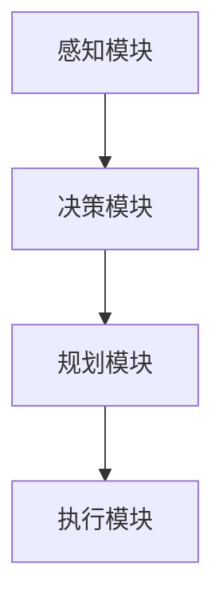

                 


# AI Agent的强化学习在自动驾驶中的应用

> 关键词：AI Agent, 强化学习, 自动驾驶, 深度强化学习, 路径规划, 交通场景, 模型训练

> 摘要：本文探讨了AI Agent在自动驾驶中的应用，重点分析了强化学习技术如何解决自动驾驶中的感知、决策和控制问题。文章详细介绍了强化学习的核心算法、数学模型、系统架构和实际应用案例，帮助读者全面理解AI Agent的强化学习在自动驾驶中的作用。

---

## 正文

### 第1章: 自动驾驶与AI Agent概述

#### 1.1 自动驾驶的基本概念
自动驾驶是指车辆能够在没有人类干预的情况下，自主完成行驶任务的技术。它依赖于感知、决策、规划和执行四个核心模块。感知模块通过传感器获取环境信息，决策模块基于这些信息做出驾驶决策，规划模块制定具体的行驶路径，执行模块则将决策转化为实际动作。

#### 1.2 AI Agent的基本概念
AI Agent（智能体）是指能够感知环境并采取行动以实现目标的实体。在自动驾驶中，AI Agent负责处理复杂动态环境中的决策和规划任务。AI Agent的核心特性包括自主性、反应性、目标导向和社交能力。

#### 1.3 强化学习的基本原理
强化学习是一种通过试错方式学习策略的方法，其核心在于通过与环境的交互，逐步优化行动策略以最大化累积奖励。强化学习的三个主要要素是状态空间、动作空间和奖励函数。

---

### 第2章: AI Agent的强化学习原理

#### 2.1 强化学习的基本算法
- **Q-learning算法**：通过更新Q值表来学习最优策略，适用于离散动作空间。
- **Deep Q-Network (DQN) 算法**：将Q值函数近似为深度神经网络，适用于高维状态空间。
- **Policy Gradient算法**：直接优化策略的参数，适用于连续动作空间。
- **Actor-Critic算法**：同时学习策略（Actor）和价值函数（Critic），通过两者协同优化策略。

#### 2.2 强化学习的核心概念
- **状态空间与动作空间**：状态描述环境的当前情况，动作是智能体可以采取的行为。
- **奖励机制与策略优化**：奖励函数定义了智能体在特定状态和动作下的收益，策略优化的目标是最大化累积奖励。
- **探索与利用的平衡**：在强化学习中，智能体需要在探索新状态和利用已知高回报状态之间找到平衡。

#### 2.3 强化学习的数学模型
- **Q-learning的数学公式**：  
  $$ Q(s, a) = Q(s, a) + \alpha [r + \gamma \max Q(s', a') - Q(s, a)] $$  
  其中，$\alpha$是学习率，$\gamma$是折扣因子。

- **DQN的网络结构与损失函数**：  
  DQN使用两个神经网络，一个作为主网络，另一个作为目标网络。损失函数为：  
  $$ \mathcal{L} = \mathbb{E}[(r + \gamma Q(s', a') - Q(s, a))^2] $$

---

### 第3章: AI Agent在自动驾驶中的应用

#### 3.1 自动驾驶中的感知与决策
- **感知模块**：通过激光雷达、摄像头和雷达等传感器感知环境，识别障碍物、道路标志和交通参与者。
- **决策模块**：基于强化学习算法，制定驾驶策略，如变道、加速、减速和转向。

#### 3.2 强化学习在自动驾驶中的具体场景
- **交通规则的遵守**：AI Agent通过强化学习掌握交通信号灯、车道规则和交规。
- **多目标优化问题**：在复杂的交通场景中，AI Agent需要同时优化安全、效率和舒适性。
- **环境动态预测与应对**：AI Agent通过强化学习预测其他车辆和行人的行为，提前做出应对策略。

#### 3.3 强化学习在自动驾驶中的优势
- **自适应性与灵活性**：强化学习模型能够适应不同环境和场景。
- **高效性与可扩展性**：通过并行计算和经验回放，强化学习能够高效训练大规模模型。
- **稳定性与安全性**：强化学习通过反复训练，确保模型在极端情况下的稳定性和安全性。

---

### 第4章: 强化学习算法的数学模型与公式

#### 4.1 Q-learning的数学模型
Q-learning的更新公式为：  
$$ Q(s, a) = Q(s, a) + \alpha (r + \gamma \max Q(s', a') - Q(s, a)) $$  
其中，$\alpha$是学习率，$\gamma$是折扣因子。

#### 4.2 DQN的数学模型
DQN的损失函数为：  
$$ \mathcal{L} = \mathbb{E}[(r + \gamma Q(s', a') - Q(s, a))^2] $$  
其中，$Q(s, a)$是主网络的输出，$Q(s', a')$是目标网络的输出。

#### 4.3 Policy Gradient的数学模型
Policy Gradient的优化目标是：  
$$ \theta = \theta + \alpha \nabla_\theta \mathbb{E}[R(\theta)] $$  
其中，$\nabla_\theta$是梯度符号，$\alpha$是学习率。

---

### 第5章: 系统分析与架构设计

#### 5.1 问题场景介绍
自动驾驶系统需要在复杂的交通环境中做出实时决策，涉及多传感器融合、路径规划和多目标优化。

#### 5.2 系统功能设计
- **感知模块**：使用激光雷达和摄像头进行环境感知。
- **决策模块**：基于强化学习算法做出驾驶决策。
- **规划模块**：制定具体的行驶路径和控制策略。

#### 5.3 系统架构设计
使用Mermaid图展示系统架构：  


#### 5.4 系统接口设计
- 感知模块接口：接收传感器数据，输出环境信息。
- 决策模块接口：接收环境信息，输出驾驶动作。
- 规划模块接口：接收驾驶动作，输出详细路径。

---

### 第6章: 项目实战

#### 6.1 环境安装
选择CARLA自动驾驶模拟器，安装步骤如下：  
1. 下载CARLA安装包。  
2. 安装NVIDIA GPU驱动和CUDA工具。  
3. 安装Python和相关库（如Pandas、NumPy）。  
4. 启动CARLA服务器和客户端。

#### 6.2 系统核心实现源代码
以下是强化学习算法的核心代码示例：  
```python
import numpy as np

class QLearning:
    def __init__(self, state_space, action_space, alpha=0.1, gamma=0.9):
        self.q_table = np.zeros((state_space, action_space))
        self.alpha = alpha
        self.gamma = gamma

    def choose_action(self, state, epsilon=0.1):
        if np.random.random() < epsilon:
            return np.random.randint(action_space)
        else:
            return np.argmax(self.q_table[state])

    def update(self, state, action, reward, next_state):
        self.q_table[state][action] = self.q_table[state][action] + self.alpha * (reward + self.gamma * np.max(self.q_table[next_state]) - self.q_table[state][action])
```

#### 6.3 代码应用解读与分析
该代码实现了Q-learning算法，通过不断更新Q值表来优化策略。在自动驾驶中，该算法可以用于简单的路径规划任务，如在直道上保持车道。

---

### 第7章: 最佳实践与总结

#### 7.1 最佳实践 tips
- 在强化学习中，合理设置奖励函数是关键。
- 使用经验回放可以提高模型的泛化能力。
- 在复杂的场景中，结合规则和强化学习可以取得更好的效果。

#### 7.2 小结
本文详细介绍了AI Agent的强化学习在自动驾驶中的应用，从基础理论到实际应用，全面分析了强化学习在感知、决策和规划中的作用。

#### 7.3 注意事项
- 数据安全是自动驾驶系统的重要考虑因素。
- 模型的泛化能力需要在多样化的场景中进行训练。
- 强化学习模型的实时性和稳定性需要在实际应用中不断优化。

#### 7.4 拓展阅读
推荐阅读《深度强化学习（Deep Reinforcement Learning）》和《自动驾驶技术与应用》。

---

作者：AI天才研究院/AI Genius Institute & 禅与计算机程序设计艺术 /Zen And The Art of Computer Programming

