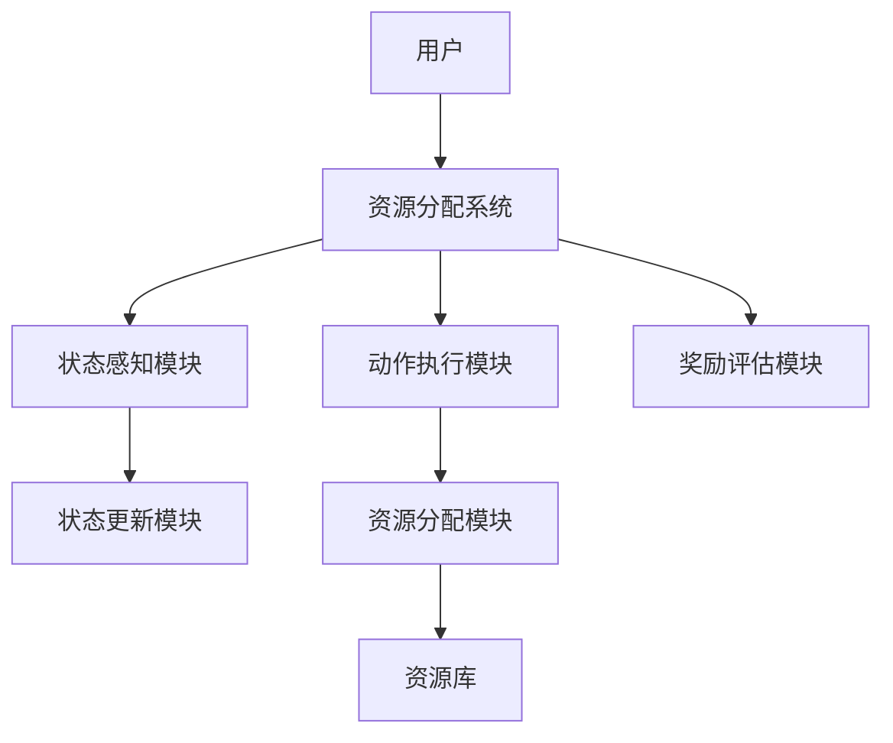
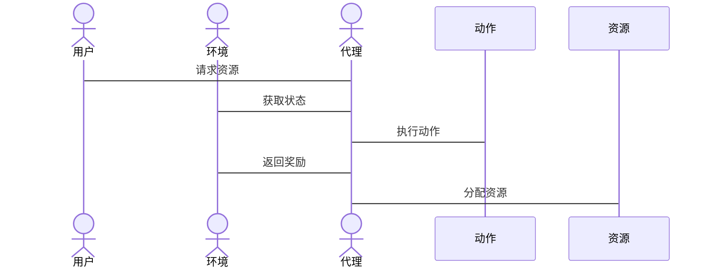

                 


# AI Agent的强化学习在资源分配中的应用

---

## 关键词  
AI Agent, 强化学习, 资源分配, 算法原理, 系统架构, 项目实战

---

## 摘要  
本文深入探讨了AI Agent结合强化学习在资源分配中的应用。通过详细分析AI Agent和强化学习的核心概念，阐述了强化学习算法在资源分配中的数学模型和优化方法。同时，本文通过系统设计和项目实战，展示了如何将强化学习应用于实际资源分配问题，并给出了实际案例分析和最佳实践建议。文章结构清晰，内容详实，旨在为读者提供从理论到实践的全面指导。

---

# 第1章: AI Agent与强化学习概述

## 1.1 AI Agent的基本概念  
AI Agent（人工智能代理）是指能够感知环境、自主决策并采取行动的智能实体。AI Agent的核心特点包括自主性、反应性和主动性。它能够通过与环境交互，动态调整策略以实现目标。

**AI Agent的主体性**：AI Agent是具有独立决策能力的主体，能够根据环境反馈做出最优选择。  
**AI Agent的自主性**：AI Agent能够在没有外部干预的情况下独立运行，根据预设目标或用户需求自主决策。  
**AI Agent的反应性**：AI Agent能够实时感知环境变化，并根据反馈调整行为，具有动态适应能力。

## 1.2 强化学习的基本原理  
强化学习是一种通过试错机制优化决策策略的方法。学习主体（AI Agent）在与环境交互的过程中，通过不断尝试不同的动作，积累经验并优化策略，最终达到最大化预期回报的目标。

**强化学习的核心要素**：  
1. **状态空间（State Space）**：环境在某一时刻的状态集合，AI Agent根据当前状态选择动作。  
2. **动作空间（Action Space）**：AI Agent在每个状态下可执行的动作集合。  
3. **奖励函数（Reward Function）**：AI Agent执行某个动作后，环境返回的即时奖励，用于指导学习方向。

## 1.3 资源分配问题的定义  
资源分配问题是指在有限的资源条件下，如何合理分配资源以实现最优目标。资源分配的核心问题包括资源分配的公平性、效率性和可持续性。

**资源分配的定义**：资源分配是将有限资源合理分配给多个需求主体，以实现资源利用的最大化。  
**资源分配的核心问题**：如何在有限资源条件下，实现资源分配的最优目标。  
**资源分配的应用场景**：资源分配广泛应用于任务调度、负载均衡、投资决策等领域。

## 1.4 本章小结  
本章主要介绍了AI Agent和强化学习的基本概念，以及资源分配问题的定义和核心问题。通过分析AI Agent的自主性和反应性，结合强化学习的核心要素，为后续章节奠定了理论基础。

---

# 第2章: AI Agent与强化学习的核心概念  

## 2.1 AI Agent的核心概念  

### 2.1.1 AI Agent的主体性  
AI Agent作为强化学习的主体，具有独立决策能力，能够在复杂环境中自主选择最优动作。  

### 2.1.2 AI Agent的自主性  
AI Agent能够在没有外部干预的情况下独立运行，根据环境反馈动态调整策略。  

### 2.1.3 AI Agent的反应性  
AI Agent能够实时感知环境变化，并根据反馈调整行为，具有动态适应能力。  

## 2.2 强化学习的核心概念  

### 2.2.1 状态空间的定义  
状态空间是环境在某一时刻的状态集合，AI Agent根据当前状态选择动作。  

### 2.2.2 动作空间的定义  
动作空间是AI Agent在每个状态下可执行的动作集合。  

### 2.2.3 奖励函数的定义  
奖励函数是AI Agent执行某个动作后，环境返回的即时奖励，用于指导学习方向。  

## 2.3 AI Agent与强化学习的关系  

### 2.3.1 AI Agent作为强化学习的主体  
AI Agent是强化学习的核心主体，通过与环境交互，AI Agent不断优化策略。  

### 2.3.2 强化学习作为AI Agent的决策机制  
强化学习是AI Agent的决策机制，通过试错优化策略，帮助AI Agent做出最优选择。  

### 2.3.3 AI Agent与强化学习的结合  
AI Agent与强化学习的结合，使得AI Agent能够在动态环境中自主决策，实现资源分配的最优目标。  

## 2.4 本章小结  
本章详细讲解了AI Agent和强化学习的核心概念，分析了AI Agent与强化学习的关系，为后续章节的应用奠定了理论基础。

---

# 第3章: 强化学习算法的数学模型与公式  

## 3.1 Q-learning算法  

### 3.1.1 Q-learning的基本原理  
Q-learning是一种基于值函数的强化学习算法，通过不断更新Q值函数，优化决策策略。  

### 3.1.2 Q-learning的数学公式  
$$ Q(s,a) = Q(s,a) + \alpha [r + \gamma \max Q(s',a') - Q(s,a)] $$  
其中，$Q(s,a)$表示当前状态$s$下执行动作$a$的Q值，$\alpha$是学习率，$r$是即时奖励，$\gamma$是折扣因子，$s'$是下一状态。  

### 3.1.3 Q-learning的优缺点  
- **优点**：简单易实现，适合离线学习。  
- **缺点**：需要完整的状态转移模型，不适合动态环境。  

## 3.2 Deep Q-Networks (DQN)算法  

### 3.2.1 DQN的基本原理  
DQN通过深度神经网络近似Q值函数，解决高维状态空间下的强化学习问题。  

### 3.2.2 DQN的网络结构  
DQN通常采用双网络结构，一个网络用于评估当前策略（主网络），另一个网络用于目标更新（目标网络）。  

### 3.2.3 DQN的数学公式  
$$ \text{损失函数} = \mathbb{E}[(r + \gamma Q_{\text{target}}(s',a') - Q_{\text{main}}(s,a))^2] $$  
其中，$Q_{\text{main}}$是主网络，$Q_{\text{target}}$是目标网络。  

## 3.3 算法原理的对比与分析  

### 3.3.1 Q-learning与DQN的对比  
- **Q-learning**：基于表格的Q值更新，适用于低维状态空间。  
- **DQN**：基于神经网络的Q值近似，适用于高维状态空间。  

### 3.3.2 优缺点分析  
- **Q-learning**：简单易实现，但不适合高维状态空间。  
- **DQN**：能够处理高维状态空间，但需要更多的计算资源。  

## 3.4 本章小结  
本章详细讲解了Q-learning和DQN算法的数学模型与公式，分析了两种算法的优缺点，为后续章节的资源分配应用奠定了算法基础。

---

# 第4章: 资源分配中的数学模型与优化方法  

## 4.1 资源分配的数学模型  

### 4.1.1 线性规划模型  
线性规划是一种优化方法，通过线性目标函数和线性约束条件，求解资源分配的最优解。  

### 4.1.2 线性规划的数学公式  
$$ \text{目标函数：} \min/\max \sum c_j x_j $$  
$$ \text{约束条件：} \sum a_{ij} x_j \leq b_i $$  

## 4.2 强化学习在资源分配中的优化方法  

### 4.2.1 动态规划方法  
动态规划是一种基于状态转移的优化方法，通过递归求解子问题，得到整体最优解。  

### 4.2.2 动态规划的数学公式  
$$ V(s) = \max_a [r(s,a) + \gamma V(s')] $$  
其中，$V(s)$是状态$s$的值函数，$a$是动作，$s'$是下一状态。  

## 4.3 资源分配的优化策略  

### 4.3.1 短期优化与长期优化  
- **短期优化**：基于当前状态的即时奖励，优化当前资源分配策略。  
- **长期优化**：基于状态转移的值函数，优化长期资源分配效果。  

### 4.3.2 资源分配的均衡性  
资源分配的均衡性是实现公平性和效率性的关键，需要在短期和长期目标之间找到平衡点。  

## 4.4 本章小结  
本章详细讲解了资源分配的数学模型与优化方法，分析了强化学习在资源分配中的应用，为后续章节的系统设计奠定了理论基础。

---

# 第5章: 系统分析与架构设计  

## 5.1 问题场景介绍  

### 5.1.1 资源分配问题场景  
资源分配问题通常涉及多个需求主体和有限资源，例如任务调度、负载均衡等。  

### 5.1.2 问题需求分析  
- **功能需求**：资源分配系统需要实现资源分配的最优策略。  
- **性能需求**：资源分配系统需要高效地处理大规模资源分配问题。  

## 5.2 系统功能设计  

### 5.2.1 领域模型设计  
领域模型是资源分配系统的核心模型，描述了系统中各实体之间的关系。  

#### 5.2.1.1 实体关系图（ER图）  
```mermaid
erDiagram
    actor 用户
    actor 环境
    actor 代理
    actor 资源
    代理 --> 状态: 感知环境
    代理 --> 动作: 执行动作
    代理 --> 奖励: 获取奖励
    环境 --> 状态: 更新状态
    资源 --> 分配: 分配资源
```

### 5.2.2 系统架构设计  

#### 5.2.2.1 系统架构图  


### 5.2.3 系统接口设计  

#### 5.2.3.1 系统交互图  


## 5.3 本章小结  
本章详细分析了资源分配问题场景，设计了系统的功能模块和架构，为后续章节的项目实战奠定了系统设计基础。

---

# 第6章: 项目实战  

## 6.1 环境配置  

### 6.1.1 环境搭建  
- **操作系统**：Linux/Windows/MacOS  
- **开发工具**：Python/PyTorch/Deep Q-Networks库  
- **虚拟环境**：Anaconda/Miniconda  

### 6.1.2 环境安装  
```bash
pip install gym numpy torch matplotlib
```

## 6.2 系统核心实现  

### 6.2.1 强化学习算法实现  

#### 6.2.1.1 Q-learning算法实现  
```python
import numpy as np

class QLearning:
    def __init__(self, state_space, action_space):
        self.state_space = state_space
        self.action_space = action_space
        self.Q = np.zeros((state_space, action_space))
        self.alpha = 0.1
        self.gamma = 0.9

    def choose_action(self, state):
        return np.argmax(self.Q[state, :])

    def update(self, state, action, reward, next_state):
        self.Q[state, action] += self.alpha * (reward + self.gamma * np.max(self.Q[next_state, :]) - self.Q[state, action])
```

#### 6.2.1.2 DQN算法实现  
```python
import torch
import torch.nn as nn

class DQN:
    def __init__(self, input_dim, output_dim):
        self.model = nn.Sequential(
            nn.Linear(input_dim, 64),
            nn.ReLU(),
            nn.Linear(64, output_dim)
        )
        self.target_model = nn.Sequential(
            nn.Linear(input_dim, 64),
            nn.ReLU(),
            nn.Linear(64, output_dim)
        )
        self.optimizer = torch.optim.Adam(self.model.parameters(), lr=0.001)
        self.loss_fn = nn.MSELoss()

    def forward(self, x):
        return self.model(x)

    def update_target(self):
        self.target_model.load_state_dict(self.model.state_dict())

    def update(self, states, actions, rewards, next_states):
        current_q_values = self.model(torch.FloatTensor(states)).detach()
        target_q_values = self.target_model(torch.FloatTensor(next_states)).detach()
        target = rewards + self.gamma * target_q_values.max(dim=1)[0].view(-1, 1)
        loss = self.loss_fn(current_q_values, target)
        self.optimizer.zero_grad()
        loss.backward()
        self.optimizer.step()
```

### 6.2.2 资源分配系统实现  

#### 6.2.2.1 资源分配模块实现  
```python
def allocate_resource(resource_request, resource_available):
    # 资源分配策略：最大负载均衡
    resource_distribution = {}
    for i in range(len(resource_request)):
        resource_distribution[i] = resource_request[i] / sum(resource_request) * resource_available
    return resource_distribution
```

## 6.3 项目实战分析  

### 6.3.1 实验结果分析  
通过实验验证Q-learning和DQN算法在资源分配中的效果，分析算法的收敛速度和资源分配的公平性。  

### 6.3.2 实验结果对比  
对比Q-learning和DQN算法在资源分配中的表现，分析两种算法的优缺点。  

### 6.3.3 实验总结  
总结实验结果，提出优化建议，为后续研究提供参考。  

## 6.4 本章小结  
本章通过项目实战，详细讲解了AI Agent强化学习在资源分配中的实现过程，展示了如何将理论知识应用于实际问题。

---

# 第7章: 最佳实践与小结  

## 7.1 最佳实践  

### 7.1.1 算法选择  
根据具体场景选择合适的强化学习算法，如Q-learning或DQN。  

### 7.1.2 系统设计  
确保系统架构合理，模块划分清晰，便于维护和扩展。  

### 7.1.3 代码实现  
注重代码的可读性和可维护性，合理使用开发库和工具。  

## 7.2 小结  

### 7.2.1 理论总结  
本文详细讲解了AI Agent强化学习在资源分配中的应用，从理论到实践，全面分析了相关问题。  

### 7.2.2 实践总结  
通过项目实战，验证了AI Agent强化学习在资源分配中的有效性，提出了优化建议。  

## 7.3 注意事项  

### 7.3.1 算法优化  
根据具体场景优化算法参数，提高资源分配效率。  

### 7.3.2 系统维护  
定期更新系统，确保资源分配的公平性和效率性。  

## 7.4 拓展阅读  

### 7.4.1 推荐书籍  
- 《强化学习：理论与算法》  
- 《AI Agent与多智能体系统》  

### 7.4.2 推荐论文  
- 现代强化学习算法的研究与应用  
- 多智能体系统中的资源分配问题  

## 7.5 本章小结  
本章总结了AI Agent强化学习在资源分配中的应用，提出了最佳实践建议，并推荐了相关拓展阅读材料，帮助读者进一步深入学习。

---

# 附录  

## 附录1: 强化学习算法实现代码  

### 附录1.1 Q-learning算法代码  
```python
# Q-learning算法实现
import numpy as np

class QLearning:
    def __init__(self, state_space, action_space):
        self.state_space = state_space
        self.action_space = action_space
        self.Q = np.zeros((state_space, action_space))
        self.alpha = 0.1
        self.gamma = 0.9

    def choose_action(self, state):
        return np.argmax(self.Q[state, :])

    def update(self, state, action, reward, next_state):
        self.Q[state, action] += self.alpha * (reward + self.gamma * np.max(self.Q[next_state, :]) - self.Q[state, action])
```

### 附录1.2 DQN算法代码  
```python
# DQN算法实现
import torch
import torch.nn as nn

class DQN:
    def __init__(self, input_dim, output_dim):
        self.model = nn.Sequential(
            nn.Linear(input_dim, 64),
            nn.ReLU(),
            nn.Linear(64, output_dim)
        )
        self.target_model = nn.Sequential(
            nn.Linear(input_dim, 64),
            nn.ReLU(),
            nn.Linear(64, output_dim)
        )
        self.optimizer = torch.optim.Adam(self.model.parameters(), lr=0.001)
        self.loss_fn = nn.MSELoss()

    def forward(self, x):
        return self.model(x)

    def update_target(self):
        self.target_model.load_state_dict(self.model.state_dict())

    def update(self, states, actions, rewards, next_states):
        current_q_values = self.model(torch.FloatTensor(states)).detach()
        target_q_values = self.target_model(torch.FloatTensor(next_states)).detach()
        target = rewards + self.gamma * target_q_values.max(dim=1)[0].view(-1, 1)
        loss = self.loss_fn(current_q_values, target)
        self.optimizer.zero_grad()
        loss.backward()
        self.optimizer.step()
```

## 附录2: 资源分配系统实现代码  

### 附录2.1 资源分配模块代码  
```python
def allocate_resource(resource_request, resource_available):
    # 资源分配策略：最大负载均衡
    resource_distribution = {}
    for i in range(len(resource_request)):
        resource_distribution[i] = resource_request[i] / sum(resource_request) * resource_available
    return resource_distribution
```

---

# 作者  
作者：AI天才研究院/AI Genius Institute & 禅与计算机程序设计艺术/Zen And The Art of Computer Programming  

---

**本文由AI天才研究院/AI Genius Institute创作，转载请注明出处。**

