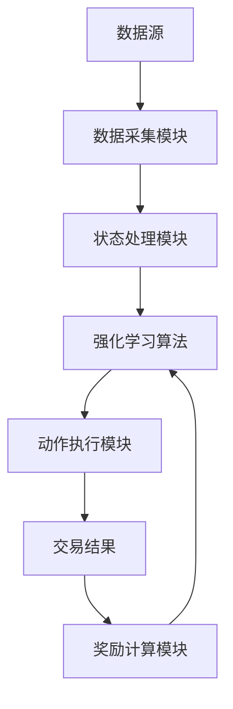

                 


# AI Agent的强化学习在金融交易中的应用

**关键词：** AI Agent, 强化学习, 金融交易, Q-Learning, Deep Q-Network

**摘要：**  
本文深入探讨AI Agent在金融交易中的应用，特别是强化学习技术如何在复杂金融环境中优化交易策略。通过分析强化学习算法（如Q-Learning和Deep Q-Network）的原理、数学模型以及在金融交易中的实际应用，本文旨在为读者提供一个全面的理解，从理论基础到实际案例，逐步解析如何利用AI Agent实现高效、智能的金融交易策略。

---

## 第一部分: AI Agent与强化学习基础

### 第1章: AI Agent的概述

#### 1.1 AI Agent的基本概念
- **1.1.1 AI Agent的定义**  
  AI Agent（人工智能代理）是指能够感知环境、做出决策并执行操作的智能实体。它可以是一个软件程序或物理设备，通过与环境交互来实现特定目标。

- **1.1.2 AI Agent的核心属性**  
  - **自主性**：能够在没有外部干预的情况下自主运作。  
  - **反应性**：能够实时感知环境并做出反应。  
  - **目标导向**：具有明确的目标，并通过行动来最大化目标的实现。  
  - **学习能力**：能够通过经验改进自身性能。

- **1.1.3 AI Agent的分类**  
  - **简单反射型Agent**：基于当前感知直接做出反应。  
  - **基于模型的反射型Agent**：利用内部模型进行决策。  
  - **目标驱动型Agent**：以目标为导向进行决策和行动。  
  - **效用驱动型Agent**：通过最大化效用来做出决策。

#### 1.2 强化学习的基本原理
- **1.2.1 强化学习的定义**  
  强化学习是一种机器学习范式，通过智能体与环境的交互，学习如何通过执行一系列行动来最大化累积的奖励。

- **1.2.2 强化学习的核心要素**  
  - **状态（State）**：环境在某一时刻的描述。  
  - **动作（Action）**：智能体在给定状态下选择的行为。  
  - **奖励（Reward）**：智能体执行动作后获得的反馈，用于评估动作的好坏。  
  - **策略（Policy）**：智能体选择动作的概率分布。  
  - **值函数（Value Function）**：衡量某个状态下采取某个动作的长期累积奖励。

- **1.2.3 强化学习与监督学习的区别**  
  监督学习通过标记数据进行训练，而强化学习通过与环境的交互和奖励信号进行学习。强化学习更加动态和不确定，适用于复杂决策问题。

### 第2章: AI Agent在金融交易中的应用背景

#### 2.1 金融交易的复杂性
- **2.1.1 金融市场的特点**  
  - 高度不确定性：市场价格受多种因素影响，难以预测。  
  - 高频交易：交易速度极快，要求实时决策。  
  - 风险与收益并存：投资决策需要在风险和收益之间找到平衡。

- **2.1.2 传统金融交易的挑战**  
  - 人工决策的局限性：情绪化、经验依赖性强。  
  - 数据量大：金融市场数据复杂且多样，人工处理效率低。  
  - 高速交易的需求：需要快速决策和执行。

- **2.1.3 AI Agent在金融交易中的优势**  
  - 自动化决策：AI Agent能够快速处理大量数据，做出最优决策。  
  - 情绪中立：AI Agent不受情绪影响，避免人为错误。  
  - 学习能力：通过强化学习不断优化交易策略。

#### 2.2 强化学习在金融交易中的应用场景
- **2.2.1 股票交易策略**  
  AI Agent可以通过强化学习学习股票买卖时机，优化投资组合。

- **2.2.2 资产配置与投资组合优化**  
  利用强化学习动态调整资产配置，降低风险，提高收益。

- **2.2.3 风险管理与市场预测**  
  AI Agent能够实时监控市场风险，预测市场波动，帮助做出风险管理决策。

---

## 第二部分: 强化学习算法与数学模型

### 第3章: 强化学习的核心算法

#### 3.1 Q-Learning算法
- **3.1.1 Q-Learning的基本原理**  
  Q-Learning是一种基于值函数的强化学习算法，通过更新Q值函数来学习最优策略。

- **3.1.2 Q-Learning的数学模型**  
  Q值更新公式：  
  $$ Q(s, a) \leftarrow Q(s, a) + \alpha [r + \gamma \max_{a'} Q(s', a') - Q(s, a)] $$  
  其中，$\alpha$是学习率，$\gamma$是折扣因子。

- **3.1.3 Q-Learning的优缺点**  
  - 优点：简单易实现，适合离散动作空间。  
  - 缺点：在连续动作空间中表现不佳，需要手动设计动作空间。

#### 3.2 Deep Q-Network (DQN)算法
- **3.2.1 DQN算法的原理**  
  DQN通过深度神经网络近似Q值函数，适用于高维状态空间和连续动作空间。

- **3.2.2 DQN算法的网络结构**  
  - 状态输入层：接收环境状态。  
  - 隐藏层：通过神经网络处理状态信息。  
  - 动作输出层：输出每个动作的Q值。

- **3.2.3 DQN算法的训练过程**  
  1. 环境提供当前状态$s$和奖励$r$。  
  2. 神经网络输出所有动作的Q值。  
  3. 根据策略选择动作$a$，执行并获得新的状态$s'$。  
  4. 更新Q值：  
     $$ Q(s, a) \leftarrow Q(s, a) + \alpha [r + \gamma \max Q(s', a') - Q(s, a)] $$  
  5. 重复直到达到训练回合数。

### 第4章: 数学模型与公式

#### 4.1 强化学习的数学基础
- **4.1.1 状态空间与动作空间**  
  - 状态空间：所有可能的状态集合。  
  - 动作空间：所有可能的动作集合。

- **4.1.2 Q值函数的数学表达**  
  Q值函数$Q(s, a)$表示在状态$s$下执行动作$a$的长期累积奖励。

- **4.1.3 损失函数与优化目标**  
  - 损失函数：衡量预测Q值与实际Q值的差异。  
  - 优化目标：最小化损失函数，使Q值逼近真实值。

#### 4.2 强化学习的数学公式
- **4.2.1 Q-Learning的更新公式**  
  $$ Q(s, a) \leftarrow Q(s, a) + \alpha (r + \gamma \max Q(s', a') - Q(s, a)) $$

- **4.2.2 DQN的损失函数**  
  损失函数为均方误差：  
  $$ \mathcal{L} = \mathbb{E}[ (r + \gamma Q(s', a') - Q(s, a))^2 ] $$

- **4.2.3 策略梯度的数学表达**  
  策略梯度方法通过优化策略参数$\theta$，使目标函数$J(\theta)$最大化：  
  $$ J(\theta) = \mathbb{E}[ \log \pi(a|s) Q(s, a) ] $$  
  其中，$\pi(a|s)$是策略函数，表示在状态$s$下选择动作$a$的概率。

---

## 第三部分: 系统分析与架构设计

### 第5章: 金融交易AI Agent的系统架构

#### 5.1 系统功能设计
- **5.1.1 系统模块划分**  
  - 数据采集模块：收集市场数据。  
  - 状态处理模块：处理当前状态并生成决策。  
  - 动作执行模块：根据决策执行交易动作。  
  - 奖励计算模块：根据交易结果计算奖励。

- **5.1.2 系统功能流程**  
  1. 数据采集模块接收市场数据。  
  2. 状态处理模块生成当前状态$s$。  
  3. 强化学习算法选择动作$a$。  
  4. 动作执行模块执行动作$a$，获得新状态$s'$和奖励$r$。  
  5. 奖励计算模块更新Q值函数。  

- **5.1.3 系统输入输出设计**  
  - 输入：市场数据（如价格、成交量等）。  
  - 输出：交易决策（如买入、卖出）。

#### 5.2 系统架构图


#### 5.3 接口设计与交互流程
- **5.3.1 系统接口设计**  
  - 数据接口：接收市场数据，格式为JSON或CSV。  
  - 动作接口：输出交易决策，格式为JSON。

- **5.3.2 系统交互流程图**
```mermaid
sequ
    用户 -> 数据采集模块: 提供市场数据
    数据采集模块 -> 状态处理模块: 传递当前状态
    状态处理模块 -> 强化学习算法: 请求决策
    强化学习算法 -> 动作执行模块: 返回动作
    动作执行模块 -> 交易系统: 执行交易
    交易系统 -> 奖励计算模块: 返回交易结果
    奖励计算模块 -> 强化学习算法: 更新Q值
```

---

## 第四部分: 项目实战

### 第6章: 强化学习在金融交易中的实战应用

#### 6.1 环境安装
- **安装Python环境**：推荐使用Anaconda。  
- **安装依赖库**：numpy, pandas, gym, matplotlib。

#### 6.2 系统核心实现源代码
```python
import gym
import numpy as np
import random
import torch
import torch.nn as nn
import torch.optim as optim

# 定义DQN网络
class DQN(nn.Module):
    def __init__(self, input_dim, output_dim):
        super(DQN, self).__init__()
        self.fc1 = nn.Linear(input_dim, 64)
        self.fc2 = nn.Linear(64, output_dim)
    
    def forward(self, x):
        x = x.float()  # 转换为浮点数
        x = x / 255.0  # 标准化
        x = self.fc1(x)
        x = self.fc2(x)
        return x

# 初始化环境
env = gym.make('StockTrading-v0')  # 假设我们定义了一个股票交易环境
input_dim = env.observation_space.shape[0]
output_dim = env.action_space.n

# 初始化DQN网络
dqn = DQN(input_dim, output_dim)
optimizer = optim.Adam(dqn.parameters(), lr=0.001)

# 训练过程
num_episodes = 1000
for episode in range(num_episodes):
    state = env.reset()
    done = False
    while not done:
        # 选择动作
        with torch.no_grad():
            q_values = dqn(torch.tensor(state))
            action = torch.argmax(q_values).item()
        # 执行动作
        next_state, reward, done, _ = env.step(action)
        # 更新Q值
        optimizer.zero_grad()
        target = reward + env.gamma * torch.max(dqn(torch.tensor(next_state)))
        loss = (dqn(torch.tensor(state)) - target).pow(2).mean()
        loss.backward()
        optimizer.step()
```

#### 6.3 代码应用解读与分析
- **代码功能**：实现一个简单的DQN算法，用于股票交易环境。  
- **关键部分**：  
  - 神经网络定义：输入层、隐藏层和输出层。  
  - 训练过程：通过不断与环境交互，更新Q值函数。  
  - 损失函数：均方误差。  
  - 优化器：Adam优化器。

#### 6.4 实际案例分析
- **案例描述**：使用DQN算法训练一个股票交易AI Agent，目标是通过买卖决策最大化收益。  
- **训练结果**：经过多次训练，AI Agent能够学习到有效的交易策略，收益高于随机交易。

#### 6.5 项目小结
- **优势**：强化学习能够适应金融市场不确定性，实现自动化交易。  
- **挑战**：金融市场高度复杂，需要更复杂的算法和更多的数据支持。

---

## 第五部分: 总结与展望

### 第7章: 总结与最佳实践

#### 7.1 核心总结
- **强化学习的优势**：适应性、自学习、高效性。  
- **AI Agent的应用价值**：提高交易效率，降低风险。

#### 7.2 最佳实践 tips
- **数据质量**：确保数据准确、完整。  
- **算法选择**：根据问题选择合适的强化学习算法。  
- **风险管理**：建立有效的风险管理机制，避免过度风险。

#### 7.3 注意事项
- **过拟合风险**：避免在特定市场条件下过度拟合，导致策略失效。  
- **计算资源**：强化学习需要大量计算资源，确保硬件支持。

#### 7.4 拓展阅读
- 推荐阅读《Reinforcement Learning: Theory and Algorithms》。  
- 关注最新的强化学习研究，了解前沿技术。

---

**作者：AI天才研究院/AI Genius Institute & 禅与计算机程序设计艺术 /Zen And The Art of Computer Programming**

