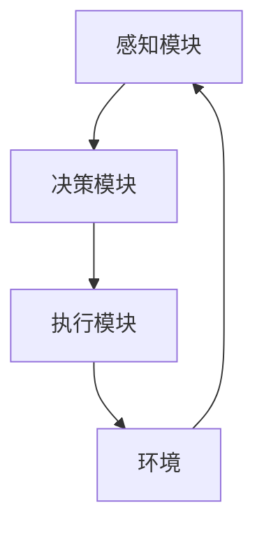
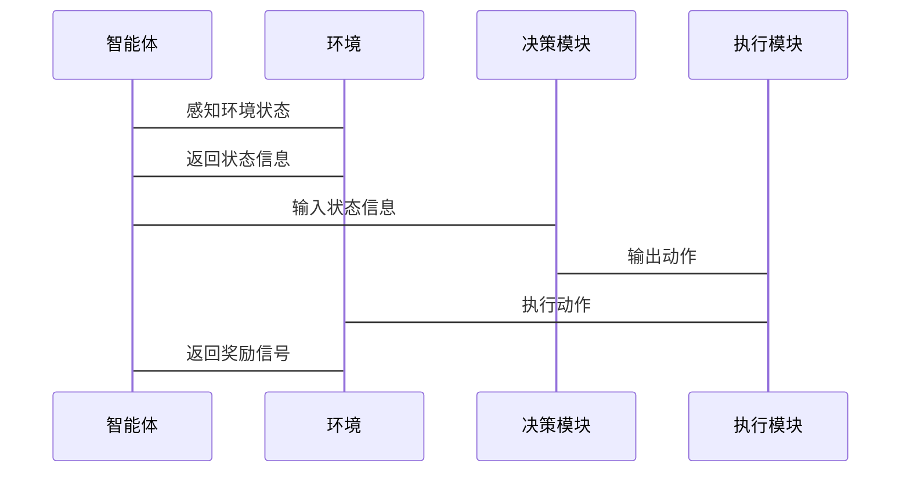

                 


# AI Agent的强化学习机制实现

> 关键词：AI Agent，强化学习，Q-learning，Deep Q-Network，马尔可夫决策过程（MDP）

> 摘要：本文详细探讨了AI Agent的强化学习机制实现，从基本概念到核心算法，再到系统设计与项目实战，深入分析了如何通过强化学习使AI Agent具备智能决策能力。文章结合数学模型、算法流程图和代码实现，为读者提供了全面的知识框架和实践指南。

---

# 第一部分: AI Agent与强化学习概述

## 第1章: AI Agent的基本概念

### 1.1 什么是AI Agent？
AI Agent（人工智能代理）是指能够感知环境并采取行动以实现目标的智能体。它可以自主决策、学习和适应环境变化，广泛应用于自动驾驶、机器人控制、游戏AI、推荐系统等领域。

### 1.2 AI Agent的类型
AI Agent可以根据智能水平分为：
- **反应式Agent**：基于当前感知做出反应，不依赖历史信息。
- **认知式Agent**：具备复杂推理和规划能力，能够处理长期任务。
- **协作式Agent**：能够与其他Agent或人类协作完成任务。

### 1.3 AI Agent的应用场景
AI Agent在多个领域有广泛应用：
- **自动驾驶**：实时感知环境并做出驾驶决策。
- **游戏AI**：在电子游戏中实现智能行为。
- **智能助手**：如Siri、Alexa等，通过对话提供服务。
- **机器人控制**：实现复杂动作的自主控制。

---

## 第2章: 强化学习的基本概念

### 2.1 强化学习的定义
强化学习（Reinforcement Learning, RL）是一种机器学习范式，通过智能体与环境交互，学习如何采取行动以最大化累积奖励。智能体通过试错方式优化策略，最终实现目标。

### 2.2 强化学习的核心要素
1. **状态（State）**：智能体所处环境的描述。
2. **动作（Action）**：智能体在某一状态下做出的行为。
3. **奖励（Reward）**：智能体采取动作后获得的反馈，用于指导学习方向。
4. **策略（Policy）**：智能体选择动作的概率分布。
5. **值函数（Value Function）**：评估某个状态下采取某动作的价值。

### 2.3 强化学习与监督学习的区别
- **监督学习**：基于标记的训练数据进行学习，目标是预测正确输出。
- **强化学习**：通过与环境交互，学习最优策略，强调长期累积奖励。

---

## 第3章: AI Agent与强化学习的关系

### 3.1 强化学习在AI Agent中的作用
强化学习为AI Agent提供了自主决策的能力，使其能够在动态环境中适应和优化行为。

### 3.2 AI Agent通过强化学习实现智能决策
AI Agent通过强化学习算法，如Q-learning和Deep Q-Network，学习最优策略，实现智能决策。

### 3.3 强化学习驱动的AI Agent的优势
- **自主性**：无需外部指令，自主决策。
- **适应性**：能够适应环境变化，持续优化行为。
- **高效性**：通过试错快速找到最优策略。

---

# 第二部分: 强化学习的核心原理

## 第4章: 马尔可夫决策过程（MDP）

### 4.1 MDP的定义
马尔可夫决策过程（MDP）是一种数学模型，描述了智能体与环境的交互过程，假设环境是马尔可夫性的，即当前状态仅依赖于当前观察，而不依赖于历史状态。

### 4.2 MDP的核心要素
1. **状态空间（State Space）**：所有可能的状态集合。
2. **动作空间（Action Space）**：所有可能的动作集合。
3. **转移概率（Transition Probability）**：从当前状态采取某个动作后转移到下一个状态的概率。
4. **奖励函数（Reward Function）**：智能体在状态-动作对上获得的奖励。

### 4.3 MDP的数学模型
状态转移可以用概率转移矩阵表示，奖励函数可以用随机变量表示。MDP的目标是找到最优策略，使累积奖励最大化。

---

## 第5章: Q-learning算法

### 5.1 Q-learning的基本原理
Q-learning是一种值迭代算法，通过学习状态-动作值函数（Q值）来优化决策。Q值表示在某个状态下采取某个动作后的预期累积奖励。

### 5.2 Q-learning的更新公式
$$ Q(s, a) = Q(s, a) + \alpha [r + \gamma \max Q(s', a') - Q(s, a)] $$
其中，$\alpha$是学习率，$\gamma$是折扣因子，$s'$是下一个状态。

### 5.3 Q-learning的收敛性分析
Q-learning在离线和在线学习模式下均可收敛，但需要确保探索和利用的平衡。

---

## 第6章: Deep Q-Network（DQN）算法

### 6.1 DQN的基本思想
DQN通过深度神经网络近似Q值函数，解决高维状态空间的问题。

### 6.2 DQN的网络结构
DQN通常包含两个神经网络：主网络和目标网络。主网络用于评估当前策略，目标网络用于稳定学习。

### 6.3 DQN的训练过程
1. **经验回放**：将经验存储在回放缓冲区，随机采样进行训练。
2. **目标网络更新**：定期将主网络的权重复制到目标网络。

---

# 第三部分: 系统设计与实现

## 第7章: AI Agent的系统架构设计

### 7.1 系统功能设计
AI Agent系统主要包含感知模块、决策模块和执行模块。感知模块负责收集环境信息，决策模块基于强化学习算法做出决策，执行模块将决策转化为实际动作。

### 7.2 系统架构图


### 7.3 系统交互流程


---

## 第8章: 项目实战

### 8.1 环境配置
使用OpenAI Gym库搭建强化学习环境，安装必要的依赖库：
```bash
pip install gym numpy tensorflow
```

### 8.2 核心代码实现
以下是一个简单的Q-learning实现：
```python
import gym
import numpy as np

class QAgent:
    def __init__(self, env):
        self.env = env
        self.Q = np.zeros([env.observation_space.n, env.action_space.n])
        self.alpha = 0.1
        self.gamma = 0.9

    def act(self, state):
        return np.argmax(self.Q[state, :])

    def update(self, state, action, reward, next_state):
        self.Q[state, action] += self.alpha * (reward + self.gamma * np.max(self.Q[next_state, :]) - self.Q[state, action])

# 初始化环境
env = gym.make('CartPole-v1')
agent = QAgent(env)

# 训练过程
for episode in range(1000):
    state = env.reset()
    total_reward = 0
    while True:
        action = agent.act(state)
        next_state, reward, done, _ = env.step(action)
        agent.update(state, action, reward, next_state)
        total_reward += reward
        if done:
            break
    print(f"Episode {episode}, Total Reward: {total_reward}")
```

### 8.3 案例分析
在CartPole环境中，通过Q-learning算法，AI Agent学会了如何平衡杆子。通过不断迭代，Q值函数逐渐逼近最优策略，最终实现稳定控制。

---

## 第9章: 最佳实践与注意事项

### 9.1 小结
本文详细介绍了AI Agent的强化学习机制实现，从基本概念到算法实现，再到系统设计，为读者提供了完整的知识框架。

### 9.2 注意事项
- **探索与利用的平衡**：避免过早收敛，确保充分探索。
- **奖励设计**：合理的奖励函数能够加速收敛。
- **计算资源**：深度强化学习需要较高的计算资源。

### 9.3 拓展阅读
-《Deep Reinforcement Learning》
-《Reinforcement Learning: Theory and Algorithms》

---

作者：AI天才研究院/AI Genius Institute & 禅与计算机程序设计艺术 /Zen And The Art of Computer Programming

