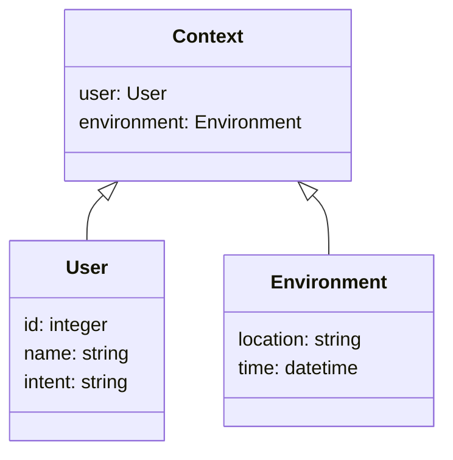
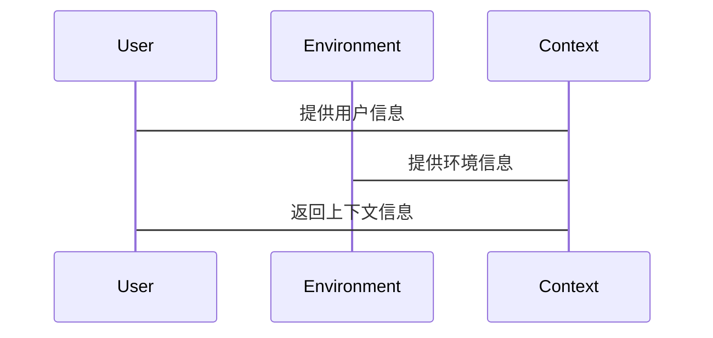

                 


# AI Agent的情境感知能力开发

> 关键词：AI Agent，情境感知，算法原理，系统架构，项目实战

> 摘要：本文详细探讨了AI Agent的情境感知能力开发，从核心概念到算法实现，再到系统架构设计和项目实战，全面解析了情境感知能力的开发过程。文章通过丰富的图表和代码示例，帮助读者深入理解情境感知的原理和应用。

---

## 第1章: AI Agent与情境感知概述

### 1.1 AI Agent的基本概念

#### 1.1.1 什么是AI Agent
AI Agent（人工智能代理）是一种能够感知环境、自主决策并执行任务的智能实体。它可以是一个软件程序或物理设备，通过与环境交互来实现特定目标。

#### 1.1.2 AI Agent的分类与特点
- **分类**：AI Agent可以分为简单反射型、基于模型型、目标驱动型和效用驱动型。
- **特点**：自主性、反应性、目标导向、社会能力。

#### 1.1.3 情境感知在AI Agent中的重要性
情境感知是指AI Agent能够理解和感知当前环境中的上下文信息，从而做出更智能的决策。它是实现更高级AI Agent的关键能力。

---

### 1.2 情境感知的定义与应用

#### 1.2.1 情境感知的定义
情境感知是指AI Agent能够感知和理解当前环境中的各种信息，包括用户的行为、环境的状态以及可能的意图。

#### 1.2.2 情境感知的核心要素
- **环境感知**：通过传感器或数据输入感知环境。
- **用户意图**：理解用户的潜在需求和目标。
- **上下文信息**：整合环境和用户信息，形成完整的上下文。

#### 1.2.3 情境感知在AI Agent中的应用场景
- 智能助手（如Siri、Alexa）。
- 智能客服系统。
- 智能自动驾驶。

---

## 第2章: 情境感知的核心概念

### 2.1 情境感知的核心要素

#### 2.1.1 环境感知
环境感知是通过传感器或数据输入获取环境信息，例如图像、声音、文本等。

#### 2.1.2 用户意图
用户意图是情境感知的关键，AI Agent需要通过分析用户的输入来推断用户的意图。

#### 2.1.3 上下文信息
上下文信息是环境感知和用户意图的综合，形成一个完整的场景描述。

---

### 2.2 情境感知与相关技术的关系

#### 2.2.1 与自然语言处理的关系
情境感知需要自然语言处理来理解用户的输入，例如情感分析、意图识别。

#### 2.2.2 与计算机视觉的关系
情境感知需要计算机视觉来处理图像或视频信息，例如人脸识别、物体识别。

#### 2.2.3 与机器学习的关系
情境感知依赖于机器学习模型来训练和预测，例如深度学习模型用于意图识别。

---

### 2.3 情境感知的数学模型与特征分析

#### 2.3.1 情境感知的特征对比表
| 特征 | 描述 |
|------|------|
| 环境感知 | 通过传感器获取环境信息 |
| 用户意图 | 分析用户的潜在需求 |
| 上下文信息 | 综合环境和用户信息 |

#### 2.3.2 情境感知的ER实体关系图

```mermaid
er
  actor: 用户
  environment: 环境
  context: 上下文
  relation: 感知
  actor -[感知]-> context
  environment -[感知]-> context
```

---

## 第3章: 情境感知算法的核心原理

### 3.1 情境感知算法的分类

#### 3.1.1 基于规则的感知算法
通过预定义的规则来判断情境，例如简单的条件判断。

#### 3.1.2 基于统计的学习算法
利用统计方法训练模型，例如朴素贝叶斯。

#### 3.1.3 基于深度学习的感知算法
使用深度学习模型，例如LSTM、Transformer。

---

### 3.2 情境感知算法的实现流程

#### 3.2.1 数据采集与预处理
- 数据来源：传感器、数据库、用户输入。
- 数据清洗：去除噪声数据。

#### 3.2.2 特征提取与选择
- 提取有用的特征，例如文本的情感特征。

#### 3.2.3 模型训练与优化
- 使用训练数据训练模型，调整参数以优化性能。

---

### 3.3 情境感知算法的数学模型

#### 3.3.1 概率模型
$$ P(A|B) = \frac{P(B|A)P(A)}{P(B)} $$

#### 3.3.2 贝叶斯网络
构建贝叶斯网络，通过概率推理进行情境感知。

#### 3.3.3 感知器模型
感知器模型是一种线性分类器，用于分类任务。

---

## 第4章: 情境感知能力的系统架构设计

### 4.1 系统功能设计

#### 4.1.1 需求分析
明确系统的需求，例如用户需求、功能需求。

#### 4.1.2 功能模块划分
- 数据采集模块
- 情境分析模块
- 决策执行模块

#### 4.1.3 领域模型设计



---

### 4.2 系统架构设计

#### 4.2.1 分层架构设计
将系统分为数据层、业务逻辑层和表现层。

#### 4.2.2 微服务架构设计
使用微服务架构，每个服务独立运行。

#### 4.2.3 组件交互设计



---

## 第5章: 情境感知能力的项目实战

### 5.1 环境安装

#### 5.1.1 安装Python
安装Python 3.8及以上版本。

#### 5.1.2 安装依赖库
安装TensorFlow、Keras、NLTK等库。

---

### 5.2 核心代码实现

#### 5.2.1 环境建模
```python
class Environment:
    def __init__(self, location, time):
        self.location = location
        self.time = time
```

#### 5.2.2 意图识别
```python
import nltk
from sklearn.feature_extraction.text import TfidfVectorizer
from sklearn.naive_bayes import MultinomialNB

# 数据预处理
vectorizer = TfidfVectorizer()
X = vectorizer.fit_transform(corpus)
model = MultinomialNB()
model.fit(X, labels)
```

---

### 5.3 案例分析

#### 5.3.1 案例场景
用户在某个地点和时间发出请求，AI Agent需要结合环境和用户信息进行决策。

#### 5.3.2 代码实现
```python
def感知环境(environment, user):
    # 实现情境感知逻辑
    return context
```

---

## 第6章: 最佳实践与注意事项

### 6.1 最佳实践

#### 6.1.1 数据质量
确保数据的准确性和完整性。

#### 6.1.2 模型选择
根据需求选择合适的算法和模型。

#### 6.1.3 系统优化
优化系统性能和可扩展性。

---

## 总结

本文详细探讨了AI Agent的情境感知能力开发，从核心概念到算法实现，再到系统架构设计和项目实战，全面解析了情境感知能力的开发过程。通过丰富的图表和代码示例，帮助读者深入理解情境感知的原理和应用。

作者：AI天才研究院/AI Genius Institute  
禅与计算机程序设计艺术/Zen And The Art of Computer Programming

