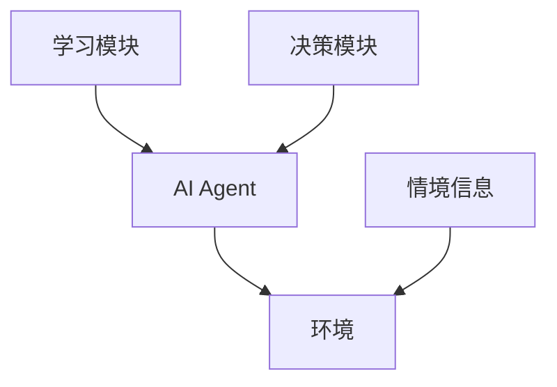
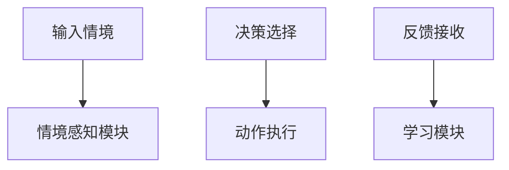

                 


# AI Agent的情境适应学习：提高在复杂环境中的表现

> 关键词：AI Agent, 情境适应学习, 复杂环境, 强化学习, 迁移学习, 系统架构设计

> 摘要：本文详细探讨了AI Agent在复杂环境中的情境适应学习方法，从理论基础到算法实现，再到系统架构设计，逐步分析了如何通过情境适应学习提升AI Agent在复杂环境中的表现。通过实际案例分析和代码实现，帮助读者全面理解并掌握AI Agent的情境适应学习技术。

---

## 第一部分: AI Agent与情境适应学习概述

### 第1章: AI Agent的基本概念

#### 1.1 AI Agent的核心特征
- **自主性**：AI Agent能够独立感知环境并做出决策。
- **反应性**：能够实时响应环境中的变化。
- **学习能力**：通过经验不断优化自身表现。
- **社交能力**：能够与其他AI Agent或人类进行交互。

#### 1.2 情境适应学习的定义与特点
- **情境感知**：AI Agent能够理解当前所处的环境和任务。
- **动态适应**：根据环境变化调整策略和行为。
- **经验迁移**：将过去的经验应用于新的情境中。

#### 1.3 应用场景
- **自动驾驶**：实时感知环境并做出驾驶决策。
- **智能客服**：根据用户情绪和需求调整对话策略。
- **工业机器人**：在复杂生产环境中灵活调整操作。

---

## 第二部分: 情境适应学习的核心概念与联系

### 第2章: 情境适应学习的核心概念

#### 2.1 知识表示与推理
- **知识表示**：将环境中的信息表示为符号、规则或概率分布。
- **推理机制**：通过逻辑推理或概率推理得出结论。

#### 2.2 行为选择与优化
- **决策树**：通过树状结构选择最优行为。
- **策略优化**：通过强化学习或遗传算法优化决策策略。

#### 2.3 环境建模与交互
- **环境模型**：建立环境的数学模型。
- **实时交互**：通过传感器或API与环境进行实时交互。

#### 2.4 实体关系图


---

## 第三部分: 情境适应学习的算法原理

### 第3章: 基于强化学习的算法

#### 3.1 Q-learning算法
- **算法公式**：
  $$ Q(s, a) = r + \gamma \max Q(s', a') $$
- **应用场景**：适用于离散动作空间的环境。
- **代码实现**：
  ```python
  import numpy as np
  
  def q_learning(env, learning_rate=0.1, discount_factor=0.9):
      q_table = np.zeros((env.states, env.actions))
      for episode in range(1000):
          state = env.reset()
          for _ in range(100):
              action = np.argmax(q_table[state, :])
              next_state, reward, done = env.step(action)
              q_table[state, action] += learning_rate * (reward + discount_factor * np.max(q_table[next_state, :]) - q_table[state, action])
              state = next_state
              if done:
                  break
      return q_table
  ```

#### 3.2 DQN算法
- **算法公式**：
  $$ \text{损失函数} = \frac{1}{2} (r + \gamma Q(s', a') - Q(s, a))^2 $$
- **代码实现**：
  ```python
  import torch
  import torch.nn as nn
  
  class DQN(nn.Module):
      def __init__(self, input_dim, output_dim):
          super(DQN, self).__init__()
          self.fc = nn.Linear(input_dim, output_dim)
      
      def forward(self, x):
          return self.fc(x)
  
  def dqn_training(env, input_dim, output_dim, num_episodes=1000):
      model = DQN(input_dim, output_dim)
      optimizer = torch.optim.Adam(model.parameters(), lr=0.001)
      for episode in range(num_episodes):
          state = env.reset()
          for _ in range(100):
              state_tensor = torch.FloatTensor(state)
              action_probs = model(state_tensor)
              action = torch.argmax(action_probs).item()
              next_state, reward, done = env.step(action)
              target = reward + env.gamma * torch.max(model(torch.FloatTensor(next_state))).item()
              loss = (model(state_tensor)[0] - target).pow(2)
              optimizer.zero_grad()
              loss.backward()
              optimizer.step()
              state = next_state
              if done:
                  break
  ```

---

## 第四部分: 系统分析与架构设计

### 第4章: 情境适应学习系统的架构设计

#### 4.1 系统功能设计
- **情境感知模块**：负责感知和理解当前环境。
- **决策模块**：根据感知信息做出决策。
- **学习模块**：通过经验更新模型参数。

#### 4.2 系统架构图


#### 4.3 接口设计
- **输入接口**：接收环境状态信息。
- **输出接口**：发送动作指令。
- **反馈接口**：接收环境反馈信息。

---

## 第五部分: 项目实战

### 第5章: 项目实现与分析

#### 5.1 环境安装
```bash
pip install gym
```

#### 5.2 核心代码实现
```python
import gym
import numpy as np

def main():
    env = gym.make('CartPole-v0')
    env.seed(42)
    np.random.seed(42)
    
    # 初始化Q表
    q_table = np.zeros([env.observation_space.shape[0], env.action_space.n])
    
    # 训练过程
    for _ in range(1000):
        state = env.reset()
        for _ in range(100):
            action = np.argmax(q_table[state, :])
            next_state, reward, done, _ = env.step(action)
            q_table[state, action] += 0.1 * (reward + 0.9 * np.max(q_table[next_state, :]) - q_table[state, action])
            state = next_state
            if done:
                break
    # 测试过程
    for _ in range(10):
        state = env.reset()
        for _ in range(100):
            action = np.argmax(q_table[state, :])
            next_state, reward, done, _ = env.step(action)
            if done:
                break
    env.close()

if __name__ == "__main__":
    main()
```

#### 5.3 案例分析
- **训练结果**：Q表的更新过程。
- **测试结果**：AI Agent在复杂环境中的表现。

---

## 第六部分: 最佳实践与总结

### 第6章: 最佳实践

#### 6.1 小结
- 情境适应学习是提升AI Agent在复杂环境中表现的核心技术。
- 通过强化学习和迁移学习可以有效实现情境适应。

#### 6.2 注意事项
- 确保算法的泛化能力。
- 处理好环境的动态变化。

#### 6.3 拓展阅读
- 《Reinforcement Learning: Theory and Algorithms》
- 《Transfer Learning: Theory and Practice》

---

## 作者

作者：AI天才研究院/AI Genius Institute & 禅与计算机程序设计艺术 /Zen And The Art of Computer Programming

---

希望这篇技术博客文章能够帮助读者全面理解并掌握AI Agent的情境适应学习技术！

