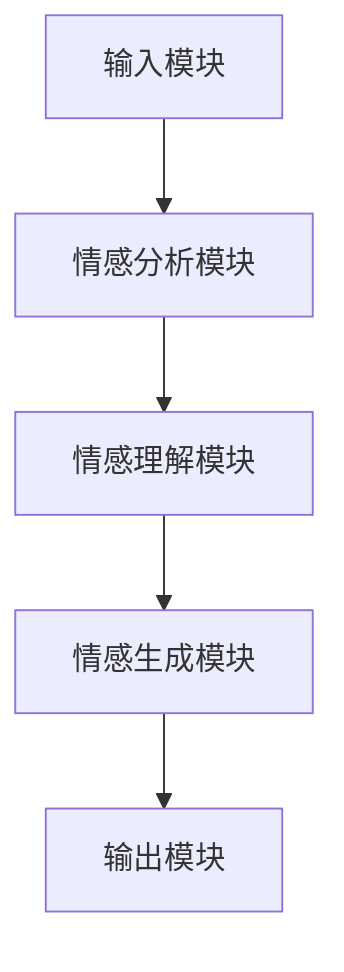
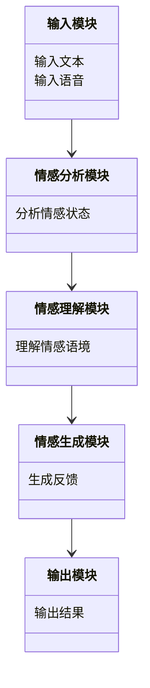
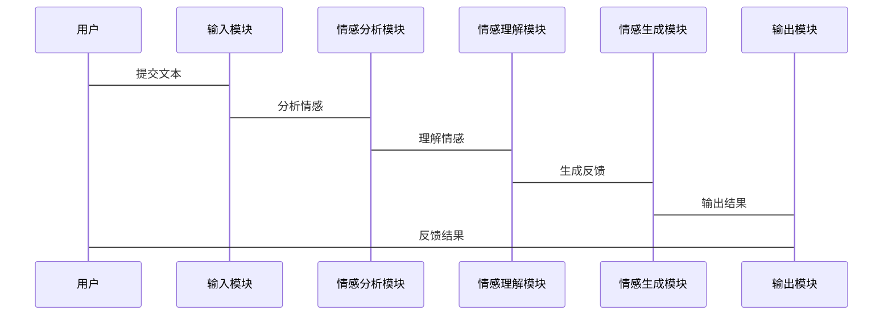

                 


# AI Agent的情感智能：利用LLM实现情感计算

---

## 关键词
- AI Agent  
- 情感智能  
- 大语言模型（LLM）  
- 情感计算  
- 人机交互  

---

## 摘要
随着人工智能技术的快速发展，AI Agent（智能体）在各个领域的应用日益广泛。为了使AI Agent更加智能化、人性化，情感智能的引入成为关键。本文将探讨如何利用大语言模型（LLM）实现情感计算，深入分析情感智能的核心概念、算法原理、系统架构，并通过实际案例展示其在AI Agent中的应用。通过本文，读者将全面了解情感智能在AI Agent中的重要性及其实现方法。

---

## 第一部分: AI Agent情感智能的背景与概念

### 第1章: AI Agent与情感智能概述

#### 1.1 情感计算的定义与背景
##### 1.1.1 情感计算的定义
情感计算（Affective Computing）是一种通过计算手段理解和回应人类情感状态的技术。它涉及对人类情绪、情感和心理状态的识别、分析和应用。

##### 1.1.2 情感计算的应用领域
情感计算广泛应用于人机交互、心理健康辅助、教育技术、智能家居、客户服务等领域。例如，在智能音箱中，情感计算可以帮助设备理解用户的情绪，从而提供更加个性化的服务。

##### 1.1.3 情感计算的技术挑战
情感计算面临数据多样性、情感表达的复杂性以及跨文化差异等技术挑战。如何准确识别和理解不同文化背景下的情感表达是一个重要的研究方向。

#### 1.2 AI Agent的基本概念
##### 1.2.1 AI Agent的定义
AI Agent是指在计算机系统中，能够感知环境并采取行动以实现目标的实体。它可以是一个软件程序或硬件设备，具有自主决策和交互能力。

##### 1.2.2 AI Agent的核心特征
- **自主性**：能够在没有外部干预的情况下自主运行。
- **反应性**：能够感知环境并实时做出反应。
- **目标导向**：具有明确的目标，并采取行动以实现这些目标。

##### 1.2.3 AI Agent与传统AI的区别
与传统AI相比，AI Agent更加注重与环境的交互和动态适应能力。传统AI主要关注问题求解和知识表示，而AI Agent更注重实时性和动态性。

#### 1.3 情感智能在AI Agent中的作用
##### 1.3.1 情感智能的定义
情感智能（Emotional Intelligence）是指个体识别、理解和管理自己及他人情感的能力。在AI Agent中，情感智能使其能够理解用户的情感状态，并据此调整交互方式。

##### 1.3.2 情感智能与AI Agent的结合
通过集成情感计算技术，AI Agent能够实时分析用户的情感状态，并根据这些信息优化交互策略，提供更加智能化的服务。

##### 1.3.3 情感智能的应用场景
- **智能客服**：通过情感分析理解用户情绪，提供更加贴心的服务。
- **教育助手**：根据学生情绪调整教学策略。
- **智能家居**：根据用户情绪调节环境设置。

### 第2章: LLM在情感计算中的应用

#### 2.1 大语言模型（LLM）的基本原理
##### 2.1.1 LLM的定义与特点
大语言模型是一种基于深度学习的自然语言处理模型，具有大规模的参数和丰富的语料库。其特点包括：
- **大规模训练数据**：通常基于 millions of parameters。
- **上下文理解能力强**：能够理解复杂的语言结构和语义。
- **多任务学习能力**：可以应用于多种自然语言处理任务，如情感分析、文本生成等。

##### 2.1.2 LLM的训练过程
LLM的训练过程包括数据预处理、模型构建、参数优化等步骤。通常使用Transformer架构，并通过自监督学习方式进行训练。

##### 2.1.3 LLM的优势与局限性
- **优势**：强大的语言理解和生成能力，能够处理复杂的情感表达。
- **局限性**：可能受到训练数据的偏差影响，情感分析的准确性有限。

#### 2.2 LLM与情感计算的结合
##### 2.2.1 情感分析的基本原理
情感分析是通过自然语言处理技术对文本的情感倾向进行判断。常见的方法包括基于规则的分类和基于机器学习的分类。

##### 2.2.2 LLM在情感分析中的应用
通过LLM的强大语言模型能力，可以实现高精度的情感分析。例如，利用GPT-3等模型进行情感分类任务。

##### 2.2.3 情感计算的模型构建
结合LLM和情感计算模型，可以构建更加智能化的情感分析系统。例如，通过预训练的情感词典和上下文信息，提升情感分析的准确性和鲁棒性。

---

## 第二部分: 情感计算的核心概念与算法原理

### 第3章: 情感计算的核心概念与数学模型

#### 3.1 情感计算的核心概念
##### 3.1.1 情感计算的三要素
- **情感识别**：识别用户的情感状态。
- **情感理解**：理解情感的语境和含义。
- **情感生成**：根据情感信息生成相应的反馈或行动。

##### 3.1.2 情感计算的分类与层次
情感计算可以分为低层次的情感识别和高层次的情感理解和生成。低层次的情感识别包括情感分类和强度分析，高层次的情感理解包括情感推理和情感记忆。

##### 3.1.3 情感计算的评价指标
常见的评价指标包括准确率、召回率、F1分数等。

#### 3.2 情感计算的数学模型
##### 3.2.1 情感计算的特征提取
特征提取是情感计算的重要步骤，常见的特征包括词汇特征、语义特征和情感特征。

##### 3.2.2 情感计算的分类模型
常用的分类模型包括支持向量机（SVM）、随机森林（Random Forest）和深度学习模型（如LSTM、Transformer）。

##### 3.2.3 情感计算的深度学习模型
深度学习模型，如BERT和GPT，具有强大的上下文理解和语义分析能力，可以应用于情感计算的各个层次。

### 第4章: 情感计算的算法原理与实现

#### 4.1 情感计算的算法原理
##### 4.1.1 基于规则的情感计算
基于规则的情感计算通过预定义的情感词典和规则进行情感分类。例如，通过匹配情感词汇和情感强度词进行情感分析。

##### 4.1.2 基于机器学习的情感计算
基于机器学习的情感计算通过训练模型进行情感分类。例如，使用SVM或随机森林模型进行文本分类。

##### 4.1.3 基于深度学习的情感计算
基于深度学习的情感计算通过神经网络模型（如LSTM、Transformer）进行情感分析。这些模型能够捕捉到文本的深层语义信息，提高情感分析的准确性。

#### 4.2 LLM在情感计算中的算法实现
##### 4.2.1 基于LLM的情感分析算法
通过调用大语言模型的API，将文本输入模型，获得情感分析结果。例如，使用GPT-3进行情感分类任务。

##### 4.2.2 基于LLM的情感推理算法
利用LLM的强大推理能力，进行情感推理。例如，分析文本中的情感原因和情感影响。

##### 4.2.3 基于LLM的情感生成算法
通过LLM生成与情感相关的文本，例如情感表达、情感反馈等。

---

## 第三部分: 系统分析与架构设计方案

### 第5章: 情感计算的系统架构与设计

#### 5.1 情感计算系统的整体架构
##### 5.1.1 系统功能模块
- **输入模块**：接收用户输入的文本或语音。
- **情感分析模块**：对输入进行情感分析，识别情感状态。
- **情感理解模块**：理解情感的语境和含义。
- **情感生成模块**：根据情感信息生成相应的反馈或行动。
- **输出模块**：将生成的结果输出给用户。

##### 5.1.2 系统流程
1. 输入模块接收用户输入。
2. 情感分析模块对输入进行情感分类。
3. 情感理解模块分析情感的深层含义。
4. 情感生成模块根据分析结果生成反馈或行动。
5. 输出模块将结果输出给用户。

##### 5.1.3 系统架构图


#### 5.2 项目介绍
##### 5.2.1 项目目标
构建一个基于LLM的情感计算系统，实现情感识别、理解和生成功能。

##### 5.2.2 项目范围
本项目旨在实现情感计算的核心功能，适用于智能客服、教育助手等场景。

##### 5.2.3 项目功能需求
- 情感识别：准确识别用户的情感状态。
- 情感理解：理解情感的语境和含义。
- 情感生成：生成与情感相关的反馈或行动。

#### 5.3 系统功能设计

##### 5.3.1 领域模型设计


##### 5.3.2 系统架构设计


##### 5.3.3 系统接口设计
- 输入接口：接收用户输入的文本或语音。
- 输出接口：输出情感分析结果或生成的反馈。

##### 5.3.4 系统交互设计


---

## 第四部分: 项目实战

### 第6章: 项目实战

#### 6.1 环境安装
##### 6.1.1 安装Python
```bash
python --version
```

##### 6.1.2 安装依赖库
```bash
pip install transformers
pip install torch
```

#### 6.2 系统核心实现源代码

##### 6.2.1 情感分析模块
```python
from transformers import pipeline

sentiment_analyzer = pipeline("sentiment-analysis")
def analyze_emotion(text):
    return sentiment_analyzer(text)
```

##### 6.2.2 情感理解模块
```python
def understand_emotion(text, emotion_label):
    # 示例：根据情感标签生成语境分析
    pass
```

##### 6.2.3 情感生成模块
```python
def generate_feedback(emotion_info):
    # 示例：根据情感信息生成反馈
    pass
```

##### 6.2.4 输出模块
```python
def output_result(feedback):
    print(feedback)
```

#### 6.3 代码应用解读与分析
##### 6.3.1 情感分析模块的实现
使用Hugging Face的`transformers`库中的`pipeline`函数，调用预训练的情感分析模型进行情感分类。

##### 6.3.2 情感理解模块的实现
根据情感标签和上下文信息，生成情感理解的结果。这一步需要结合具体场景进行实现。

##### 6.3.3 情感生成模块的实现
根据情感理解结果，生成相应的反馈或行动。例如，如果用户表达的是愤怒，生成相应的道歉和解决方案。

#### 6.4 实际案例分析
##### 6.4.1 案例描述
用户输入：“我对这个服务非常不满意。”

##### 6.4.2 情感分析结果
情感标签：消极，情感强度：0.9

##### 6.4.3 情感理解结果
用户因服务问题感到不满，可能需要解决方案。

##### 6.4.4 情感生成结果
生成反馈：“非常抱歉给您带来不愉快的体验，我们会尽快解决问题，请您耐心等待。”

#### 6.5 项目小结
通过本项目的实现，我们可以看到基于LLM的情感计算系统在实际应用中的潜力。未来可以通过优化模型和增加更多的场景训练数据，进一步提升情感分析的准确性和生成反馈的智能化。

---

## 第五部分: 最佳实践与总结

### 第7章: 最佳实践

#### 7.1 小结
本文详细介绍了AI Agent的情感智能及其在LLM中的实现。通过背景介绍、核心概念、算法原理和项目实战，全面阐述了情感智能在AI Agent中的重要性和实现方法。

#### 7.2 注意事项
- 在情感计算中，需要考虑数据的多样性和文化差异。
- 情感生成模块需要结合具体场景进行定制化设计。
- 情感计算的准确性和鲁棒性是需要持续优化的方向。

#### 7.3 拓展阅读
- 建议读者进一步阅读关于大语言模型的论文和相关技术文档，深入了解LLM在情感计算中的应用。
- 关注情感计算领域的最新研究和技术进展。

---

## 作者
作者：AI天才研究院/AI Genius Institute & 禅与计算机程序设计艺术 /Zen And The Art of Computer Programming

---

以上就是完整的《AI Agent的情感智能：利用LLM实现情感计算》的技术博客文章。

