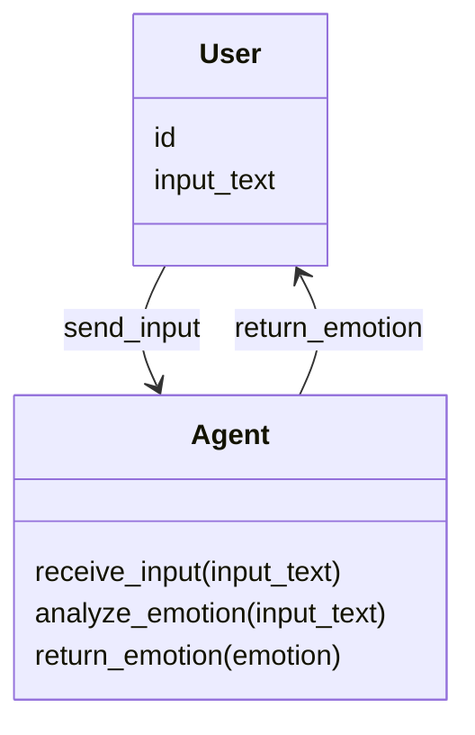
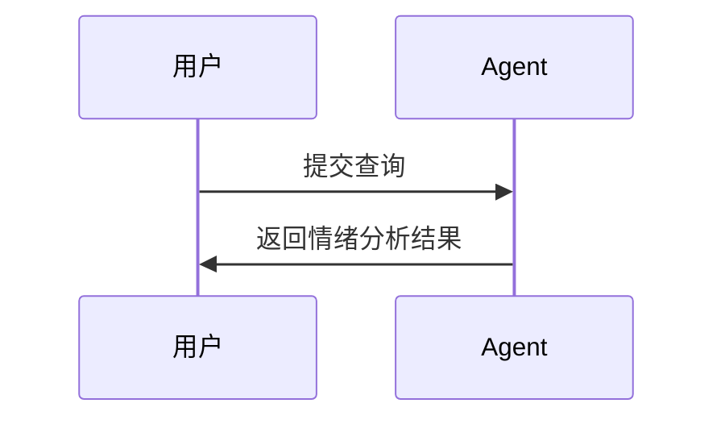

                 


# AI Agent的情感计算与情绪识别

## 关键词：AI Agent，情感计算，情绪识别，机器学习，自然语言处理，人机交互

## 摘要：
本文深入探讨了AI Agent中的情感计算与情绪识别技术，从基本概念到算法原理，再到系统设计和项目实战，全面分析了情感计算在AI Agent中的应用。文章通过详细讲解情感计算的核心原理、常用算法、数学模型，以及系统架构设计，帮助读者理解如何将情感计算技术应用于实际场景中，提升AI Agent的智能化水平。

---

## 第一部分: AI Agent与情感计算的背景与基础

### 第1章: 情感计算与情绪识别的概述

#### 1.1 情感计算的定义与背景

##### 1.1.1 情感计算的定义
情感计算（Affective Computing）是通过计算机技术来识别、理解和模拟人类情感的过程。它旨在通过分析人的语言、表情、声音等信息，捕捉人的情绪状态，从而实现更智能的人机交互。

##### 1.1.2 情感计算的发展历史
情感计算的概念最早由麻省理工学院的ffective Computing Group提出，经过数十年的发展，情感计算技术在自然语言处理、计算机视觉等领域取得了显著进展。

##### 1.1.3 情感计算的应用场景
情感计算广泛应用于教育、医疗、娱乐等领域，例如智能辅导系统可以根据学生的情绪调整教学策略。

##### 1.1.4 AI Agent中的情感计算
AI Agent通过情感计算技术，能够理解用户的情绪状态，从而提供更个性化的服务。

#### 1.2 情绪识别的核心概念

##### 1.2.1 情绪的基本分类
情绪可以分为基本情绪（如愤怒、快乐）和复杂情绪（如嫉妒、悲伤）。常用的情绪分类模型包括PAFC、Ekman模型等。

##### 1.2.2 情绪识别的特征与挑战
情绪识别的特征包括语言特征（如词汇、语调）、面部表情特征、生理信号特征（如心率、皮肤温度）等。主要挑战包括数据的多样性和情感的模糊性。

##### 1.2.3 情绪识别的边界与外延
情绪识别的边界在于如何准确区分不同情绪，外延则包括情感强度、情感时序分析等。

##### 1.2.4 情感计算与情绪识别的关系
情感计算是情绪识别的技术基础，而情绪识别是情感计算的重要应用之一。

#### 1.3 情感计算与AI Agent的结合

##### 1.3.1 AI Agent的基本概念
AI Agent是一种智能代理，能够感知环境、执行任务并与其他实体进行交互。

##### 1.3.2 情感计算在AI Agent中的作用
情感计算使AI Agent能够理解用户的情绪，从而提供更贴心的服务。

##### 1.3.3 情绪识别在人机交互中的应用
情绪识别可以提升人机交互的自然性和智能化，例如在智能音箱中识别用户的语气情绪。

#### 1.4 本章小结
本章介绍了情感计算和情绪识别的基本概念，分析了它们在AI Agent中的作用和应用场景。

---

## 第二部分: 情感计算的核心概念与技术原理

### 第2章: 情感计算的核心原理

#### 2.1 情感计算的理论基础

##### 2.1.1 情感计算的数学模型
情感计算的数学模型包括情感评分模型和情感分类模型。例如，情感评分模型可以通过线性回归或神经网络对文本进行情感评分。

##### 2.1.2 情感计算的心理学基础
心理学中的情感理论为情感计算提供了理论支持，例如基本情绪理论和情感维度理论。

##### 2.1.3 情感计算的计算机科学基础
计算机视觉、自然语言处理等技术为情感计算提供了技术支持。

#### 2.2 情感计算的关键技术

##### 2.2.1 情感计算的特征提取
特征提取是情感计算的关键步骤，包括文本特征提取、语音特征提取和图像特征提取。

##### 2.2.2 情感计算的分类算法
常用的情感分类算法包括支持向量机（SVM）、随机森林（RF）和深度学习模型（如LSTM、BERT）。

##### 2.2.3 情感计算的评估指标
常用的评估指标包括准确率、召回率、F1值和AUC值。

#### 2.3 情感计算的流程图


#### 2.4 情感计算的Python代码实现

```python
import numpy as np
from sklearn.svm import SVC

# 示例数据
X = np.array([[0.1, 0.2], [0.3, 0.4], [0.5, 0.6]])
y = np.array([0, 1, 0])

# 训练模型
model = SVC()
model.fit(X, y)

# 预测
new_data = np.array([[0.2, 0.3]])
print(model.predict(new_data))
```

#### 2.5 情感计算的数学模型

##### 2.5.1 情感评分模型
$$ \text{score} = w_1x_1 + w_2x_2 + \dots + w_nx_n $$

##### 2.5.2 情感分类模型
$$ P(y|x) = \frac{P(x|y)P(y)}{P(x)} $$

---

## 第三部分: 系统分析与架构设计

### 第3章: 情感计算系统的架构设计

#### 3.1 问题场景介绍
AI Agent需要通过分析用户的输入文本，识别用户的情绪状态。

#### 3.2 系统功能设计

##### 3.2.1 领域模型设计


##### 3.2.2 系统架构设计


#### 3.3 系统接口设计
系统接口包括用户输入接口和API接口。

#### 3.4 系统交互流程



---

## 第四部分: 项目实战

### 第4章: 情感计算项目实战

#### 4.1 环境安装
安装Python和相关库：
```bash
pip install numpy scikit-learn transformers
```

#### 4.2 核心代码实现

```python
from transformers import pipeline

# 情感分类 pipeline
sentiment_analyzer = pipeline("sentiment-analysis")

# 输入文本
text = "I love this product!"
result = sentiment_analyzer(text)
print(result)
```

#### 4.3 代码解读与分析
该代码使用了预训练的情感分类模型，能够对输入文本进行情感分析。

#### 4.4 实际案例分析
分析用户输入的情绪状态，例如用户输入“我非常不满意这个服务”，系统返回“negative”情绪。

#### 4.5 项目小结
本项目展示了如何使用预训练模型快速实现情感计算功能。

---

## 第五部分: 最佳实践与总结

### 第5章: 最佳实践

#### 5.1 小结
情感计算是一项复杂但极具应用价值的技术，本文详细介绍了其核心原理和应用方法。

#### 5.2 注意事项
在实际应用中，需要注意数据的多样性和模型的泛化能力。

#### 5.3 拓展阅读
推荐阅读相关论文和书籍，深入理解情感计算的技术细节。

---

## 作者：AI天才研究院 & 禅与计算机程序设计艺术

---

通过以上结构，文章系统地介绍了AI Agent中的情感计算与情绪识别技术，从理论到实践，为读者提供了全面的知识和指导。

