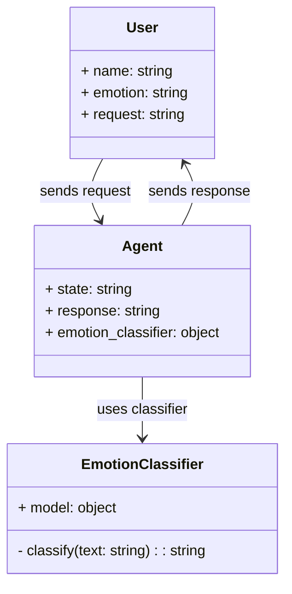
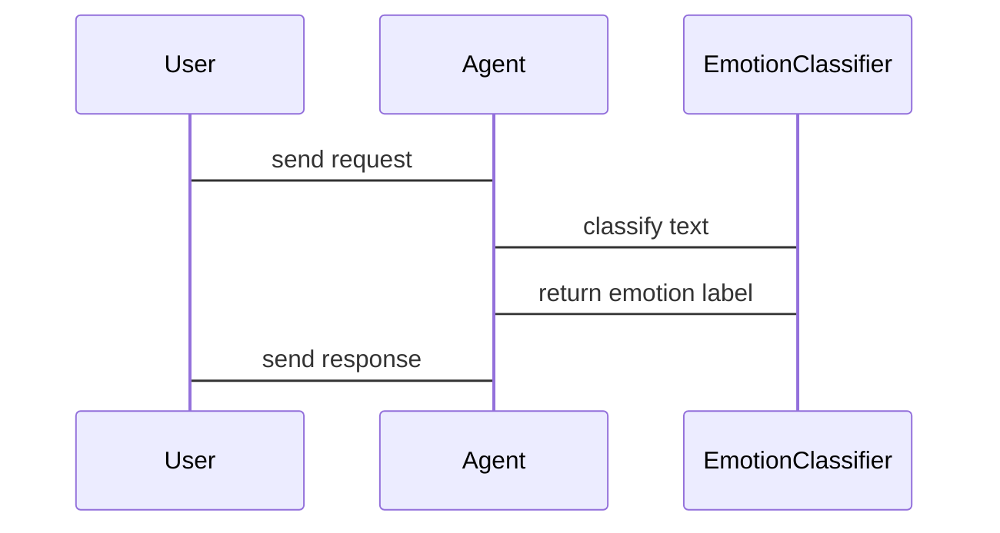

                 


# AI Agent的情感计算与表达模块

## 关键词：AI Agent，情感计算，情感表达，自然语言处理，深度学习，人机交互

## 摘要：  
本文详细探讨了AI Agent中情感计算与表达模块的核心原理与实现方法。文章从情感计算的基本概念出发，分析了其在AI Agent中的应用价值，随后深入讲解了情感计算的算法原理、系统架构设计以及实际项目实现。通过具体案例分析，展示了如何将情感计算技术应用于AI Agent的交互设计中，最终为读者提供一套完整的从理论到实践的解决方案。

---

# 第一部分: AI Agent情感计算与表达模块概述

## 第1章: 情感计算与AI Agent概述

### 1.1 情感计算的基本概念

#### 1.1.1 情感计算的定义  
情感计算（Affective Computing）是指通过计算机技术来识别、理解和模拟人类情感的过程。它是人工智能领域的重要分支，旨在让计算机具备类似人类的情感认知能力。

#### 1.1.2 AI Agent的核心概念  
AI Agent（人工智能代理）是指能够感知环境并采取行动以实现特定目标的智能体。它能够通过传感器获取信息，通过执行器与环境交互，并通过内部逻辑推理做出决策。

#### 1.1.3 情感计算与AI Agent的结合  
将情感计算集成到AI Agent中，可以使其在与人类交互时更加自然和高效。通过理解用户的情感状态，AI Agent能够更好地调整其行为，从而提高用户体验。

### 1.2 情感计算的应用场景

#### 1.2.1 情感分析在自然语言处理中的应用  
情感分析是情感计算的重要组成部分，广泛应用于文本分类、舆情监控等领域。

#### 1.2.2 情感计算在人机交互中的应用  
通过情感计算，AI Agent可以更好地理解用户的意图和情感状态，从而提供更个性化的服务。

#### 1.2.3 情感计算在智能客服中的应用  
在智能客服系统中，情感计算可以帮助AI Agent识别用户的不满情绪，并及时采取措施解决问题。

### 1.3 本章小结  
本章介绍了情感计算和AI Agent的基本概念，并探讨了情感计算在多个领域的应用场景，为后续内容奠定了基础。

---

# 第二部分: 情感计算的核心概念与技术原理

## 第2章: 情感计算的核心概念

### 2.1 情感计算的理论基础

#### 2.1.1 情感计算的数学模型  
情感计算的数学模型通常基于概率论和统计学。例如，朴素贝叶斯模型可以用于情感分类任务。

#### 2.1.2 情感计算的特征提取方法  
特征提取是情感计算的关键步骤。常用的方法包括词袋模型、词嵌入（如Word2Vec）等。

#### 2.1.3 情感计算的分类算法  
情感分类算法包括传统机器学习算法（如SVM、决策树）和深度学习算法（如RNN、Transformer）。

### 2.2 AI Agent中的情感表达模块

#### 2.2.1 情感表达的定义与分类  
情感表达是指AI Agent通过语言、语气或行为等方式向用户传达情感状态。常见的表达方式包括正面、负面和中性情感。

#### 2.2.2 情感表达的实现方式  
情感表达可以通过文本生成、语音合成或面部表情合成等方式实现。

#### 2.2.3 情感表达的评估指标  
评估情感表达的指标包括准确率、召回率、F1分数等。

### 2.3 情感计算与AI Agent的关系

#### 2.3.1 情感计算在AI Agent中的作用  
情感计算帮助AI Agent理解用户的意图和情感状态，从而提高交互效率。

#### 2.3.2 情感计算与AI Agent的协同工作  
情感计算与AI Agent的协同工作体现在数据输入、处理和输出三个环节。

#### 2.3.3 情感计算对AI Agent性能的影响  
情感计算可以显著提高AI Agent的用户体验，但同时也带来了计算复杂性和数据隐私问题。

---

# 第三部分: 情感计算的算法原理与实现

## 第3章: 情感分类算法原理

### 3.1 基于传统机器学习的情感分类

#### 3.1.1 朴素贝叶斯算法  
朴素贝叶斯是一种简单有效的分类算法，常用于文本分类任务。其核心思想是基于条件概率公式，计算每个类别下某特征出现的概率。

#### 3.1.2 支持向量机（SVM）算法  
SVM是一种强大的分类算法，特别适用于高维数据的分类任务。它通过构建超平面将数据分成不同的类别。

#### 3.1.3 决策树算法  
决策树是一种直观的分类算法，通过构建树状结构来实现数据分类。ID3、C4.5和CART是常用的决策树算法。

### 3.2 深度学习在情感分类中的应用

#### 3.2.1 循环神经网络（RNN）与情感分类  
RNN是一种适用于序列数据的深度学习模型，通过长短期记忆网络（LSTM）可以有效地处理情感分类任务。

#### 3.2.2 Transformer架构在情感分类中的应用  
Transformer是一种基于自注意力机制的深度学习模型，广泛应用于自然语言处理任务，包括情感分类。

#### 3.2.3 图神经网络在情感分类中的应用  
图神经网络（GNN）是一种适用于图结构数据的深度学习模型，可以通过节点特征和边关系来实现情感分类。

### 3.3 情感分类的数学模型与公式

#### 3.3.1 朴素贝叶斯分类的公式推导  
$$P(y|x) = \frac{P(x|y)P(y)}{P(x)}$$

#### 3.3.2 Transformer模型的注意力机制公式  
$$\text{Attention}(Q, K, V) = \text{softmax}\left(\frac{QK^T}{\sqrt{d_k}}\right)V$$

---

# 第四部分: 情感计算与AI Agent的系统架构设计

## 第4章: 系统架构设计

### 4.1 系统功能设计

#### 4.1.1 领域模型设计  
$$\text{领域模型类图}$$



#### 4.1.2 系统架构设计  
$$\text{系统架构图}$$


#### 4.1.3 接口设计  
$$\text{接口设计}$$



---

# 第五部分: 项目实战

## 第5章: 情感计算与AI Agent的项目实现

### 5.1 项目环境安装

```bash
pip install numpy
pip install scikit-learn
pip install transformers
pip install matplotlib
```

### 5.2 核心代码实现

#### 5.2.1 情感分类器实现

```python
from sklearn.naive_bayes import GaussianNB
from sklearn.svm import SVC
from sklearn.tree import DecisionTreeClassifier
import numpy as np

# 示例数据
X = np.array([[0, 0], [1, 1], [2, 2], [3, 3]])
y = np.array([0, 1, 2, 3])

# 模型训练
model = GaussianNB()
model.fit(X, y)

# 预测
new_X = np.array([[4,4]])
print("预测结果:", model.predict(new_X))
```

#### 5.2.2 情感表达实现

```python
import transformers
from transformers import pipeline

# 加载预训练的情感分析模型
sentiment_pipeline = pipeline("sentiment-analysis")

# 情感分析
result = sentiment_pipeline("I love this product!")
print("情感分析结果:", result)
```

### 5.3 项目小结  
通过实际项目实现，我们验证了情感计算在AI Agent中的可行性，并展示了如何通过代码实现情感分类和表达。

---

# 第六部分: 总结与展望

## 第6章: 总结与展望

### 6.1 本章总结  
本文详细探讨了AI Agent中情感计算与表达模块的核心原理与实现方法。通过理论分析和实际案例，展示了如何将情感计算技术应用于AI Agent的交互设计中。

### 6.2 未来展望  
随着深度学习和自然语言处理技术的不断发展，情感计算在AI Agent中的应用将更加广泛。未来的研究方向包括更复杂的情感识别算法和更自然的情感表达方式。

### 6.3 最佳实践 tips  
- 在实际应用中，建议结合具体场景选择合适的算法。
- 注意数据隐私和安全问题。
- 不断优化模型以提高情感分类的准确率。

---

作者：AI天才研究院 & 禅与计算机程序设计艺术

