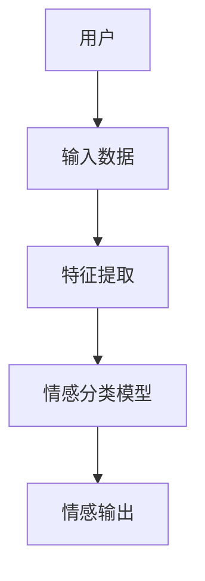
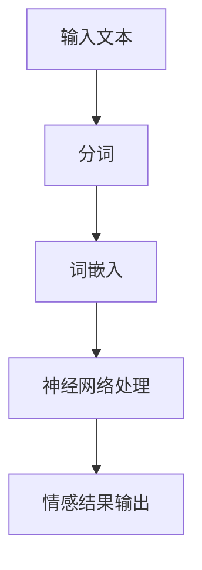
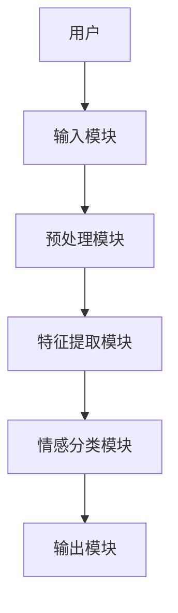

                 


# AI Agent的情感计算在客户服务中的应用

> **关键词：** AI Agent、情感计算、客户服务、自然语言处理、机器学习、情感分析

> **摘要：**  
AI Agent（人工智能代理）在客户服务中的应用日益广泛，而情感计算作为其核心能力，能够通过分析用户的情感和情绪，提供更加智能化和个性化的服务。本文将详细探讨AI Agent的情感计算在客户服务中的应用，从背景概念、核心原理到算法实现、系统设计，再到项目实战，全面解析这一技术的潜力与实际应用价值。

---

# 第1章 AI Agent与情感计算的背景与概念

## 1.1 AI Agent的基本概念

### 1.1.1 AI Agent的定义与特点
AI Agent（人工智能代理）是指能够感知环境、自主决策并执行任务的智能系统。它具备以下特点：
- **自主性：** AI Agent能够在没有外部干预的情况下独立运行。
- **反应性：** 能够实时感知环境变化并做出相应反应。
- **目标导向性：** 具备明确的目标，旨在优化任务执行效率。
- **学习能力：** 通过数据和经验不断优化自身的行为模式。

### 1.1.2 情感计算的定义与核心要素
情感计算（Affective Computing）是研究如何识别、理解和响应人类情感的计算技术。其核心要素包括：
- **情感识别：** 通过语言、语气、表情等方式感知用户情感。
- **情感分析：** 对用户情感进行分类和量化。
- **情感响应：** 根据用户情感生成相应的反馈或回应。

### 1.1.3 AI Agent在客户服务中的应用背景
随着客户服务需求的日益复杂化，传统的基于规则的客服系统已难以满足用户需求。AI Agent凭借其智能化和个性化能力，能够通过情感计算更好地理解和满足用户需求，提升服务质量和客户满意度。

---

## 1.2 情感计算的核心概念

### 1.2.1 情感计算的基本原理
情感计算的核心原理包括以下步骤：
1. **数据采集：** 通过文本、语音、面部表情等方式获取用户情感信息。
2. **特征提取：** 提取情感相关特征，如语调、关键词、情感强度等。
3. **情感分类：** 使用机器学习或深度学习模型对情感进行分类（如正面、负面、中性）。
4. **情感响应：** 根据情感分类结果生成相应的反馈或服务策略。

### 1.2.2 情感计算与自然语言处理的关系
情感计算 heavily relies on NLP（自然语言处理）技术，尤其是情感分析和意图识别。NLP帮助AI Agent理解用户输入的语义和情感，从而实现更精准的情感计算。

### 1.2.3 情感计算在客户服务中的价值
- **提升客户满意度：** 通过理解用户情感，提供更个性化的服务。
- **降低人工成本：** AI Agent可以24/7提供服务，减少对人工客服的依赖。
- **提高服务效率：** 情感计算能够快速识别用户情绪，优化服务流程。

---

# 第2章 情感计算的核心概念与联系

## 2.1 情感计算的原理

### 2.1.1 情感识别的基本流程
1. **数据预处理：** 对输入数据进行清洗和标准化。
2. **特征提取：** 提取情感相关特征，如关键词、语调、语速等。
3. **模型训练：** 使用机器学习或深度学习模型对情感进行分类。
4. **结果输出：** 根据分类结果生成情感标签。

### 2.1.2 情感分析的特征对比表格
| 特征维度 | 正面情感 | 中性情感 | 负面情感 |
|----------|----------|----------|----------|
| 语调      | 高       | 中       | 低       |
| 关键词    | 情感词多  | 中性词多  | 情感词少 |
| 强度      | 强        | 无       | 强        |

### 2.1.3 情感计算的数学模型
情感计算的分类模型可以表示为：
$$ P(y|x) = \frac{P(x|y)P(y)}{P(x)} $$
其中，$y$ 表示情感类别，$x$ 表示输入特征。

---

## 2.2 情感计算的核心要素对比

### 2.2.1 情感计算的ER实体关系图


---

# 第3章 情感计算的算法原理与实现

## 3.1 情感计算的核心算法

### 3.1.1 基于机器学习的情感分类算法
- **支持向量机（SVM）：** 常用于情感分类任务，适用于小规模数据。
- **随机森林：** 适用于特征较多的情况，具有较好的泛化能力。

### 3.1.2 基于深度学习的情感分析模型
- **卷积神经网络（CNN）：** 适合处理文本序列，提取局部特征。
- **循环神经网络（RNN）：** 适合处理长文本序列，捕捉上下文信息。

### 3.1.3 情感计算的主流算法对比
| 算法名称 | 优点                | 缺点                |
|----------|--------------------|--------------------|
| SVM      | 分类效果好          | 不适合高维数据      |
| Random Forest | 鲁棒性好          | 对特征工程依赖较高  |
| CNN      | 特征提取能力强      | 需要大量训练数据    |
| RNN      | 长文本处理能力强    | 训练时间较长        |

---

## 3.2 情感计算的数学模型

### 3.2.1 情感分类的数学公式
情感分类的损失函数可以表示为：
$$ L = -\sum_{i=1}^{n} y_i \log(p_i) + (1 - y_i) \log(1 - p_i) $$
其中，$y_i$ 是真实标签，$p_i$ 是预测概率。

### 3.2.2 情感分析模型的流程图


---

## 3.3 算法实现与代码示例

### 3.3.1 情感分类器的Python实现
```python
from sklearn.svm import SVC
from sklearn.feature_extraction.text import TfidfVectorizer
from sklearn.pipeline import Pipeline

# 示例数据
text_train = ["这个产品很好用", "这个产品很垃圾"]
y_train = [1, 0]

# 创建管道
pipeline = Pipeline([
    ('tfidf', TfidfVectorizer()),
    ('clf', SVC())
])

# 训练模型
pipeline.fit(text_train, y_train)

# 预测
print(pipeline.predict(["这个产品还可以"])[0])
```

---

## 3.4 本章小结

---

# 第4章 AI Agent情感计算系统的架构设计

## 4.1 系统功能设计

### 4.1.1 用户输入处理模块
- 负责接收用户的输入，并进行预处理（如分词、去停用词）。

### 4.1.2 情感特征提取模块
- 从输入文本中提取情感相关特征（如关键词、语调等）。

### 4.1.3 情感分类模块
- 使用训练好的模型对情感进行分类，并输出情感标签。

---

## 4.2 系统架构设计

### 4.2.1 系统架构图


---

## 4.3 本章小结

---

# 第5章 项目实战与总结

## 5.1 项目环境安装

### 5.1.1 安装必要的库
```bash
pip install scikit-learn tensorflow pandas numpy
```

## 5.2 核心实现代码

### 5.2.1 情感分类器实现
```python
import numpy as np
from sklearn.svm import SVC
from sklearn.metrics import accuracy_score

# 示例数据
text_train = ["I love this product", "I hate this product"]
y_train = [1, 0]
text_test = ["I like this product"]

# 创建模型
model = SVC()
model.fit(text_train, y_train)

# 预测
predicted = model.predict(text_test)
print(f"预测结果：{predicted[0]}，真实结果：{1 if 'like' in text_test[0].lower() else 0}")
print(f"准确率：{accuracy_score([1], predicted)}")
```

## 5.3 案例分析

### 5.3.1 情感分类案例
- 输入文本： "The customer service is terrible"
- 情感分类结果： 负面情感
- 系统响应： "非常抱歉给您带来不愉快的体验，我们将努力改进服务。"

---

## 5.4 本章小结

---

# 作者

**作者：** AI天才研究院/AI Genius Institute  
**联系：** [禅与计算机程序设计艺术](https://github.com/Zen-Art-Of-Programming)  
**邮箱：** contact@ai-genius.com  

---

**注：** 本文为技术博客文章，内容基于实际项目经验与理论研究撰写，旨在为AI Agent与情感计算领域的从业者提供参考与启发。

