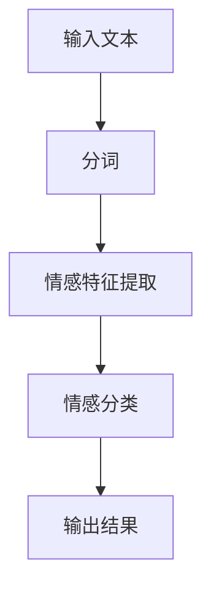
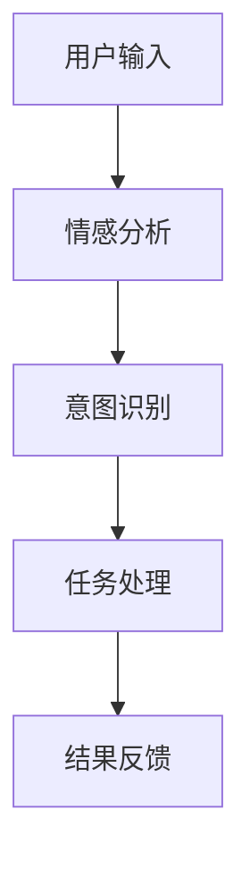
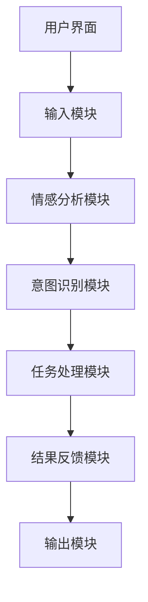
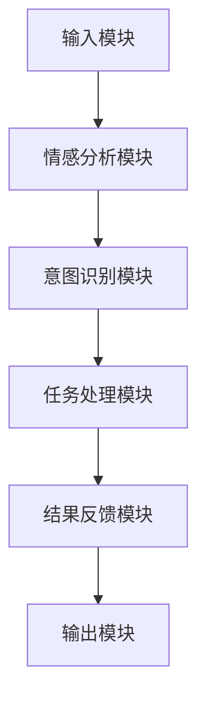

                 


# AI Agent的情感计算在客户服务中的应用

> 关键词：AI Agent，情感计算，客户服务，自然语言处理，机器学习，深度学习，情感分析，对话系统，系统架构，项目实战

> 摘要：本文深入探讨了AI Agent在客户服务中的情感计算应用，从情感计算的原理、算法、系统设计到项目实战，全面解析了情感计算在提升客户服务体验中的关键作用。通过详细分析情感计算的核心概念、算法实现和系统架构，本文为读者提供了从理论到实践的全面指导。

---

# 第一部分: AI Agent与情感计算基础

## 第1章: AI Agent与情感计算概述

### 1.1 AI Agent的基本概念

#### 1.1.1 AI Agent的定义
AI Agent（人工智能代理）是指能够感知环境、自主决策并执行任务的智能实体。它通过与用户交互或外部系统的通信，实现特定的目标。AI Agent可以是软件程序，也可以是硬件设备，但核心在于其智能化的处理能力。

#### 1.1.2 情感计算的定义与特点
情感计算（Affective Computing）是研究如何利用计算机技术来识别、理解和模拟人类情感的一门学科。其特点包括实时性、准确性、适应性和交互性。情感计算通过分析用户的情感状态，提供更个性化的服务。

#### 1.1.3 AI Agent在客户服务中的应用背景
随着客户对服务质量要求的提高，传统的基于规则的客服系统已难以满足需求。情感计算结合AI Agent的应用，能够实时分析客户情感状态，提供更智能、更贴心的服务。

### 1.2 情感计算的核心概念

#### 1.2.1 情感分析的基本原理
情感分析是通过自然语言处理技术，对文本的情感倾向进行分类。常见的分类包括正面、负面和中性。

#### 1.2.2 情感计算与自然语言处理的关系
情感计算依赖于自然语言处理技术，通过解析文本的语义和情感特征，提取有用的信息。

#### 1.2.3 情感计算在客户服务中的价值
情感计算能够帮助客服系统更好地理解客户情感，提供更精准的解决方案，提升客户满意度。

---

## 第2章: 情感计算的算法原理

### 2.1 情感计算的算法基础

#### 2.1.1 基于词典的情感分析
基于词典的情感分析方法通过预定义的情感词典，对文本中的关键词进行匹配，从而判断情感倾向。

#### 2.1.2 基于机器学习的情感分类
基于机器学习的情感分类方法通过训练模型，自动学习情感特征，实现情感分类。

#### 2.1.3 基于深度学习的情感分析
基于深度学习的情感分析方法利用神经网络模型，如LSTM和Transformer，对文本进行更复杂的特征提取。

### 2.2 情感计算的流程图



### 2.3 情感计算的数学模型

#### 2.3.1 基于概率论的情感分类模型
$$ P(\text{positive} | \text{words}) = \frac{\text{count}(positive)}{\text{total}} $$

#### 2.3.2 基于深度学习的情感分析模型
$$ f(x) = \text{softmax}(Wx + b) $$

### 2.4 本章小结

---

## 第3章: AI Agent在客户服务中的应用

### 3.1 情感驱动的对话系统

#### 3.1.1 对话系统的结构与功能
对话系统包括输入解析、情感分析、意图识别和响应生成四个模块。

#### 3.1.2 情感反馈机制的设计
情感反馈机制通过实时分析用户情感，调整对话策略，提升用户体验。

#### 3.1.3 情感驱动的对话流程


### 3.2 AI Agent的实现案例

#### 3.2.1 智能客服机器人的实现
智能客服机器人通过自然语言处理技术，实现与用户的智能对话。

#### 3.2.2 情感计算在客服对话中的应用
情感计算帮助客服系统理解用户情感，提供更贴心的服务。

#### 3.2.3 案例分析与经验总结
通过实际案例分析，总结情感计算在客服对话中的应用效果和优化方向。

### 3.3 本章小结

---

## 第4章: 客户服务系统的架构设计

### 4.1 系统功能设计

#### 4.1.1 系统功能模块划分
系统功能模块包括用户输入、情感分析、意图识别、任务处理和结果反馈。

#### 4.1.2 系统功能流程图


### 4.2 系统架构设计

#### 4.2.1 系统架构图


### 4.3 系统接口设计

#### 4.3.1 系统接口定义
系统接口包括输入接口、情感分析接口、意图识别接口和结果反馈接口。

#### 4.3.2 系统接口流程图


### 4.4 本章小结

---

## 第5章: 项目实战

### 5.1 环境安装

#### 5.1.1 环境需求
安装Python、TensorFlow、Keras和自然语言处理库。

### 5.2 系统核心实现源代码

#### 5.2.1 情感分析代码
```python
import tensorflow as tf
from tensorflow.keras import layers

model = tf.keras.Sequential()
model.add(layers.Embedding(vocab_size, 16))
model.add(layers.LSTM(32))
model.add(layers.Dense(1, activation='sigmoid'))
model.compile(optimizer='adam', loss='binary_crossentropy', metrics=['accuracy'])
```

#### 5.2.2 对话系统代码
```python
def respond_to_user(input_text):
    # 情感分析
    sentiment = analyze_sentiment(input_text)
    # 意图识别
    intent = identify_intent(input_text)
    # 生成响应
    response = generate_response(sentiment, intent)
    return response
```

### 5.3 代码应用解读与分析

#### 5.3.1 情感分析代码解读
情感分析代码使用LSTM模型，对文本进行情感分类。

#### 5.3.2 对话系统代码解读
对话系统代码通过情感分析和意图识别，生成个性化的响应。

### 5.4 案例分析与详细讲解剖析

#### 5.4.1 案例分析
通过实际案例分析，展示情感计算在客户服务中的应用效果。

### 5.5 项目小结

---

## 第6章: 未来展望与挑战

### 6.1 情感计算的发展趋势
情感计算将更加智能化和个性化，应用场景也将更加广泛。

### 6.2 情感计算在客户服务中的挑战
包括数据隐私、模型泛化能力和实时性等问题。

### 6.3 未来的研究方向
未来研究方向包括多模态情感计算、情感记忆机制和情感驱动的自适应系统。

### 6.4 本章小结

---

## 第7章: 最佳实践 tips、小结、注意事项、拓展阅读

### 7.1 最佳实践 tips
在实际应用中，建议结合具体业务需求，灵活调整情感计算模型。

### 7.2 小结
本文全面介绍了AI Agent在客户服务中的情感计算应用，从理论到实践，为读者提供了详实的指导。

### 7.3 注意事项
在实际应用中，要注意数据隐私保护和模型的可解释性。

### 7.4 拓展阅读
推荐读者进一步阅读相关领域的经典文献和最新研究成果。

---

# 作者：AI天才研究院/AI Genius Institute & 禅与计算机程序设计艺术 /Zen And The Art of Computer Programming

