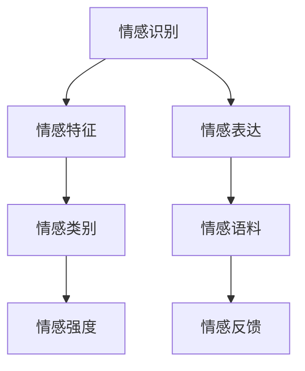
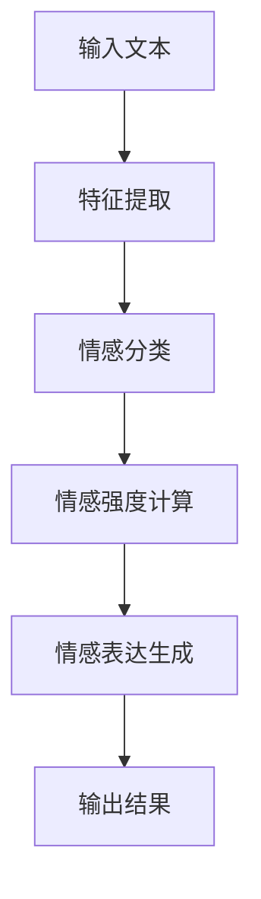
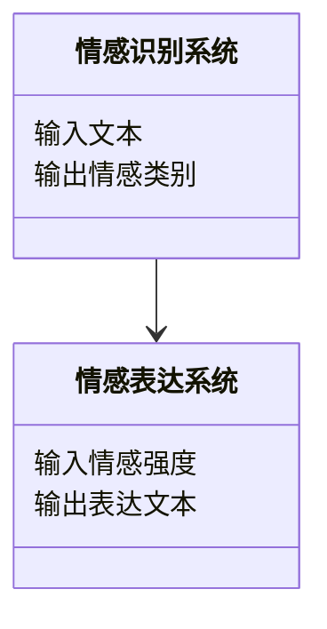
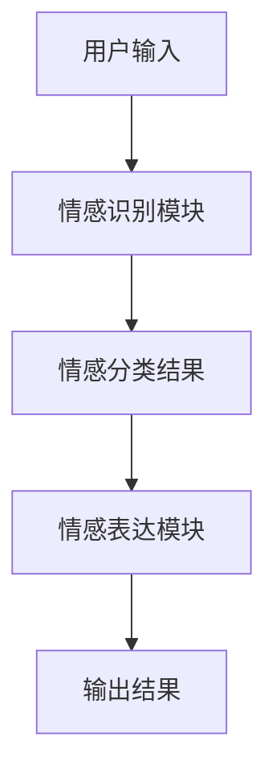

                 


# AI Agent的情感识别与表达能力开发

> **关键词**: AI Agent, 情感识别, 情感表达, 人机交互, 机器学习, 深度学习

> **摘要**: 本文将详细探讨AI Agent在情感识别与表达方面的能力开发，涵盖从基础概念到算法原理、系统设计及项目实战的各个方面。通过分析情感识别与表达的核心原理、应用场景，结合实际案例，提供系统化的解决方案，帮助读者掌握AI Agent在情感交互中的开发技巧。

---

## 第1章: AI Agent与情感识别概述

### 1.1 AI Agent的基本概念

#### 1.1.1 AI Agent的定义与特点

AI Agent（人工智能代理）是一种能够感知环境并采取行动以实现目标的智能实体。它具备以下特点：
- **自主性**: 能够自主决策，无需外部干预。
- **反应性**: 能够实时感知环境并做出反应。
- **目标导向**: 通过行动实现预设目标。
- **学习能力**: 能够通过经验改进性能。

#### 1.1.2 情感识别的背景与意义

情感识别是AI Agent理解用户情感状态的关键能力，其背景与意义如下：
- **背景**: 随着人机交互的普及，用户与AI Agent之间的互动越来越频繁，情感识别成为提升用户体验的核心技术。
- **意义**: 情感识别使AI Agent能够理解用户的情感状态，从而提供更个性化的服务。

#### 1.1.3 情感表达的核心作用

情感表达是AI Agent与用户进行有效沟通的重要方式，其核心作用包括：
- **增强交互性**: 通过情感表达，AI Agent能够更好地与用户建立情感联系。
- **提升用户体验**: 情感化的表达能够让用户感受到被理解和关怀。
- **提高准确性**: 情感表达有助于减少误解，提升信息传递的准确性。

### 1.2 情感识别与表达的定义

#### 1.2.1 情感识别的定义

情感识别是通过分析文本、语音或图像等输入数据，判断出其中蕴含的情感倾向（如正面、负面、中性）或具体情感类型（如快乐、悲伤、愤怒）的过程。

#### 1.2.2 情感表达的定义

情感表达是将AI Agent的情感状态转化为文字、语音、图像等形式的过程，目的是让用户体验到AI Agent的情感反馈。

#### 1.2.3 情感识别与表达的区别与联系

- **区别**: 情感识别侧重于理解和分析情感，而情感表达侧重于生成和输出情感。
- **联系**: 情感识别是情感表达的基础，而情感表达是情感识别的延伸。

### 1.3 情感识别与表达的应用场景

#### 1.3.1 情感识别在人机交互中的应用

- **智能客服**: 通过情感识别，AI Agent能够理解用户的情绪状态，提供更贴心的服务。
- **智能助手**: 情感识别使智能助手能够感知用户的情感变化，调整交互方式。

#### 1.3.2 情感表达在智能系统中的应用

- **虚拟助手**: 情感表达使虚拟助手的声音更具人性化。
- **智能音箱**: 通过情感表达，音箱能够以更自然的方式与用户互动。

#### 1.3.3 情感识别与表达的边界与外延

- **边界**: 情感识别主要关注情感状态的判断，不涉及情感内容的理解。
- **外延**: 情感表达不仅限于语言，还可以通过肢体语言、图像等方式实现。

---

## 第2章: 情感识别与表达的核心概念

### 2.1 情感识别的核心原理

#### 2.1.1 基于规则的情感识别

- **方法**: 通过预定义的规则匹配情感关键词，判断情感倾向。
- **优缺点**: 简单易实现，但灵活性差，难以处理复杂情感场景。

#### 2.1.2 基于机器学习的情感识别

- **方法**: 使用训练好的模型（如SVM、随机森林）进行情感分类。
- **优缺点**: 精度高，但需要大量标注数据。

#### 2.1.3 深度学习在情感识别中的应用

- **方法**: 使用RNN、LSTM等深度学习模型处理序列数据。
- **优缺点**: 处理复杂情感场景能力强，但计算资源需求高。

### 2.2 情感表达的核心特征

#### 2.2.1 情感表达的多样性

- **多样性**: 根据情感强度和情感类型生成不同表达方式。
- **情感强度**: 从“非常开心”到“稍微不满”等强度变化。

#### 2.2.2 情感表达的情感强度

- **强度计算**: 根据情感识别结果，调整情感表达的语气和用词。

#### 2.2.3 情感表达的语境依赖性

- **语境适应**: 根据上下文调整情感表达方式。

### 2.3 情感识别与表达的ER实体关系图



---

## 第3章: 情感识别与表达的算法原理

### 3.1 情感识别算法

#### 3.1.1 基于规则的情感识别算法

- **规则匹配**: 使用预定义的情感关键词库，匹配输入文本中的关键词，判断情感倾向。

#### 3.1.2 基于机器学习的情感识别算法

- **特征提取**: 将文本转化为数值特征向量。
- **模型训练**: 使用训练数据训练分类模型。
- **情感分类**: 对待识别文本进行分类。

#### 3.1.3 基于深度学习的情感识别算法

- **模型结构**: 使用LSTM进行序列建模，捕捉情感特征。
- **情感分类**: 通过 softmax 层输出情感类别概率。

### 3.2 情感表达算法

#### 3.2.1 基于规则的情感表达生成

- **模板匹配**: 根据情感类别选择预定义模板，生成表达文本。

#### 3.2.2 基于模板的情感表达生成

- **模板扩展**: 根据情感强度和语境，扩展模板内容，生成多样化表达。

#### 3.2.3 基于生成模型的情感表达生成

- **生成模型**: 使用GPT等生成模型，根据情感类别生成自然语言表达。

### 3.3 情感识别与表达的算法流程图



---

## 第4章: 情感识别与表达的数学模型和公式

### 4.1 情感识别的数学模型

#### 4.1.1 情感分类的线性模型

- **线性分类器**: 使用线性回归模型进行情感分类。
- **公式**: 
  $$ y = w \cdot x + b $$
  其中，$y$ 是输出，$w$ 是权重，$x$ 是输入特征，$b$ 是偏置项。

#### 4.1.2 情感强度的计算公式

- **情感强度**: 
  $$ \text{强度} = \frac{\sum_{i=1}^{n} w_i \cdot f_i}{\sum_{i=1}^{n} w_i} $$
  其中，$w_i$ 是情感关键词的权重，$f_i$ 是关键词出现的频率。

### 4.2 情感表达的生成模型

#### 4.2.1 基于生成模型的数学公式

- **生成模型**: 使用变分自编码器（VAE）生成情感表达文本。
- **公式**: 
  $$ p(x) = \int \mathcal{N}(x; \mu, \sigma^2) q(z|x) dz $$
  其中，$x$ 是生成的文本，$z$ 是潜在变量。

---

## 第5章: 情感识别与表达的系统分析与架构设计

### 5.1 系统功能设计

#### 5.1.1 领域模型设计



#### 5.1.2 系统架构设计



#### 5.1.3 系统接口设计

- **输入接口**: 文本输入接口。
- **输出接口**: 文本或语音输出接口。

---

## 第6章: 情感识别与表达的项目实战

### 6.1 项目环境安装

- **工具安装**: 安装Python、TensorFlow、Keras等工具。

### 6.2 核心代码实现

#### 6.2.1 情感识别代码

```python
import tensorflow as tf
from tensorflow.keras import layers

model = tf.keras.Sequential()
model.add(layers.Embedding(input_dim=10000, output_dim=50))
model.add(layers.LSTM(64, return_sequences=True))
model.add(layers.Dense(2, activation='softmax'))
```

#### 6.2.2 情感表达代码

```python
def generate_response(emotion):
    if emotion == 'happy':
        return "That's great! I'm happy for you."
    elif emotion == 'sad':
        return "I'm sorry to hear that. Let me know if you need anything."
    else:
        return "I understand. How can I assist you?"
```

---

## 第7章: 最佳实践与小结

### 7.1 开发注意事项

- **数据质量**: 确保训练数据的多样性和代表性。
- **模型调优**: 根据实际应用需求，调整模型参数。

### 7.2 未来研究方向

- **多模态情感识别**: 结合文本、语音和图像进行情感识别。
- **自适应情感表达**: 根据用户反馈动态调整情感表达方式。

### 7.3 本章小结

本文详细探讨了AI Agent在情感识别与表达方面的能力开发，涵盖了从理论到实践的各个方面，为读者提供了系统化的解决方案。

---

**作者：AI天才研究院/AI Genius Institute & 禅与计算机程序设计艺术 /Zen And The Art of Computer Programming**

