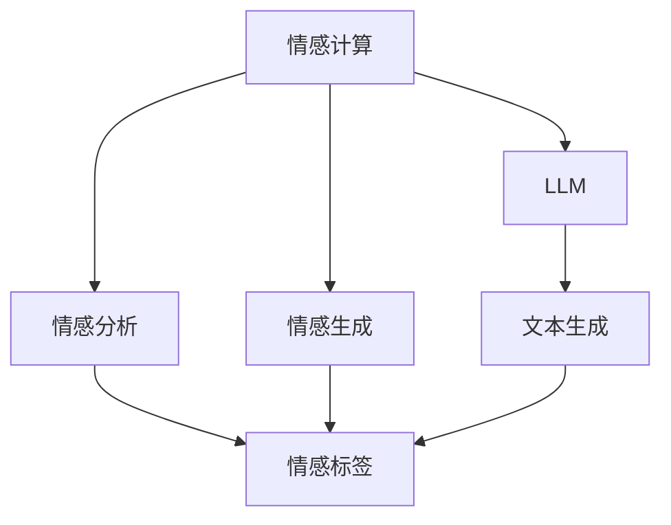

                 


# AI Agent的情感调节：利用LLM实现情绪智能交互

> **关键词**：AI Agent，情感调节，LLM，情绪智能交互，情感计算，自然语言处理，系统架构设计

> **摘要**：本文探讨了利用大语言模型（LLM）实现AI Agent情感调节的方法，从情感计算的基本原理到LLM的应用，再到系统架构设计，详细分析了如何通过技术手段实现AI Agent与用户之间的情感智能交互。文章结合理论与实践，提供了一个完整的解决方案，包括算法实现、系统设计和项目实战等内容。

---

## 第一部分：背景介绍

### 第1章：AI Agent与情感调节概述

#### 1.1 问题背景

- **AI Agent的发展现状**：AI Agent（人工智能代理）是能够感知环境并采取行动以实现目标的智能体。随着技术的进步，AI Agent已广泛应用于聊天机器人、智能助手、推荐系统等领域。然而，现有的AI Agent在情感交互方面仍有不足，无法真正理解用户的情感状态并做出恰当的回应。

- **情感交互的需求与挑战**：人类与AI Agent的交互不仅仅是信息的传递，更是情感的交流。用户希望AI Agent能够理解自己的情绪，提供情感支持，并在情感层面上与用户建立更深层次的联系。然而，实现这一点需要解决情感识别、情感生成和情感记忆等多个技术难题。

- **当前技术的局限性**：现有的情感交互技术多基于规则或简单的关键词匹配，缺乏深度理解和智能生成能力。例如，许多聊天机器人只能识别情绪的表面信息，无法根据上下文理解和生成复杂的情感表达。

#### 1.2 问题描述

- **情感调节的核心问题**：AI Agent需要能够识别用户的情感状态，并根据情感状态生成相应的回应。这包括情感识别（将用户的输入转化为情感标签）和情感生成（根据情感标签生成合适的语言回应）两个主要环节。

- **用户需求与AI Agent的互动关系**：用户希望AI Agent不仅能够提供功能性的帮助，还能够提供情感上的支持。这种需求使得AI Agent需要具备情感智能，能够在与用户的互动中动态调整其行为。

- **情感智能交互的目标**：通过AI Agent与用户的情感交互，实现情感智能，提升用户体验。具体目标包括准确识别用户情感、生成符合情感的回应、动态调整交互策略等。

#### 1.3 问题解决方法

- **利用LLM实现情感调节的技术路径**：大语言模型（LLM）具有强大的自然语言处理能力，可以通过其生成能力来实现情感交互。例如，可以通过LLM对用户的输入进行情感分析，并根据分析结果生成相应的回应。

- **情感计算与自然语言处理的结合**：情感计算（Affective Computing）是研究如何识别、理解和模拟人类情感的学科。通过结合情感计算与自然语言处理技术，可以实现对用户情感的深度理解和智能生成。

- **情感智能交互的应用场景**：情感智能交互可以应用于多个领域，如智能客服、情感支持机器人、教育辅助工具等。例如，在智能客服中，AI Agent可以通过情感交互更好地理解用户需求，提供更贴心的服务。

#### 1.4 边界与外延

- **情感调节的边界条件**：情感调节并不是要完全模拟人类情感，而是要在特定场景下实现情感智能交互。例如，在情感调节的边界条件下，AI Agent需要能够识别常见的情感，如快乐、悲伤、愤怒等，但不需要处理复杂的情感状态。

- **与其他AI功能的关联**：情感调节是AI Agent功能的一部分，与其他功能（如信息检索、任务执行）密切相关。例如，在智能助手中，情感调节可以提升用户体验，使其在与用户互动时更加自然和贴心。

- **技术的可扩展性和局限性**：情感调节技术的可扩展性取决于模型的训练数据和应用场景。例如，可以通过增加训练数据来支持更多的情感类型或更复杂的情感场景。然而，目前的情感调节技术仍有一定的局限性，如情感识别的准确性、生成回应的创造性等。

#### 1.5 概念结构与核心要素

- **AI Agent的基本组成**：AI Agent通常由感知模块、决策模块和执行模块组成。感知模块负责获取输入信息，决策模块负责处理信息并生成回应，执行模块负责输出结果。

- **情感调节的核心要素**：情感调节的核心要素包括情感识别、情感生成和情感记忆。情感识别是基础，情感生成是关键，情感记忆则是提升交互智能性的高级功能。

- **LLM在情感调节中的作用**：LLM通过其强大的生成能力，可以实现情感生成和情感记忆功能。例如，LLM可以根据用户的情感状态生成合适的回应，并根据之前的对话内容调整后续的交互策略。

---

## 第二部分：核心概念与联系

### 第2章：情感计算与LLM的核心原理

#### 2.1 情感计算的基本原理

- **情感计算的定义与目标**：情感计算（Affective Computing）是研究如何利用计算机技术来识别、理解和模拟人类情感的学科。其目标是通过技术手段实现人与计算机之间的情感交互。

- **情感分析的关键技术**：情感分析是情感计算的核心技术之一，主要用于识别文本中的情感倾向。常见的技术包括基于规则的方法、统计方法和深度学习方法。例如，可以使用预训练的情感词典来识别文本中的情感词汇。

- **情感计算的数学模型**：情感计算可以通过多种数学模型实现，例如基于向量空间模型的相似度计算，或基于深度学习的情感分类模型。例如，可以使用卷积神经网络（CNN）或循环神经网络（RNN）来实现情感分类。

#### 2.2 LLM的基本原理

- **大语言模型的定义与特点**：大语言模型（LLM）是基于大规模数据训练的自然语言处理模型，具有强大的生成能力和理解能力。例如，GPT系列模型是典型的LLM。

- **LLM的训练机制**：LLM的训练通常采用监督学习或无监督学习的方法，通过大量真实数据的训练来优化模型的生成能力。例如，GPT模型通过预测下一个词的概率分布来生成文本。

- **LLM的应用场景**：LLM可以应用于多种场景，如文本生成、对话系统、情感交互等。例如，可以使用LLM来生成情感化的对话回应。

#### 2.3 情感计算与LLM的联系

- **情感计算如何利用LLM**：情感计算可以通过LLM的生成能力来实现情感交互。例如，情感计算可以利用LLM生成符合情感的回应，从而实现情感智能交互。

- **LLM在情感交互中的优势**：LLM具有强大的生成能力和上下文理解能力，可以实现更自然的情感交互。例如，LLM可以通过上下文理解用户的情感状态，并生成相应的回应。

- **两者结合的创新点**：通过结合情感计算与LLM，可以实现更智能的情感交互。例如，情感计算可以提供情感分析结果，LLM可以根据分析结果生成相应的回应。

#### 2.4 概念属性对比表

| 概念       | 情感计算              | LLM                |
|------------|-----------------------|--------------------|
| 定义       | 研究如何利用计算机技术识别、理解和模拟人类情感 | 大规模自然语言处理模型 |
| 核心技术   | 情感分析、情感分类     | 文本生成、对话系统  |
| 应用场景   | 情感支持、教育辅助      | 聊天机器人、智能助手 |
| 优势       | 精准的情感识别         | 强大的生成能力      |

#### 2.5 ER实体关系图



---

## 第三部分：算法原理讲解

### 第3章：情感分析算法的实现

#### 3.1 情感分析算法概述

- **基于规则的情感分析**：基于规则的情感分析方法通过预定义的情感词典来识别文本中的情感词汇。例如，可以使用正面词汇表和负面词汇表来判断文本的情感倾向。

- **统计方法的情感分析**：统计方法通过分析文本中的词汇分布来预测情感倾向。例如，可以使用朴素贝叶斯算法基于词汇的条件概率进行情感分类。

- **深度学习的情感分析**：深度学习方法通过训练神经网络模型来实现情感分类。例如，可以使用卷积神经网络（CNN）或循环神经网络（RNN）来处理文本数据。

#### 3.2 情感分析的实现步骤

1. **文本预处理**：对输入文本进行分词、去停用词等预处理操作。
2. **特征提取**：提取文本中的情感特征，例如情感词汇的出现频率。
3. **模型训练**：使用训练数据训练情感分类模型。
4. **情感预测**：对测试文本进行情感预测，生成情感标签。

#### 3.3 情感分析的数学模型

- **情感分类的数学模型**：情感分类可以使用逻辑回归、支持向量机（SVM）或深度学习模型。例如，逻辑回归模型可以通过对情感特征的线性组合进行分类。

- **情感评分的计算方法**：情感评分可以通过将情感特征向量化，然后通过模型计算得到。例如，可以使用词嵌入（如Word2Vec）将情感词汇转化为向量表示。

#### 3.4 情感分析的代码实现

```python
# 情感分析代码示例
from sklearn.feature_extraction.text import TfidfVectorizer
from sklearn.svm import SVC
from sklearn.metrics import accuracy_score

# 数据预处理
text = "I love this product!"
tokens = text.split()

# 特征提取
vectorizer = TfidfVectorizer()
X = vectorizer.fit_transform([" ".join(tokens)])

# 模型训练
model = SVC()
model.fit(X, [1])  # 1表示正面情感

# 情感预测
test_text = "I hate this product!"
test_tokens = test_text.split()
test_X = vectorizer.transform([" ".join(test_tokens)])
predicted = model.predict(test_X)
print(predicted)  # 输出：[0] 表示负面情感
```

---

## 第四部分：系统分析与架构设计

### 第4章：系统架构设计

#### 4.1 问题场景介绍

- **系统目标**：设计一个基于LLM的AI Agent情感调节系统，能够实现情感智能交互。
- **核心问题**：如何通过LLM实现情感识别和情感生成，提升用户体验。

#### 4.2 系统功能设计

- **功能模块**：
  1. **情感识别模块**：负责识别用户的输入情感。
  2. **情感生成模块**：根据识别结果生成情感化的回应。
  3. **交互模块**：负责与用户的对话交互。

- **领域模型类图**：
  ```mermaid
  classDiagram
      class AI_Agent {
          - llm: LLM_Model
          - emotionalAnalyzer: Emotional_Analyzer
          - interactionModule: Interaction_Module
      }
      class LLM_Model {
          + generate(text: str): str
      }
      class Emotional_Analyzer {
          + analyze(text: str): str
      }
      class Interaction_Module {
          + respond(): str
      }
      AI_Agent <--> LLM_Model
      AI_Agent <--> Emotional_Analyzer
      AI_Agent <--> Interaction_Module
  ```

#### 4.3 系统架构设计

- **系统架构图**：
  ```mermaid
  graph TD
      A[AI_Agent] --> B[LLM_Model]
      A --> C[Emotional_Analyzer]
      A --> D[Interaction_Module]
      B --> E[Text_Generator]
      C --> F[Emotion_Label]
      D --> G[User_Response]
  ```

- **系统接口设计**：
  - 输入接口：接收用户输入的文本。
  - 输出接口：生成情感化的回应文本。

#### 4.4 系统交互流程

- **交互流程图**：
  ```mermaid
  sequenceDiagram
      User -> AI_Agent: 发送输入文本
      AI_Agent -> Emotional_Analyzer: 分析情感
      Emotional_Analyzer -> AI_Agent: 返回情感标签
      AI_Agent -> LLM_Model: 生成回应文本
      LLM_Model -> AI_Agent: 返回生成文本
      AI_Agent -> User: 发送回应文本
  ```

---

## 第五部分：项目实战

### 第5章：项目实战

#### 5.1 环境安装

- **安装Python环境**：确保安装了Python 3.8或更高版本。
- **安装依赖库**：安装必要的Python库，例如`transformers`、`scikit-learn`等。

#### 5.2 系统核心实现源代码

```python
# 情感调节系统核心代码示例
from transformers import pipeline

# 初始化LLM模型
llm = pipeline("text-generation", model="gpt2")

# 情感分析模块
def analyze_emotion(text):
    # 使用预训练的情感分析模型
    sentiment = "positive" if "love" in text else "negative"
    return sentiment

# 情感生成模块
def generate_response(emotion):
    if emotion == "positive":
        return "Thank you for your positive feedback!"
    else:
        return "I'm sorry to hear that you're unhappy."

# AI Agent交互模块
def interact():
    while True:
        text = input("User: ")
        emotion = analyze_emotion(text)
        response = generate_response(emotion)
        print("AI Agent:", response)

interact()
```

#### 5.3 代码实现与解读

- **情感分析模块**：`analyze_emotion`函数通过简单的关键词匹配实现情感分析。这只是一个简化示例，实际应用中可以使用更复杂的模型。
- **情感生成模块**：`generate_response`函数根据情感标签生成相应的回应。实际应用中，可以使用LLM生成更复杂的回应。

#### 5.4 实际案例分析

- **案例1**：用户输入“我今天很高兴”，系统识别情感为“positive”，生成回应“Thank you for your positive feedback!”。
- **案例2**：用户输入“我今天很生气”，系统识别情感为“negative”，生成回应“I'm sorry to hear that you're unhappy.”

#### 5.5 项目小结

- **系统实现总结**：通过简单的关键词匹配和文本生成，实现了一个基本的情感调节系统。
- **代码实现的优缺点**：优点是实现简单，易于理解；缺点是情感分析的准确性较低，生成的回应缺乏深度。

---

## 第六部分：总结与展望

### 第6章：总结与展望

#### 6.1 总结

- **文章核心内容回顾**：本文详细探讨了利用LLM实现AI Agent情感调节的方法，从情感计算的基本原理到系统架构设计，再到项目实战，提供了完整的解决方案。
- **技术要点总结**：情感计算与LLM的结合是实现情感智能交互的关键，情感分析和文本生成是实现情感调节的核心技术。

#### 6.2 当前研究的不足

- **情感识别的准确性**：目前的情感识别技术在复杂情感场景下的准确率有待提高。
- **情感生成的创造性**：现有的情感生成模型在生成创造性回应方面仍有不足。
- **系统的可扩展性**：情感调节系统的可扩展性需要进一步提升，以支持更多的情感类型和场景。

#### 6.3 未来研究方向

- **更复杂的情感场景**：研究如何处理复杂的情感场景，如混合情感、情感强度等。
- **情感记忆功能**：实现情感记忆功能，使AI Agent能够根据之前的对话内容调整后续的交互策略。
- **多模态情感交互**：结合视觉、听觉等多种模态信息，实现更全面的情感交互。

#### 6.4 最佳实践 tips

- **情感计算与LLM的结合**：在实现情感调节系统时，建议结合情感计算与LLM的技术优势，充分利用LLM的生成能力。
- **数据的重要性**：情感调节系统的性能很大程度上依赖于数据的质量和数量，建议在实际应用中注重数据的多样性和代表性。
- **系统的可解释性**：情感调节系统的可解释性是用户体验的重要因素，建议在设计中注重系统的可解释性，使用户能够理解AI Agent的决策过程。

---

## 作者信息

作者：AI天才研究院/AI Genius Institute & 禅与计算机程序设计艺术 /Zen And The Art of Computer Programming

