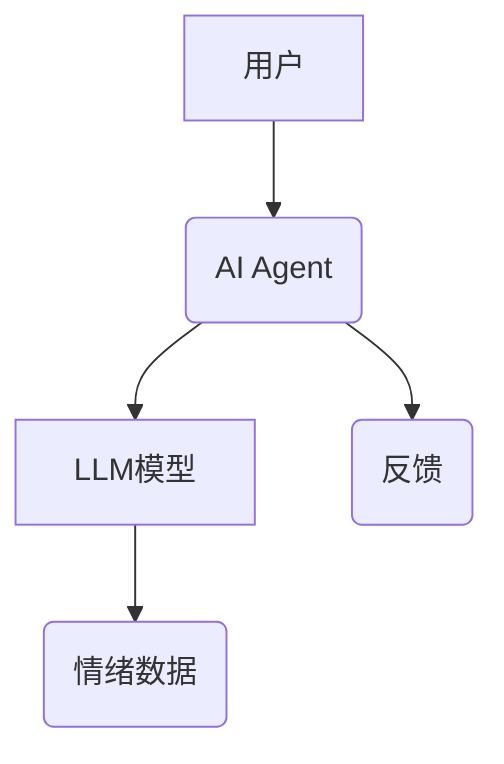
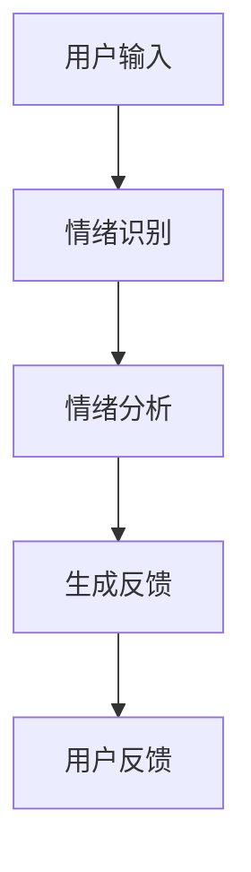
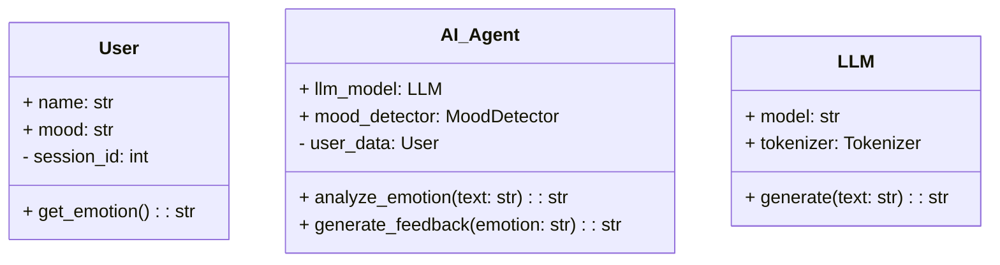
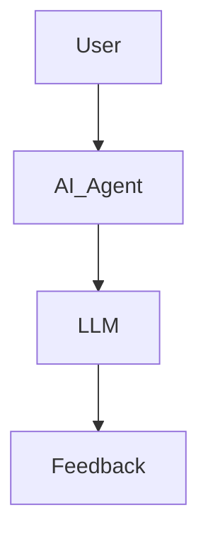

                 


# AI Agent的情绪调节功能：LLM驱动的心理健康助手

**关键词：** AI Agent, LLM, 情绪调节, 心理健康, 自然语言处理, 情绪分析, 人工智能

**摘要：**  
本文探讨了AI Agent的情绪调节功能，特别是利用大语言模型（LLM）作为驱动的心理健康助手。通过分析LLM的工作原理，结合系统架构设计和实际项目案例，详细阐述了如何实现AI代理的情绪调节功能，为心理健康领域提供创新的解决方案。

---

## 第一部分: AI Agent的情绪调节功能背景介绍

### 第1章: 问题背景与描述

#### 1.1 问题背景

**1.1.1 AI Agent的定义与特点**  
AI Agent是一种智能代理，能够感知环境、执行任务并做出决策。其特点包括自主性、反应性、目标导向和社交能力。AI Agent广泛应用于客服、教育、医疗等领域，其中心理健康助手是其重要应用之一。

**1.1.2 情绪调节功能的重要性**  
在快节奏的现代生活中，心理健康问题日益突出。AI Agent的情绪调节功能能够实时识别用户情绪，提供支持，缓解压力，帮助用户维护心理健康。

**1.1.3 当前心理健康问题的现状**  
根据世界卫生组织的数据，全球约有9.7亿人受心理健康问题影响。传统的心理健康服务资源有限，AI Agent作为辅助工具，可以提供及时、便捷的帮助。

#### 1.2 问题描述

**1.2.1 情绪调节功能的需求分析**  
用户需要AI Agent能够识别情绪、提供反馈、提供建议。这需要AI Agent具备情绪分析、自然语言处理和生成能力。

**1.2.2 LLM在情绪调节中的作用**  
LLM通过理解和生成自然语言，帮助AI Agent识别用户情绪，提供个性化的反馈，从而实现情绪调节。

**1.2.3 AI Agent与传统心理健康工具的对比**  
AI Agent的优势在于实时性和便捷性，而传统工具如心理咨询可能需要预约和更多的时间。AI Agent可以作为初步筛查和辅助工具，帮助用户缓解情绪问题。

#### 1.3 问题解决

**1.3.1 LLM驱动AI Agent的实现路径**  
通过训练LLM模型，使其具备情绪分析能力，进而实现情绪调节功能。

**1.3.2 情绪调节功能的核心算法**  
基于自然语言处理和机器学习算法，识别情绪并生成反馈。

**1.3.3 系统设计与实现方案**  
设计一个包含情绪识别、理解、反馈生成和用户反馈收集的系统架构。

---

### 第2章: 核心概念与联系

#### 2.1 核心概念原理

**2.1.1 LLM的基本原理**  
大语言模型通过大量数据训练，能够理解上下文并生成连贯的文本。其核心是基于Transformer架构的编码和解码机制。

**2.1.2 情绪调节功能的实现机制**  
AI Agent通过分析用户输入的情绪，生成相应的反馈，帮助用户调节情绪。

**2.1.3 AI Agent与LLM的协同工作**  
AI Agent调用LLM API，将用户输入传递给模型，获得情绪分析结果和反馈建议。

#### 2.2 概念属性特征对比

**2.2.1 不同LLM模型的特征对比**  
比较GPT-3、GPT-4和BERT等模型在情绪分析中的表现，分析其优缺点。

**2.2.2 AI Agent功能模块的属性分析**  
功能模块包括情绪识别、理解、反馈生成，每个模块的属性如准确性、响应时间等需要考虑。

**2.2.3 情绪调节功能的性能指标**  
准确率、响应时间、用户满意度等是衡量情绪调节功能的重要指标。

#### 2.3 ER实体关系图



---

## 第二部分: 算法原理讲解

### 第3章: LLM驱动的情绪调节算法

#### 3.1 算法流程



#### 3.2 情绪分析的数学模型

情绪分析通常基于分类模型，如支持向量机（SVM）或随机森林（Random Forest）。训练模型时，使用情感词典将文本转化为向量表示，然后通过分类算法预测情绪类别。

**分类模型的数学表示：**

$$
f(x) = \text{argmax}_{y} \sum_{i=1}^{n} w_i x_i + b
$$

其中，\( x \) 是输入向量，\( w \) 是权重，\( b \) 是偏置。

#### 3.3 情绪调节算法的实现代码

```python
import torch
import torch.nn as nn
import torch.optim as optim

class EmotionClassifier(nn.Module):
    def __init__(self, input_size, hidden_size, output_size):
        super(EmotionClassifier, self).__init__()
        self.fc1 = nn.Linear(input_size, hidden_size)
        self.fc2 = nn.Linear(hidden_size, output_size)
        self.relu = nn.ReLU()
        self.softmax = nn.Softmax(dim=1)

    def forward(self, x):
        out = self.fc1(x)
        out = self.relu(out)
        out = self.fc2(out)
        out = self.softmax(out)
        return out

# 示例数据
X_train = torch.randn(100, input_size)
y_train = torch.randint(0, output_size, (100,))

# 训练模型
model = EmotionClassifier(input_size, hidden_size, output_size)
criterion = nn.CrossEntropyLoss()
optimizer = optim.Adam(model.parameters(), lr=0.001)

for epoch in range(num_epochs):
    outputs = model(X_train)
    loss = criterion(outputs, y_train)
    loss.backward()
    optimizer.step()
```

---

## 第三部分: 系统分析与架构设计

### 第4章: 系统分析与架构设计方案

#### 4.1 问题场景介绍

用户与AI Agent互动，用户输入带有情绪的文本，AI Agent分析情绪并生成反馈。

#### 4.2 系统功能设计

**领域模型：**



**系统架构：**



---

## 第四部分: 项目实战

### 第5章: 项目实战

#### 5.1 安装环境

安装Python和必要的库，如`torch`、`transformers`等。

#### 5.2 核心实现代码

```python
from transformers import pipeline

# 情绪分析 pipeline
emotion_pipeline = pipeline("sentiment-analysis")

def analyze_emotion(text):
    result = emotion_pipeline(text)
    return result[0]['label']

def generate_feedback(emotion):
    feedback = {
        'happy': "看起来你心情很好！有什么我可以帮你的吗？",
        'sad': "听起来你有点低落，希望你能找到解决方法。",
        'angry': "你看起来很生气，试着冷静下来，我会在这里支持你。",
        'neutral': "你的反馈中性，有什么我可以帮助你的吗？"
    }
    return feedback.get(emotion, "抱歉，我没有理解你的情绪。")
```

#### 5.3 实际案例分析

案例：用户输入“我感到非常生气。”，AI Agent识别情绪为“angry”，生成反馈：“你看起来很生气，试着冷静下来，我会在这里支持你。”

---

## 第五部分: 最佳实践

### 第6章: 最佳实践

#### 6.1 经验总结

- 数据多样性：训练数据应涵盖各种情绪和场景，以提高模型的泛化能力。
- 用户反馈：收集用户反馈，不断优化模型和系统。
- 隐私保护：确保用户数据的安全，遵守相关隐私法规。

#### 6.2 小结

AI Agent的情绪调节功能结合了AI和心理学，为心理健康提供了创新的解决方案。通过不断优化算法和系统架构，可以进一步提升用户体验和效果。

#### 6.3 注意事项

- 数据隐私：处理用户情绪数据时，需确保数据不被泄露。
- 模型泛化能力：确保模型在不同情境下都能准确识别情绪。
- 用户信任：建立用户信任，确保AI代理的建议可靠。

#### 6.4 拓展阅读

- 《Deep Learning》
- 《The AI Builder's Guide to Large Language Models》
- 《Artificial Intelligence: A Modern Approach》

---

**作者：**  
AI天才研究院/AI Genius Institute  
禅与计算机程序设计艺术 / Zen And The Art of Computer Programming

