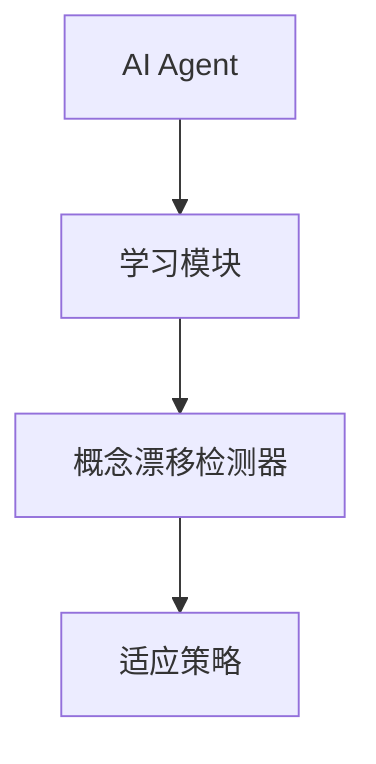
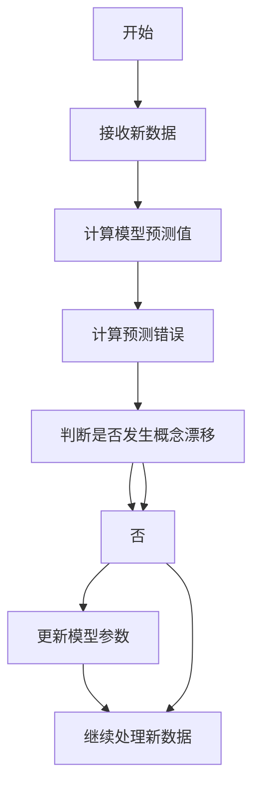
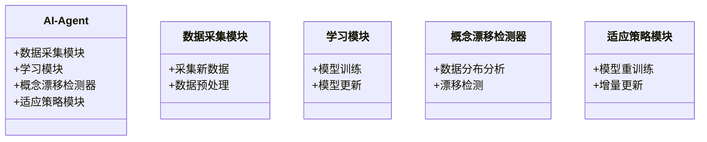
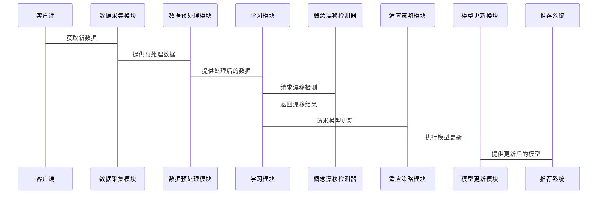

                 


# AI Agent的持续学习与概念漂移适应

> 关键词：AI Agent，持续学习，概念漂移，机器学习，自适应系统

> 摘要：本文深入探讨AI Agent在持续学习环境中的适应能力，特别是如何应对概念漂移的问题。通过分析持续学习的原理、概念漂移的检测与适应机制，结合实际案例和系统设计，本文为AI Agent的开发和应用提供了理论基础和实践指导。

---

# 第一部分: AI Agent的持续学习与概念漂移适应背景介绍

## 第1章: AI Agent与概念漂移概述

### 1.1 AI Agent的基本概念
AI Agent（人工智能代理）是指能够感知环境、自主决策并执行任务的智能实体。它具备以下核心特征：
- **自主性**：能够在没有外部干预的情况下运行。
- **反应性**：能够实时感知环境并做出响应。
- **目标导向**：基于明确的目标执行任务。
- **学习能力**：能够通过经验改进自身性能。

AI Agent的应用场景广泛，包括推荐系统、自动驾驶、智能助手、机器人控制等。

### 1.2 概念漂移的基本概念
概念漂移是指数据分布或任务目标在时间上的变化，导致已训练好的模型性能下降的现象。概念漂移可以分为以下类型：
- **突然漂移**：数据分布突然变化，例如网络攻击模式的改变。
- **逐步漂移**：数据分布逐渐变化，例如用户偏好的缓慢演变。
- **回归漂移**：数据分布回到早期状态，例如周期性变化。

概念漂移对AI模型的影响主要体现在模型预测准确率下降、决策失误等方面。

### 1.3 持续学习与概念漂移适应的关联
持续学习是一种机器学习范式，允许模型在新数据上逐步优化性能，而不必重新训练整个模型。概念漂移适应则是指模型能够检测并响应数据分布的变化。两者结合可以提升AI Agent的自适应能力，使其在动态环境中保持高效运行。

### 1.4 本章小结
本章介绍了AI Agent和概念漂移的基本概念，并探讨了持续学习与概念漂移适应的关联。这些内容为后续章节的深入分析奠定了基础。

---

# 第二部分: AI Agent的持续学习与概念漂移适应的核心概念

## 第2章: 持续学习的原理与算法

### 2.1 持续学习的基本原理
持续学习的核心在于模型能够在线处理数据流，逐步更新参数以适应新数据。与传统批量学习相比，持续学习的特点包括：
- **在线性**：模型在接收到新数据时立即更新。
- **记忆性**：模型需要保留之前学习的信息，避免遗忘旧知识。
- **高效性**：模型更新过程需要高效，以应对实时任务。

### 2.2 概念漂移适应的机制
概念漂移适应涉及检测和响应数据分布变化的机制。常用的方法包括：
- **统计检测**：通过统计测试（如卡方检验）检测数据分布的变化。
- **模型检测**：利用模型预测性能的变化来判断概念漂移。
- **在线检测**：实时监控模型预测错误率的变化。

概念漂移适应的策略包括：
- **模型重训练**：当检测到概念漂移时，重新训练模型。
- **增量更新**：逐步调整模型参数，适应新数据。
- **混合策略**：结合模型重训练和增量更新，平衡计算资源和适应速度。

### 2.3 持续学习与概念漂移适应的结合
结合持续学习和概念漂移适应，可以设计出高效的自适应系统。具体方法包括：
- **动态学习率调整**：根据概念漂移的严重程度，动态调整学习率。
- **分段训练**：将数据流分成多个时间段，每个时间段内进行模型更新，适应数据分布的变化。
- **遗忘策略优化**：设计合理的遗忘机制，避免模型在新数据上遗忘重要信息。

### 2.4 核心概念对比表
以下是持续学习与概念漂移适应的核心概念对比：

| 比较维度       | 持续学习                          | 概念漂移适应                  |
|----------------|----------------------------------|-----------------------------|
| 目标           | 在线更新模型参数                  | 检测并响应数据分布变化        |
| 输入           | 流数据                           | 流数据                       |
| 输出           | 更新后的模型参数                  | 适应策略或新模型             |
| 挑战           | 防止遗忘旧知识                    | 高效检测与适应                |

### 2.5 ER实体关系图
以下是AI Agent的持续学习与概念漂移适应的ER实体关系图：



### 2.6 本章小结
本章详细讲解了持续学习和概念漂移适应的原理，并通过对比和图表展示了两者的关系。这为后续的算法设计奠定了基础。

---

# 第三部分: 持续学习与概念漂移适应的算法原理

## 第3章: 持续学习算法的实现

### 3.1 持续学习算法概述
持续学习算法可以分为以下几类：
- **增量学习算法**：仅利用新数据更新模型。
- **任务增量学习算法**：针对新任务进行模型更新。
- **持续增量学习算法**：同时处理多个任务的增量学习。

### 3.2 概念漂移适应算法的设计
概念漂移适应算法的设计需要考虑以下几点：
- **检测方法**：选择合适的统计或模型方法检测概念漂移。
- **适应策略**：根据检测结果，选择重训练或增量更新。
- **评估指标**：使用准确率、召回率等指标评估适应效果。

### 3.3 算法实现的数学模型
以下是一个简单的持续学习模型：

$$ f(x) = w \cdot x + b $$

其中，$w$和$b$是模型参数，$x$是输入数据。

当检测到概念漂移时，模型参数会以一定步长更新：

$$ w_{new} = w + \alpha \cdot \Delta w $$
$$ b_{new} = b + \alpha \cdot \Delta b $$

其中，$\alpha$是学习率，$\Delta w$和$\Delta b$是参数更新量。

### 3.4 算法流程图
以下是持续学习与概念漂移适应的算法流程图：



### 3.5 Python代码实现
以下是实现持续学习和概念漂移适应的Python代码示例：

```python
import numpy as np
from sklearn.linear_model import SGDClassifier

# 初始化模型
model = SGDClassifier()

# 模型更新函数
def update_model(model, X, y, alpha=0.1):
    model.partial_fit(X, y, classes=np.unique(y))
    return model

# 概念漂移检测函数
def detect_drift(X, y, threshold=0.1):
    accuracy = np.mean(model.predict(X) == y)
    return accuracy < (1 - threshold)

# 主循环
while True:
    X_new, y_new = get_new_data()  # 获取新数据
    model = update_model(model, X_new, y_new)
    if detect_drift(X_new, y_new):
        model = train_new_model(model, X_new, y_new)  # 重训练模型
```

### 3.6 本章小结
本章通过数学模型和代码示例，详细讲解了持续学习和概念漂移适应的算法实现。这些内容为后续的系统设计和项目实战提供了理论支持。

---

# 第四部分: 系统分析与架构设计方案

## 第4章: 系统分析与架构设计

### 4.1 问题场景介绍
考虑一个智能推荐系统，用户的行为数据会随时间变化，导致推荐模型需要不断更新。这种场景下，AI Agent需要具备持续学习和概念漂移适应的能力，以提供个性化的推荐服务。

### 4.2 系统功能设计
以下是系统功能设计的领域模型：



### 4.3 系统架构设计
以下是系统架构设计的Mermaid图：


### 4.4 系统接口设计
系统接口设计包括以下部分：
- 数据采集模块接口：用于接收新数据。
- 学习模块接口：用于模型训练和更新。
- 概念漂移检测器接口：用于检测数据分布变化。
- 适应策略模块接口：用于选择模型更新策略。

### 4.5 系统交互流程
以下是系统交互的Mermaid序列图：



### 4.6 本章小结
本章通过系统分析和架构设计，展示了AI Agent在持续学习与概念漂移适应中的实际应用。这为后续的项目实战奠定了基础。

---

# 第五部分: 项目实战

## 第5章: 项目实战

### 5.1 环境安装
项目实战需要以下环境：
- Python 3.8+
- scikit-learn库
- Mermaid图生成工具（可选）

安装命令：
```bash
pip install scikit-learn
```

### 5.2 核心代码实现
以下是项目的核心代码实现：

```python
import numpy as np
from sklearn.linear_model import SGDClassifier
from sklearn.metrics import accuracy_score

class AIAgent:
    def __init__(self):
        self.model = SGDClassifier()
    
    def update_model(self, X, y):
        self.model.partial_fit(X, y, classes=np.unique(y))
        return self.model
    
    def detect_drift(self, X, y, threshold=0.1):
        accuracy = accuracy_score(y, self.model.predict(X))
        return accuracy < (1 - threshold)
    
    def adapt_strategy(self, X, y):
        if self.detect_drift(X, y):
            self.model = SGDClassifier()
            self.model.fit(X, y)
        else:
            self.update_model(X, y)
        return self.model

# 示例用法
agent = AIAgent()
X_new, y_new = get_new_data()  # 获取新数据
agent.adapt_strategy(X_new, y_new)
```

### 5.3 代码解读与分析
- **AIAgent类**：包含模型初始化、模型更新、概念漂移检测和适应策略方法。
- **update_model方法**：使用`partial_fit`进行增量更新。
- **detect_drift方法**：通过准确率判断是否发生概念漂移。
- **adapt_strategy方法**：根据检测结果选择重训练或增量更新。

### 5.4 案例分析
假设我们有一个分类任务，数据分布随时间变化。通过上述代码，AI Agent能够自动检测并适应数据分布的变化，保持分类性能。

### 5.5 项目小结
本章通过实际案例展示了AI Agent在持续学习与概念漂移适应中的应用，帮助读者理解理论与实践的结合。

---

# 第六部分: 最佳实践与小结

## 第6章: 最佳实践与小结

### 6.1 小结
本文系统地探讨了AI Agent的持续学习与概念漂移适应，从理论到实践，详细讲解了相关概念、算法和系统设计。通过案例分析和代码实现，展示了如何在实际应用中提升AI Agent的自适应能力。

### 6.2 注意事项
- **数据质量**：持续学习和概念漂移适应的效果依赖于高质量的数据。
- **模型选择**：根据任务需求选择合适的模型和算法。
- **资源优化**：合理分配计算资源，平衡模型更新频率和性能。

### 6.3 拓展阅读
- 建议读者深入学习持续学习和概念漂移适应的最新研究成果，如《Continual Learning: A Comprehensive Survey》和《Concept Drift Detection and Adaptation: A Comprehensive Survey》。

---

# 作者：AI天才研究院/AI Genius Institute & 禅与计算机程序设计艺术 /Zen And The Art of Computer Programming

---

以上是完整的文章内容，涵盖了从背景介绍到系统设计再到项目实战的全过程。通过清晰的结构和详细的讲解，读者可以全面理解AI Agent的持续学习与概念漂移适应的核心内容。

