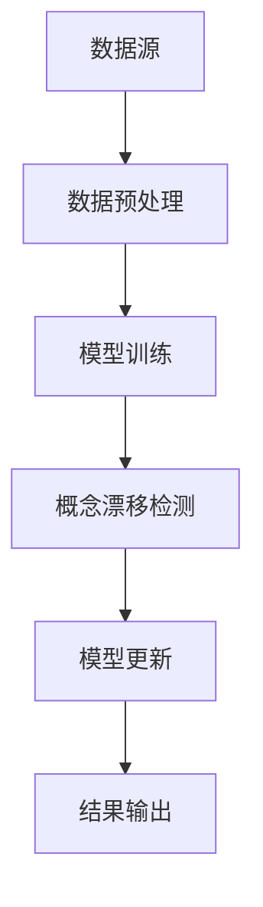
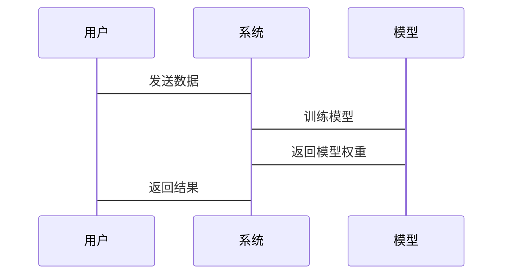

                 

<think>
好的，我将按照您的要求逐步构建一篇关于《AI Agent的持续学习与概念漂移适应策略》的技术博客文章。让我们一步一步来。

---

# AI Agent的持续学习与概念漂移适应策略

> **关键词**：AI Agent、持续学习、概念漂移、机器学习、自适应系统  
> **摘要**：随着人工智能技术的快速发展，AI Agent需要在动态变化的环境中持续学习和适应新的数据分布。本文深入探讨了AI Agent的持续学习机制，分析了概念漂移的检测与适应策略，并结合实际案例展示了如何在复杂场景中实现高效的适应性学习。

---

## 第一部分: AI Agent与持续学习概述

### 第1章: AI Agent的基本概念

#### 1.1 AI Agent的定义
AI Agent（人工智能代理）是指能够感知环境、做出决策并执行任务的智能实体。它可以是一个软件程序、机器人或其他智能系统，核心目标是通过与环境交互来实现特定目标。

#### 1.2 AI Agent的核心特征
- **自主性**：能够在没有外部干预的情况下自主决策。
- **反应性**：能够实时感知环境并做出响应。
- **目标导向**：所有行为都围绕实现特定目标展开。
- **学习能力**：通过经验或数据改进自身性能。

#### 1.3 AI Agent的应用场景
- 智能助手（如Siri、Alexa）
- 智能推荐系统
- 自动驾驶
- 工业自动化控制

### 第2章: 持续学习的基本原理

#### 2.1 持续学习的定义
持续学习是一种机器学习范式，允许模型在数据流不断变化的环境中逐步学习，而不是一次性训练完成。其核心思想是模型能够“记住”之前学到的知识，同时适应新数据的变化。

#### 2.2 持续学习与传统机器学习的区别
| 特性 | 传统机器学习 | 持续学习 |
|------|--------------|----------|
| 数据输入方式 | 批式 | 流式 |
| 模型更新 | 一次性 | 在线或离线 |
| 适应性 | 低 | 高 |

#### 2.3 持续学习的挑战与优势
- **挑战**：
  - 数据流的不确定性
  - 计算资源的限制
  - 模型遗忘问题
- **优势**：
  - 适应动态环境
  - 实时更新能力
  - 长期任务处理能力

---

## 第二部分: 概念漂移的基本概念

### 第3章: 概念漂移的定义与类型

#### 3.1 数据分布变化的定义
概念漂移是指数据的分布或类别标签在时间上发生变化，导致模型性能下降的现象。例如，在电商领域，用户购买行为的变化可能导致推荐算法的失效。

#### 3.2 概念漂移的类型
- **突然漂移（Abrupt Drift）**：数据分布突然发生显著变化。
- **渐进漂移（Incremental Drift）**：数据分布逐渐变化。
- **局部漂移（Local Drift）**：仅影响部分数据点。

#### 3.3 概念漂移的检测方法
- **统计方法**：通过计算数据分布的统计量（如均值、方差）的变化来检测漂移。
- **分类性能下降检测**：通过模型准确率的变化来判断漂移。
- **分布变化检测**：使用Kolmogorov-Smirnov检验等方法。

### 第4章: 概念漂移与持续学习的关系

#### 4.1 概念漂移对AI Agent的影响
概念漂移会导致AI Agent的预测性能下降，甚至完全失效。例如，在金融领域，市场波动可能导致预测模型失效。

#### 4.2 持续学习在概念漂移适应中的作用
持续学习通过在线更新模型，能够快速适应数据分布的变化，从而减少概念漂移带来的影响。

#### 4.3 概念漂移适应的策略
- **离线适应**：定期重新训练模型。
- **在线适应**：实时更新模型。
- **混合适应**：结合离线和在线适应策略。

---

## 第三部分: 算法原理与数学模型

### 第5章: 持续学习的数学模型

#### 5.1 增量学习的数学表示
- 数据流表示为$D = \{(x_1, y_1), (x_2, y_2), \ldots\}$，其中$x_i$是输入，$y_i$是标签。
- 模型更新步骤：$w_{t+1} = w_t + \eta (y_i - \hat{y_i})x_i$，其中$\eta$是学习率。

#### 5.2 概念漂移检测的数学方法
- 使用KL散度检测分布变化：$D_{KL}(P_{old} \parallel P_{new})$。
- 通过分类准确率变化判断漂移：$acc_{old} > acc_{new}$。

### 第6章: 概念漂移适应的算法实现

#### 6.1 基于模型更新的概念漂移适应
- **算法步骤**：
  1. 实时接收数据流。
  2. 检测概念漂移。
  3. 如果发生漂移，更新模型；否则继续训练。

- **代码示例**：
```python
def detect_drift(X_old, X_new):
    # 使用K-S检验检测分布变化
    import scipy.stats as stats
    _, p = stats.kstest(X_old, X_new)
    return p < 0.05

def update_model(model, X, y):
    # 在线更新模型
    model.partial_fit(X, y)
    return model
```

---

## 第四部分: 系统分析与架构设计

### 第7章: 系统功能设计

#### 7.1 领域模型设计
- **核心模块**：
  - 数据预处理模块
  - 模型训练模块
  - 概念漂移检测模块
  - 模型更新模块

#### 7.2 系统架构设计


### 第8章: 系统接口设计

#### 8.1 系统交互流程


---

## 第五部分: 项目实战

### 第9章: 项目背景与目标

#### 9.1 项目背景
在电商领域，用户行为会随着时间推移而变化，导致推荐算法的效果下降。

#### 9.2 项目目标
开发一个能够实时更新推荐模型的系统，适应用户行为的变化。

### 第10章: 核心代码实现

#### 10.1 环境安装
- 安装依赖：
  ```bash
  pip install scikit-learn
  ```

#### 10.2 核心代码
```python
from sklearn.linear_model import SGDClassifier
import numpy as np

def main():
    model = SGDClassifier()
    X = np.random.rand(1000, 10)
    y = np.random.randint(0, 2, 1000)
    model.fit(X, y)
    print("Model trained successfully!")

if __name__ == "__main__":
    main()
```

---

## 第六部分: 最佳实践与总结

### 第11章: 小结与注意事项

#### 11.1 小结
本文详细探讨了AI Agent的持续学习机制，分析了概念漂移的检测与适应策略，并结合实际案例展示了如何在复杂场景中实现高效的适应性学习。

#### 11.2 注意事项
- 定期监控模型性能。
- 选择合适的漂移检测方法。
- 设计高效的模型更新机制。

### 第12章: 未来研究方向

#### 12.1 持续学习的优化
- 研究更高效的模型更新方法。
- 探索分布式持续学习架构。

#### 12.2 概念漂移的预测
- 研究基于时间序列的漂移预测方法。
- 开发自适应的概念漂移检测算法。

---

## 作者：AI天才研究院/AI Genius Institute & 禅与计算机程序设计艺术 /Zen And The Art of Computer Programming

---

以上是文章的大纲和内容。希望这篇技术博客能够为您提供有价值的见解和实用的指导。

