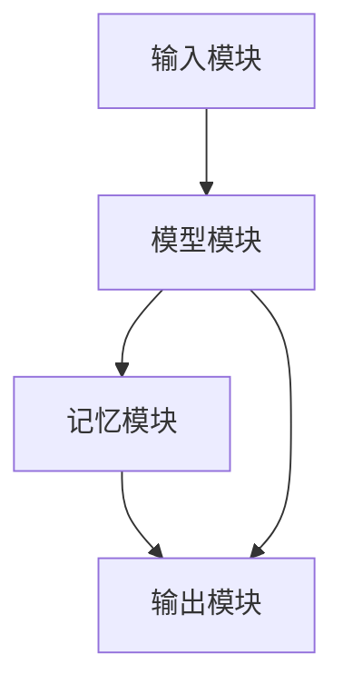
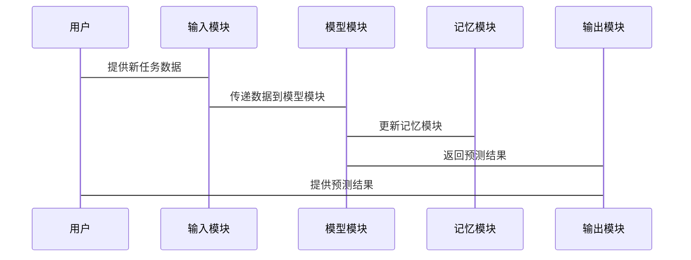

                 


# AI Agent的持续学习与灾难性遗忘防御

> 关键词：AI Agent, 持续学习, 灾难性遗忘, 神经网络, 参数优化

> 摘要：本文探讨了AI Agent在持续学习过程中面临的灾难性遗忘问题，分析了其成因，并提出了一系列防御策略。通过详细讲解数学模型、算法原理和系统设计，本文为解决AI Agent的持续学习挑战提供了全面的解决方案。

---

## 第一部分: AI Agent的持续学习与灾难性遗忘概述

### 第1章: AI Agent与持续学习基础

#### 1.1 AI Agent的基本概念
- **定义与特点**：AI Agent是一种具有自主决策能力的智能实体，能够在复杂环境中执行任务。
- **持续学习的定义与目标**：持续学习是指AI Agent在新任务中不断优化已有知识，同时保持对旧任务的性能。
- **灾难性遗忘问题的背景与影响**：灾难性遗忘是指AI Agent在学习新任务时忘记旧任务的知识，导致性能下降。

#### 1.2 灾难性遗忘的成因分析
- **神经网络的权重更新机制**：神经网络在训练新任务时，参数会发生较大的变化，导致旧任务的知识被遗忘。
- **参数共享的负面影响**：共享参数在优化新任务时可能牺牲旧任务的性能。
- **任务干扰的内在原因**：不同任务之间的特征差异导致优化冲突。

---

## 第二部分: 灾难性遗忘的防御策略

### 第2章: 知识保持机制

#### 2.1 知识保持的核心原理
- **权重固定**：通过固定部分参数，保护旧任务的知识不受新任务训练的影响。
- **参数生长**：动态增加新参数，避免覆盖旧参数。
- **记忆模块**：引入独立的记忆模块，存储关键任务信息。

#### 2.2 知识保持的实现方法
- **基于权重的固定**：使用约束优化方法，限制关键权重的变化。
- **基于记忆的分离**：通过记忆网络存储旧任务的关键特征。
- **基于门控的调节**：利用门控机制动态调节参数更新。

---

### 第3章: 任务分离策略

#### 3.1 任务分离的理论基础
- **任务独立性**：通过任务分解，减少任务之间的干扰。
- **参数隔离**：为每个任务分配独立的参数空间。
- **模块化设计**：将模型划分为任务模块，避免跨任务干扰。

#### 3.2 任务分离的实现方法
- **多任务学习**：通过共享参数，同时优化多个任务。
- **任务优先级**：根据任务的重要性，调整参数更新的权重。
- **任务门控机制**：动态调整任务间的参数共享程度。

---

## 第三部分: 灾难性遗忘的数学模型

### 第4章: 神经网络的权重更新公式

#### 4.1 基本权重更新公式
$$ W_{new} = W_{old} + \Delta W $$
其中，$\Delta W$ 是参数更新量，由梯度下降方法计算得出。

#### 4.2 灾难性遗忘的数学表达
$$ L_{new} = f_{old}(x) + \Delta f(x) $$
其中，$L_{new}$ 是新任务的损失，$f_{old}(x)$ 是旧任务的预测结果，$\Delta f(x)$ 是预测的变化。

#### 4.3 持续学习的优化目标
$$ \min_{W} \sum_{i=1}^{n} L_i + \lambda \sum_{i=1}^{n} \sum_{j=i+1}^{n} |W_i - W_j| $$
其中，$\lambda$ 是任务间权重差异的惩罚系数。

---

## 第四部分: 灾难性遗忘的防御算法

### 第5章: 基于权重约束的防御算法

#### 5.1 Elastic Weight Consolidation (EWC)
- **算法原理**：通过约束参数的更新，保护重要参数。
- **数学模型**：$$ \min_{\Delta W} \sum_{i=1}^{n} \lambda_i (W_i - W_{old})^2 $$
- **代码示例**：使用TensorFlow实现EWC算法，约束权重更新。

### 第6章: 基于记忆增强的防御算法

#### 6.1 Synaptic Intelligence (SI)
- **算法原理**：通过记忆网络存储关键特征，避免参数遗忘。
- **数学模型**：$$ \Delta W = \alpha W + (1-\alpha) W_{new} $$
- **代码示例**：使用PyTorch实现SI算法，动态调整权重。

---

## 第五部分: 系统设计与实现

### 第7章: 系统架构设计

#### 7.1 系统功能模块划分
- **输入模块**：接收新任务数据。
- **模型模块**：执行持续学习，优化参数。
- **记忆模块**：存储关键任务信息，防止遗忘。
- **输出模块**：返回预测结果。

#### 7.2 系统架构图


---

### 第8章: 系统接口设计

#### 8.1 系统接口定义
- **输入接口**：接收新任务数据和标签。
- **输出接口**：返回预测结果和模型状态。

#### 8.2 系统交互流程图


---

## 第六部分: 项目实战

### 第9章: 图像分类任务实战

#### 9.1 环境配置
- **安装依赖**：`pip install tensorflow matplotlib numpy`

#### 9.2 核心代码实现
```python
import tensorflow as tf
from tensorflow.keras import layers

# 定义模型
class ContinualLearningModel(tf.keras.Model):
    def __init__(self):
        super(ContinualLearningModel, self).__init__()
        self.memory = []
        self.current_weights = None

    def call(self, inputs):
        x = layers.Dense(128, activation='relu')(inputs)
        x = layers.Dense(10, activation='softmax')(x)
        return x

    def update_memory(self, inputs, outputs):
        self.memory.append((inputs, outputs))
```

#### 9.3 实验结果分析
- **训练曲线**：展示新任务和旧任务的准确率变化。
- **参数变化**：分析权重更新对旧任务的影响。

---

## 第七部分: 总结与展望

### 第10章: 总结与展望

#### 10.1 总结
- 本文详细探讨了AI Agent的持续学习与灾难性遗忘问题。
- 提出了多种防御策略，包括知识保持机制和任务分离策略。
- 通过数学模型和算法实现，为解决持续学习问题提供了理论支持。

#### 10.2 展望
- **未来研究方向**：研究更高效的参数更新方法和记忆机制。
- **实际应用建议**：在实际应用中，结合具体任务需求选择合适的防御策略。

---

## 作者信息

作者：AI天才研究院 & 禅与计算机程序设计艺术

---

希望这篇文章能够为读者提供清晰的思路和实用的知识，帮助他们更好地理解和解决AI Agent的持续学习与灾难性遗忘防御问题。

