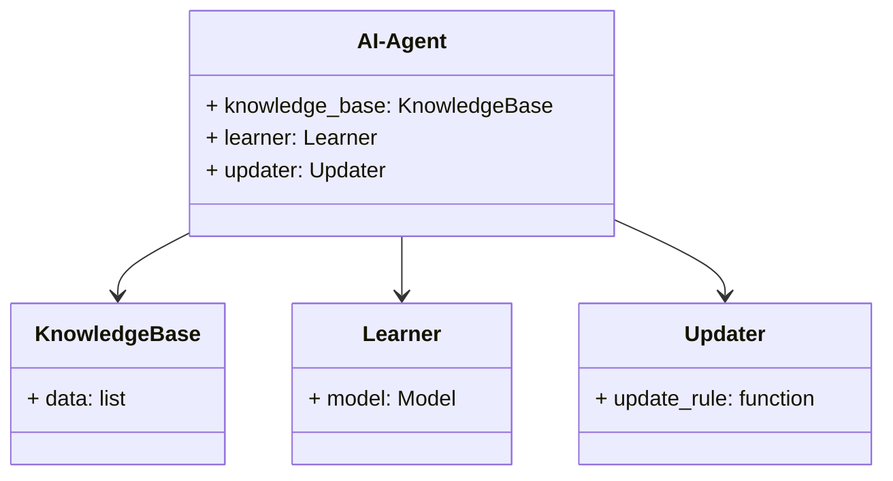
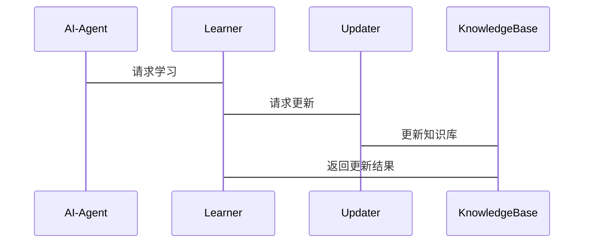

                 


# AI Agent的持续学习与知识更新策略

## 关键词：AI Agent, 持续学习, 知识更新, 算法原理, 系统架构设计, 项目实战

## 摘要：  
AI Agent作为一种能够感知环境、自主决策并执行任务的智能体，其核心能力在于能够持续学习和更新知识，以适应不断变化的环境和任务需求。本文将深入探讨AI Agent的持续学习与知识更新策略，分析其核心机制、算法原理、系统架构设计，并通过实际案例展示如何实现高效的持续学习与知识更新。文章最后总结了最佳实践和未来研究方向，为读者提供全面的指导和参考。

---

## 第1章: AI Agent的持续学习与知识更新背景

### 1.1 AI Agent的基本概念
#### 1.1.1 AI Agent的定义与特点  
AI Agent（人工智能代理）是一种能够感知环境、自主决策并执行任务的智能实体。其特点包括自主性、反应性、目标导向性和社交能力。AI Agent能够通过与环境交互，动态调整自身行为以实现目标。

#### 1.1.2 持续学习的必要性  
AI Agent在动态环境中工作时，需要不断适应新的信息和任务。持续学习是其保持竞争力和高效性的关键能力，能够帮助其在复杂环境中做出最优决策。

#### 1.1.3 知识更新的背景与挑战  
随着环境的变化，AI Agent的知识库可能过时或不完整。知识更新是确保AI Agent保持最新信息和能力的关键，但面临数据质量、计算效率和模型泛化能力等挑战。

### 1.2 持续学习与知识更新的背景  
#### 1.2.1 AI Agent在动态环境中的应用  
AI Agent在多个领域（如自动驾驶、智能助手、机器人）中广泛应用，但动态环境要求其具备持续学习和知识更新的能力。

#### 1.2.2 知识更新的驱动因素  
知识更新的驱动因素包括环境变化、任务需求变化、数据多样性等。AI Agent需要能够识别这些变化，并主动更新知识库。

#### 1.2.3 持续学习的现状与趋势  
持续学习技术正在快速发展，但仍然面临数据效率、模型容量和计算资源等方面的挑战。未来研究将更多关注高效、可解释的持续学习方法。

### 1.3 问题背景与目标  
#### 1.3.1 问题背景分析  
AI Agent在动态环境中工作时，需要不断更新知识库以应对新任务和环境变化。传统一次性训练方法无法满足需求，因此需要持续学习和知识更新。

#### 1.3.2 问题目标的设定  
本文旨在探讨AI Agent的持续学习与知识更新策略，分析其核心机制、算法原理和系统架构设计，提供实际应用的指导。

#### 1.3.3 边界与外延  
本文的边界包括AI Agent的知识更新机制和持续学习算法，不涉及其低级感知和决策能力。外延则扩展到相关领域，如强化学习和迁移学习。

### 1.4 核心概念与联系  
#### 1.4.1 核心概念的结构  
核心概念包括持续学习、知识更新、增量学习、知识蒸馏等。

#### 1.4.2 核心概念的属性特征对比  
| 概念 | 属性 | 特征 |
|------|------|------|
| 持续学习 | 数据 | 增量数据 |
| 知识更新 | 方法 | 增量学习、知识蒸馏 |
| 知识表示 | 形式 | 符号化、概率化 |

#### 1.4.3 ER实体关系图架构  
```mermaid
er
actor: AI Agent
action: 知识更新
object: 知识库
```

---

## 第2章: AI Agent持续学习与知识更新的核心机制

### 2.1 持续学习的原理  
#### 2.1.1 增量学习机制  
增量学习通过逐步更新模型参数，适应新数据的变化。其核心在于如何高效利用历史知识，避免灾难性遗忘。

#### 2.1.2 知识蒸馏技术  
知识蒸馏通过教师模型将知识传递给学生模型，帮助学生模型快速学习。教师模型可以是大型预训练模型，学生模型则更轻量化。

#### 2.1.3 知识表示与推理  
知识表示采用符号化或向量化的形式，推理过程通过逻辑推理或概率计算完成。

### 2.2 知识更新的策略  
#### 2.2.1 基于时间的更新策略  
定期更新知识库，适用于环境变化较慢的场景。

#### 2.2.2 基于性能的更新策略  
根据AI Agent的性能表现，动态调整知识更新的频率和范围。

#### 2.2.3 基于反馈的更新策略  
通过用户反馈或任务结果，主动更新相关知识。

### 2.3 核心概念的联系与对比  
#### 2.3.1 核心概念的原理分析  
持续学习和知识更新是相辅相成的过程。持续学习提供增量数据处理能力，知识更新确保知识库的准确性。

#### 2.3.2 核心概念的属性特征对比  
| 概念 | 增量学习 | 知识蒸馏 |
|------|----------|----------|
| 方法 | 参数更新 | 知识传递 |
| 优势 | 高效 | 可解释 |

#### 2.3.3 ER实体关系图架构  
```mermaid
er
actor: AI Agent
action: 知识更新
object: 知识库
```

---

## 第3章: 持续学习与知识更新的算法原理

### 3.1 算法原理概述  
#### 3.1.1 增量学习算法  
增量学习算法通过逐步更新模型参数，适应新数据的变化。其数学模型如下：

$$
\theta_{t+1} = \theta_t + \eta \cdot \Delta \theta
$$

其中，$\theta_t$ 是当前参数，$\eta$ 是学习率，$\Delta \theta$ 是参数更新量。

#### 3.1.2 知识蒸馏算法  
知识蒸馏算法通过教师模型将知识传递给学生模型。教师模型的输出作为软标签，学生模型通过最小化预测概率的差异进行学习。

$$
L = -\sum_{i} y_{\text{teacher}}^{(i)} \log y_{\text{student}}^{(i)}
$$

#### 3.1.3 知识表示与推理算法  
知识表示采用向量化的形式，推理过程通过矩阵乘法完成。

### 3.2 算法的数学模型与公式  
#### 3.2.1 增量学习的数学模型  
增量学习的更新规则如下：

$$
\theta_{t+1} = \theta_t + \eta (x_{\text{new}} - \theta_t)
$$

#### 3.2.2 知识蒸馏的数学模型  
知识蒸馏的损失函数如下：

$$
L = \sum_{i} (y_{\text{true}}^{(i)} - y_{\text{pred}}^{(i)})^2
$$

### 3.3 算法的实现与优化  
#### 3.3.1 算法实现的步骤  
1. 初始化模型参数$\theta_0$。
2. 输入增量数据$x_{\text{new}}$。
3. 更新参数$\theta_{t+1} = \theta_t + \eta (x_{\text{new}} - \theta_t)$。

#### 3.3.2 优化策略  
通过调整学习率$\eta$和动量项，加速收敛。

---

## 第4章: 系统分析与架构设计方案

### 4.1 问题场景介绍  
AI Agent需要在动态环境中执行任务，其知识库需要定期更新。

### 4.2 项目介绍  
设计一个支持持续学习的AI Agent系统，能够实时更新知识库。

### 4.3 系统功能设计  
#### 4.3.1 领域模型类图  


#### 4.3.2 系统架构设计  


#### 4.3.3 系统接口设计  
AI Agent通过API接口与外部环境交互，接收新数据并更新知识库。

#### 4.3.4 系统交互流程  


---

## 第5章: 项目实战

### 5.1 环境安装  
安装Python和相关库（如TensorFlow、Keras）。

### 5.2 系统核心实现源代码  
```python
class AIAgent:
    def __init__(self):
        self.knowledge_base = KnowledgeBase()
        self.learner = Learner()
        self.updater = Updater()

    def update_knowledge(self, data):
        self.updater.update(self.knowledge_base, data)
        self.learner.train(self.knowledge_base.data)
```

### 5.3 代码应用解读与分析  
AI Agent通过Updater更新知识库，通过Learner进行训练。

### 5.4 实际案例分析  
通过具体案例展示AI Agent如何更新知识库并执行任务。

### 5.5 项目小结  
总结项目实现的关键点和经验教训。

---

## 第6章: 最佳实践

### 6.1 小结  
持续学习和知识更新是AI Agent的重要能力，本文详细探讨了其实现策略和方法。

### 6.2 注意事项  
数据质量、模型容量和计算资源是实现持续学习的关键因素。

### 6.3 拓展阅读  
推荐阅读相关领域的论文和书籍。

---

## 作者：AI天才研究院 & 禅与计算机程序设计艺术  
本文由AI天才研究院撰写，转载请注明出处。

