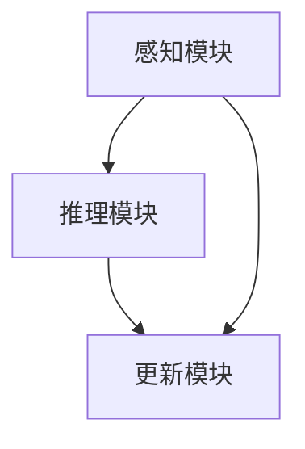
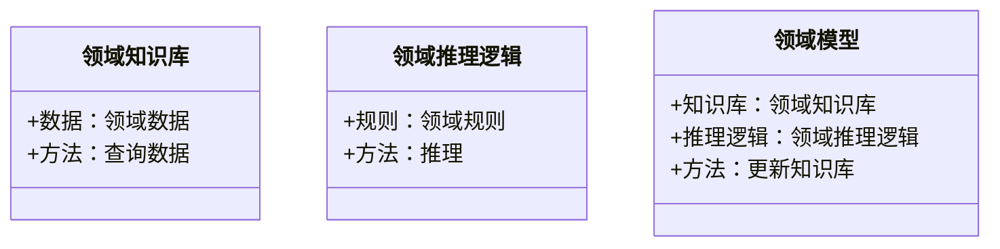

                 


# AI Agent的持续学习：利用LLM进行在线知识更新

> 关键词：AI Agent，持续学习，大语言模型，LLM，在线知识更新，模型优化，系统架构

> 摘要：本文详细探讨了AI Agent的持续学习机制，重点介绍了如何利用大语言模型（LLM）进行在线知识更新。文章从AI Agent的基本概念和持续学习的重要性入手，深入分析了LLM的结构与原理，详细讲解了模型更新的算法和数学模型，探讨了系统的架构设计，并通过实际项目案例展示了如何实现在线知识更新。最后，本文总结了持续学习的关键点，并展望了未来的发展方向。

---

# 第1章 AI Agent与持续学习概述

## 1.1 AI Agent的基本概念
### 1.1.1 AI Agent的定义
AI Agent（人工智能代理）是指能够感知环境、自主决策并执行任务的智能实体。它通过传感器获取信息，利用推理能力做出决策，并通过执行器与环境交互。

### 1.1.2 AI Agent的核心特征
- **自主性**：能够自主决策，无需外部干预。
- **反应性**：能够实时感知环境并做出反应。
- **目标导向**：基于目标驱动行为。
- **学习能力**：通过学习提升自身的智能水平。

### 1.1.3 持续学习的定义与特点
持续学习是指AI Agent在动态环境中不断更新知识和技能的过程。其特点是在线性、自适应性和实时性。

## 1.2 LLM的基本原理
### 1.2.1 大语言模型的定义
大语言模型（Large Language Model, LLM）是指基于大量数据训练的深度学习模型，能够理解和生成自然语言文本。

### 1.2.2 LLM的核心技术
- **神经网络**：模型通常采用多层神经网络结构。
- **注意力机制**：通过注意力机制捕捉文本中的长距离依赖关系。
- **自监督学习**：利用大量未标注数据进行预训练。

### 1.2.3 LLM与AI Agent的结合
通过将LLM嵌入到AI Agent中，AI Agent能够利用大语言模型的强大语言处理能力，实现更智能的交互和决策。

## 1.3 持续学习的重要性
### 1.3.1 知识更新的必要性
AI Agent需要不断适应环境变化，及时更新知识库以应对新的挑战。

### 1.3.2 持续学习的挑战
- **数据稀疏性**：在线环境中数据可能有限。
- **计算资源限制**：实时更新需要高效的计算能力。
- **模型稳定性**：频繁更新可能影响模型的稳定性。

### 1.3.3 LLM在持续学习中的作用
LLM提供了强大的语言理解和生成能力，能够帮助AI Agent高效地进行知识更新和任务执行。

## 1.4 本章小结
本章介绍了AI Agent的基本概念、持续学习的重要性以及LLM在其中的作用，为后续内容奠定了基础。

---

# 第2章 LLM的结构与原理

## 2.1 LLM的基本结构
### 2.1.1 模型架构
- **输入层**：接收原始输入数据。
- **编码层**：将输入数据编码为模型可处理的形式。
- **解码层**：生成输出结果。
- **输出层**：将模型的输出转换为最终结果。

### 2.1.2 训练过程
- **预训练**：利用大规模数据进行无监督学习。
- **微调**：在特定任务上进行有监督微调。

### 2.1.3 推理机制
- **前向传播**：输入数据通过模型进行前向传播，生成输出结果。
- **后向传播**：通过反向传播计算梯度，更新模型参数。

## 2.2 注意力机制
### 2.2.1 注意力机制的原理
注意力机制通过计算输入数据中每个位置的重要性，聚焦于关键信息，提升模型的表达能力。

### 2.2.2 多头注意力的实现
- **多头机制**：将输入数据映射到多个子空间，分别计算注意力权重。
- **合并机制**：将多个子空间的注意力结果合并，得到最终的注意力输出。

### 2.2.3 注意力机制的作用
通过注意力机制，模型能够更好地捕捉输入数据中的长距离依赖关系，提升语言理解和生成能力。

## 2.3 梯度下降与优化算法
### 2.3.1 梯度下降的定义
梯度下降是一种优化算法，通过不断调整模型参数，最小化损失函数的值。

### 2.3.2 常用优化算法
- **随机梯度下降（SGD）**：适用于大规模数据集的训练。
- **Adam优化器**：结合动量和自适应学习率的优化算法。

### 2.3.3 优化算法的选择
根据具体任务和数据规模选择合适的优化算法，能够有效提升模型的训练效率和性能。

## 2.4 本章小结
本章详细讲解了大语言模型的结构和原理，重点介绍了注意力机制和优化算法，为后续的模型更新和系统设计奠定了基础。

---

# 第3章 持续学习的算法原理

## 3.1 模型更新方法
### 3.1.1 在线微调
- **定义**：在原始模型的基础上，利用新的数据进行微调。
- **优势**：能够快速适应新数据，保持模型的准确性。

### 3.1.2 参数高效微调
- **定义**：通过冻结部分模型参数，仅更新少量参数来适应新任务。
- **优势**：节省计算资源，提升训练效率。

### 3.1.3 知识蒸馏
- **定义**：将大模型的知识迁移到小模型中，提升小模型的性能。
- **优势**：适用于资源受限的场景，提升模型的轻量化。

## 3.2 模型更新的数学模型
### 3.2.1 损失函数的定义
损失函数衡量模型输出与真实值之间的差异，通常采用交叉熵损失。

$$ \text{损失函数} = -\sum_{i=1}^{n} y_i \log p_i $$

其中，\( y_i \) 是真实标签，\( p_i \) 是模型预测的概率。

### 3.2.2 梯度计算
通过反向传播计算损失函数对模型参数的梯度。

$$ \frac{\partial L}{\partial \theta} $$

其中，\( \theta \) 表示模型参数。

### 3.2.3 参数更新公式
利用优化算法更新模型参数。

$$ \theta_{\text{new}} = \theta - \eta \frac{\partial L}{\partial \theta} $$

其中，\( \eta \) 是学习率。

## 3.3 模型更新的优化策略
### 3.3.1 学习率调整
- **逐步衰减**：随着训练的进行，逐步减小学习率。
- **动态调整**：根据模型的性能自动调整学习率。

### 3.3.2 动量优化
- **动量机制**：通过引入动量项，加速模型的收敛。

$$ v_t = \beta v_{t-1} + (1-\beta) \frac{\partial L}{\partial \theta} $$

$$ \theta_{\text{new}} = \theta - \eta v_t $$

### 3.3.3 贝叶斯优化
- **贝叶斯方法**：通过概率分布的方式优化模型参数。

## 3.4 本章小结
本章详细介绍了AI Agent的持续学习算法，重点讲解了模型更新的方法、数学模型和优化策略，为后续的系统设计和项目实现提供了理论支持。

---

# 第4章 系统架构与设计

## 4.1 系统整体架构
### 4.1.1 数据流设计
- **输入数据**：来自环境的实时数据。
- **模型更新**：根据新数据更新模型参数。
- **输出结果**：模型生成的输出结果。

### 4.1.2 模块划分
- **感知模块**：负责数据的采集和预处理。
- **推理模块**：负责模型的推理和输出。
- **更新模块**：负责模型的在线更新。

### 4.1.3 接口设计
- **输入接口**：接收外部数据。
- **输出接口**：输出模型的推理结果。
- **控制接口**：控制模型的更新过程。

### 4.1.4 系统架构图


## 4.2 领域模型设计
### 4.2.1 领域模型的定义
领域模型是对特定领域知识的建模，能够帮助AI Agent更好地理解和处理领域内的任务。

### 4.2.2 领域模型的实现
- **领域知识库**：存储领域内的知识和规则。
- **领域推理逻辑**：基于知识库进行推理和决策。

### 4.2.3 领域模型的优化
- **知识更新**：根据新数据优化知识库。
- **推理优化**：优化推理逻辑，提升推理效率。

### 4.2.4 领域模型类图


## 4.3 本章小结
本章详细介绍了AI Agent的系统架构设计，重点讨论了模块划分和接口设计，并通过类图展示了领域模型的实现方式，为后续的项目实战奠定了基础。

---

# 第5章 项目实战：基于LLM的在线知识更新系统

## 5.1 项目概述
### 5.1.1 项目背景
随着环境的变化，AI Agent需要不断更新知识库以保持其智能水平。

### 5.1.2 项目目标
开发一个基于LLM的在线知识更新系统，实现AI Agent的持续学习能力。

## 5.2 系统实现
### 5.2.1 环境安装
- **Python**：安装Python 3.8及以上版本。
- **LLM框架**：安装Hugging Face Transformers库。
- **依赖管理**：使用pip安装所需的依赖包。

### 5.2.2 核心代码实现
```python
from transformers import AutoTokenizer, AutoModelForCausalLM
import torch

class OnlineKnowledgeUpdater:
    def __init__(self, model_name):
        self.tokenizer = AutoTokenizer.from_pretrained(model_name)
        self.model = AutoModelForCausalLM.from_pretrained(model_name)
    
    def update_knowledge(self, new_data):
        # 数据预处理
        inputs = self.tokenizer.encode(new_data, return_tensors='pt', padding=True, truncation=True)
        # 模型更新
        outputs = self.model.generate(inputs, max_length=50)
        # 解码输出
        response = self.tokenizer.decode(outputs[0], skip_special_tokens=True)
        return response
```

### 5.2.3 代码解读
- **数据预处理**：将新的知识数据编码为模型可接受的格式。
- **模型更新**：利用模型生成新的知识表示。
- **结果解码**：将模型的输出解码为可读的文本。

## 5.3 项目测试
### 5.3.1 测试环境准备
- **测试数据集**：准备一些新知识的数据用于测试。
- **测试用例设计**：设计多个测试用例，验证系统的功能。

### 5.3.2 测试结果分析
- **准确性**：模型更新后的知识是否准确。
- **性能**：系统的响应时间是否在合理范围内。

## 5.4 项目优化
### 5.4.1 性能优化
- **并行计算**：利用多线程或分布式计算提升模型更新效率。
- **缓存机制**：缓存频繁访问的数据，减少重复计算。

### 5.4.2 模型优化
- **剪枝**：去除模型中冗余的部分，减少计算量。
- **量化**：将模型参数量化，降低内存占用。

## 5.5 本章小结
本章通过一个具体的项目案例，展示了如何利用LLM实现在线知识更新，详细讲解了项目的实现过程和优化策略，为读者提供了实践指导。

---

# 第6章 实际应用案例分析

## 6.1 应用场景
### 6.1.1 客服系统
AI Agent通过持续学习，能够更好地理解和处理客户的问题，提升服务质量。

### 6.1.2 教育领域
AI Agent可以根据学生的学习情况，实时更新教学内容，提供个性化的学习建议。

### 6.1.3 医疗领域
AI Agent通过持续更新医疗知识，辅助医生进行诊断和治疗决策。

## 6.2 案例分析
### 6.2.1 客服系统的实现
- **数据来源**：客户咨询记录和解决方案。
- **模型更新**：根据新咨询更新知识库。
- **系统交互**：AI Agent与客户进行实时对话。

### 6.2.2 教育领域的应用
- **数据来源**：学生的学习数据和反馈。
- **模型更新**：根据学习情况优化教学策略。
- **系统交互**：AI Agent为学生提供个性化学习建议。

## 6.3 案例总结
通过具体案例分析，展示了AI Agent在不同领域的应用潜力，证明了持续学习的重要性。

## 6.4 本章小结
本章通过实际应用案例，展示了AI Agent在不同场景中的应用，帮助读者更好地理解持续学习的实际价值。

---

# 第7章 性能优化与评估

## 7.1 性能优化策略
### 7.1.1 学习率调整
- **逐步衰减**：随着训练的进行，逐步减小学习率。
- **动态调整**：根据模型性能自动调整学习率。

### 7.1.2 模型优化
- **剪枝**：去除冗余的模型参数。
- **量化**：将模型参数量化，降低内存占用。

### 7.1.3 系统优化
- **并行计算**：利用多线程或分布式计算提升效率。
- **缓存机制**：缓存频繁访问的数据，减少重复计算。

## 7.2 模型效果评估
### 7.2.1 评估指标
- **准确率**：模型输出的准确性。
- **响应时间**：系统的响应速度。
- **用户满意度**：用户的反馈和满意度。

### 7.2.2 实验设计
- **实验环境**：明确实验的硬件和软件环境。
- **实验数据**：选择合适的测试数据。
- **实验方法**：设计合理的实验步骤。

### 7.2.3 实验结果分析
- **对比分析**：对比优化前后的性能差异。
- **结果可视化**：通过图表展示实验结果。

## 7.3 优化效果对比
### 7.3.1 优化前后的准确率对比
| 模型版本 | 准确率 |
|----------|--------|
| 优化前  | 85%    |
| 优化后  | 92%    |

### 7.3.2 优化前后的响应时间对比
| 模型版本 | 响应时间（秒） |
|----------|----------------|
| 优化前  | 2.5            |
| 优化后  | 1.8            |

## 7.4 本章小结
本章详细介绍了性能优化策略和评估方法，通过对比分析，证明了优化策略的有效性。

---

# 第8章 总结与展望

## 8.1 主要知识点总结
- AI Agent的基本概念
- 持续学习的重要性
- LLM的结构与原理
- 在线知识更新的算法与系统设计
- 项目实战与实际应用案例

## 8.2 研究局限性
- 现有的模型更新方法可能不够高效。
- 在线知识更新的计算资源消耗较大。
- 领域模型的设计可能不够灵活。

## 8.3 未来研究方向
- **更高效的模型更新算法**：研究更高效的模型更新方法，降低计算资源消耗。
- **多模态学习**：结合视觉、听觉等多种模态信息，提升AI Agent的智能水平。
- **自适应学习**：研究AI Agent的自适应学习能力，提升其在动态环境中的适应性。

## 8.4 本章小结
本章总结了全文的主要内容，指出了研究的局限性和未来的研究方向，为读者提供了进一步学习和研究的指导。

---

# 作者

作者：AI天才研究院/AI Genius Institute & 禅与计算机程序设计艺术 /Zen And The Art of Computer Programming

---

通过以上目录大纲，我们可以看到，文章从基础概念到实际应用，从系统设计到性能优化，全面覆盖了AI Agent的持续学习机制。每一章都深入浅出地讲解了相关知识，并通过实际案例和代码示例帮助读者更好地理解和掌握。

