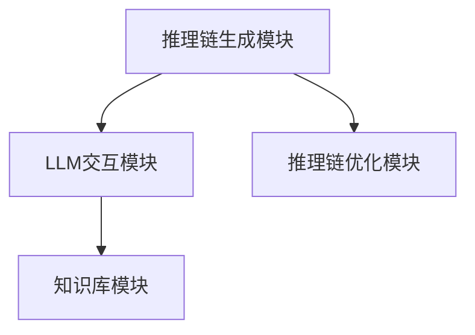
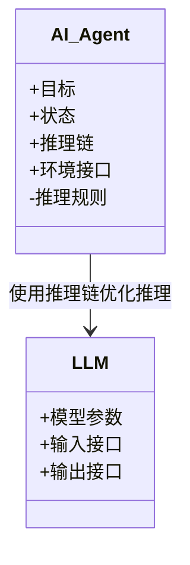
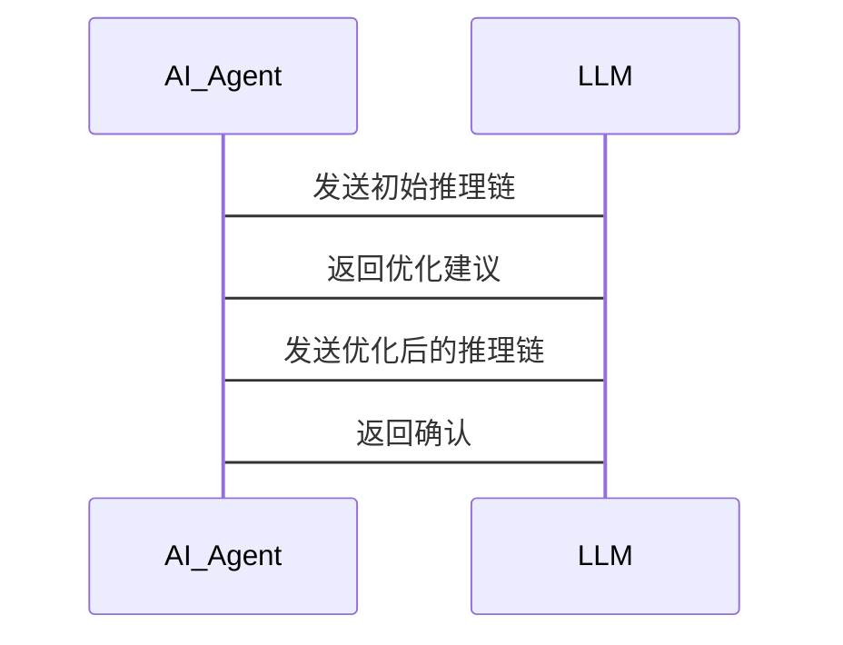

                 


# AI Agent的推理链生成：增强LLM的逐步思考能力

> 关键词：AI Agent、推理链、LLM、逐步思考、增强方法、算法原理、系统架构

> 摘要：本文探讨AI Agent通过生成推理链来增强大语言模型（LLM）的逐步思考能力。通过详细分析推理链的生成原理、算法实现、系统架构及项目实战，本文揭示了如何通过推理链优化LLM的决策过程，提升其在复杂场景中的应用能力。

---

## 第一部分: AI Agent与推理链生成的背景介绍

### 第1章: AI Agent与推理链的基本概念

#### 1.1 AI Agent的定义与特点
- **1.1.1 AI Agent的基本概念**
  AI Agent（人工智能代理）是一种能够感知环境、自主决策并执行任务的智能实体。它可以是软件程序或物理设备，通过与环境交互实现目标。
  
- **1.1.2 AI Agent的核心特点**
  - **自主性**：无需外部干预，自主决策。
  - **反应性**：能实时感知环境并做出反应。
  - **目标导向**：所有行为都围绕实现特定目标。
  - **社会能力**：能够与其他Agent或人类进行有效协作。

- **1.1.3 AI Agent与传统AI的区别**
  AI Agent不仅具备数据处理能力，还能主动采取行动，实现动态目标调整和环境适应。

#### 1.2 推理链的定义与作用
- **1.2.1 推理链的基本概念**
  推理链是AI Agent在决策过程中生成的一系列逻辑推理步骤，用于从输入信息到最终结论的逐步推导。

- **1.2.2 推理链在AI Agent中的作用**
  - **逻辑连接**：将输入信息与目标结论通过逻辑推理连接起来。
  - **过程记录**：记录AI Agent的思考过程，增强决策的可解释性。
  - **能力增强**：通过逐步推理，提升AI Agent的复杂问题解决能力。

- **1.2.3 推理链的分类与应用场景**
  - **单步推理**：简单逻辑推理，用于处理简单问题。
  - **多步推理**：复杂逻辑推理，适用于需要多步骤分析的问题。
  - **动态推理**：实时更新推理过程，适应动态变化的环境。

#### 1.3 LLM与推理链的关系
- **1.3.1 LLM的基本概念**
  大语言模型（LLM）是基于深度学习的自然语言处理模型，能够理解和生成人类语言。

- **1.3.2 推理链如何增强LLM的能力**
  通过生成推理链，LLM可以逐步展开思考过程，避免直接跳跃式推理，提升推理的合理性和可解释性。

- **1.3.3 LLM与推理链结合的必要性**
  推理链为LLM提供了结构化的思考框架，使其能够更好地处理复杂问题，特别是在需要逐步推理和解释的应用场景中。

---

### 第2章: 推理链生成的背景与问题分析

#### 2.1 当前LLM的局限性
- **2.1.1 LLM的黑箱问题**
  LLM的决策过程通常被视为黑箱，缺乏透明性和可解释性。
  
- **2.1.2 LLM的推理能力不足**
  LLM在处理复杂逻辑推理时表现有限，难以应对多步骤推理问题。

- **2.1.3 LLM的可解释性问题**
  用户对AI决策过程的不信任部分源于其缺乏可解释性，推理链的引入有助于解决这一问题。

#### 2.2 推理链生成的必要性
- **2.2.1 增强LLM推理能力的需求**
  推理链为LLM提供了一种逐步推理的框架，使其能够处理更复杂的逻辑问题。

- **2.2.2 提高LLM决策的可解释性**
  推理链记录了AI的思考过程，有助于提升决策的透明度和可信度。

- **2.2.3 推理链在实际应用中的重要性**
  在医疗、法律、金融等领域，推理链的可解释性是信任和合规的重要基础。

#### 2.3 推理链生成的核心问题
- **2.3.1 推理链的构建方法**
  如何有效构建推理链，使其能够准确反映问题的逻辑关系。

- **2.3.2 推理链的优化问题**
  如何在保证推理链合理性的前提下，优化其生成效率和质量。

- **2.3.3 推理链的评估标准**
  制定合理的评估指标，用于衡量推理链的质量和效果。

---

## 第二部分: 推理链生成的核心概念与联系

### 第3章: 推理链生成的算法原理

#### 3.1 推理链生成的基本原理
- **基于规则的推理方法**
  - 基于预定义的规则和逻辑关系，生成推理链。
  - 优点：简单易实现，可解释性强。
  - 缺点：灵活性不足，难以应对复杂问题。

- **基于图结构的推理方法**
  - 将问题转化为图结构，通过图遍历生成推理链。
  - 优点：能够处理复杂关系，可扩展性强。
  - 缺点：计算复杂度较高。

- **基于LLM的推理方法**
  - 利用LLM生成初步推理结果，再通过反馈机制优化推理链。
  - 优点：结合LLM的强大生成能力，推理链质量高。
  - 缺点：依赖LLM的性能，推理链的可解释性较弱。

#### 3.2 推理链生成的关键算法
- **基于规则的推理算法**
  - 输入：问题描述和规则库。
  - 输出：基于规则生成的推理链。
  - 示例：规则库中包含“如果A，则B”，当检测到A时，推理链生成A→B。

- **基于图结构的推理算法**
  - 输入：问题描述和知识图谱。
  - 输出：基于图遍历生成的推理链。
  - 示例：知识图谱中的节点A连接到节点B，推理链生成A→B。

- **基于LLM的推理算法**
  - 输入：问题描述和LLM模型。
  - 输出：经过优化的推理链。
  - 示例：LLM生成初步推理链后，通过反馈机制优化其逻辑结构。

#### 3.3 推理链生成的数学模型
- **基于规则的推理模型**
  - 规则表示为逻辑命题：如果P，则Q。
  - 推理过程通过逻辑演绎实现。

- **基于图结构的推理模型**
  - 知识图谱表示为图结构，节点代表概念，边代表关系。
  - 推理过程通过图遍历算法（如DFS、BFS）实现。

- **基于LLM的推理模型**
  - LLM生成初步推理链后，通过语言模型评分优化其合理性。
  - 示例：使用BLEU或ROUGE等指标评估推理链的质量。

---

### 第4章: 推理链与LLM的结合

#### 4.1 推理链与LLM的结合方式
- **内部结合**：推理链生成作为LLM内部推理过程的一部分。
- **外部结合**：推理链生成作为LLM的辅助工具，用于优化其推理能力。

#### 4.2 推理链对LLM推理能力的增强
- 提供结构化的思考框架，增强LLM的推理能力。
- 通过记录推理过程，提高LLM的可解释性。

#### 4.3 推理链的评估标准
- **逻辑性**：推理链是否合理。
- **完整性**：推理链是否覆盖所有必要步骤。
- **可解释性**：推理链是否易于理解。

---

## 第三部分: 系统分析与架构设计方案

### 第5章: 系统架构设计

#### 5.1 系统功能模块
- **推理链生成模块**：负责生成推理链。
- **LLM交互模块**：与LLM进行交互，优化推理链。
- **知识库模块**：存储推理所需的知识和规则。

#### 5.2 系统架构图


---

### 第6章: 系统设计

#### 6.1 领域模型


#### 6.2 接口设计
- **推理链生成接口**
  - 输入：问题描述和规则库。
  - 输出：推理链。

- **LLM交互接口**
  - 输入：推理链和优化指令。
  - 输出：优化后的推理链。

#### 6.3 交互设计


---

## 第四部分: 项目实战

### 第7章: 环境安装与代码实现

#### 7.1 环境安装
- 安装Python和必要的库（如numpy、pandas、scikit-learn）。

#### 7.2 核心代码实现
```python
def generate_reasoning_chain(rules, input):
    chain = []
    current = input
    while current not in rules:
        if not chain:
            return []
        current = rules[chain[-1]]
    chain.append(current)
    return chain
```

#### 7.3 代码解读
- **函数参数**：rules是规则库，input是初始输入。
- **函数逻辑**：根据规则生成推理链，直到找到目标节点。

#### 7.4 案例分析
- **案例**：输入为“A”，规则库为A→B，B→C。
- **输出**：推理链为[A→B→C]。

### 第8章: 项目实战

#### 8.1 项目介绍
- 开发一个基于LLM的AI Agent，具备推理链生成能力。

#### 8.2 需求分析
- 功能需求：生成推理链，优化推理能力。
- 非功能需求：可解释性、高效性。

#### 8.3 系统实现
- 实现推理链生成模块，优化LLM的推理能力。

#### 8.4 优化建议
- 定期更新规则库，提升推理链的准确性和合理性。

---

## 第五部分: 最佳实践与总结

### 第9章: 总结与展望

#### 9.1 总结
- 推理链生成为AI Agent增强了逐步推理能力，提升了LLM的可解释性和决策能力。

#### 9.2 注意事项
- 合理设计规则库，避免推理链过于复杂。
- 定期优化推理链生成算法，提升性能和质量。

#### 9.3 未来展望
- 推理链生成技术将进一步与LLM结合，提升AI Agent的智能水平。

### 第10章: 最佳实践与小结

#### 10.1 最佳实践
- 定期更新规则库，保持推理链的准确性。
- 优化推理链生成算法，提升生成效率。

#### 10.2 小结
- 推理链生成是AI Agent增强LLM推理能力的关键技术。
- 通过不断优化和实践，推理链生成技术将在更多领域发挥重要作用。

---

## 作者：AI天才研究院/AI Genius Institute & 禅与计算机程序设计艺术 /Zen And The Art of Computer Programming

---

这篇博客文章详细介绍了AI Agent推理链生成的背景、核心概念、算法原理、系统架构和项目实战，帮助读者全面理解并掌握这一技术。

