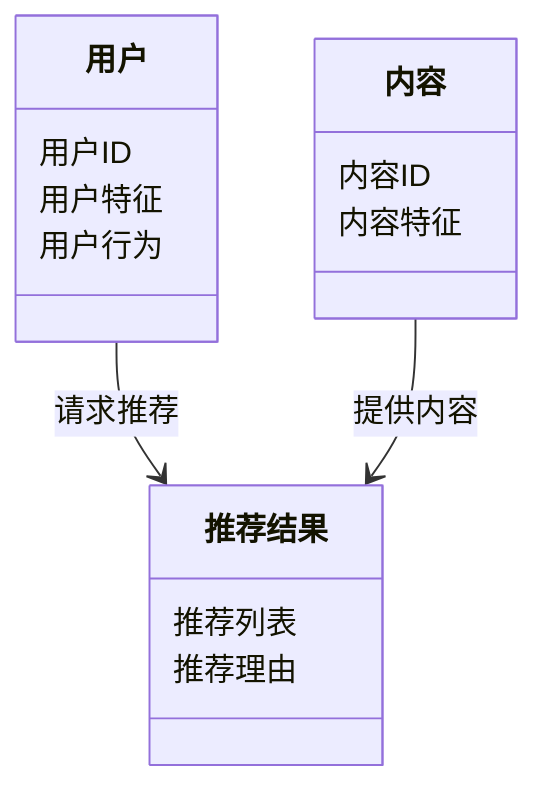
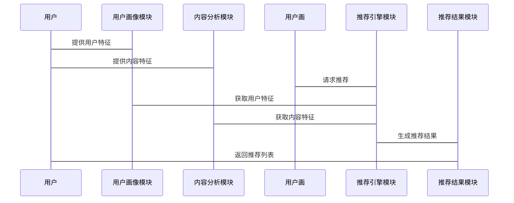

                 


# AI Agent的推荐系统：个性化内容推送

## 关键词：AI Agent，推荐系统，个性化内容推送，协同过滤，深度学习，系统架构设计

## 摘要：  
本文深入探讨了AI Agent在推荐系统中的应用，特别是如何通过个性化内容推送提升用户体验。文章从推荐系统的背景与核心概念出发，详细分析了AI Agent如何增强推荐系统的智能化与个性化能力。通过结合协同过滤、深度学习算法以及系统架构设计，本文为读者提供了一套完整的个性化推荐解决方案。最后，文章还通过项目实战展示了如何实现一个高效的个性化推荐系统。

---

# 第1章: AI Agent与推荐系统概述

## 1.1 问题背景与核心概念

### 1.1.1 个性化内容推送的背景与挑战  
随着互联网的快速发展，用户每天面对的信息量呈指数级增长。如何在海量信息中筛选出用户感兴趣的内容，成为各大平台的核心问题。个性化推荐系统通过分析用户行为、偏好和内容特征，为用户提供高度定制化的信息，从而提升用户体验和平台粘性。

个性化推荐的核心挑战在于如何平衡推荐的精准性与多样性，同时确保推荐过程的实时性和可解释性。传统的推荐系统虽然在一定程度上解决了这些问题，但其效率和精度仍有提升空间，尤其是在面对复杂用户行为和多样化内容类型时。

### 1.1.2 AI Agent的基本概念与功能  
AI Agent（人工智能代理）是一种能够感知环境、执行任务并做出决策的智能实体。在推荐系统中，AI Agent可以扮演多个角色，例如数据采集器、推荐模型训练器、用户行为分析器等。其核心功能包括：  
1. **数据采集**：实时收集用户的交互行为（如点击、收藏、购买等）和内容特征（如文本、标签、类别等）。  
2. **用户建模**：基于收集的数据，构建用户画像和内容表示。  
3. **推荐生成**：通过算法生成个性化推荐结果，并实时调整推荐策略以优化用户体验。  
4. **反馈处理**：根据用户的反馈（如点击、评分）不断优化推荐模型。  

### 1.1.3 推荐系统的核心目标与分类  
推荐系统的最终目标是通过分析用户行为和内容特征，生成高度个性化的推荐列表。根据推荐策略的不同，推荐系统可以分为以下几类：  
1. **基于协同过滤的推荐**：通过分析用户行为相似性，找到与目标用户相似的用户群体，并推荐这些用户喜欢的内容。  
2. **基于内容的推荐**：通过分析内容的特征（如文本、标签等），找到与用户偏好相似的内容进行推荐。  
3. **混合推荐**：结合协同过滤和内容推荐的优点，构建混合推荐模型，以提升推荐的准确性和多样性。  

---

## 1.2 AI Agent在推荐系统中的作用

### 1.2.1 AI Agent的核心能力与优势  
AI Agent在推荐系统中的核心能力体现在以下几个方面：  
1. **实时性**：AI Agent能够实时处理用户行为数据，并根据最新的数据调整推荐策略。  
2. **个性化**：通过深度学习和自然语言处理技术，AI Agent能够更精准地理解和预测用户的偏好。  
3. **自适应性**：AI Agent能够根据用户的反馈动态调整推荐策略，从而提升推荐的准确性和用户满意度。  

### 1.2.2 AI Agent如何提升推荐系统的个性化能力  
AI Agent通过以下方式提升推荐系统的个性化能力：  
1. **多模态数据处理**：AI Agent能够同时处理文本、图像、视频等多种数据类型，从而更全面地理解用户需求。  
2. **上下文感知**：AI Agent能够根据用户的上下文信息（如时间、地点、设备类型等）动态调整推荐策略。  
3. **持续学习**：AI Agent通过在线学习技术，能够不断优化推荐模型，从而提升推荐的精准性。  

### 1.2.3 AI Agent与传统推荐系统的区别  
与传统推荐系统相比，AI Agent的优势体现在以下几个方面：  
1. **智能化**：AI Agent能够通过深度学习技术自动提取数据特征，而传统推荐系统通常依赖人工特征工程。  
2. **实时性**：AI Agent能够实时处理用户行为数据，而传统推荐系统往往需要离线处理数据。  
3. **自适应性**：AI Agent能够根据用户的反馈动态调整推荐策略，而传统推荐系统通常需要重新训练模型才能更新推荐结果。  

---

## 1.3 个性化内容推送的实现方式

### 1.3.1 基于用户行为的推荐  
基于用户行为的推荐是一种常见的推荐方式，其核心思想是通过分析用户的点击、收藏、购买等行为，找到与目标用户行为相似的用户群体，并推荐这些用户喜欢的内容。  

### 1.3.2 基于内容的推荐  
基于内容的推荐是一种通过分析内容特征进行推荐的方法。例如，对于一篇新闻文章，可以通过提取其关键词、主题标签等特征，找到与目标用户兴趣相似的内容进行推荐。  

### 1.3.3 混合推荐模型的实现  
混合推荐模型是一种结合协同过滤和内容推荐的优点，以提升推荐准确性和多样性的方法。例如，可以通过协同过滤找到与目标用户相似的用户群体，同时通过内容推荐找到与目标用户兴趣相似的内容，最终将两者的结果进行融合，生成最终的推荐列表。  

---

## 1.4 本章小结  

本章主要介绍了AI Agent在推荐系统中的应用，重点分析了个性化内容推送的背景、核心概念以及AI Agent在推荐系统中的作用。通过对比传统推荐系统和AI Agent的优势，为后续的算法实现和系统设计奠定了基础。

---

# 第2章: AI Agent推荐系统的核心概念与联系

## 2.1 推荐系统的类型与特点

### 2.1.1 基于协同过滤的推荐系统  
基于协同过滤的推荐系统通过分析用户行为相似性，找到与目标用户相似的用户群体，并推荐这些用户喜欢的内容。  

#### 协同过滤的实现步骤  
1. **数据预处理**：对用户行为数据进行清洗和归一化处理。  
2. **相似度计算**：通过余弦相似度、Jaccard相似度等方法计算用户之间的相似度。  
3. **推荐生成**：根据相似用户的偏好，生成推荐列表。  

#### 协同过滤的优缺点  
- **优点**：推荐结果具有较高的准确性和相关性。  
- **缺点**：计算复杂度较高，且难以处理用户冷启动问题。  

### 2.1.2 基于内容的推荐系统  
基于内容的推荐系统通过分析内容特征进行推荐。例如，对于一篇新闻文章，可以通过提取其关键词、主题标签等特征，找到与目标用户兴趣相似的内容进行推荐。  

#### 内容推荐的实现步骤  
1. **内容特征提取**：通过文本挖掘、自然语言处理等技术提取内容特征。  
2. **相似度计算**：通过余弦相似度等方法计算内容之间的相似度。  
3. **推荐生成**：根据目标用户的兴趣，推荐相似的内容。  

#### 内容推荐的优缺点  
- **优点**：推荐结果具有较高的多样性。  
- **缺点**：推荐结果的准确性和相关性较低。  

### 2.1.3 混合推荐模型的优缺点对比  
混合推荐模型是一种结合协同过滤和内容推荐的优点，以提升推荐准确性和多样性的方法。  

#### 混合推荐模型的实现步骤  
1. **协同过滤推荐**：通过分析用户行为相似性，生成推荐列表。  
2. **内容推荐**：通过分析内容特征，生成推荐列表。  
3. **结果融合**：将两者的结果进行融合，生成最终的推荐列表。  

#### 混合推荐模型的优缺点  
- **优点**：推荐结果具有较高的准确性和多样性。  
- **缺点**：实现复杂度较高。  

---

## 2.2 AI Agent与推荐系统的结合方式

### 2.2.1 AI Agent如何增强推荐系统的个性化能力  
AI Agent通过以下方式增强推荐系统的个性化能力：  
1. **多模态数据处理**：AI Agent能够同时处理文本、图像、视频等多种数据类型，从而更全面地理解用户需求。  
2. **上下文感知**：AI Agent能够根据用户的上下文信息（如时间、地点、设备类型等）动态调整推荐策略。  
3. **持续学习**：AI Agent通过在线学习技术，能够不断优化推荐模型，从而提升推荐的精准性。  

### 2.2.2 AI Agent在推荐系统中的具体应用场景  
AI Agent在推荐系统中的具体应用场景包括：  
1. **个性化新闻推荐**：根据用户的阅读历史和兴趣偏好，推荐相关新闻文章。  
2. **个性化商品推荐**：根据用户的购买历史和浏览行为，推荐相关商品。  
3. **个性化视频推荐**：根据用户的观看历史和偏好，推荐相关视频。  

### 2.2.3 AI Agent与知识图谱的结合  
AI Agent可以通过知识图谱技术，构建一个知识网络，将用户、内容、上下文等信息进行关联，从而进一步提升推荐的准确性和多样性。  

---

## 2.3 推荐系统的核心要素分析

### 2.3.1 用户画像与行为分析  
用户画像是通过分析用户的特征（如年龄、性别、兴趣爱好等）和行为（如点击、收藏、购买等），构建的一个用户行为模型。  

#### 用户画像的实现步骤  
1. **数据收集**：收集用户的基本信息和行为数据。  
2. **特征提取**：通过文本挖掘、聚类分析等技术提取用户特征。  
3. **画像构建**：根据提取的特征，构建用户画像。  

### 2.3.2 内容特征提取与表示  
内容特征提取与表示是通过分析内容的特征（如文本、标签、类别等），将其表示为向量或嵌入。  

#### 内容特征提取的实现步骤  
1. **文本预处理**：对内容进行分词、去停用词等预处理。  
2. **特征提取**：通过TF-IDF、Word2Vec等技术提取内容特征。  
3. **内容表示**：将内容特征表示为向量或嵌入。  

### 2.3.3 推荐算法的可解释性与实时性  
推荐算法的可解释性是指推荐结果能够被用户理解和解释。推荐算法的实时性是指推荐系统能够在用户请求时快速返回推荐结果。  

#### 提升推荐算法可解释性的方法  
1. **基于规则的推荐**：通过制定一些规则，如“推荐点击率高的内容”，实现可解释的推荐。  
2. **可视化推荐结果**：通过可视化的方式展示推荐结果的依据，如相似用户或相似内容的特征。  

#### 提升推荐算法实时性的方法  
1. **离线预计算**：在用户请求推荐之前，预先计算好推荐结果。  
2. **在线计算**：在用户请求推荐时，实时计算推荐结果。  

---

## 2.4 本章小结  

本章主要介绍了AI Agent推荐系统的核心概念与联系，重点分析了推荐系统的类型与特点、AI Agent与推荐系统的结合方式，以及推荐系统的核心要素。通过对比不同推荐方法的优缺点，为后续的算法实现和系统设计奠定了基础。

---

# 第3章: AI Agent推荐系统的算法原理

## 3.1 协同过滤算法

### 3.1.1 基于用户的协同过滤算法  
基于用户的协同过滤算法是通过分析用户行为相似性，找到与目标用户相似的用户群体，并推荐这些用户喜欢的内容。  

#### 基于用户的协同过滤算法的实现步骤  
1. **数据预处理**：对用户行为数据进行清洗和归一化处理。  
2. **相似度计算**：通过余弦相似度、Jaccard相似度等方法计算用户之间的相似度。  
3. **推荐生成**：根据相似用户的偏好，生成推荐列表。  

#### 余弦相似度的计算公式  
$$ \text{相似度} = \frac{\sum_{i=1}^{n} x_i y_i}{\sqrt{\sum_{i=1}^{n} x_i^2} \cdot \sqrt{\sum_{i=1}^{n} y_i^2}} $$  

### 3.1.2 基于物品的协同过滤算法  
基于物品的协同过滤算法是通过分析内容相似性，找到与目标内容相似的内容进行推荐。  

#### 基于物品的协同过滤算法的实现步骤  
1. **数据预处理**：对内容特征数据进行清洗和归一化处理。  
2. **相似度计算**：通过余弦相似度、Jaccard相似度等方法计算内容之间的相似度。  
3. **推荐生成**：根据目标用户的偏好，推荐相似的内容。  

#### Jaccard相似度的计算公式  
$$ \text{相似度} = \frac{|A \cap B|}{|A \cup B|} $$  

### 3.1.3 混合协同过滤算法的实现  
混合协同过滤算法是一种结合基于用户的协同过滤和基于物品的协同过滤的优点，以提升推荐准确性和多样性的方法。  

#### 混合协同过滤算法的实现步骤  
1. **基于用户的协同过滤推荐**：通过分析用户行为相似性，生成推荐列表。  
2. **基于物品的协同过滤推荐**：通过分析内容相似性，生成推荐列表。  
3. **结果融合**：将两者的结果进行融合，生成最终的推荐列表。  

---

## 3.2 基于深度学习的推荐算法

### 3.2.1 神经网络协同过滤算法  
神经网络协同过滤算法是一种基于深度学习的推荐算法，通过构建神经网络模型，学习用户和内容的特征表示，并生成推荐结果。  

#### 神经网络协同过滤算法的实现步骤  
1. **数据预处理**：对用户行为数据和内容特征数据进行清洗和归一化处理。  
2. **模型训练**：通过神经网络模型学习用户和内容的特征表示。  
3. **推荐生成**：根据训练好的模型，生成推荐结果。  

#### 神经网络协同过滤算法的数学模型  
$$ y = \sigma(w_u^T x_u + w_i^T x_i + b) $$  
其中，$w_u$ 和 $w_i$ 是用户和内容的特征权重，$x_u$ 和 $x_i$ 是用户和内容的特征向量，$\sigma$ 是sigmoid函数，$b$ 是偏置项。  

### 3.2.2 基于深度学习的推荐算法的优势  
基于深度学习的推荐算法的优势体现在以下几个方面：  
1. **自动特征提取**：深度学习模型能够自动提取用户和内容的特征，无需人工特征工程。  
2. **非线性关系建模**：深度学习模型能够建模用户和内容之间的非线性关系，从而提升推荐的准确性和多样性。  
3. **实时性**：深度学习模型能够实时处理用户行为数据，生成推荐结果。  

---

## 3.3 本章小结  

本章主要介绍了AI Agent推荐系统的算法原理，重点分析了协同过滤算法和基于深度学习的推荐算法的实现方法和优缺点。通过对比不同算法的性能，为后续的系统设计奠定了基础。

---

# 第4章: AI Agent推荐系统的系统架构设计

## 4.1 问题场景介绍

### 4.1.1 用户需求分析  
用户需求分析是通过分析用户的特征和行为，理解用户的兴趣和偏好。  

#### 用户需求分析的实现步骤  
1. **数据收集**：收集用户的基本信息和行为数据。  
2. **特征提取**：通过文本挖掘、聚类分析等技术提取用户特征。  
3. **需求建模**：根据提取的特征，构建用户需求模型。  

### 4.1.2 业务需求分析  
业务需求分析是通过分析业务目标和约束条件，明确推荐系统的核心功能和性能指标。  

#### 业务需求分析的实现步骤  
1. **目标设定**：明确推荐系统的最终目标，如提升用户点击率、转化率等。  
2. **功能需求**：明确推荐系统的功能模块，如用户画像、内容分析、推荐引擎等。  
3. **性能需求**：明确推荐系统的性能指标，如响应时间、推荐准确率等。  

---

## 4.2 系统功能设计

### 4.2.1 领域模型设计  
领域模型是通过分析用户、内容、推荐等核心概念，构建一个领域模型。  

#### 领域模型设计的实现步骤  
1. **核心概念识别**：识别推荐系统中的核心概念，如用户、内容、推荐结果等。  
2. **关系建模**：通过Mermaid类图展示核心概念之间的关系。  



### 4.2.2 功能模块设计  
功能模块设计是通过分析推荐系统的功能需求，设计功能模块的结构和交互流程。  

#### 功能模块设计的实现步骤  
1. **功能模块划分**：将推荐系统的功能需求划分为功能模块，如用户画像模块、内容分析模块、推荐引擎模块等。  
2. **功能流程设计**：通过Mermaid序列图展示功能模块之间的交互流程。  



---

## 4.3 系统架构设计

### 4.3.1 系统架构设计方法  
系统架构设计方法是通过分析推荐系统的功能需求和性能需求，设计系统的整体架构。  

#### 系统架构设计的实现步骤  
1. **架构划分**：将推荐系统划分为功能模块，如用户画像模块、内容分析模块、推荐引擎模块等。  
2. **架构实现**：通过Mermaid架构图展示系统的整体架构。  

```mermaid
archiecture
    component 用户画像模块 {
        Provides 用户特征
        Requires 用户行为数据
    }
    component 内容分析模块 {
        Provides 内容特征
        Requires 内容数据
    }
    component 推荐引擎模块 {
        Provides 推荐列表
        Requires 用户特征, 内容特征
    }
    component 推荐结果模块 {
        Provides 推荐结果
        Requires 推荐列表
    }
```

### 4.3.2 系统接口设计  
系统接口设计是通过定义模块之间的接口，确保系统的可扩展性和可维护性。  

#### 系统接口设计的实现步骤  
1. **接口定义**：通过定义模块之间的接口，明确模块之间的交互方式。  
2. **接口实现**：通过编写接口实现代码，确保模块之间的交互符合设计要求。  

### 4.3.3 系统交互设计  
系统交互设计是通过设计用户的交互流程，确保推荐系统的用户体验。  

#### 系统交互设计的实现步骤  
1. **交互流程设计**：通过Mermaid序列图展示用户的交互流程。  
2. **交互界面设计**：设计用户与推荐系统之间的交互界面。  

```mermaid
sequenceDiagram
    用户 -> 用户画像模块: 提供用户特征
    用户 -> 内容分析模块: 提供内容特征
    用户 -> 推荐引擎模块: 请求推荐
    推荐引擎模块 -> 用户画 -> 获取用户特征
    推荐引擎模块 -> 内容分析模块: 获取内容特征
    推荐引擎模块 -> 推荐结果模块: 生成推荐结果
    推荐结果模块 -> 用户: 返回推荐列表
```

---

## 4.4 本章小结  

本章主要介绍了AI Agent推荐系统的系统架构设计，重点分析了问题场景、系统功能设计和系统架构设计的方法。通过Mermaid图展示了系统的整体架构和功能模块之间的交互流程，为后续的项目实现奠定了基础。

---

# 第5章: AI Agent推荐系统的项目实战

## 5.1 项目环境安装与配置

### 5.1.1 环境安装  
项目实战需要安装以下环境：  
- Python 3.8以上版本  
- PyTorch 1.9以上版本  
- scikit-learn 0.24以上版本  
- Mermaid图生成工具  

### 5.1.2 环境配置  
安装完成后，需要进行以下配置：  
1. 设置Python环境变量。  
2. 安装所需的第三方库。  

---

## 5.2 项目核心实现

### 5.2.1 数据预处理  
数据预处理是通过清洗和归一化处理用户行为数据和内容特征数据。  

#### 数据预处理的实现步骤  
1. **数据清洗**：去除缺失值、重复值和异常值。  
2. **特征提取**：通过文本挖掘、聚类分析等技术提取用户特征和内容特征。  
3. **数据归一化**：对数据进行归一化处理，确保模型训练的稳定性。  

### 5.2.2 模型训练  
模型训练是通过训练推荐模型，生成用户和内容的特征表示。  

#### 模型训练的实现步骤  
1. **数据加载**：加载预处理后的数据。  
2. **模型构建**：构建神经网络协同过滤模型。  
3. **模型训练**：通过梯度下降等优化算法训练模型。  

#### 神经网络协同过滤模型的Python代码实现  
```python
import torch
import torch.nn as nn
import torch.optim as optim

class NeuralCF(nn.Module):
    def __init__(self, user_dim, item_dim, embed_dim):
        super(NeuralCF, self).__init__()
        self.user_embeddings = nn.Embedding(user_dim, embed_dim)
        self.item_embeddings = nn.Embedding(item_dim, embed_dim)
        self.fc = nn.Linear(embed_dim, 1)
    
    def forward(self, user_id, item_id):
        user_emb = self.user_embeddings(user_id)
        item_emb = self.item_embeddings(item_id)
        output = self.fc(user_emb * item_emb)
        return output.squeeze()

# 模型训练
model = NeuralCF(user_dim, item_dim, embed_dim)
optimizer = optim.Adam(model.parameters(), lr=0.001)
criterion = nn.BCEWithLogitsLoss()

for epoch in range(num_epochs):
    for batch in batches:
        optimizer.zero_grad()
        user_ids, item_ids, labels = batch
        outputs = model(user_ids, item_ids)
        loss = criterion(outputs, labels)
        loss.backward()
        optimizer.step()
```

### 5.2.3 推荐生成  
推荐生成是通过模型生成推荐结果，并返回给用户。  

#### 推荐生成的实现步骤  
1. **模型预测**：通过训练好的模型，生成推荐结果。  
2. **结果排序**：根据推荐结果的评分，对推荐内容进行排序。  
3. **结果输出**：将推荐结果返回给用户。  

---

## 5.3 项目结果评估

### 5.3.1 评估指标设计  
评估指标设计是通过定义推荐系统的评估指标，衡量推荐系统的性能。  

#### 评估指标设计的实现步骤  
1. **指标选择**：选择常用的推荐系统评估指标，如准确率、召回率、F1分数等。  
2. **指标计算**：通过Python代码实现评估指标的计算。  

#### 常用的推荐系统评估指标  
- **准确率（Precision）**：推荐结果中正确推荐的比例。  
- **召回率（Recall）**：推荐结果中被正确推荐的比例。  
- **F1分数（F1 Score）**：准确率和召回率的调和平均数。  

### 5.3.2 项目结果分析  
项目结果分析是通过分析推荐系统的性能，找出优化方向。  

#### 项目结果分析的实现步骤  
1. **结果可视化**：通过可视化工具展示推荐系统的性能指标。  
2. **结果解读**：根据结果解读推荐系统的优缺点，并提出优化建议。  

---

## 5.4 本章小结  

本章主要介绍了AI Agent推荐系统的项目实战，重点分析了项目环境安装、核心实现和结果评估。通过实际案例展示了如何实现一个高效的个性化推荐系统，并通过评估指标分析了系统的性能。

---

# 第6章: AI Agent推荐系统的扩展与优化

## 6.1 推荐系统的可解释性

### 6.1.1 可解释性的重要性  
可解释性是推荐系统的重要性能指标之一，能够帮助用户理解推荐结果的依据。  

### 6.1.2 提升推荐系统可解释性的方法  
1. **可视化推荐结果**：通过可视化的方式展示推荐结果的依据，如相似用户或相似内容的特征。  
2. **基于规则的推荐**：通过制定一些规则，如“推荐点击率高的内容”，实现可解释的推荐。  

---

## 6.2 推荐系统的实时性

### 6.2.1 实时性的重要性  
实时性是推荐系统的重要性能指标之一，能够帮助用户快速获取推荐结果。  

### 6.2.2 提升推荐系统实时性的方法  
1. **离线预计算**：在用户请求推荐之前，预先计算好推荐结果。  
2. **在线计算**：在用户请求推荐时，实时计算推荐结果。  

---

## 6.3 推荐系统的个性化深度

### 6.3.1 个性化深度的重要性  
个性化深度是推荐系统的重要性能指标之一，能够帮助用户获取更精准的推荐结果。  

### 6.3.2 提升推荐系统个性化深度的方法  
1. **多模态数据处理**：通过处理文本、图像、视频等多种数据类型，提升推荐的个性化深度。  
2. **上下文感知**：根据用户的上下文信息（如时间、地点、设备类型等），动态调整推荐策略。  

---

## 6.4 AI Agent与知识图谱的结合

### 6.4.1 知识图谱的基本概念  
知识图谱是一种通过图结构表示知识的技术，能够将用户、内容、上下文等信息进行关联。  

### 6.4.2 AI Agent与知识图谱的结合方式  
AI Agent可以通过知识图谱技术，构建一个知识网络，将用户、内容、上下文等信息进行关联，从而进一步提升推荐的准确性和多样性。  

---

## 6.5 基于强化学习的推荐优化

### 6.5.1 强化学习的基本概念  
强化学习是一种通过试错方法，学习最优策略的技术。  

### 6.5.2 强化学习在推荐系统中的应用  
强化学习可以通过与用户的交互，动态调整推荐策略，从而提升推荐的准确性和多样性。  

---

## 6.6 本章小结  

本章主要介绍了AI Agent推荐系统的扩展与优化，重点分析了推荐系统的可解释性、实时性、个性化深度，以及AI Agent与知识图谱的结合。通过结合强化学习技术，进一步提升了推荐系统的性能。

---

# 第7章: 总结与展望

## 7.1 总结  

本文深入探讨了AI Agent在推荐系统中的应用，特别是如何通过个性化内容推送提升用户体验。文章从推荐系统的背景与核心概念出发，详细分析了AI Agent如何增强推荐系统的智能化与个性化能力。通过结合协同过滤、深度学习算法以及系统架构设计，本文为读者提供了一套完整的个性化推荐解决方案。最后，文章通过项目实战展示了如何实现一个高效的个性化推荐系统，并通过评估指标分析了系统的性能。

---

## 7.2 展望  

未来，AI Agent在推荐系统中的应用将更加广泛和深入。随着深度学习、知识图谱和强化学习等技术的不断发展，推荐系统的智能化和个性化能力将不断提升。同时，推荐系统的可解释性和实时性也将成为未来研究的重要方向。我们期待通过技术的不断进步，为用户提供更加精准和个性化的推荐服务。

---

# 作者：AI天才研究院/AI Genius Institute & 禅与计算机程序设计艺术 /Zen And The Art of Computer Programming

