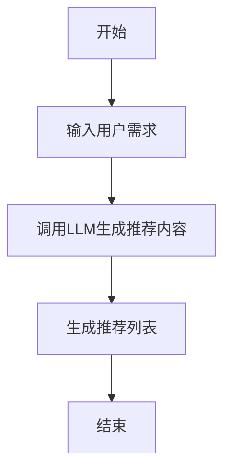
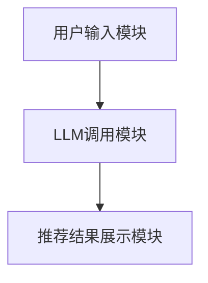
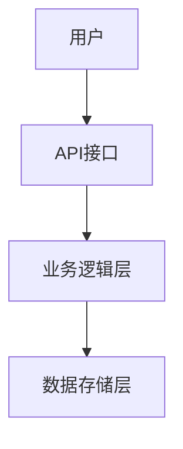
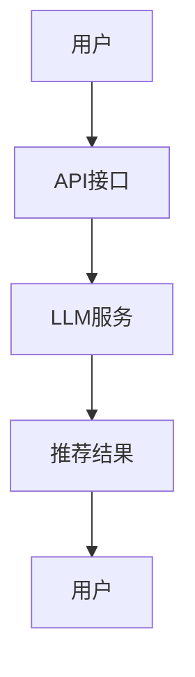

                 


# AI Agent的推荐系统：结合LLM的内容推荐

## 关键词：AI Agent、推荐系统、LLM、生成式推荐、协同过滤、大语言模型

## 摘要：  
本文深入探讨了AI Agent在推荐系统中的应用，特别是结合大语言模型（LLM）进行内容推荐的核心原理和实现方法。文章从AI Agent和推荐系统的背景出发，详细分析了LLM在推荐系统中的角色与优势，结合具体的算法原理、系统架构设计和项目实战，全面阐述了如何利用AI Agent和LLM构建高效的推荐系统。通过实际案例分析和代码实现，本文为读者提供了从理论到实践的完整指南。

---

# 第1章: AI Agent与推荐系统概述

## 1.1 AI Agent的基本概念

### 1.1.1 AI Agent的定义  
AI Agent（人工智能代理）是一种能够感知环境、自主决策并执行任务的智能实体。它通过感知输入信息，利用算法和模型进行分析，输出相应的决策或操作结果。AI Agent的核心目标是通过智能化的处理，为用户提供高效、个性化的服务。

### 1.1.2 AI Agent的核心特征  
- **自主性**：AI Agent能够自主决策，无需人工干预。  
- **反应性**：能够实时感知环境变化并做出响应。  
- **学习能力**：通过数据和经验不断优化自身的决策能力。  
- **交互性**：能够与用户或其他系统进行交互。  

### 1.1.3 AI Agent与传统推荐系统的区别  
传统推荐系统通常基于协同过滤或基于内容的推荐算法，主要依赖于用户行为数据或物品属性数据。而AI Agent推荐系统引入了更强的自主性和学习能力，能够根据实时信息和上下文动态调整推荐策略。

---

## 1.2 推荐系统的定义与分类

### 1.2.1 推荐系统的定义  
推荐系统是一种通过分析用户行为、偏好和数据特征，为用户提供个性化推荐的智能系统。它广泛应用于电商、音乐、影视、社交等领域。

### 1.2.2 推荐系统的分类  
推荐系统主要分为以下几类：  
1. **基于协同过滤的推荐**：通过分析用户行为相似性进行推荐。  
2. **基于内容的推荐**：通过分析物品的特征属性进行推荐。  
3. **基于生成模型的推荐**：利用生成模型生成个性化内容。  
4. **混合推荐模型**：结合多种推荐方法的优势。  

### 1.2.3 推荐系统的应用领域  
- 电商：个性化商品推荐。  
- 音乐/影视：个性化内容推荐。  
- 社交：个性化好友推荐。  
- 教育：个性化学习资源推荐。  

---

## 1.3 AI Agent在推荐系统中的作用

### 1.3.1 AI Agent如何提升推荐系统性能  
AI Agent通过实时感知用户需求和环境变化，动态调整推荐策略，从而提升推荐系统的准确性和实时性。

### 1.3.2 AI Agent在推荐系统中的应用场景  
- **个性化推荐**：根据用户偏好动态生成推荐内容。  
- **实时推荐**：基于实时数据进行推荐。  
- **多模态推荐**：结合文本、图像等多种数据形式进行推荐。  

### 1.3.3 AI Agent与LLM的结合  
AI Agent可以通过调用LLM（大语言模型）来生成高质量的推荐内容，例如文本描述、创意建议或个性化推荐信息。

---

## 1.4 本章小结  
本章从AI Agent和推荐系统的背景出发，介绍了AI Agent的核心特征和推荐系统的分类，重点分析了AI Agent在推荐系统中的作用及其与LLM的结合方式，为后续章节奠定了基础。

---

# 第2章: LLM与推荐系统的结合

## 2.1 LLM的基本原理

### 2.1.1 LLM的定义  
LLM（Large Language Model）是基于大规模数据训练的深度学习模型，能够理解和生成人类语言。常见的LLM包括GPT系列、BERT系列等。

### 2.1.2 LLM的核心技术  
- **自注意力机制**：通过计算输入文本中各个词之间的关系，生成长距离依赖的上下文表示。  
- **解码器结构**：通过逐步生成文本，实现自然语言的生成能力。  

### 2.1.3 LLM的应用场景  
- 文本生成：生成文章、广告、对话等。  
- 问答系统：基于LLM构建智能问答系统。  
- 机器翻译：实现多种语言之间的翻译。  

---

## 2.2 LLM在推荐系统中的应用

### 2.2.1 LLM如何生成推荐内容  
LLM可以根据用户输入的关键词或上下文，生成与推荐内容相关的文本描述或创意建议。

### 2.2.2 LLM在推荐系统中的优势  
- **内容生成能力强**：能够生成高质量的个性化文本。  
- **多模态支持**：可以结合文本、图像等多种数据形式。  
- **动态调整能力**：可以根据实时数据动态生成推荐内容。  

### 2.2.3 LLM与AI Agent的结合  
AI Agent可以通过调用LLM API，生成个性化推荐内容，例如写推荐理由、优化推荐文案等。

---

## 2.3 本章小结  
本章重点介绍了LLM的基本原理及其在推荐系统中的应用，特别是LLM与AI Agent的结合方式，为后续章节的算法实现奠定了基础。

---

# 第3章: AI Agent推荐系统的算法原理

## 3.1 推荐系统的算法分类

### 3.1.1 基于协同过滤的推荐算法  
协同过滤是一种基于用户相似性或物品相似性的推荐算法，主要包括基于用户的协同过滤（UBCF）和基于物品的协同过滤（IBCF）。

### 3.1.2 基于内容的推荐算法  
基于内容的推荐算法通过分析物品的特征属性，生成与用户兴趣匹配的推荐内容。

### 3.1.3 基于生成模型的推荐算法  
基于生成模型的推荐算法利用生成模型生成个性化推荐内容，例如利用生成式对抗网络（GAN）生成推荐列表。

---

## 3.2 AI Agent推荐系统的算法实现

### 3.2.1 基于LLM的生成式推荐算法  
基于LLM的生成式推荐算法通过调用LLM生成个性化推荐内容，例如生成推荐文案或推荐理由。

### 3.2.2 AI Agent在推荐系统中的算法优化  
AI Agent可以通过动态调整推荐算法的参数或引入外部数据，优化推荐系统的性能。

### 3.2.3 算法实现的数学模型  
生成式推荐算法的数学模型如下：  
$$ P(y|x) = \text{生成模型}(x) $$  
其中，$x$ 是输入，$y$ 是生成的输出。

---

## 3.3 算法流程图  


---

## 3.4 本章小结  
本章详细介绍了推荐系统的算法分类和AI Agent推荐系统的算法实现，重点分析了基于LLM的生成式推荐算法及其数学模型。

---

# 第4章: AI Agent推荐系统的数学模型

## 4.1 协同过滤算法的数学模型

### 4.1.1 用户相似度计算公式  
$$ \text{相似度}(u, v) = \frac{\sum_{i=1}^{n} (r_{u,i} - \bar{r}_u)(r_{v,i} - \bar{r}_v)}{\sqrt{\sum_{i=1}^{n} (r_{u,i} - \bar{r}_u)^2} \cdot \sqrt{\sum_{i=1}^{n} (r_{v,i} - \bar{r}_v)^2}} $$  
其中，$r_{u,i}$ 表示用户$u$对物品$i$的评分，$\bar{r}_u$ 表示用户$u$的平均评分。

### 4.1.2 物品相似度计算公式  
$$ \text{相似度}(i, j) = \frac{\sum_{u=1}^{m} (r_{u,i} - \bar{r}_i)(r_{u,j} - \bar{r}_j)}{\sqrt{\sum_{u=1}^{m} (r_{u,i} - \bar{r}_i)^2} \cdot \sqrt{\sum_{u=1}^{m} (r_{u,j} - \bar{r}_j)^2}} $$  
其中，$r_{u,i}$ 表示用户$u$对物品$i$的评分，$\bar{r}_i$ 表示物品$i$的平均评分。

### 4.1.3 推荐评分预测公式  
$$ \hat{r}_{u,i} = \bar{r}_u + \sum_{v \in N(u)} w(u, v)(r_{v,i} - \bar{r}_v) $$  
其中，$N(u)$ 表示与用户$u$相似的用户集合，$w(u, v)$ 表示用户$u$和$v$之间的相似度。

---

## 4.2 生成式推荐算法的数学模型

### 4.2.1 LLM的注意力机制公式  
$$ \text{Attention}(Q, K, V) = \text{softmax}\left(\frac{QK^T}{\sqrt{d_k}}\right)V $$  
其中，$Q$、$K$、$V$分别是查询、键和值向量，$d_k$是键的维度。

### 4.2.2 LLM的解码器结构公式  
$$ P(y|x) = \text{生成模型}(x) $$  
其中，$x$ 是输入，$y$ 是生成的输出。

---

## 4.3 数学模型的优化与改进

### 4.3.1 模型优化方法  
- **参数优化**：通过梯度下降优化模型参数。  
- **模型融合**：结合协同过滤和生成式推荐模型的优势。  

### 4.3.2 模型改进策略  
- **引入外部数据**：结合用户行为数据和物品属性数据。  
- **动态调整模型**：根据实时数据动态优化模型参数。  

---

## 4.4 本章小结  
本章详细分析了协同过滤算法和生成式推荐算法的数学模型，并探讨了模型优化与改进的策略。

---

# 第5章: AI Agent推荐系统的系统架构设计

## 5.1 系统功能设计

### 5.1.1 用户需求分析  
用户需求包括个性化推荐、实时推荐、多模态推荐等。

### 5.1.2 系统功能模块划分  
- **用户输入模块**：接收用户需求输入。  
- **LLM调用模块**：调用LLM生成推荐内容。  
- **推荐结果展示模块**：展示推荐结果。  

### 5.1.3 功能模块之间的关系  


---

## 5.2 系统架构设计

### 5.2.1 分层架构设计  


### 5.2.2 系统架构图  


---

## 5.3 系统接口设计

### 5.3.1 接口描述  
- **输入接口**：接收用户需求。  
- **输出接口**：返回推荐结果。  

### 5.3.2 接口实现  
```python
def get_recommendations(user_input):
    # 调用LLM生成推荐内容
    recommendations = llm.generate(user_input)
    return recommendations
```

---

## 5.4 本章小结  
本章详细设计了AI Agent推荐系统的功能模块和系统架构，为后续的项目实现奠定了基础。

---

# 第6章: AI Agent推荐系统的项目实战

## 6.1 项目介绍

### 6.1.1 项目背景  
本项目旨在利用AI Agent和LLM构建一个高效的推荐系统。

### 6.1.2 项目目标  
实现一个基于AI Agent和LLM的推荐系统，能够根据用户需求生成个性化推荐内容。

---

## 6.2 环境安装

### 6.2.1 安装Python  
```bash
python --version
pip install --upgrade pip
```

### 6.2.2 安装LLM库  
```bash
pip install transformers
pip install openai
```

---

## 6.3 核心实现

### 6.3.1 接收用户输入  
```python
def get_user_input():
    user_input = input("请输入您的需求：")
    return user_input
```

### 6.3.2 调用LLM生成推荐内容  
```python
from transformers import GPT2Tokenizer, GPT2LMHeadModel

def generate_recommendations(user_input):
    tokenizer = GPT2Tokenizer.from_pretrained('gpt2')
    model = GPT2LMHeadModel.from_pretrained('gpt2')
    inputs = tokenizer(user_input, return_tensors='np')
    outputs = model.generate(**inputs, max_length=50)
    recommendations = tokenizer.decode(outputs[0], skip_special_tokens=True)
    return recommendations
```

### 6.3.3 展示推荐结果  
```python
def display_recommendations(recommendations):
    print("推荐结果：")
    print(recommendations)
```

---

## 6.4 项目运行与测试

### 6.4.1 运行脚本  
```bash
python main.py
```

### 6.4.2 测试案例  
- **输入**：旅游推荐  
- **输出**：生成旅游相关的推荐内容。

---

## 6.5 本章小结  
本章通过实际案例分析和代码实现，详细介绍了AI Agent推荐系统的项目实战过程，为读者提供了从理论到实践的完整指南。

---

# 第7章: 总结与展望

## 7.1 本章总结  
本文深入探讨了AI Agent在推荐系统中的应用，特别是结合LLM进行内容推荐的核心原理和实现方法。通过理论分析、算法实现和项目实战，全面阐述了如何利用AI Agent和LLM构建高效的推荐系统。

## 7.2 未来展望  
未来，随着AI Agent和LLM技术的不断发展，推荐系统将更加智能化和个性化。如何进一步优化推荐算法、提升推荐系统的实时性和准确性，是未来研究的重要方向。

## 7.3 最佳实践Tips  
- **数据质量**：确保数据的多样性和代表性。  
- **模型优化**：结合多种推荐算法的优势。  
- **用户体验**：注重推荐结果的可解释性和用户反馈。  

---

# 作者：AI天才研究院/AI Genius Institute & 禅与计算机程序设计艺术 /Zen And The Art of Computer Programming

