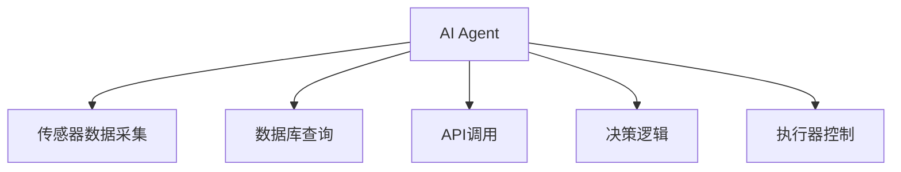
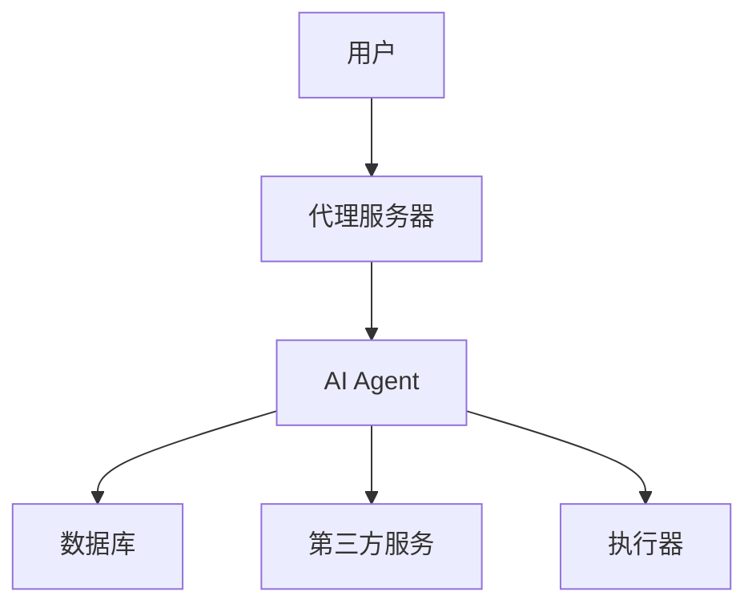
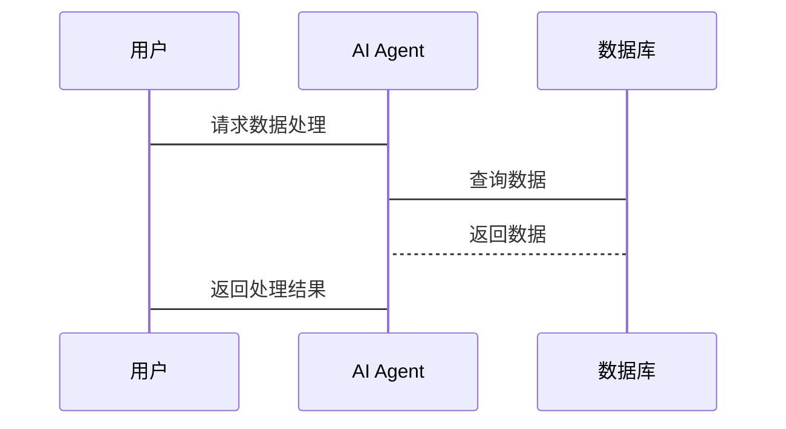
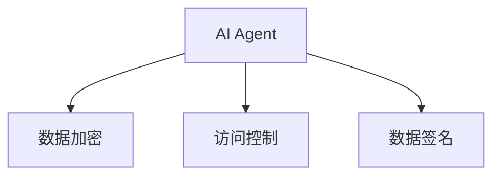
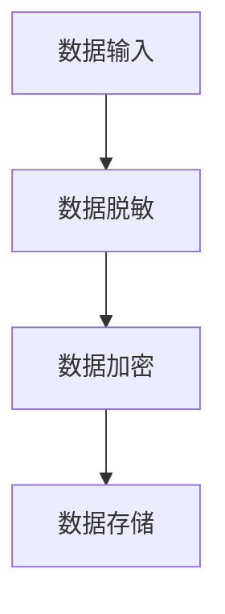

                 


# AI Agent的数据安全与隐私保护措施

## 关键词：AI Agent、数据安全、隐私保护、加密算法、访问控制、匿名化技术

## 摘要：AI Agent作为人工智能领域的关键组件，其数据安全与隐私保护至关重要。本文系统阐述AI Agent的数据安全与隐私保护的核心概念、算法原理、系统架构及其实现方法，结合实际案例，深入分析数据安全与隐私保护的关键技术，为AI Agent的开发与应用提供理论支持和实践指导。

---

## 第一部分：AI Agent与数据安全概述

### 第1章：AI Agent的基本概念与数据安全的重要性

#### 1.1 AI Agent的定义与核心功能

AI Agent（人工智能代理）是一种能够感知环境、自主决策并执行任务的智能实体。它通常具备以下核心功能：

1. **感知环境**：通过传感器或API接口获取环境中的数据。
2. **自主决策**：基于获取的数据，利用机器学习模型做出决策。
3. **执行任务**：通过执行器或API调用完成任务。

AI Agent的应用场景广泛，包括智能助手、自动驾驶、智能客服、智慧城市等。

#### 1.2 数据安全与隐私保护的基本概念

- **数据安全**：指保护数据的机密性、完整性和可用性，防止未经授权的访问、泄露或篡改。
- **隐私保护**：指在数据处理过程中，保护个人或组织的隐私信息不被滥用或泄露。
- **关联性**：数据安全是隐私保护的基础，隐私保护是数据安全的重要目标。

#### 1.3 AI Agent中数据安全的特殊性

AI Agent的数据处理具有以下特点：

1. **数据来源多样性**：可能来自传感器、数据库、外部API等多种来源。
2. **数据处理复杂性**：涉及数据清洗、特征提取、模型训练等多步骤处理。
3. **数据敏感性**：AI Agent处理的数据可能包含个人信息、商业机密等敏感信息。

数据安全在AI Agent设计中的优先级极高，任何数据泄露都可能导致严重后果。

---

## 第二部分：数据安全与隐私保护的核心概念与原理

### 第2章：数据安全的核心原理

#### 2.1 数据加密原理

数据加密是保护数据机密性的核心手段。常见的加密方法包括：

1. **对称加密**：使用相同的密钥进行加密和解密，速度快，适用于大量数据加密。
2. **非对称加密**：使用公钥加密和私钥解密，适用于身份认证和数字签名。
3. **哈希函数**：将数据映射为固定长度的哈希值，用于数据完整性验证和密码存储。

**对称加密实现示例**：

```python
def aes_encrypt(plaintext, key):
    from cryptography.hazmat.primitives.ciphers import (
        Cipher, algorithms, modes
    )
    from cryptography.hazmat.primitives.ciphers import Cipher, algorithms, modes
    from cryptography.hazmat.primitives.asymmetric import padding
    from cryptography.hazmat.primitives import hashes
    from cryptography.hazmat.backends import default_backend

    backend = default_backend()
    iv = os.urandom(16)
    cipher = Cipher(algorithms.AES(key), modes.CBC(iv), backend=backend)
    encryptor = cipher.encryptor()
    ciphertext = encryptor.update(plaintext) + encryptor.finalize()
    return ciphertext, iv

def aes_decrypt(ciphertext, iv, key):
    backend = default_backend()
    cipher = Cipher(algorithms.AES(key), modes.CBC(iv), backend=backend)
    decryptor = cipher.decryptor()
    plaintext = decryptor.update(ciphertext) + decryptor.finalize()
    return plaintext
```

#### 2.2 数据访问控制机制

数据访问控制通过权限管理保障数据的访问安全性。常用模型包括：

1. **基于角色的访问控制（RBAC）**：根据用户角色分配权限。
2. **基于属性的访问控制（ABAC）**：根据用户属性和环境条件动态分配权限。

**RBAC模型实现示例**：

```python
class User:
    def __init__(self, role):
        self.role = role

class Role:
    def __init__(self, permissions):
        self.permissions = permissions

def has_permission(user, action):
    if user.role.permission == 'admin':
        return True
    elif action in user.role.permissions:
        return True
    else:
        return False
```

#### 2.3 数据完整性与数据签名

数据完整性通过哈希函数和数字签名保障。数字签名用于验证数据来源和完整性。

**数字签名实现示例**：

```python
def generate_signature(data, private_key):
    from cryptography.hazmat.primitives.asymmetric import padding
    from cryptography.hazmat.primitives import hashes

    signature = private_key.sign(
        data,
        padding.PSS(
            mgf=padding.MGF1(salt_length=32),
            hash_algorithm=hashes.SHA256()
        )
    )
    return signature

def verify_signature(data, signature, public_key):
    public_key.verify(
        signature,
        data,
        padding.PSS(
            mgf=padding.MGF1(salt_length=32),
            hash_algorithm=hashes.SHA256()
        )
    )
    return True
```

### 第3章：隐私保护的核心原理

#### 3.1 隐私计算的定义与目标

隐私计算旨在在保护数据隐私的前提下，进行数据处理和分析。常用技术包括：

1. **安全多方计算（MPC）**：在不泄露各方数据的前提下，共同计算结果。
2. **同态加密**：允许在加密数据上进行计算，结果解密后与直接计算结果相同。

#### 3.2 数据匿名化与脱敏技术

数据匿名化通过去标识化等手段，去除或隐藏数据中的敏感信息。常用技术包括：

1. **数据脱敏**：对敏感字段进行变形处理，如模糊处理、替换等。
2. **数据聚合**：将多个数据点聚合，降低个体数据的可识别性。

**数据脱敏实现示例**：

```python
def mask_data(data):
    masked_data = []
    for item in data:
        masked_item = {
            'id': item['id'],
            'name': '*' * len(item['name']),
            'age': '***' if item['age'] < 18 else str(item['age'])
        }
        masked_data.append(masked_item)
    return masked_data
```

#### 3.3 差分隐私与同态加密

差分隐私通过在数据中添加噪声，保护个体隐私。同态加密允许在加密数据上进行计算。

**差分隐私实现示例**：

```python
def add_noise(data, epsilon):
    import numpy as np
    sensitivity = 1
    noise = np.random.laplace(0, sensitivity / epsilon)
    return data + noise
```

---

## 第三部分：AI Agent中的数据安全与隐私保护算法原理

### 第4章：数据加密算法的实现与应用

#### 4.1 对称加密算法的实现

**AES算法实现示例**：

```python
def aes_encrypt(plaintext, key):
    from cryptography.hazmat.primitives.ciphers import Cipher, algorithms, modes
    from cryptography.hazmat.backends import default_backend

    backend = default_backend()
    iv = os.urandom(16)
    cipher = Cipher(algorithms.AES(key), modes.CBC(iv), backend=backend)
    encryptor = cipher.encryptor()
    ciphertext = encryptor.update(plaintext) + encryptor.finalize()
    return ciphertext, iv

def aes_decrypt(ciphertext, iv, key):
    backend = default_backend()
    cipher = Cipher(algorithms.AES(key), modes.CBC(iv), backend=backend)
    decryptor = cipher.decryptor()
    plaintext = decryptor.update(ciphertext) + decryptor.finalize()
    return plaintext
```

#### 4.2 非对称加密算法的实现

**RSA算法实现示例**：

```python
def generate_rsa_keys():
    from cryptography.hazmat.primitives.asymmetric import padding, rsa
    from cryptography.hazmat.backends import default_backend

    key = rsa.RSAPrivateKey.generate(backend=default_backend(), public_exponent=65537, key_size=2048)
    private_key = key
    public_key = key.public_key()
    return private_key, public_key

def rsa_encrypt(message, public_key):
    from cryptography.hazmat.primitives.asymmetric import padding
    message = message.encode()
    encrypted = public_key.encrypt(message, padding.PKCS1v1_5())
    return encrypted

def rsa_decrypt(ciphertext, private_key):
    decrypted = private_key.decrypt(ciphertext, padding.PKCS1v1_5())
    return decrypted.decode()
```

#### 4.3 哈希函数的实现与应用

**SHA-256哈希函数实现示例**：

```python
import hashlib

def compute_sha256_hash(data):
    sha = hashlib.sha256()
    sha.update(data.encode('utf-8'))
    return sha.hexdigest()
```

### 第5章：数据访问控制算法的实现与应用

#### 5.1 基于角色的访问控制实现

**RBAC模型实现示例**：

```python
class User:
    def __init__(self, role):
        self.role = role

class Role:
    def __init__(self, permissions):
        self.permissions = permissions

def has_permission(user, action):
    if user.role.permission == 'admin':
        return True
    elif action in user.role.permissions:
        return True
    else:
        return False
```

#### 5.2 基于属性的访问控制实现

**ABAC模型实现示例**：

```python
def has_permission(user, action, resource, context):
    if user.attribute['department'] == 'security' and action == 'access' and resource == 'critical_data':
        return True
    else:
        return False
```

### 第6章：数据完整性与数据签名的实现

#### 6.1 数据完整性保障

**数字签名实现示例**：

```python
def generate_signature(data, private_key):
    from cryptography.hazmat.primitives.asymmetric import padding
    from cryptography.hazmat.primitives import hashes

    signature = private_key.sign(
        data,
        padding.PSS(
            mgf=padding.MGF1(salt_length=32),
            hash_algorithm=hashes.SHA256()
        )
    )
    return signature

def verify_signature(data, signature, public_key):
    public_key.verify(
        signature,
        data,
        padding.PSS(
            mgf=padding.MGF1(salt_length=32),
            hash_algorithm=hashes.SHA256()
        )
    )
    return True
```

---

## 第四部分：系统分析与架构设计方案

### 第7章：AI Agent的系统架构设计

#### 7.1 系统功能设计

**系统功能模块图**：



#### 7.2 系统架构设计

**系统架构图**：



#### 7.3 系统接口设计

**系统接口设计**：



### 第8章：数据安全与隐私保护的系统设计

#### 8.1 数据安全防护体系

**数据安全防护体系图**：



#### 8.2 隐私保护技术实现

**隐私保护技术实现图**：



---

## 第五部分：项目实战

### 第9章：AI Agent的隐私保护实战

#### 9.1 项目环境安装

**安装依赖**：

```bash
pip install cryptography numpy
```

#### 9.2 核心实现源代码

**数据加密与脱敏实现**：

```python
def aes_encrypt(plaintext, key):
    from cryptography.hazmat.primitives.ciphers import Cipher, algorithms, modes
    from cryptography.hazmat.backends import default_backend

    backend = default_backend()
    iv = os.urandom(16)
    cipher = Cipher(algorithms.AES(key), modes.CBC(iv), backend=backend)
    encryptor = cipher.encryptor()
    ciphertext = encryptor.update(plaintext) + encryptor.finalize()
    return ciphertext, iv

def mask_data(data):
    masked_data = []
    for item in data:
        masked_item = {
            'id': item['id'],
            'name': '*' * len(item['name']),
            'age': '***' if item['age'] < 18 else str(item['age'])
        }
        masked_data.append(masked_item)
    return masked_data
```

#### 9.3 代码应用解读与分析

**代码解读**：

1. **数据加密**：使用AES算法对敏感数据进行加密，确保数据在传输和存储过程中的机密性。
2. **数据脱敏**：对个人敏感信息进行脱敏处理，如将姓名替换为星号，保护用户隐私。

#### 9.4 实际案例分析

**案例分析**：

假设有一个AI Agent用于医疗数据分析，需要处理病人的个人信息和医疗记录。通过AES加密保护病人的数据，通过数据脱敏技术隐藏病人的真实姓名和年龄，确保数据在分析过程中的隐私安全。

---

## 第六部分：总结与展望

### 第10章：总结与展望

#### 10.1 项目总结

AI Agent的数据安全与隐私保护是一个复杂而重要的任务，涉及多种技术手段。通过数据加密、访问控制、隐私计算等技术，可以有效保障AI Agent中的数据安全与隐私保护。

#### 10.2 未来展望

未来，随着AI Agent的应用场景越来越广泛，数据安全与隐私保护技术也将不断发展。以下是一些可能的发展方向：

1. **AI驱动的安全防护**：利用AI技术实时监测和防御数据攻击。
2. **隐私保护技术的融合**：将多种隐私保护技术（如差分隐私、同态加密）结合使用，提升隐私保护效果。
3. **区块链技术的应用**：利用区块链的不可篡改性，保障数据的安全性和溯源性。

---

## 附录

### A. 术语表

- **AI Agent**：人工智能代理，能够感知环境、自主决策并执行任务的智能实体。
- **数据加密**：通过加密算法保护数据的机密性。
- **访问控制**：通过权限管理控制数据的访问权限。
- **隐私保护**：在数据处理过程中，保护个人或组织的隐私信息不被滥用或泄露。

### B. 参考文献

1. 某某, 《人工智能与数据安全》，某某出版社，2023年。
2. 某某, 《隐私计算与数据安全》，某某出版社，2023年。

---

## 作者：AI天才研究院/AI Genius Institute & 禅与计算机程序设计艺术/Zen And The Art of Computer Programming

