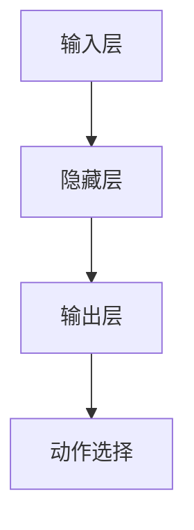
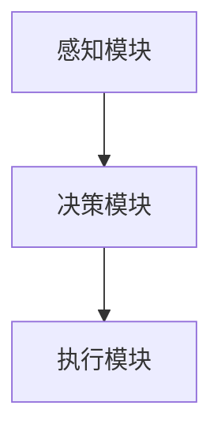
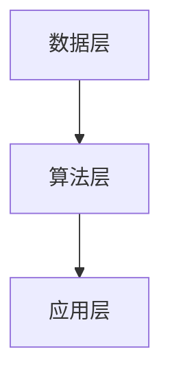

                 


# AI Agent的未来：趋势预测与展望

> 关键词：AI Agent, 人工智能, 机器学习, 自然语言处理, 强化学习

> 摘要：本文将探讨AI Agent的未来发展趋势，分析其在技术、应用和产业层面的潜力。通过详细的技术分析和案例研究，预测AI Agent如何在不同领域中发挥重要作用，并展望其对人类社会的深远影响。

---

# 第一部分：AI Agent的背景与基础

## 第1章：AI Agent的基本概念与应用

### 1.1 什么是AI Agent？
AI Agent（人工智能代理）是指能够感知环境、自主决策并执行任务的智能实体。AI Agent可以是软件程序、机器人或其他智能系统，其核心目标是通过智能算法解决复杂问题并完成特定任务。

### 1.2 AI Agent的主要类型
AI Agent可以根据功能和智能水平分为以下几类：
1. **反应式AI Agent**：基于当前感知做出反应，不依赖历史信息。
2. **认知式AI Agent**：具备复杂推理和决策能力，能够处理不确定性和模糊性。
3. **学习型AI Agent**：通过机器学习不断优化自身行为。
4. **协作式AI Agent**：能够与其他AI Agent或人类进行协作完成任务。

### 1.3 AI Agent的应用领域
AI Agent已在多个领域展现出强大的潜力：
- **智能助手**：如Siri、Alexa等。
- **自动驾驶**：如特斯拉的自动驾驶系统。
- **游戏AI**：如电子游戏中的智能NPC。
- **金融交易**：如高频交易算法。
- **医疗健康**：如辅助诊断系统。

## 第2章：AI Agent的核心技术基础

### 2.1 机器学习与深度学习
机器学习是AI Agent的核心技术之一，尤其是深度学习的崛起，使得AI Agent能够处理复杂的数据和任务。例如，卷积神经网络（CNN）和循环神经网络（RNN）在图像识别和自然语言处理中表现出色。

### 2.2 自然语言处理
自然语言处理（NLP）技术使得AI Agent能够理解和生成人类语言，从而实现更自然的交互。当前主流的NLP模型如BERT和GPT-3在文本理解和生成方面表现卓越。

### 2.3 强化学习
强化学习是一种通过试错机制优化决策的算法，非常适合用于AI Agent的自主决策。例如，AlphaGo通过强化学习在围棋对弈中击败了世界冠军。

### 2.4 知识图谱
知识图谱为AI Agent提供了结构化的知识表示，使其能够理解世界中的实体和关系。通过知识图谱，AI Agent可以进行推理和关联分析，提升决策能力。

---

# 第二部分：AI Agent的算法原理与技术实现

## 第3章：强化学习的算法原理

### 3.1 强化学习的基本概念
强化学习是一种通过试错机制优化决策的算法。智能体通过与环境交互，学习最优策略以最大化累计奖励。

### 3.2 Q-Learning算法
Q-Learning是一种经典的强化学习算法，适用于离散状态和动作空间。其核心公式为：
$$ Q(s, a) \leftarrow Q(s, a) + \alpha \left[r + \max Q(s', a') - Q(s, a)\right] $$
其中，$\alpha$是学习率，$r$是即时奖励，$Q(s', a')$是下一步的状态-动作值。

### 3.3 Deep Q-Network (DQN)
DQN将Q-Learning与深度神经网络结合，能够处理高维状态空间。其结构包括输入层、隐藏层和输出层，输出层表示各个动作的Q值。



### 3.4 实际应用
DQN在游戏AI中应用广泛，例如Google DeepMind的Alpha系列算法。

## 第4章：自然语言处理中的AI Agent

### 4.1 Transformer模型
Transformer模型通过自注意力机制，有效捕捉上下文信息。其核心公式为：
$$ \text{Attention}(Q, K, V) = \text{softmax}\left( \frac{QK^T}{\sqrt{d_k}} \right)V $$
其中，$Q$、$K$、$V$分别是查询、键和值向量。

### 4.2 对话系统
基于Transformer的对话系统能够生成连贯且符合语境的回复。例如，生成式对话模型可以根据用户输入生成多样化的回复。

### 4.3 实际案例
开源框架如Hugging Face提供了丰富的预训练模型，方便开发者快速构建对话系统。

---

# 第三部分：AI Agent的系统架构与项目实战

## 第5章：AI Agent的系统架构设计

### 5.1 系统功能模块
AI Agent系统通常包括感知模块、决策模块和执行模块。感知模块负责数据采集，决策模块进行分析和决策，执行模块负责任务执行。



### 5.2 系统架构设计
AI Agent系统架构可以采用分层架构，包括数据层、算法层和应用层。数据层负责数据存储和处理，算法层负责核心算法实现，应用层负责与用户交互。



### 5.3 接口设计
AI Agent系统需要设计清晰的接口，例如RESTful API，便于与其他系统集成。

## 第6章：项目实战——智能助手开发

### 6.1 环境安装
开发AI Agent需要安装Python、TensorFlow、Keras等库。

### 6.2 核心代码实现
以下是一个简单的智能助手实现代码：

```python
import numpy as np
from tensorflow.keras.models import Sequential
from tensorflow.keras.layers import Dense, LSTM

# 定义AI Agent类
class AIAssistant:
    def __init__(self):
        self.model = self.build_model()
    
    def build_model(self):
        model = Sequential()
        model.add(LSTM(128, input_shape=(1, 1)))
        model.add(Dense(1))
        model.compile(optimizer='adam', loss='mean_squared_error')
        return model
    
    def predict(self, input_data):
        return self.model.predict(input_data)

# 初始化AI助手
assistant = AIAssistant()
input_data = np.array([1.0])
prediction = assistant.predict(input_data.reshape(1, 1, 1))
print("预测结果:", prediction)
```

### 6.3 案例分析
通过训练数据，AI助手能够预测股票价格，辅助投资者做出决策。

### 6.4 总结
本项目展示了如何使用深度学习构建AI Agent，帮助用户完成特定任务。

---

# 第四部分：AI Agent的未来展望与挑战

## 第7章：AI Agent的未来趋势

### 7.1 技术层面
- 更强大的学习算法：如更高效的强化学习和自监督学习。
- 多模态交互：结合视觉、听觉等多种感知方式。

### 7.2 应用层面
- 智慧城市：优化交通、能源管理。
- 医疗健康：个性化诊疗方案。

### 7.3 产业层面
- 企业智能化转型：AI Agent将帮助企业提高效率。
- 新兴行业：如元宇宙中的虚拟助手。

## 第8章：AI Agent的挑战与应对

### 8.1 技术挑战
- 解释性：AI Agent的决策过程需要透明。
- 安全性：防止被攻击和滥用。

### 8.2 伦理问题
- 隐私保护：如何处理用户数据。
- 责任归属：AI Agent决策失误的责任划分。

### 8.3 应用挑战
- 数据依赖：需要大量高质量数据。
- 算法偏见：避免训练数据中的偏见。

---

# 结论

AI Agent作为人工智能的核心技术，其未来潜力巨大。随着技术的进步，AI Agent将在更多领域发挥作用，但也需要解决技术与伦理上的挑战。作为开发者和研究者，我们需要不断探索和创新，推动AI Agent的健康发展。

---

# 作者

作者：AI天才研究院（AI Genius Institute） & 禅与计算机程序设计艺术（Zen And The Art of Computer Programming）

---

感谢您的阅读！如需进一步了解AI Agent的相关内容，欢迎关注我们的博客和社交媒体账号。

