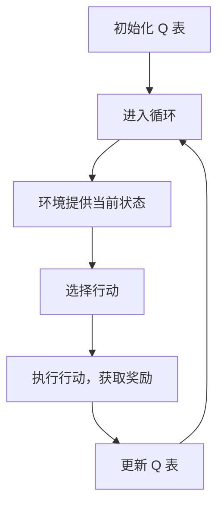
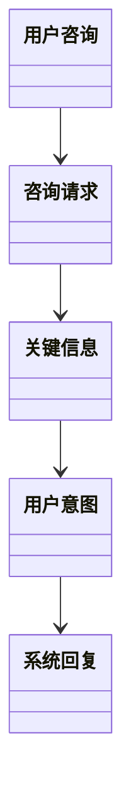
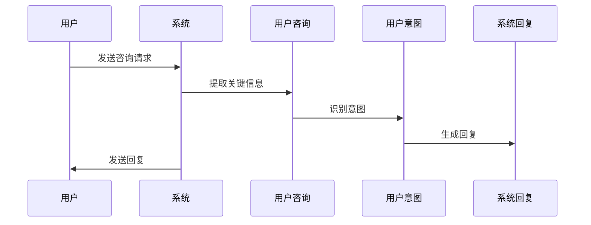

                 


# AI Agent的架构设计：从概念到实现

> 关键词：AI Agent，架构设计，算法原理，系统分析，项目实战

> 摘要：本文将深入探讨AI Agent的架构设计，从基本概念到实现细节，逐步解析其核心原理、算法流程、系统架构和实际应用。通过详细的技术分析和实例演示，帮助读者全面理解AI Agent的设计与实现。

---

## 第一部分：AI Agent 的背景与概念

### 第1章：AI Agent 概述

#### 1.1 AI Agent 的基本概念

- **1.1.1 什么是 AI Agent**
  - AI Agent 是一类能够感知环境、自主决策并采取行动的智能实体。
  - 它能够根据输入的信息，通过算法处理后输出决策或行动，以达到预定目标。

- **1.1.2 AI Agent 的特点与优势**
  - **自主性**：能够在没有外部干预的情况下独立运作。
  - **反应性**：能够实时感知环境变化并做出反应。
  - **目标导向**：所有行为都以实现特定目标为导向。
  - **社会能力**：能够与其他智能体或人类进行有效交互。

- **1.1.3 AI Agent 的应用场景**
  - 智能助手（如 Siri、Alexa）
  - 推荐系统（如 Netflix 的内容推荐）
  - 自动交易系统
  - 自动驾驶

#### 1.2 AI Agent 的问题背景

- **1.2.1 传统 AI 的局限性**
  - 传统 AI 系统（如专家系统）依赖于预定义规则，缺乏灵活性和适应性。
  - 面对动态变化的环境时，难以有效应对。

- **1.2.2 AI Agent 出现的背景与需求**
  - 随着人工智能技术的发展，对自主、动态、智能实体的需求日益增长。
  - AI Agent 能够在复杂环境中自主决策，适应环境变化。

- **1.2.3 AI Agent 的目标与价值**
  - 提供更高效、更智能的解决方案。
  - 适应动态环境，实现复杂任务的自动化。

#### 1.3 AI Agent 的核心概念

- **1.3.1 问题背景与问题描述**
  - AI Agent 的核心目标是通过感知和行动来优化特定任务的执行。
  - 在复杂环境中，AI Agent 需要处理不确定性，实现最优决策。

- **1.3.2 问题解决的思路与方法**
  - 通过算法和模型，实现自主决策和行动。
  - 结合感知和行动，构建闭环系统。

- **1.3.3 AI Agent 的边界与外延**
  - 确定 AI Agent 的作用范围和能力边界。
  - 明确与外部系统和其他智能体的交互方式。

#### 1.4 AI Agent 的核心要素

- **1.4.1 AI Agent 的核心要素**
  - **感知能力**：通过传感器或接口获取环境信息。
  - **决策能力**：基于感知信息做出决策。
  - **行动能力**：根据决策执行具体行动。
  - **学习能力**：通过经验优化自身性能。

- **1.4.2 AI Agent 的概念结构**
  - 由感知、决策、行动和学习四个模块组成。
  - 模块之间相互协作，共同实现目标。

- **1.4.3 AI Agent 的核心属性**
  - **自主性**：独立运作的能力。
  - **反应性**：实时响应环境变化的能力。
  - **目标导向**：以目标为导向的决策能力。
  - **社会能力**：与其他智能体或人类交互的能力。

---

## 第二部分：AI Agent 的核心概念与联系

### 第2章：AI Agent 的核心概念原理

#### 2.1 AI Agent 的核心概念原理

- **2.1.1 AI Agent 的基本原理**
  - AI Agent 通过感知获取信息，利用算法进行决策，并通过行动实现目标。
  - 感知、决策和行动形成一个闭环系统。

- **2.1.2 AI Agent 的核心算法**
  - 包括决策树、强化学习、马尔可夫决策过程等算法。

- **2.1.3 AI Agent 的运行机制**
  - 感知环境状态，生成候选行动，评估行动效果，选择最优行动。

#### 2.2 AI Agent 的概念属性特征对比

- **2.2.1 属性对比表格**
  | 属性       | 描述                                         |
  |------------|----------------------------------------------|
  | 自主性      | 是否能够独立运作                             |
  | 反应性      | 是否能够实时响应环境变化                     |
  | 目标导向    | 是否以目标为导向进行决策                     |
  | 社会能力    | 是否能够与其他智能体或人类交互               |

- **2.2.2 特征对比分析**
  - 自主性是 AI Agent 的核心特征，其他特征则辅助其实现目标。

- **2.2.3 属性与特征的关联性**
  - 自主性与反应性密切相关，目标导向与社会能力相互影响。

#### 2.3 AI Agent 的 ER 实体关系图

- **2.3.1 实体关系图的构建**
  - 使用 Mermaid 绘制 ER 实体关系图，展示 AI Agent 的核心实体及其关系。

```mermaid
erDiagram
    actor 用户
    actor 环境
    actor 其他智能体
    class 状态
    class 行动
    class 决策
    用户 --> 状态 : 感知
    环境 --> 状态 : 提供
    其他智能体 --> 决策 : 交互
    决策 --> 行动 : 生成
    行动 --> 状态 : 影响
```

- **2.3.2 实体关系图的分析**
  - 用户、环境和其他智能体通过状态与 AI Agent 交互。
  - 决策过程生成行动，行动反过来影响环境或状态。

---

## 第三部分：AI Agent 的算法原理

### 第3章：AI Agent 的算法原理

#### 3.1 AI Agent 的核心算法

- **3.1.1 算法原理概述**
  - 以 Q-learning 算法为例，讲解其在 AI Agent 中的应用。

- **3.1.2 算法实现步骤**
  1. 初始化 Q 表。
  2. 进入循环，直到达到终止条件。
  3. 环境提供当前状态。
  4. 根据当前状态选择行动。
  5. 执行行动并获取奖励。
  6. 更新 Q 表中的 Q 值。

- **3.1.3 算法优缺点分析**
  - 优点：适用于离散状态和动作空间。
  - 缺点：在复杂环境中表现有限，需要大量训练数据。

#### 3.2 AI Agent 的算法流程图

- **3.2.1 算法流程图的绘制**
  - 使用 Mermaid 绘制 Q-learning 算法的流程图。



- **3.2.2 算法流程图的解释**
  - 从初始化 Q 表开始，进入循环，直到满足终止条件。
  - 每次循环中，环境提供状态，AI Agent 选择行动并执行，更新 Q 表。

- **3.2.3 算法流程图的应用**
  - 展示 Q-learning 算法在 AI Agent 中的执行流程。

#### 3.3 AI Agent 的算法实现代码

- **3.3.1 代码实现**
  ```python
  import numpy as np
  import random

  # 初始化 Q 表
  Q = np.zeros((5, 5))
  alpha = 0.1  # 学习率
  gamma = 0.9  # 折扣因子

  # 训练过程
  for _ in range(100):
      state = 环境.get_state()
      action = np.argmax(Q[state])  # 选择最优行动
      next_state = 执行行动.get_next_state(action)
      reward = 环境.get_reward(next_state)
      
      # 更新 Q 表
      Q[state][action] += alpha * (reward + gamma * np.max(Q[next_state]))
  ```

- **3.3.2 代码解读**
  - 使用 Q-learning 算法，通过状态和行动更新 Q 表，实现决策优化。

- **3.3.3 代码优化建议**
  - 引入经验回放机制，提高算法的泛化能力。
  - 调整学习率和折扣因子，优化收敛速度和稳定性。

#### 3.4 AI Agent 的数学模型与公式

- **3.4.1 Q-learning 的数学公式**
  $$ Q(s, a) = Q(s, a) + \alpha [r + \gamma \max Q(s', a) - Q(s, a)] $$
  - 其中，$s$ 是当前状态，$a$ 是当前行动，$s'$ 是下一个状态，$\alpha$ 是学习率，$\gamma$ 是折扣因子。

- **3.4.2 其他相关公式**
  - 状态转移概率：$$ P(s' | s, a) $$
  - 奖励函数：$$ R(s, a, s') $$

---

## 第四部分：AI Agent 的系统分析与架构设计

### 第4章：AI Agent 的系统分析

#### 4.1 问题场景介绍

- **4.1.1 问题描述**
  - 以智能客服系统为例，AI Agent 需要处理用户的咨询请求。

- **4.1.2 项目介绍**
  - 开发一个基于 AI Agent 的智能客服系统，实现用户咨询的自动响应。

- **4.1.3 系统功能设计**
  - 信息抽取：从用户输入中提取关键信息。
  - 意图识别：判断用户的需求类型。
  - 对话管理：根据需求生成合适的回复。

#### 4.2 系统架构设计

- **4.2.1 领域模型类图**
  - 使用 Mermaid 绘制领域模型类图。



- **4.2.2 系统架构设计**
  - 分层架构：感知层、决策层和执行层。
  - 每层之间通过接口进行通信。

- **4.2.3 系统接口设计**
  - API 接口：提供给外部系统调用。
  - 数据格式：JSON 格式，确保数据的结构化和易用性。

#### 4.3 系统交互设计

- **4.3.1 系统交互流程**
  - 用户发送咨询请求，系统提取关键信息，识别用户意图，生成回复。
  
- **4.3.2 交互流程图**
  - 使用 Mermaid 绘制交互流程图。



---

## 第五部分：AI Agent 的项目实战

### 第5章：项目实战

#### 5.1 环境安装

- **5.1.1 安装 Python 和相关库**
  - 使用 pip 安装 numpy、scikit-learn 和其他必要的库。

#### 5.2 系统核心实现

- **5.2.1 信息抽取模块**
  - 使用自然语言处理技术，从文本中提取关键信息。

- **5.2.2 对话管理模块**
  - 基于提取的信息，生成合适的回复。

#### 5.3 代码实现与解读

- **5.3.1 信息抽取代码**
  ```python
  import nltk
  from sklearn.feature_extraction.text import TfidfVectorizer

  def extract_keywords(text):
      vectorizer = TfidfVectorizer()
      X = vectorizer.fit_transform([text])
      feature_names = vectorizer.get_feature_names_out()
      return feature_names
  ```

- **5.3.2 对话管理代码**
  ```python
  def generate_response(keywords):
      response_map = {
          'product': '我们的产品具有以下特点：...',
          'price': '产品的价格是：...'
      }
      return response_map.get(keywords[0], '抱歉，我无法回答您的问题。')
  ```

#### 5.4 案例分析与讲解

- **5.4.1 案例分析**
  - 用户输入：我需要了解你们的产品。
  - 关键词提取：产品。
  - 生成回复：我们的产品具有以下特点：...

- **5.4.2 代码解读**
  - 信息抽取模块使用 TF-IDF 方法提取关键词。
  - 对话管理模块根据关键词生成回复。

#### 5.5 项目小结

- **5.5.1 项目总结**
  - 成功实现了基于 AI Agent 的智能客服系统。
  - 通过信息抽取和对话管理模块，实现了用户咨询的自动响应。

---

## 第六部分：总结与展望

### 第6章：总结与展望

#### 6.1 核心内容回顾

- AI Agent 是一类能够感知环境、自主决策并采取行动的智能实体。
- 本文从概念、算法、架构和实现四个方面详细介绍了 AI Agent 的设计与实现。

#### 6.2 最佳实践 tips

- 在设计 AI Agent 时，需要充分考虑其自主性、反应性和目标导向性。
- 算法选择和系统架构设计是实现 AI Agent 的关键。

#### 6.3 小结

- 通过本文的学习，读者可以掌握 AI Agent 的基本概念和实现方法。
- 在实际应用中，需要根据具体需求选择合适的算法和架构。

#### 6.4 注意事项

- 确保数据质量和系统的安全性。
- 定期优化和更新 AI Agent 的模型和算法。

#### 6.5 拓展阅读

- 推荐阅读相关领域的书籍和论文，深入了解 AI Agent 的最新研究成果和技术进展。

---

## 作者

作者：AI天才研究院/AI Genius Institute & 禅与计算机程序设计艺术 /Zen And The Art of Computer Programming

---

感谢您的阅读！希望本文对您理解和实现 AI Agent 的架构设计有所帮助。

