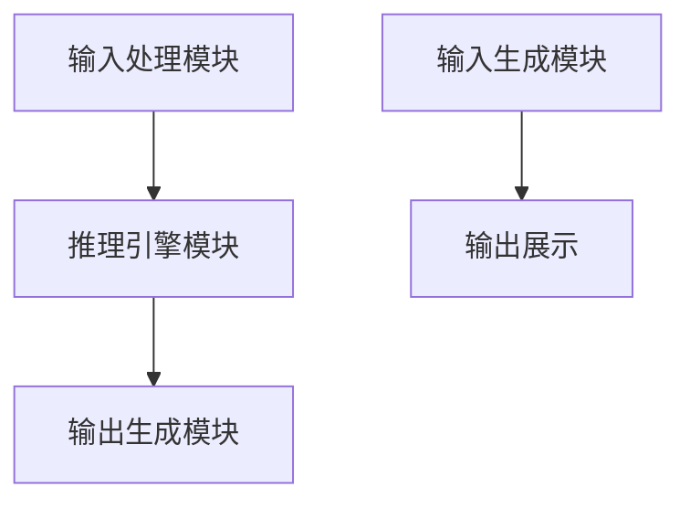

                 


# AI Agent的核心组件：输入处理、推理引擎和输出生成

> 关键词：AI Agent, 输入处理, 推理引擎, 输出生成, 人工智能, 计算机科学

> 摘要：本文详细探讨了AI Agent的核心组件，包括输入处理、推理引擎和输出生成。通过分析每个组件的实现方法、算法原理和系统设计，本文为读者提供了全面的技术解读，帮助理解AI Agent的工作原理和实际应用。

---

## 第1章: AI Agent的背景与概念

### 1.1 AI Agent的基本概念

#### 1.1.1 什么是AI Agent
AI Agent（人工智能代理）是指能够感知环境、做出决策并执行动作的智能实体。它可以是一个软件程序，也可以是一个物理设备，其核心目标是通过自动化方式完成特定任务。

#### 1.1.2 AI Agent的类型与特点
AI Agent可以根据功能和应用场景分为多种类型：
- **反应式Agent**：基于当前感知做出实时反应，适用于需要快速响应的场景。
- **认知式Agent**：具备推理、规划和学习能力，能够处理复杂任务。
- **服务式Agent**：提供特定服务，如智能客服、推荐系统等。

#### 1.1.3 AI Agent的应用场景
AI Agent广泛应用于多个领域：
- **智能助手**：如Siri、Alexa等，帮助用户完成日常任务。
- **推荐系统**：基于用户行为推荐个性化内容。
- **自动驾驶**：通过感知环境做出驾驶决策。

### 1.2 AI Agent的核心组件

#### 1.2.1 输入处理模块
输入处理模块负责接收和解析输入数据，是AI Agent与外部交互的第一步。

#### 1.2.2 推理引擎模块
推理引擎是AI Agent的核心，负责根据输入数据进行分析和推理，生成决策。

#### 1.2.3 输出生成模块
输出生成模块将推理结果转化为具体的输出形式，如文本、动作等。

### 1.3 AI Agent的系统架构

#### 1.3.1 分层架构设计
AI Agent的架构通常分为输入层、推理层和输出层，各层之间相互协作。

#### 1.3.2 组件之间的交互关系
- 输入处理模块将数据传递给推理引擎。
- 推理引擎根据数据生成推理结果。
- 输出生成模块将推理结果转化为最终输出。

#### 1.3.3 系统的灵活性与扩展性
通过模块化设计，AI Agent可以灵活扩展和升级各个组件，以适应不同的应用场景。

### 1.4 本章小结
本章介绍了AI Agent的基本概念、核心组件及其系统架构，为后续章节奠定了基础。

---

## 第2章: 输入处理模块的实现

### 2.1 输入处理的背景与目标

#### 2.1.1 输入处理的重要性
输入处理是AI Agent与外部交互的第一步，直接影响后续推理的准确性。

#### 2.1.2 输入处理的目标
- 数据清洗：去除噪声，确保数据质量。
- 特征提取：提取关键特征，为推理提供有效信息。
- 格式化：将输入数据转换为系统可处理的格式。

#### 2.1.3 输入处理的挑战
- 数据多样性：输入数据可能来自不同来源，格式和类型各异。
- 噪声干扰：输入数据中可能包含大量无关信息。

### 2.2 输入处理的实现方法

#### 2.2.1 数据预处理
数据预处理是输入处理的第一步，包括：
- 数据清洗：去除无效数据，填充缺失值。
- 数据标准化：将数据转换为统一格式，如文本分词、数值归一化。

#### 2.2.2 特征提取
特征提取是从输入数据中提取关键特征，常见的方法有：
- **基于规则的特征提取**：根据预定义的规则提取特征，如关键词提取。
- **基于机器学习的特征提取**：使用无监督学习方法提取隐含特征，如主题模型。

#### 2.2.3 输入格式化
将处理后的数据转换为系统可处理的格式，如将文本数据转换为向量形式。

### 2.3 输入处理的优化技巧

#### 2.3.1 数据清洗的最佳实践
- 使用正则表达式清洗文本数据。
- 对于数值数据，使用统计方法处理异常值。

#### 2.3.2 特征选择的策略
- 使用信息增益法选择重要特征。
- 基于领域知识选择特征。

#### 2.3.3 输入格式的标准化
- 使用统一的编码标准，如UTF-8。
- 对于图像数据，使用标准化的尺寸和格式。

### 2.4 本章小结
本章详细讲解了输入处理模块的实现方法和优化技巧，为后续推理引擎的实现奠定了基础。

---

## 第3章: 推理引擎的设计与实现

### 3.1 推理引擎的背景与目标

#### 3.1.1 推理引擎的作用
推理引擎是AI Agent的核心，负责根据输入数据生成推理结果。

#### 3.1.2 推理引擎的目标
- 准确性：推理结果要准确反映输入数据。
- 速度：推理过程要高效，能够快速响应。

#### 3.1.3 推理引擎的挑战
- 复杂性：推理逻辑可能非常复杂，涉及多种推理方法。
- 不确定性：输入数据可能包含不确定性，推理结果需要考虑多种可能性。

### 3.2 推理引擎的实现方法

#### 3.2.1 基于规则的推理
基于规则的推理是一种简单的推理方法，适用于规则明确的场景。
- **规则定义**：定义一系列规则，如“如果A，则B”。
- **规则匹配**：将输入数据与规则匹配，生成推理结果。

#### 3.2.2 基于机器学习的推理
基于机器学习的推理是一种更复杂的方法，能够处理非结构化数据。
- **模型训练**：使用标注数据训练模型，如深度学习模型。
- **推理过程**：将输入数据输入模型，生成推理结果。

#### 3.2.3 基于知识图谱的推理
基于知识图谱的推理结合了知识表示和推理技术。
- **知识表示**：将知识表示为图结构，节点表示实体，边表示关系。
- **推理过程**：通过图遍历进行推理，如路径查找。

### 3.3 推理引擎的优化技巧

#### 3.3.1 规则优化策略
- 规则简洁性：避免冗余规则，确保规则简洁明了。
- 规则优先级：根据规则的重要性设置优先级。

#### 3.3.2 机器学习模型的优化
- 模型选择：选择适合任务的模型，如CNN、RNN等。
- 超参数调优：通过网格搜索等方法优化模型性能。

#### 3.3.3 知识图谱优化
- 知识表示优化：使用更高效的表示方法，如知识图谱嵌入。
- 推理优化：使用更高效的推理算法，如符号逻辑推理。

### 3.4 本章小结
本章详细讲解了推理引擎的设计与实现，包括基于规则、机器学习和知识图谱的推理方法，以及优化技巧。

---

## 第4章: 输出生成模块的实现

### 4.1 输出生成的背景与目标

#### 4.1.1 输出生成的重要性
输出生成是AI Agent与用户交互的关键步骤，直接影响用户体验。

#### 4.1.2 输出生成的目标
- 准确性：生成的内容要准确反映推理结果。
- 自然性：生成的内容要符合语言习惯，自然流畅。

#### 4.1.3 输出生成的挑战
- 生成多样性：需要生成多样化的输出，避免重复。
- 生成控制：需要根据上下文控制生成内容。

### 4.2 输出生成的实现方法

#### 4.2.1 基于模板的生成
基于模板的生成是一种简单的方法，适用于规则明确的场景。
- **模板定义**：定义一系列模板，如邮件模板。
- **内容填充**：将推理结果填充到模板中。

#### 4.2.2 基于生成模型的生成
基于生成模型的生成是一种更复杂的方法，能够生成多样化的输出。
- **模型训练**：使用生成对抗网络（GAN）或变自动器（VAE）训练生成模型。
- **内容生成**：将推理结果输入模型，生成输出内容。

#### 4.2.3 基于规则的生成
基于规则的生成结合了规则和生成模型的优势。
- **规则定义**：定义生成规则，如语言风格规则。
- **内容生成**：结合规则和生成模型生成输出内容。

### 4.3 输出生成的优化技巧

#### 4.3.1 模板优化策略
- 模板简洁性：避免冗余模板，确保模板简洁明了。
- 模板可扩展性：设计可扩展的模板，方便后续扩展。

#### 4.3.2 生成模型优化
- 模型选择：选择适合任务的生成模型，如GPT、BERT等。
- 超参数调优：通过网格搜索等方法优化模型性能。

#### 4.3.3 生成控制优化
- 上下文理解：通过理解上下文控制生成内容。
- 生成多样性：通过多样性采样生成多样化的输出。

### 4.4 本章小结
本章详细讲解了输出生成模块的实现方法和优化技巧，为AI Agent的完整实现提供了关键步骤。

---

## 第5章: AI Agent的系统设计与实现

### 5.1 系统设计的背景与目标

#### 5.1.1 系统设计的重要性
系统设计是AI Agent实现的关键步骤，确保各个模块协同工作。

#### 5.1.2 系统设计的目标
- 模块化：各个模块独立实现，便于维护和扩展。
- 高效性：系统整体运行高效，能够快速响应。

#### 5.1.3 系统设计的挑战
- 模块交互复杂：各个模块之间的交互需要精心设计。
- 系统扩展性：系统需要具备良好的扩展性，适应不同的应用场景。

### 5.2 系统功能设计

#### 5.2.1 领域模型设计
领域模型是系统设计的基础，通过ER图展示各个模块的关系。
```mermaid
erDiagram
    class 输入处理模块 {
        输入数据
        处理后的数据
    }
    class 推理引擎模块 {
        推理规则
        模型参数
    }
    class 输出生成模块 {
        生成模板
        生成内容
    }
    输入处理模块 --> 推理引擎模块: 传递处理后的数据
    推理引擎模块 --> 输出生成模块: 传递推理结果
```

#### 5.2.2 系统架构设计
系统架构设计决定了系统的整体结构，通常采用分层架构。


#### 5.2.3 接口设计
接口设计是系统实现的关键，确保各个模块之间能够顺利交互。
- **输入接口**：接收输入数据，传递给输入处理模块。
- **输出接口**：输出生成内容，传递给展示模块。

#### 5.2.4 交互设计
交互设计决定了用户与系统之间的交互方式，如命令行、图形界面等。

### 5.3 系统实现

#### 5.3.1 环境安装
安装必要的开发环境，如Python、TensorFlow等。

#### 5.3.2 核心代码实现
- 输入处理模块的代码实现：
  ```python
  def preprocess_input(data):
      # 数据清洗
      cleaned_data = data Cleaning Process
      # 特征提取
      features = extract_features(cleaned_data)
      return features
  ```

- 推理引擎模块的代码实现：
  ```python
  def inference_engine(features):
      # 规则推理
      rules = get_rules()
      results = apply_rules(features, rules)
      return results
  ```

- 输出生成模块的代码实现：
  ```python
  def generate_output(results):
      # 内容生成
      content = generate_content(results)
      return content
  ```

#### 5.3.3 系统功能设计
- 系统功能流程图：
  ```mermaid
  graph TD
      Input --> preprocess_input
      preprocess_input --> inference_engine
      inference_engine --> generate_output
      generate_output --> Output
  ```

### 5.4 本章小结
本章详细讲解了AI Agent的系统设计与实现，包括系统架构、接口设计、交互设计和核心代码实现。

---

## 第6章: AI Agent的最佳实践与未来展望

### 6.1 最佳实践

#### 6.1.1 数据处理
- 数据清洗：确保数据质量。
- 特征选择：选择关键特征。

#### 6.1.2 模型选择
- 根据任务选择合适的模型。
- 定期更新模型，保持性能。

#### 6.1.3 系统优化
- 模块化设计：便于维护和扩展。
- 并行处理：提高系统效率。

### 6.2 未来展望

#### 6.2.1 技术进步
- 更强的推理能力：基于深度学习的推理模型。
- 更高效的生成模型：生成更自然、多样化的输出。

#### 6.2.2 应用场景扩展
- 更多领域应用：如医疗、金融等。
- 更复杂的任务：如多轮对话、自主决策。

### 6.3 小结
未来，AI Agent将在更多领域得到应用，技术也将不断进步，为人类带来更多的便利。

---

## 作者：AI天才研究院/AI Genius Institute & 禅与计算机程序设计艺术 /Zen And The Art of Computer Programming

---

以上是《AI Agent的核心组件：输入处理、推理引擎和输出生成》的技术博客文章的完整内容。

