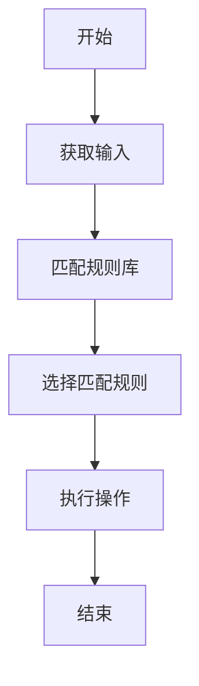
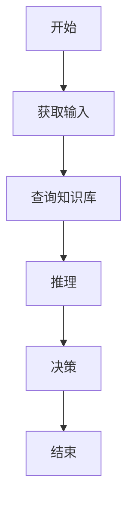
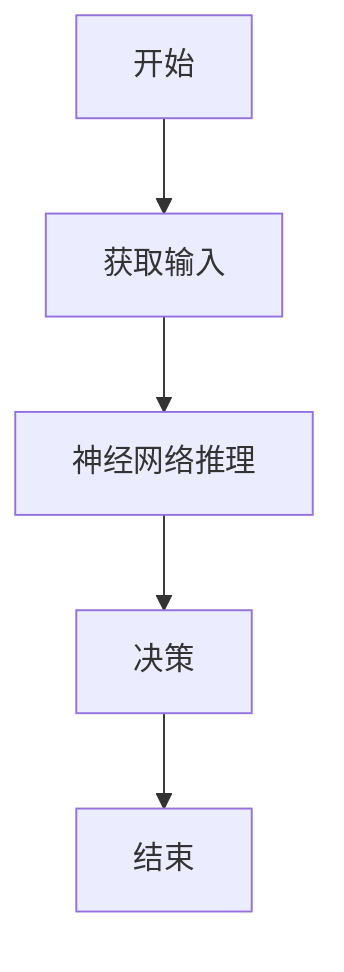
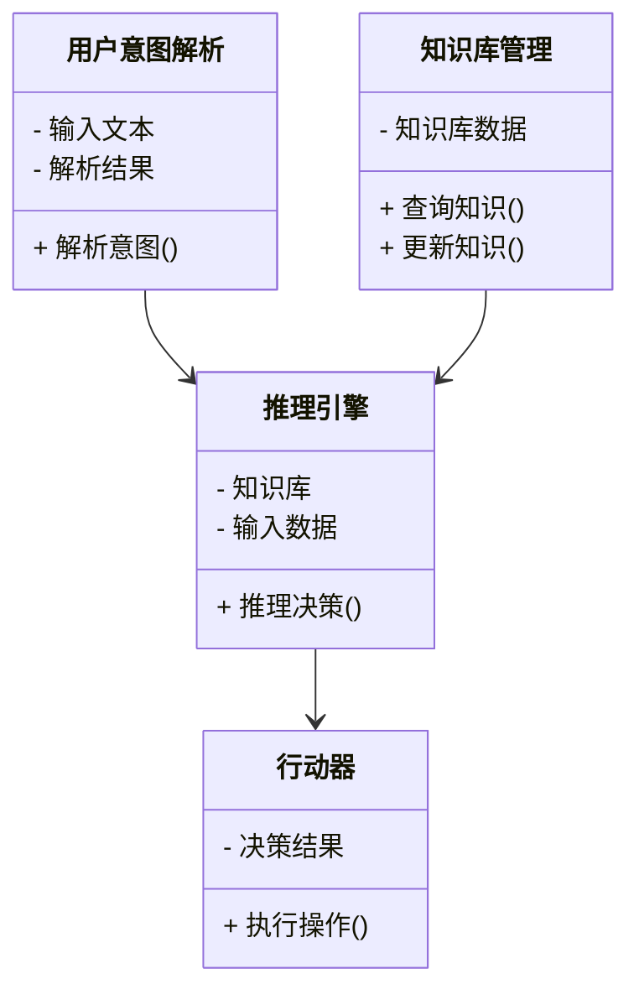

                 


# AI Agent的概念学习与推理实现

> **关键词**：AI Agent、人工智能、知识表示、推理机制、系统架构  
> **摘要**：本文深入探讨了AI Agent的概念、核心原理、算法实现及系统架构设计，通过实际案例展示AI Agent的应用，为读者提供全面的理论与实践指导。

---

## 第一部分: AI Agent的概念学习与推理基础

---

### 第1章: AI Agent的背景与概念

#### 1.1 AI Agent的基本概念

**1.1.1 什么是AI Agent**

AI Agent（人工智能代理）是一种能够感知环境、自主决策并采取行动的智能实体。它通过与环境交互，实现特定目标，如问题解决、信息检索或任务执行。AI Agent可以是软件程序，也可以是机器人，关键在于其具备智能行为的能力。

**1.1.2 AI Agent的特点**

AI Agent的特点包括自主性、反应性、目标导向和社交能力：

- **自主性**：无需外部干预，自主决策。
- **反应性**：能感知环境变化并实时调整行为。
- **目标导向**：基于目标驱动行动。
- **社交能力**：能与其他AI Agent或人类交互协作。

**1.1.3 AI Agent与其他智能体的对比**

AI Agent与传统软件或机器人有显著区别：

| 特性               | 传统软件/机器人             | AI Agent             |
|--------------------|------------------------------|-----------------------|
| 智能水平           | 预定义规则执行               | 具备自主学习与推理能力 |
| 交互能力           | 无智能交互                   | 支持自然语言处理和推理 |
| 环境适应能力       | 固定场景应用                 | 能适应动态变化环境    |

---

#### 1.2 AI Agent的分类与应用场景

**1.2.1 分类：基于智能水平的AI Agent**

AI Agent按智能水平分为：

1. **反应式AI Agent**：基于当前感知做出反应，如自动门。
2. **认知式AI Agent**：具备复杂推理和规划能力，如自动驾驶。

**1.2.2 应用场景：从简单任务到复杂决策**

- **智能家居**：控制家电，优化能源使用。
- **智能助手**：如Siri、Alexa，处理日程管理、信息查询。
- **自动驾驶**：实时感知、决策和执行。
- **医疗诊断**：辅助医生进行病情分析和诊断。

---

#### 1.3 AI Agent的核心问题与挑战

**1.3.1 问题背景：AI Agent的目标设定**

AI Agent的目标设定是关键：

- 清晰的目标定义确保行动方向正确。
- 多目标冲突时需优先级排序。

**1.3.2 问题描述：任务分解与优先级**

任务分解涉及将大目标拆解为子任务：

- 子任务需独立且可执行。
- 优先级排序确保资源合理分配。

**1.3.3 问题解决：推理与决策机制**

推理和决策是AI Agent的核心：

- 推理需准确，避免错误决策。
- 决策需高效，适应动态环境。

**1.3.4 AI Agent的边界与外延**

明确AI Agent的能力边界：

- 避免越界处理超出能力的任务。
- 外延扩展至与其他系统的协作。

---

#### 1.4 AI Agent的概念结构与核心要素

**1.4.1 概念结构：感知、决策、执行三大部分**

AI Agent的工作流程：

1. **感知**：通过传感器或数据源获取信息。
2. **决策**：基于知识库和推理引擎做出决策。
3. **执行**：通过行动器执行决策。

**1.4.2 核心要素：知识库、推理引擎、行动器**

- **知识库**：存储AI Agent所需的所有信息，包括事实、规则和经验。
- **推理引擎**：根据知识库中的信息进行推理，得出结论。
- **行动器**：负责执行决策，与环境互动。

---

#### 1.5 本章小结

本章介绍了AI Agent的基本概念、分类、应用场景及核心问题。理解这些内容是后续学习的基础，帮助读者明确AI Agent的工作机制和应用范围。

---

### 第2章: AI Agent的核心概念与联系

#### 2.1 AI Agent的核心概念原理

**2.1.1 知识表示：符号逻辑与概率推理**

知识表示方法：

- **符号逻辑**：使用符号和规则表示知识，如规则库。
- **概率推理**：基于概率论处理不确定性，如贝叶斯网络。

**2.1.2 推理机制：演绎推理与归纳推理**

推理方法：

- **演绎推理**：从一般到具体，如“所有鸟都会飞，企鹅是鸟，所以企鹅会飞”。
- **归纳推理**：从具体到一般，如“每次下雨后地面湿，所以下雨导致地面湿”。

**2.1.3 决策模型：基于规则与基于学习**

决策模型：

- **基于规则**：使用预定义规则，如专家系统。
- **基于学习**：通过机器学习模型，如神经网络。

---

#### 2.2 AI Agent核心概念的属性特征对比

| 概念         | 特性1：自主性 | 特性2：反应性 | 特性3：目标导向 | 特性4：社交能力 |
|--------------|---------------|---------------|------------------|----------------|
| 基于规则的AI Agent | 高           | 中           | 中              | 低             |
| 基于学习的AI Agent | 高           | 高           | 高              | 高             |

---

#### 2.3 AI Agent的ER实体关系图

```mermaid
erDiagram
    actor 用户
    actor 环境
    actor 其他AI Agent
    entity 知识库
    entity 行为
    entity 目标
    
    用户 --> 知识库: 查询
    用户 --> 行为: 执行
    用户 --> 目标: 设置
    
    环境 --> 知识库: 更新
    环境 --> 行为: 触发
    
    其他AI Agent --> 知识库: 共享
    其他AI Agent --> 目标: 协调
```

---

#### 2.4 本章小结

本章深入分析了AI Agent的核心概念及其相互关系，通过对比和图表展示了各部分的联系，为后续算法实现奠定基础。

---

### 第3章: AI Agent的算法原理讲解

#### 3.1 基于规则的AI Agent

**3.1.1 算法流程**



---

#### 3.1.2 算法实现代码

```python
# 知识库：规则库
rules = {
    "规则1": {"条件": "温度 < 20", "动作": "打开暖气"},
    "规则2": {"条件": "时间 > 22:00", "动作": "关闭灯光"}
}

# 基于规则的推理算法
def rule_based_reasoning(input_data):
    for rule in rules:
        if eval(rules[rule]["条件"], input_data):
            return rules[rule]["动作"]
    return "无动作"

# 示例输入
input_data = {"温度": 18, "时间": "23:00"}
result = rule_based_reasoning(input_data)
print(result)  # 输出："关闭灯光"
```

---

#### 3.1.3 数学模型与公式

基于规则的推理模型可表示为：

$$ \text{如果 } P \text{ 满足条件 } Q \text{，则执行动作 } R $$

其中：
- \( P \) 是输入数据。
- \( Q \) 是条件表达式。
- \( R \) 是动作。

例如，条件 \( Q \) 可表示为：

$$ \text{温度} < 20 $$

动作 \( R \) 可表示为：

$$ \text{打开暖气} $$

---

#### 3.2 基于知识的AI Agent

**3.2.1 算法流程**



---

#### 3.2.2 算法实现代码

```python
# 知识库：事实库
facts = {
    "fact1": {"条件": "下雨", "结论": "关闭窗户"},
    "fact2": {"条件": "下雨且有雨具", "结论": "带伞"}
}

# 基于知识的推理算法
def knowledge_based_reasoning(input_data):
    for fact in facts:
        if eval(facts[fact]["条件"], input_data):
            return facts[fact]["结论"]
    return "无结论"

# 示例输入
input_data = {"下雨": True, "有雨具": True}
result = knowledge_based_reasoning(input_data)
print(result)  # 输出："带伞"
```

---

#### 3.2.3 数学模型与公式

基于知识的推理模型可表示为：

$$ \text{如果 } P \text{ 满足条件 } Q \text{，则结论 } R $$

其中：
- \( P \) 是输入数据。
- \( Q \) 是条件表达式。
- \( R \) 是结论。

例如，条件 \( Q \) 可表示为：

$$ \text{下雨且有雨具} $$

结论 \( R \) 可表示为：

$$ \text{带伞} $$

---

#### 3.3 基于学习的AI Agent

**3.3.1 算法流程**



---

#### 3.3.2 算法实现代码

```python
import tensorflow as tf
from tensorflow.keras import layers

# 定义模型
model = tf.keras.Sequential([
    layers.Dense(64, activation='relu'),
    layers.Dense(1, activation='sigmoid')
])

# 编译模型
model.compile(optimizer='adam', loss='binary_crossentropy', metrics=['accuracy'])

# 示例输入
input_data = tf.constant([[1.0, 2.0, 3.0]])

# 预测
prediction = model.predict(input_data)
print(prediction)  # 输出：[[概率值]]
```

---

#### 3.3.3 数学模型与公式

基于学习的推理模型通常涉及神经网络，其数学模型复杂，但核心思想是通过训练数据学习输入与输出的映射关系。

例如，一个简单的神经网络模型可表示为：

$$ y = \sigma(Wx + b) $$

其中：
- \( x \) 是输入向量。
- \( W \) 是权重矩阵。
- \( b \) 是偏置向量。
- \( \sigma \) 是sigmoid函数。

---

#### 3.4 本章小结

本章详细讲解了三种典型的AI Agent算法：基于规则、基于知识和基于学习的推理算法，通过代码示例和数学公式帮助读者理解其实现原理。

---

## 第四章: 系统分析与架构设计方案

#### 4.1 问题场景介绍

以智能助手为例，AI Agent需要处理用户查询、环境反馈和任务执行。

---

#### 4.2 系统功能设计

**功能模块：**

1. **用户意图解析**：识别用户需求。
2. **知识库管理**：存储和更新知识。
3. **推理引擎**：执行推理和决策。
4. **行动器**：执行具体操作。

**领域模型：**



---

#### 4.3 系统架构设计

**系统架构：**


---

#### 4.4 系统接口设计

**接口说明：**

1. **用户意图解析接口**：接收用户输入，返回解析结果。
2. **知识库管理接口**：提供知识查询和更新功能。
3. **推理引擎接口**：接收解析结果和知识库数据，返回决策结果。
4. **行动器接口**：接收决策结果，执行具体操作。

---

#### 4.5 系统交互流程

**交互流程：**

1. 用户输入查询。
2. 用户意图解析模块解析意图。
3. 推理引擎结合知识库进行推理。
4. 行动器执行决策。

---

#### 4.6 本章小结

本章详细设计了AI Agent的系统架构和接口，展示了各模块的协作关系，为后续的项目实现奠定了基础。

---

## 第五章: 项目实战

#### 5.1 环境安装

安装所需库：

- Python 3.8+
- TensorFlow 2.5+
- Mermaid 1.0+

安装命令：

```bash
pip install tensorflow mermaid
```

---

#### 5.2 系统核心实现

**代码实现：**

```python
# 知识库
knowledge_base = {
    "问题1": {"条件": "天气晴朗", "建议": "外出散步"},
    "问题2": {"条件": "天气下雨", "建议": "待在家里"}
}

# 推理引擎
def inference_engine(input_data):
    for question in knowledge_base:
        if eval(knowledge_base[question]["条件"], input_data):
            return knowledge_base[question]["建议"]
    return "无建议"

# 行动器
def action_engine(action):
    print(f"执行操作：{action}")

# 示例运行
input_data = {"天气": "下雨"}
result = inference_engine(input_data)
action_engine(result)
```

---

#### 5.3 代码应用解读

- **知识库**：存储预定义的规则和建议。
- **推理引擎**：根据输入数据匹配知识库中的条件，返回建议。
- **行动器**：根据建议执行具体操作。

---

#### 5.4 实际案例分析

案例：用户查询天气情况，系统建议外出散步或待在家里。

输入数据：天气晴朗。

输出结果：执行操作：外出散步。

---

#### 5.5 项目小结

本章通过实际案例展示了AI Agent的实现过程，从环境搭建到代码实现，帮助读者理解理论与实践的结合。

---

## 第六章: 最佳实践、小结、注意事项和拓展阅读

#### 6.1 最佳实践

1. **明确目标**：确保AI Agent的目标清晰。
2. **选择合适算法**：根据任务选择合适的推理算法。
3. **持续优化**：定期更新知识库和优化模型。
4. **测试验证**：通过测试确保系统稳定性和准确性。

#### 6.2 小结

本文从AI Agent的基本概念出发，逐步深入算法实现和系统架构设计，通过项目实战展示了其应用。读者需掌握这些知识，才能在实际项目中灵活运用。

#### 6.3 注意事项

- **数据质量**：知识库数据需准确、完整。
- **模型选择**：根据任务特点选择合适算法。
- **系统维护**：定期更新和优化系统。

#### 6.4 拓展阅读

1. 《人工智能：一种现代方法》
2. 《机器学习实战》
3. 《深入理解人工智能》

---

## 作者

作者：AI天才研究院/AI Genius Institute & 禅与计算机程序设计艺术/Zen And The Art of Computer Programming

