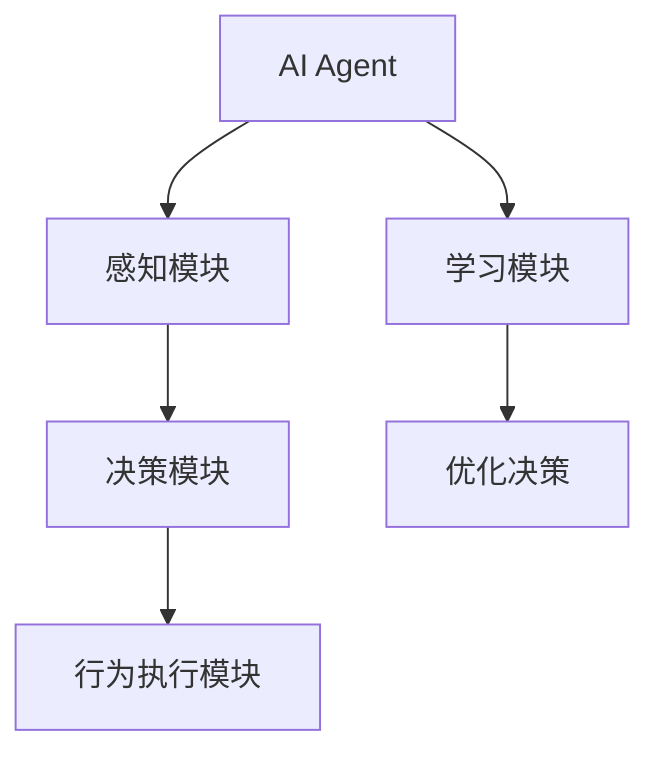
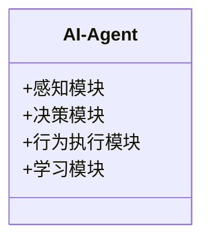
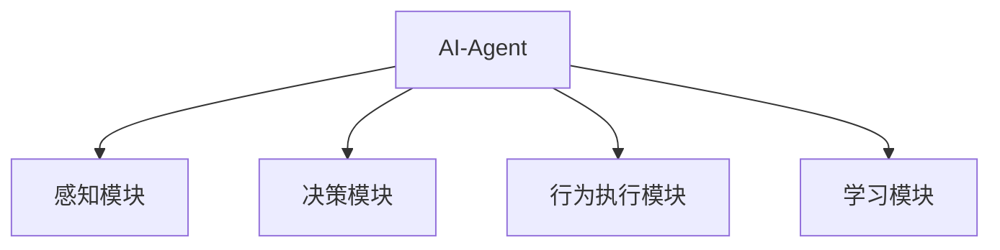
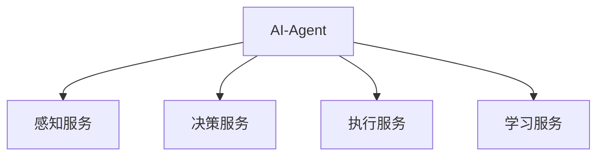
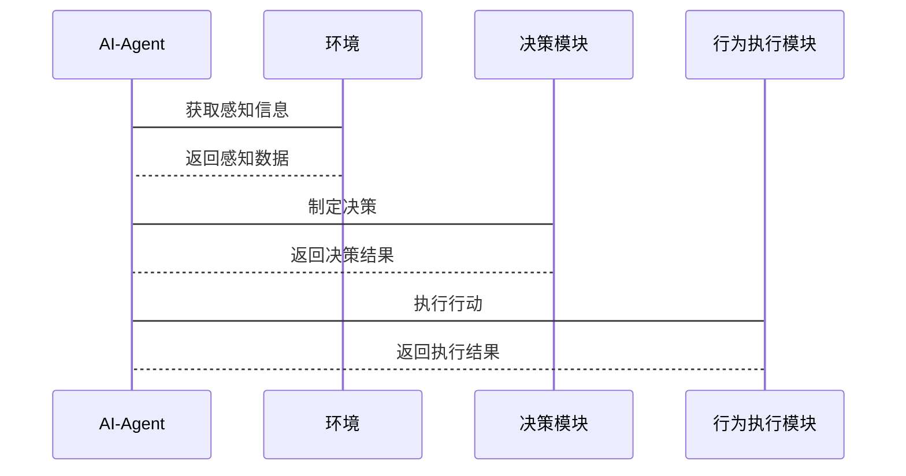

                 


# AI Agent的概念学习：从具体到抽象的认知过程

## 关键词：AI Agent, 人工智能, 机器学习, 强化学习, 系统架构设计

## 摘要：  
本文旨在系统地介绍AI Agent的概念，从具体的应用场景到抽象的理论框架进行全面解析。通过逐步分析AI Agent的核心原理、算法实现、系统架构设计及实际应用案例，帮助读者建立扎实的理论基础和实践能力。文章内容涵盖AI Agent的基本概念、核心原理、算法实现、系统架构设计、项目实战等多个方面，旨在为读者提供一个全面的认知框架。

---

# 第一部分: AI Agent 的概念与背景

## 第1章: AI Agent 的基本概念

### 1.1 AI Agent 的定义与特点

#### 1.1.1 什么是 AI Agent
AI Agent（人工智能代理）是指能够感知环境、自主决策并执行任务的智能实体。与传统程序不同，AI Agent具有主动性，能够在动态环境中适应变化并完成复杂任务。AI Agent的核心在于其“智能”属性，能够通过感知、推理、学习和执行来实现目标。

#### 1.1.2 AI Agent 的核心特点
- **主动性**：AI Agent能够主动采取行动，而非被动响应。
- **反应性**：能够实时感知环境变化并调整行为。
- **学习性**：通过数据和经验不断优化自身的决策能力。
- **社会性**：能够与其他AI Agent或人类进行协作或竞争。

#### 1.1.3 AI Agent 与传统智能体的区别
| 属性       | 传统智能体                          | AI Agent                          |
|------------|------------------------------------|------------------------------------|
| 智能水平    | 通常基于规则或预定义逻辑          | 具备学习和推理能力                |
| 环境适应性  | 难以应对复杂或未预见的环境变化      | 能够适应动态且不确定的环境         |
| 决策机制    | 基于固定的规则或逻辑               | 基于学习和推理的动态决策机制       |

---

### 1.2 AI Agent 的分类与应用场景

#### 1.2.1 基于智能水平的分类
AI Agent可以根据智能水平分为以下几类：
- **反应式AI Agent**：基于当前感知做出反应，适用于实时任务（如自动驾驶）。
- **认知式AI Agent**：具备复杂的推理和规划能力，适用于复杂任务（如智能助手）。
- **学习式AI Agent**：能够通过经验优化自身行为，适用于动态环境（如游戏AI）。

#### 1.2.2 基于功能类型的分类
- **服务型AI Agent**：提供特定服务（如智能客服、推荐系统）。
- **娱乐型AI Agent**：用于游戏、虚拟助手等领域。
- **监控型AI Agent**：用于安全监控、异常检测等任务。

#### 1.2.3 AI Agent 在不同领域的应用
- **智能家居**：控制家电、优化能源使用。
- **自动驾驶**：实时感知环境、规划路径。
- **金融领域**：进行股票交易、风险管理。
- **医疗领域**：辅助诊断、个性化治疗建议。

---

### 1.3 AI Agent 的发展历史与现状

#### 1.3.1 AI Agent 的起源与发展
AI Agent的概念起源于人工智能领域的研究，早期的智能体研究主要集中在逻辑推理和知识表示。随着机器学习和深度学习技术的发展，AI Agent逐渐具备了更强的学习和自适应能力。

#### 1.3.2 当前 AI Agent 的技术趋势
- **强化学习**：成为AI Agent的核心技术之一，尤其在游戏和机器人领域。
- **多智能体协作**：研究如何让多个AI Agent协同工作，提升整体效率。
- **边缘计算**：AI Agent开始向边缘计算方向发展，减少对云端的依赖。

#### 1.3.3 AI Agent 的未来展望
随着5G、物联网和云计算技术的普及，AI Agent将更加智能化和普及化。未来的AI Agent将具备更强的自主决策能力，能够在更广泛的领域中应用。

---

## 1.4 本章小结
本章从基本概念入手，详细介绍了AI Agent的定义、特点、分类及应用场景。通过对比分析，帮助读者理解AI Agent与传统智能体的区别，并展望了其未来的发展趋势。

---

# 第二部分: AI Agent 的核心概念与联系

## 第2章: AI Agent 的核心原理

### 2.1 AI Agent 的感知与决策机制

#### 2.1.1 感知模块的作用与实现
感知模块是AI Agent与环境交互的第一步，负责收集环境中的信息。常见的感知方式包括：
- **传感器感知**：如摄像头、麦克风等。
- **数据解析**：对感知到的信息进行处理和解析。
- **状态表示**：将感知信息转化为AI Agent可以理解的状态表示。

#### 2.1.2 决策模块的逻辑与算法
决策模块是AI Agent的核心，负责根据感知信息制定行动策略。常用的决策算法包括：
- **基于规则的决策**：适用于简单任务。
- **基于逻辑推理的决策**：适用于复杂任务。
- **基于机器学习的决策**：如强化学习、监督学习等。

#### 2.1.3 感知与决策的协同关系
感知模块为决策模块提供输入信息，决策模块根据这些信息生成行动计划。两者协同工作，确保AI Agent能够实时适应环境变化。

---

### 2.2 AI Agent 的行为执行机制

#### 2.2.1 行为规划的基本原理
行为规划是AI Agent根据决策结果制定具体行动方案的过程。常见的行为规划方法包括：
- **贪心算法**：选择当前最优的行动方案。
- **A*算法**：适用于路径规划问题。
- **马尔可夫决策过程（MDP）**：适用于概率环境下的决策。

#### 2.2.2 行为执行的实现方式
行为执行模块负责将决策结果转化为具体的行动。常见的实现方式包括：
- **直接执行**：如移动机器人直接执行命令。
- **中间件控制**：通过中间件实现对设备的控制。
- **人机协作**：与人类协同完成任务。

#### 2.2.3 行为执行中的反馈机制
行为执行过程中，AI Agent需要实时收集反馈信息，用于后续的决策优化。反馈机制包括：
- **状态反馈**：实时更新环境状态。
- **奖励反馈**：强化学习中的奖励机制。

---

### 2.3 AI Agent 的学习与进化

#### 2.3.1 监督学习在 AI Agent 中的应用
监督学习是一种常用的学习方法，适用于任务目标明确的情况。AI Agent可以通过监督学习掌握特定任务的执行方法。

#### 2.3.2 强化学习在 AI Agent 中的应用
强化学习是一种基于奖励机制的学习方法，适用于动态环境中的决策问题。AI Agent通过与环境交互，逐步优化自身的决策策略。

#### 2.3.3 迁移学习在 AI Agent 中的应用
迁移学习是一种将已有的知识应用到新任务中的方法。AI Agent可以通过迁移学习快速掌握新任务，减少训练时间。

---

## 2.4 AI Agent 的核心概念图



---

## 第3章: AI Agent 的算法原理

### 3.1 强化学习算法

#### 3.1.1 强化学习的基本原理
强化学习是一种基于奖励机制的学习方法。AI Agent通过与环境交互，不断优化自身的决策策略。

#### 3.1.2 Q-Learning 算法
Q-Learning是一种经典的强化学习算法，适用于离散动作空间的决策问题。

代码示例：
```python
import numpy as np

class QLearning:
    def __init__(self, state_space, action_space, learning_rate=0.1, gamma=0.9):
        self.q_table = np.zeros((state_space, action_space))
        self.lr = learning_rate
        self.gamma = gamma

    def choose_action(self, state):
        return np.argmax(self.q_table[state])

    def update_q_table(self, state, action, reward, next_state):
        self.q_table[state][action] = self.q_table[state][action] * self.lr + reward + self.gamma * np.max(self.q_table[next_state])
```

#### 3.1.3 DQN 算法
DQN（Deep Q-Network）是一种基于深度学习的强化学习算法，适用于复杂环境中的决策问题。

代码示例：
```python
import torch
import torch.nn as nn

class DQN(nn.Module):
    def __init__(self, input_dim, output_dim):
        super(DQN, self).__init__()
        self.fc = nn.Linear(input_dim, 64)
        self.fc2 = nn.Linear(64, output_dim)

    def forward(self, x):
        x = torch.relu(self.fc(x))
        return torch.relu(self.fc2(x))
```

---

### 3.2 监督学习算法

#### 3.2.1 线性回归
线性回归是一种简单但强大的监督学习算法，适用于回归任务。

公式：
$$ y = \theta x + \beta $$

代码示例：
```python
import numpy as np

def linear_regression(X, y, lr=0.01, iterations=1000):
    theta = np.zeros(X.shape[1])
    for _ in range(iterations):
        y_pred = np.dot(X, theta)
        error = y - y_pred
        theta += lr * np.dot(X.T, error)
    return theta
```

---

### 3.3 无监督学习算法

#### 3.3.1 K-means 聚类
K-means是一种常用的无监督学习算法，适用于聚类任务。

公式：
$$ \text{目标函数} = \sum_{i=1}^{k} \sum_{j=1}^{n} (x_j - c_i)^2 $$

代码示例：
```python
from sklearn.cluster import KMeans

def kmeans_clustering(X, k=2):
    kmeans = KMeans(n_clusters=k)
    kmeans.fit(X)
    return kmeans.labels_
```

---

## 3.4 AI Agent 的算法选择与优化

### 3.4.1 算法选择的依据
- **任务类型**：回归、分类、聚类等。
- **数据特征**：数据量、数据维度、数据分布。
- **计算资源**：算法的计算复杂度。

### 3.4.2 算法优化技巧
- **超参数调优**：如学习率、批量大小等。
- **模型压缩**：减少模型参数，降低计算成本。
- **分布式训练**：利用分布式计算提升训练效率。

---

## 第4章: AI Agent 的系统架构设计

### 4.1 问题场景介绍

#### 4.1.1 系统目标
设计一个能够自主决策的AI Agent，用于实现特定任务。

#### 4.1.2 系统约束
- **实时性**：要求快速响应。
- **可靠性**：确保系统的稳定性。
- **可扩展性**：支持未来功能扩展。

---

### 4.2 系统功能设计

#### 4.2.1 领域模型设计


#### 4.2.2 功能模块划分
- **感知模块**：负责收集环境信息。
- **决策模块**：负责制定行动策略。
- **行为执行模块**：负责执行具体行动。
- **学习模块**：负责优化决策策略。

---

### 4.3 系统架构设计

#### 4.3.1 分层架构


#### 4.3.2 微服务架构


---

### 4.4 系统接口设计

#### 4.4.1 接口定义
- **感知接口**：提供环境信息获取的API。
- **决策接口**：提供决策请求的API。
- **执行接口**：提供行动执行的API。

#### 4.4.2 接口协议
- **RESTful API**：适用于HTTP通信。
- **RPC**：适用于远程过程调用。

---

### 4.5 系统交互流程

#### 4.5.1 交互流程图


---

## 第5章: 项目实战

### 5.1 环境安装

#### 5.1.1 安装依赖
```bash
pip install numpy
pip install torch
pip install matplotlib
```

#### 5.1.2 配置开发环境
- **Python版本**：推荐使用3.7以上版本。
- **IDE选择**：推荐使用PyCharm或VS Code。

---

### 5.2 核心代码实现

#### 5.2.1 AI Agent 的核心实现
```python
class AI-Agent:
    def __init__(self):
        self.sensors = []
        self actuators = []
        self.decision_model = None

    def perceive(self):
        # 获取环境信息
        return [sensor.read() for sensor in self.sensors]

    def decide(self, state):
        # 调用决策模型
        return self.decision_model.predict(state)

    def actuate(self, action):
        # 执行具体行动
        actuator = self.actuators[0]
        actuator.execute(action)
```

---

### 5.3 代码解读与分析

#### 5.3.1 感知模块
```python
class Sensor:
    def read(self):
        # 返回传感器读数
        pass
```

#### 5.3.2 决策模块
```python
class DecisionModel:
    def predict(self, state):
        # 返回决策结果
        pass
```

#### 5.3.3 行为执行模块
```python
class Actuator:
    def execute(self, action):
        # 执行具体行动
        pass
```

---

### 5.4 实际案例分析

#### 5.4.1 案例背景
设计一个简单的AI Agent，用于实现智能家居中的设备控制。

#### 5.4.2 系统实现
```python
class SmartHomeAI:
    def __init__(self):
        self.sensors = [TemperatureSensor(), LightSensor()]
        self.actuators = [SmartLight(), SmartThermostat()]
        self.decision_model = TemperatureControlModel()

    def run(self):
        while True:
            temperature = self.perceive()
            decision = self.decide(temperature)
            self.actuate(decision)

    def perceive(self):
        return [sensor.read() for sensor in self.sensors]

    def decide(self, state):
        return self.decision_model.predict(state)

    def actuate(self, action):
        actuator = self.actuators[0]
        actuator.execute(action)
```

---

### 5.5 项目小结

通过本节的实战项目，读者可以深入了解AI Agent的实现过程。从环境安装到代码实现，再到系统测试，每一个步骤都帮助读者巩固所学知识。

---

## 第6章: 总结与展望

### 6.1 总结
本文从AI Agent的基本概念出发，逐步深入讲解了其核心原理、算法实现、系统架构设计及实际应用案例。通过系统的分析和实践，读者能够全面掌握AI Agent的相关知识。

### 6.2 小结
- **核心概念**：AI Agent是一种具备感知、决策和执行能力的智能实体。
- **算法选择**：根据任务需求选择合适的算法，如强化学习、监督学习等。
- **系统设计**：注重模块化设计，确保系统的可扩展性和可维护性。

### 6.3 注意事项
- **数据质量**：确保数据的准确性和完整性。
- **算法优化**：合理选择超参数，提升算法性能。
- **系统测试**：进行全面的测试，确保系统的稳定性和可靠性。

### 6.4 拓展阅读
- **推荐书籍**：《强化学习（Deep Reinforcement Learning）》、《机器学习实战》。
- **推荐论文**：查阅最新的AI Agent相关研究论文，了解前沿技术。

---

## 作者：AI天才研究院/AI Genius Institute & 禅与计算机程序设计艺术 /Zen And The Art of Computer Programming

---

以上是文章的完整目录和内容框架，接下来将根据以上结构完成具体的章节内容撰写。

