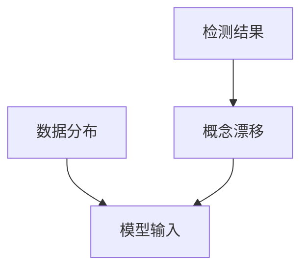
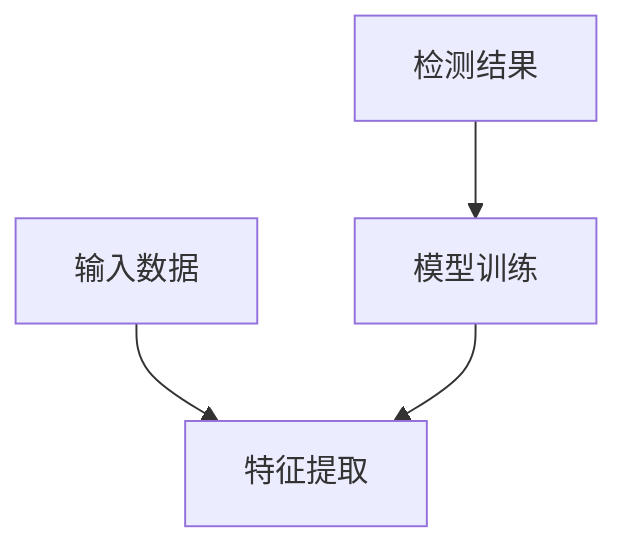
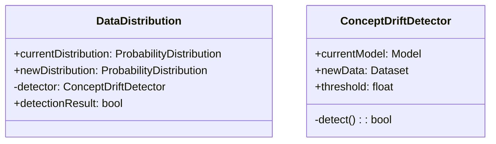
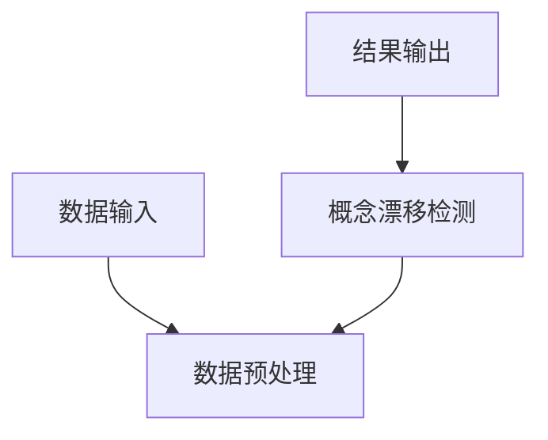

                 


# AI Agent的概念漂移检测与适应策略

## 关键词：AI Agent, 概念漂移, 检测算法, 适应策略, 动态环境, 数据分布

## 摘要：  
概念漂移是指在机器学习模型部署后，由于数据分布的变化导致模型性能下降的现象。本文系统地探讨了AI Agent在动态环境中的概念漂移检测与适应策略，从理论基础到实际应用进行了详细分析，提出了多种检测方法和适应策略，帮助AI Agent在动态环境中保持高性能。

---

# 第1章: 概念漂移的背景与问题描述

## 1.1 什么是概念漂移

### 1.1.1 概念漂移的定义
概念漂移是指在机器学习模型部署后，由于数据分布的变化，导致模型性能下降的现象。这种变化可能由数据源的变化、环境的变化或用户行为的变化引起。

### 1.1.2 概念漂移的分类
概念漂移可以分为以下几类：
1. **突然漂移（Abrupt Drift）**：数据分布的突然变化，例如在金融领域中市场突然崩盘。
2. **渐进漂移（Incremental Drift）**：数据分布的缓慢变化，例如用户偏好逐渐变化。
3. **分布漂移（Distribution Shift）**：数据分布的改变，但类别标签不变。

### 1.1.3 概念漂移的特征
- 数据分布的变化性
- 模型性能的下降
- 动态环境中的适应需求

## 1.2 概念漂移的背景与问题背景

### 1.2.1 机器学习模型的动态环境挑战
机器学习模型在实际应用中面临动态环境的挑战，例如用户行为变化、设备状态变化等，这些变化可能导致模型性能下降。

### 1.2.2 数据分布变化的现实问题
数据分布的变化是概念漂移的核心问题，例如在推荐系统中用户偏好变化可能导致推荐算法失效。

### 1.2.3 AI Agent在动态环境中的适应需求
AI Agent需要在动态环境中不断适应新的数据环境，保持高性能。

## 1.3 概念漂移对AI Agent的影响

### 1.3.1 模型性能下降的后果
概念漂移可能导致AI Agent的预测准确性下降，影响用户体验和业务决策。

### 1.3.2 数据分布变化的检测难度
数据分布的变化可能不明显，检测难度大，需要高效的算法支持。

### 1.3.3 概念漂移的检测与适应需求
AI Agent需要实时检测概念漂移，并采取相应的适应策略，保持性能稳定。

## 1.4 本章小结
本章介绍了概念漂移的定义、分类和特征，分析了其对AI Agent的影响，为后续章节奠定了基础。

---

# 第2章: 概念漂移的核心概念与联系

## 2.1 概念漂移的核心原理

### 2.1.1 数据分布变化的数学模型
概念漂移的核心是数据分布的变化，可以用概率分布来描述。设当前数据分布为$P(x)$，新数据分布为$Q(x)$，概念漂移可以通过比较$P(x)$和$Q(x)$的变化来检测。

### 2.1.2 概念漂移的检测方法
常用的检测方法包括统计方法、机器学习方法和深度学习方法。每种方法都有其优缺点，适用于不同的场景。

### 2.1.3 概念漂移与AI Agent的关系
AI Agent需要实时检测概念漂移，并根据检测结果调整模型参数或更换模型，以适应新的数据环境。

## 2.2 概念漂移的核心属性特征对比

### 2.2.1 概念漂移的检测指标对比
以下是几种常见检测方法的对比：

| 方法          | 优缺点                                                                 |
|---------------|-----------------------------------------------------------------------|
| 统计方法      | 计算简单，但可能无法捕捉复杂的数据分布变化                           |
| 机器学习方法  | 能捕捉复杂模式，但需要大量数据和计算资源                              |
| 深度学习方法  | 能处理高维数据，但训练时间长，计算资源需求高                        |

### 2.2.2 不同检测方法的优缺点分析
统计方法适用于数据分布变化较小的场景，机器学习方法适用于复杂场景，深度学习方法适用于高维数据场景。

### 2.2.3 概念漂移检测的数学公式对比
以下是几种常见检测方法的数学公式：

1. **统计方法**：基于分布差异的检测方法，常用Kullback-Leibler散度公式：
   $$D_{KL}(P||Q) = \sum_{x} P(x)\log\frac{P(x)}{Q(x)}$$

2. **机器学习方法**：基于分类器性能的检测方法，常用roc-auc作为评估指标。

3. **深度学习方法**：基于对抗网络的检测方法，使用生成对抗网络（GAN）来检测数据分布变化。

## 2.3 概念漂移的ER实体关系图



上述图展示了数据分布、模型输入、概念漂移和检测结果之间的关系。

## 2.4 本章小结
本章详细分析了概念漂移的核心原理和检测方法，为后续章节的算法实现奠定了理论基础。

---

# 第3章: 概念漂移检测算法原理

## 3.1 统计方法

### 3.1.1 统计方法的基本原理
统计方法通过比较当前数据和新数据的统计分布差异来检测概念漂移。常用的方法包括卡方检验、Kolmogorov-Smirnov检验等。

### 3.1.2 基于分布差异的检测方法
以下是基于分布差异的检测方法的数学公式：

$$\chi^2 = \sum_{i} \frac{(O_i - E_i)^2}{E_i}$$

其中，$O_i$是观察频数，$E_i$是期望频数。

### 3.1.3 统计方法的优缺点
统计方法计算简单，但可能无法捕捉复杂的数据分布变化。

## 3.2 机器学习方法

### 3.2.1 基于分类器性能的检测方法
该方法通过训练分类器，观察其在新数据上的性能变化来检测概念漂移。常用的性能指标包括准确率、roc-auc等。

### 3.2.2 基于聚类的检测方法
聚类方法通过将数据分成不同的簇，观察簇的变化来检测概念漂移。

### 3.2.3 机器学习方法的数学模型
以下是基于分类器性能的检测方法的数学模型：

$$Accuracy = \frac{CorrectPredictions}{TotalPredictions}$$

## 3.3 深度学习方法

### 3.3.1 基于对抗网络的检测方法
对抗网络通过生成器和判别器的对抗训练来检测数据分布变化。

### 3.3.2 基于自监督学习的检测方法
自监督学习方法通过预训练任务来检测数据分布变化。

### 3.3.3 深度学习方法的优缺点
深度学习方法能够处理高维数据，但训练时间长，计算资源需求高。

## 3.4 算法流程图



上述图展示了概念漂移检测算法的基本流程。

## 3.5 本章小结
本章详细介绍了几种概念漂移检测算法的原理和实现方法，为后续章节的系统设计奠定了基础。

---

# 第4章: 概念漂移检测的数学模型与公式

## 4.1 统计方法的数学模型

### 4.1.1 基于Kullback-Leibler散度的公式
Kullback-Leibler散度用于衡量两个概率分布之间的差异：

$$D_{KL}(P||Q) = \sum_{x} P(x)\log\frac{P(x)}{Q(x)}$$

### 4.1.2 基于Hellinger距离的公式
Hellinger距离用于衡量两个概率分布的相似性：

$$H(P,Q) = \frac{1}{\sqrt{2}} \sqrt{\sum_{x} (\sqrt{P(x)} - \sqrt{Q(x)})^2}$$

## 4.2 机器学习方法的数学模型

### 4.2.1 基于分类器性能的检测方法
分类器性能可以通过准确率、roc-auc等指标来评估：

$$Accuracy = \frac{CorrectPredictions}{TotalPredictions}$$

### 4.2.2 基于聚类的检测方法
聚类方法通过计算簇的变化来检测概念漂移。

## 4.3 深度学习方法的数学模型

### 4.3.1 基于对抗网络的检测方法
对抗网络通过生成器和判别器的对抗训练来检测数据分布变化：

$$\mathcal{L}_G = \mathbb{E}_{z}[D(G(z))]$$
$$\mathcal{L}_D = \mathbb{E}_{x}[D(x)] + \mathbb{E}_{z}[1 - D(G(z))]$$

### 4.3.2 基于自监督学习的检测方法
自监督学习方法通过预训练任务来检测数据分布变化。

## 4.4 本章小结
本章详细分析了概念漂移检测的数学模型和公式，为后续章节的系统设计和项目实现奠定了理论基础。

---

# 第5章: 系统分析与架构设计

## 5.1 问题场景介绍
在动态环境中，AI Agent需要实时检测概念漂移，并根据检测结果调整模型参数或更换模型。

## 5.2 系统功能设计

### 5.2.1 领域模型
以下是领域模型的类图：



### 5.2.2 系统架构设计
以下是系统架构设计的流程图：



## 5.3 接口设计

### 5.3.1 输入接口
- 数据输入接口：接收实时数据流。
- 参数配置接口：配置检测阈值和其他参数。

### 5.3.2 输出接口
- 检测结果输出接口：输出概念漂移检测结果。
- 警报输出接口：当检测到概念漂移时，触发警报。

## 5.4 本章小结
本章详细分析了概念漂移检测系统的功能设计和架构设计，为后续章节的项目实现奠定了基础。

---

# 第6章: 项目实战

## 6.1 环境搭建

### 6.1.1 安装依赖
- Python 3.8+
- Scikit-learn
- TensorFlow
- Mermaid
- Jupyter Notebook

### 6.1.2 数据集准备
选择一个适合的公开数据集，例如Kaggle上的用户行为数据集。

## 6.2 核心代码实现

### 6.2.1 数据预处理
```python
import pandas as pd
from sklearn.preprocessing import StandardScaler

# 加载数据集
data = pd.read_csv('user_behavior.csv')

# 数据预处理
scaler = StandardScaler()
data_scaled = scaler.fit_transform(data)
```

### 6.2.2 概念漂移检测
```python
from sklearn.metrics import accuracy_score

def detect_concept_drift(X_train, X_test, y_train, y_test):
    # 训练分类器
    clf = DecisionTreeClassifier()
    clf.fit(X_train, y_train)
    
    # 预测测试集
    y_pred = clf.predict(X_test)
    accuracy = accuracy_score(y_test, y_pred)
    
    # 如果准确率低于阈值，返回True（检测到概念漂移）
    if accuracy < 0.7:
        return True
    else:
        return False
```

## 6.3 案例分析
以用户行为数据集为例，展示如何部署概念漂移检测系统，并分析检测结果。

## 6.4 项目总结
总结项目实现的关键点，分析可能的优化方向。

---

# 第7章: 最佳实践与小结

## 7.1 最佳实践
- 定期监控模型性能，及时发现概念漂移。
- 选择合适的检测方法，根据数据规模和复杂度选择统计方法、机器学习方法或深度学习方法。
- 优化系统架构，确保实时检测和快速响应。

## 7.2 小结
概念漂移是AI Agent在动态环境中面临的重要挑战，本文详细探讨了概念漂移的检测与适应策略，为实际应用提供了理论支持和实践指导。

## 7.3 注意事项
- 概念漂移检测需要实时性，确保模型能够及时响应。
- 检测方法的选择需要根据具体场景和数据特性进行调整。
- 系统设计需要考虑扩展性和可维护性，确保长期稳定运行。

## 7.4 拓展阅读
推荐阅读相关领域的最新研究论文和技术博客，持续关注概念漂移检测的最新进展。

---

# 作者：AI天才研究院/AI Genius Institute & 禅与计算机程序设计艺术 /Zen And The Art of Computer Programming

