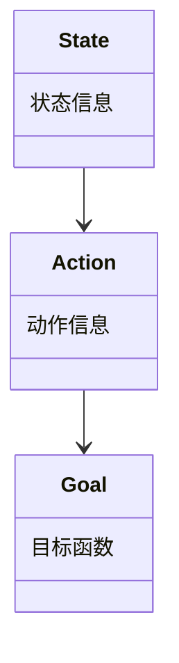
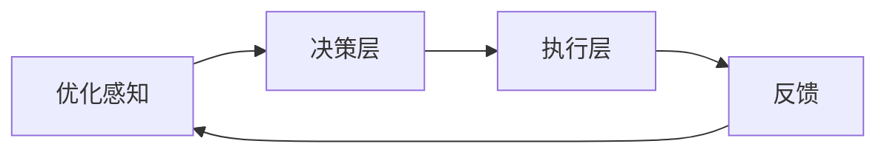
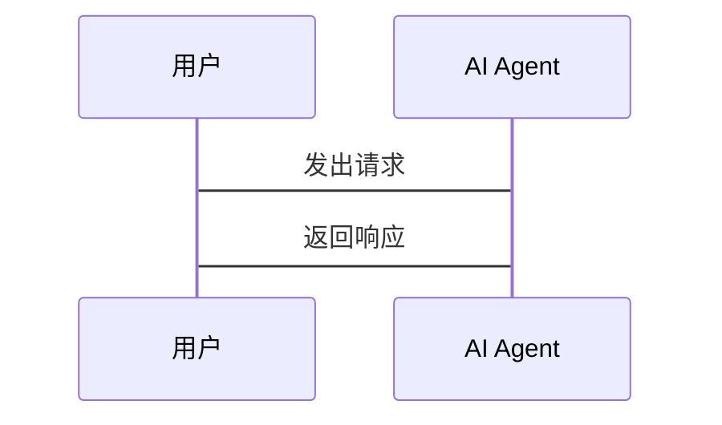
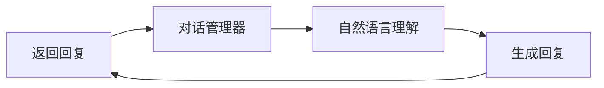

                 


# AI Agent的模仿学习：从人类行为中学习

**关键词：** AI Agent，模仿学习，强化学习，机器学习，自然语言处理

**摘要：**  
模仿学习是一种强大的机器学习方法，允许AI Agent通过观察和模仿人类行为来学习复杂的任务。本文将深入探讨模仿学习的基本原理、算法实现、系统设计以及在实际项目中的应用。通过详细讲解策略梯度、Q-learning等算法，结合系统架构设计和实战案例，帮助读者全面理解如何构建基于模仿学习的AI Agent系统。文章最后还将总结模仿学习的优势与挑战，并给出最佳实践建议。

---

# 第1章: 模仿学习的背景与概念

## 1.1 问题背景与问题描述

### 1.1.1 AI Agent的基本概念  
AI Agent（人工智能代理）是一种能够感知环境、自主决策并执行任务的智能实体。它广泛应用于自动驾驶、智能客服、游戏AI等领域。AI Agent的核心目标是通过学习和推理，完成复杂任务并优化性能。

### 1.1.2 模仿学习的定义与特点  
模仿学习（Imitation Learning）是一种机器学习方法，通过观察和模仿人类或其他智能体的行为来学习任务。与监督学习不同，模仿学习不需要大量标注数据，而是通过模仿示例行为来推断目标函数。其特点包括：数据效率高、任务复杂性低、适用于动态环境等。

### 1.1.3 模仿学习的应用领域  
模仿学习广泛应用于多个领域：  
- **自然语言处理**：如智能对话系统、文本生成。  
- **机器人控制**：如工业机器人操作、服务机器人行为控制。  
- **游戏AI**：如游戏代理学习人类策略。  
- **自动驾驶**：如模仿人类驾驶行为以提高安全性和效率。  

模仿学习与监督学习的主要区别在于数据来源和学习方式。监督学习依赖于标注数据，而模仿学习通过观察行为间接学习目标函数。

---

## 1.2 模仿学习的核心概念与联系

### 1.2.1 核心概念原理  
模仿学习的核心在于通过观察行为推断目标函数。具体来说，AI Agent通过观察人类或其他智能体的行为序列，学习如何在类似的情况下做出相似决策。

### 1.2.2 模仿学习与监督学习的对比分析  
| 对比维度      | 监督学习          | 模仿学习          |
|----------------|-------------------|-------------------|
| 数据来源      | 标签数据          | 行为示范          |
| 学习目标      | 预测目标函数      | 模仿行为策略      |
| 适用场景      | 固定任务          | 动态任务          |

### 1.2.3 ER实体关系图架构  
以下是模仿学习的ER实体关系图：  
```mermaid
er
    actor: 用户
    action: 行为
    agent: AI Agent
    goal: 目标函数
    relation: 模仿关系
    actor -[行为]-> action
    action -[目标]-> goal
    agent -[模仿]-> action
```

---

# 第2章: 模仿学习的算法原理

## 2.1 策略梯度方法

### 2.1.1 策略梯度的核心思想  
策略梯度（Policy Gradient）是一种通过直接优化策略来最大化期望奖励的算法。其核心思想是通过计算策略梯度，更新策略参数以提高奖励。

### 2.1.2 算法流程图  
以下为策略梯度的流程图：  
```mermaid
graph TD
    A[开始] --> B[初始化策略参数θ]
    B --> C[采样动作a]
    C --> D[执行动作a]
    D --> E[获取奖励r]
    E --> F[计算梯度∇θ(∇θ log π_θ(a|s) * r)]
    F --> G[更新策略参数θ]
    G --> A[结束]
```

### 2.1.3 数学模型与公式推导  
策略梯度的优化目标是最大化期望奖励：  
$$ J(θ) = \mathbb{E}[r] $$  
策略梯度的梯度计算公式为：  
$$ \nabla J(θ) = \mathbb{E}[∇ log π_θ(a|s) \cdot r] $$  
其中，$π_θ(a|s)$ 是策略函数。

---

## 2.2 Q-learning算法

### 2.2.1 Q-learning的基本原理  
Q-learning是一种基于价值的强化学习算法，通过学习状态-动作值函数$Q(s,a)$来优化决策。其核心思想是通过更新Q值来逼近最优策略。

### 2.2.2 算法流程图  
以下为Q-learning的流程图：  
```mermaid
graph TD
    A[开始] --> B[选择动作a]
    B --> C[执行动作a]
    C --> D[获取奖励r]
    D --> E[更新Q值：Q(s,a) = Q(s,a) + α(r + γ max Q(s',a))]
    E --> A[结束]
```

### 2.2.3 数学模型与公式推导  
Q-learning的更新公式为：  
$$ Q(s,a) = Q(s,a) + α(r + γ \max Q(s',a')) $$  
其中，$α$ 是学习率，$γ$ 是折扣因子。

---

## 2.3 算法对比与选择

### 2.3.1 策略梯度与Q-learning的对比  
策略梯度直接优化策略，适用于高维动作空间；Q-learning优化价值函数，适用于离散动作空间。选择算法需根据具体任务需求。

### 2.3.2 算法选择的依据  
任务类型、动作空间维度、奖励函数设计等因素会影响算法选择。

### 2.3.3 实际案例分析  
在智能客服对话系统中，动作空间较小，适合使用Q-learning。

---

## 2.4 本章小结

---

# 第3章: 模仿学习的系统架构设计

## 3.1 系统功能设计

### 3.1.1 领域模型设计  
领域模型是系统的核心，定义了AI Agent的行为规范和决策逻辑。以下是领域模型的mermaid图：  


### 3.1.2 系统架构图  
以下是系统架构图：  


### 3.1.3 系统接口设计  
系统接口设计需考虑模块间的通信方式和数据格式。

---

## 3.2 系统交互设计

### 3.2.1 交互流程分析  
以下是系统交互流程图：  


### 3.2.2 交互优化建议  
优化交互设计，提高系统响应速度和用户体验。

---

## 3.3 系统实现与测试

### 3.3.1 环境配置与安装  
环境配置包括安装Python、TensorFlow等依赖库。

### 3.3.2 核心代码实现  
以下是核心代码示例：  
```python
class AI-Agent:
    def __init__(self, states, actions):
        self.states = states
        self.actions = actions
        # 初始化策略参数
        self.theta = np.random.randn(len(states), len(actions))
    
    def policy(self, state):
        # 策略函数
        return np.argmax(self.theta[state])
    
    def update_policy(self, state, action, reward):
        # 策略更新
        self.theta[state][action] += reward
```

### 3.3.3 测试与优化  
通过测试用例验证系统性能，并进行优化。

---

## 3.4 本章小结

---

# 第4章: 项目实战——智能客服对话系统

## 4.1 项目背景与目标

### 4.1.1 项目需求分析  
智能客服需要处理多种对话场景，提供高效的客户支持。

### 4.1.2 项目目标设定  
通过模仿学习训练AI Agent进行自然语言对话。

---

## 4.2 系统功能设计

### 4.2.1 领域模型设计  
定义对话状态、动作和目标函数。

### 4.2.2 系统架构图  
以下是系统架构图：  


---

## 4.3 系统实现与测试

### 4.3.1 环境配置与安装  
安装必要的库，如TensorFlow、Keras。

### 4.3.2 核心代码实现  
以下是核心代码示例：  
```python
def train_agent():
    # 初始化AI Agent
    agent = AI-Agent(states, actions)
    for episode in range(episodes):
        state = env.reset()
        while not done:
            action = agent.policy(state)
            next_state, reward, done = env.step(action)
            agent.update_policy(state, action, reward)
            state = next_state
```

### 4.3.3 测试与优化  
通过测试用例验证系统性能，并进行优化。

---

## 4.4 项目总结与经验分享

### 4.4.1 项目成果展示  
展示训练后的AI Agent在对话任务中的表现。

### 4.4.2 实施过程中的问题与解决方案  
总结项目实施中的问题和解决方案。

### 4.4.3 项目经验总结  
总结项目经验，为后续项目提供参考。

---

## 4.5 本章小结

---

# 第5章: 模仿学习的最佳实践与注意事项

## 5.1 最佳实践Tips

### 5.1.1 数据质量的重要性  
高质量的示范数据是模仿学习成功的关键。

### 5.1.2 算法选择的建议  
根据任务需求选择合适的算法。

### 5.1.3 系统优化的技巧  
优化系统架构和代码性能。

---

## 5.2 模仿学习的注意事项

### 5.2.1 数据偏差的风险  
避免示范数据中的偏差，确保AI Agent的行为符合伦理规范。

### 5.2.2 算法局限性  
了解模仿学习的局限性，合理应用。

### 5.2.3 系统维护与更新  
定期维护和更新系统，适应环境变化。

---

## 5.3 拓展阅读与未来展望

### 5.3.1 模仿学习的前沿领域  
如基于模仿学习的多智能体协作、元学习等。

### 5.3.2 结合其他技术的潜力  
如模仿学习与强化学习的结合。

### 5.3.3 未来发展趋势  
模仿学习在复杂任务中的应用将更加广泛。

---

## 5.4 本章小结

---

# 附录: 模仿学习相关工具与资源

## 附录A: 开发环境配置  
包括Python、TensorFlow等工具的安装与配置。

---

**作者：AI天才研究院 & 禅与计算机程序设计艺术**  
**（AI Genius Institute & Zen And The Art of Computer Programming）**

