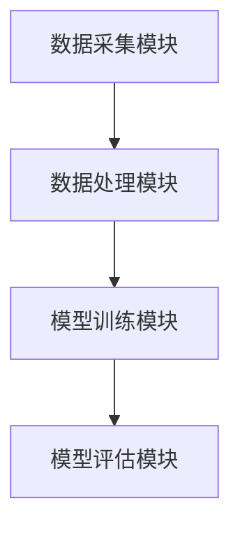
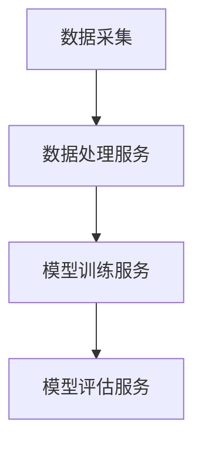

                 


# AI Agent的模仿学习：从人类行为数据中提取知识

> **关键词**：AI Agent，模仿学习，人类行为数据，知识提取，机器学习，数学模型

> **摘要**：模仿学习是一种从人类行为数据中提取知识的有效方法，通过分析人类的决策过程和行为模式，AI Agent可以模仿人类的智能行为，从而实现更高效的任务处理。本文将从模仿学习的基本概念、数学模型、系统架构设计到实际项目实现进行全面解析，帮助读者深入了解如何从人类行为数据中提取知识，并构建高效的AI Agent系统。

---

# 第1章: 模仿学习的基本概念与背景

## 1.1 模仿学习的定义与问题背景

### 1.1.1 从监督学习到模仿学习的演进

模仿学习（Imitation Learning）是机器学习领域的一个重要分支，它通过观察和模仿人类或其他智能体的行为模式，使AI Agent能够完成复杂的任务。与监督学习不同，模仿学习不需要大量标注数据，而是通过学习行为示范（Behavior Demonstrations）来推断任务的目标和策略。

例如，在自动驾驶系统中，模仿学习可以通过学习人类驾驶员的驾驶行为，逐步掌握如何在复杂交通环境中做出决策。

### 1.1.2 模仿学习的核心问题与挑战

模仿学习的核心问题是如何从有限的行为示范中推导出通用的策略。这涉及到以下几个关键挑战：

1. **数据稀疏性**：人类行为数据往往有限，如何从少量数据中提取足够的信息是关键。
2. **策略的泛化能力**：模仿学习的目标是让AI Agent能够在新的场景中灵活应用所学策略。
3. **行为解释性**：如何理解人类行为背后的原因，以便更好地模仿和优化。

### 1.1.3 模仿学习在AI Agent中的应用价值

模仿学习在AI Agent中的应用广泛，包括机器人控制、自然语言处理、游戏AI等多个领域。通过模仿学习，AI Agent能够快速掌握复杂任务，减少试错成本。

---

## 1.2 人类行为数据的特点与提取方法

### 1.2.1 人类行为数据的多样性

人类行为数据可以是图像、文本、语音等多种形式。例如，在自然语言处理中，模仿学习可以通过分析人类对话数据，提取对话策略。

### 1.2.2 数据采集与预处理技术

数据采集是模仿学习的第一步，常用的方法包括：

- **数据标注**：通过人工标注数据，提取行为特征。
- **数据增强**：通过技术手段（如旋转、噪声添加）扩展数据集。
- **数据清洗**：去除无效或噪声数据，确保数据质量。

### 1.2.3 行为数据的特征提取与分析

特征提取是模仿学习的关键步骤，常用的技术包括：

- **统计分析**：计算数据的均值、方差等统计特征。
- **深度学习**：使用CNN、RNN等模型提取高层次特征。
- **行为建模**：通过马尔可夫链等模型建模行为序列。

---

## 1.3 模仿学习的核心概念与边界

### 1.3.1 模仿学习的定义与核心要素

模仿学习是一种通过观察和模仿学习者行为模式来推导任务目标和策略的机器学习方法。其核心要素包括：

1. **行为示范**：人类或其他智能体的行为数据。
2. **策略空间**：可能的动作或决策空间。
3. **奖励机制**：评估行为优劣的标准。

### 1.3.2 模仿学习与其他学习范式的对比

以下是模仿学习与其他学习范式的对比：

| 学习范式 | 核心目标 | 数据类型 | 主要挑战 |
|----------|----------|----------|----------|
| 监督学习 | 预测正确输出 | 标签数据 | 需要大量标注数据 |
| � � 强化学习 | 学习最优策略 | 环境反馈 | 策略收敛困难 |
| 模仿学习 | 复制行为模式 | 行为示范 | 数据稀疏性 |

### 1.3.3 模仿学习的边界与外延

模仿学习的边界在于如何从有限的行为示范中推导出通用策略。其外延包括从单一任务到多任务、从静态环境到动态环境的应用。

---

## 1.4 本章小结

本章介绍了模仿学习的基本概念、核心问题、应用价值以及与其他学习范式的对比。通过理解这些内容，读者可以初步掌握模仿学习的核心思想和应用场景。

---

# 第2章: 模仿学习的数学模型与算法原理

## 2.1 模仿学习的核心原理

### 2.1.1 最大似然估计在模仿学习中的应用

最大似然估计（Maximum Likelihood Estimation, MLE）是模仿学习中常用的方法。通过最大化目标函数，我们可以找到最接近人类行为的策略。

例如，在文本生成任务中，我们可以使用MLE来优化生成模型，使其生成的文本与人类示范数据更接近。

### 2.1.2 贝叶斯框架下的模仿学习模型

贝叶斯方法通过计算后验概率，可以有效地处理不确定性。在模仿学习中，贝叶斯框架可以帮助我们估计行为示范的分布。

公式：
$$P(\theta|D) = \frac{P(D|\theta)P(\theta)}{P(D)}$$

### 2.1.3 模仿学习的损失函数设计

常用的损失函数包括：

- **交叉熵损失**：常用于分类任务。
- **均方误差**：常用于回归任务。
- **KL散度**：用于衡量两个概率分布之间的差异。

---

## 2.2 模仿学习的数学模型

### 2.2.1 最大似然估计公式

$$L(\theta) = \sum_{i=1}^{n} \log P(y_i|x_i,\theta)$$

### 2.2.2 贝叶斯推断公式

$$P(\theta|D) = \frac{P(D|\theta)P(\theta)}{P(D)}$$

---

## 2.3 模仿学习的算法流程

### 2.3.1 数据预处理与特征提取

数据预处理是模仿学习的关键步骤，包括：

1. 数据清洗：去除无效数据。
2. 数据增强：扩展数据集。
3. 特征提取：提取关键特征。

### 2.3.2 模型训练与参数优化

模型训练包括：

1. 选择模型架构。
2. 定义损失函数。
3. 优化参数。

### 2.3.3 模型评估与调优

模型评估包括：

1. 使用验证集评估模型性能。
2. 调整超参数优化模型表现。

---

## 2.4 本章小结

本章详细讲解了模仿学习的数学模型和算法原理，包括MLE、贝叶斯方法和损失函数设计。通过这些内容，读者可以理解模仿学习的理论基础。

---

# 第3章: 模仿学习的系统架构与实现

## 3.1 系统功能设计

### 3.1.1 数据采集与处理模块

数据采集模块负责收集人类行为数据，包括：

- 图像采集：使用摄像头采集图像数据。
- 语音采集：使用麦克风采集语音数据。
- 文本采集：使用输入设备采集文本数据。

### 3.1.2 模型训练与优化模块

模型训练模块包括：

- 模型选择：选择适合任务的模型架构。
- 参数优化：使用梯度下降等方法优化模型参数。

### 3.1.3 模型评估与应用模块

模型评估模块包括：

- 使用测试集评估模型性能。
- 部署模型到实际应用中。

---

## 3.2 系统架构设计

### 3.2.1 分层架构设计



### 3.2.2 微服务架构设计



---

## 3.3 系统接口设计

### 3.3.1 数据接口规范

- 数据输入接口：接收人类行为数据。
- 数据输出接口：输出处理后的数据。

### 3.3.2 模型训练接口

- 训练数据接口：接收训练数据。
- 模型保存接口：保存训练好的模型。

### 3.3.3 模型应用接口

- 模型加载接口：加载预训练模型。
- 模型推理接口：接收输入，输出结果。

---

## 3.4 系统交互流程

### 3.4.1 数据采集与处理流程

1. 数据采集模块接收输入数据。
2. 数据处理模块对数据进行清洗和增强。
3. 处理后的数据传递给模型训练模块。

### 3.4.2 模型训练与优化流程

1. 模型训练模块选择模型架构。
2. 使用训练数据优化模型参数。
3. 保存训练好的模型。

### 3.4.3 模型部署与应用流程

1. 模型加载模块加载预训练模型。
2. 模型推理模块接收输入数据。
3. 输出推理结果。

---

## 3.5 本章小结

本章详细讲解了模仿学习的系统架构设计，包括模块划分、接口设计和交互流程。通过这些内容，读者可以理解如何构建一个高效的模仿学习系统。

---

# 第4章: 项目实战：基于模仿学习的AI Agent实现

## 4.1 项目环境与工具安装

### 4.1.1 环境配置与依赖管理

- 安装Python和相关库（如TensorFlow、PyTorch）。
- 配置开发环境（如Jupyter Notebook）。

### 4.1.2 开发工具与库的安装

- 使用pip安装依赖库：`pip install -r requirements.txt`

---

## 4.2 核心代码实现

### 4.2.1 数据预处理代码

```python
def preprocess_data(data):
    # 数据清洗
    cleaned_data = data.dropna()
    # 数据增强
    augmented_data = cleaned_data.sample(n=1000, replace=True)
    return augmented_data
```

### 4.2.2 模型训练代码

```python
def train_model(data, model):
    # 定义损失函数
    loss = tf.keras.losses.SparseCategoricalCrossentropy()
    # 编译模型
    model.compile(optimizer='adam', loss=loss, metrics=['accuracy'])
    # 训练模型
    model.fit(data, epochs=10, batch_size=32)
    return model
```

### 4.2.3 模型评估代码

```python
def evaluate_model(model, test_data):
    # 评估模型
    loss, accuracy = model.evaluate(test_data)
    print(f"Loss: {loss}, Accuracy: {accuracy}")
    return accuracy
```

---

## 4.3 实际案例分析

### 4.3.1 案例背景介绍

以文本生成任务为例，目标是让AI Agent模仿人类写作风格，生成类似的文章。

### 4.3.2 数据采集与处理

1. 采集人类写作风格的文本数据。
2. 对数据进行清洗和增强。

### 4.3.3 模型训练与优化

1. 使用预处理后的数据训练模型。
2. 调整超参数优化模型性能。

### 4.3.4 模型评估与应用

1. 使用测试集评估模型生成文本的质量。
2. 部署模型到实际应用中。

---

## 4.4 本章小结

本章通过一个实际案例，详细讲解了模仿学习的项目实现过程，包括环境配置、代码实现和案例分析。通过这些内容，读者可以掌握模仿学习的实际应用方法。

---

# 第5章: 最佳实践与注意事项

## 5.1 最佳实践

1. **数据质量**：确保数据的多样性和代表性。
2. **模型选择**：根据任务需求选择合适的模型架构。
3. **评估指标**：选择合适的评估指标衡量模型性能。

## 5.2 小结

模仿学习是一种强大的工具，通过合理的数据处理和模型设计，可以实现高效的AI Agent系统。

## 5.3 注意事项

1. **数据隐私**：处理人类行为数据时，需注意隐私保护。
2. **模型泛化能力**：避免过拟合，确保模型的泛化能力。
3. **性能优化**：优化模型运行效率，降低计算成本。

---

## 5.4 拓展阅读

推荐阅读以下书籍和论文：

- 《Deep Learning》 - Ian Goodfellow
- 《Reinforcement Learning: Theory and Algorithms》 - Richard S. Sutton

---

# 作者

**作者：AI天才研究院/AI Genius Institute & 禅与计算机程序设计艺术 /Zen And The Art of Computer Programming**

---

感谢您的阅读！希望本文能为您提供有价值的信息和启发。

