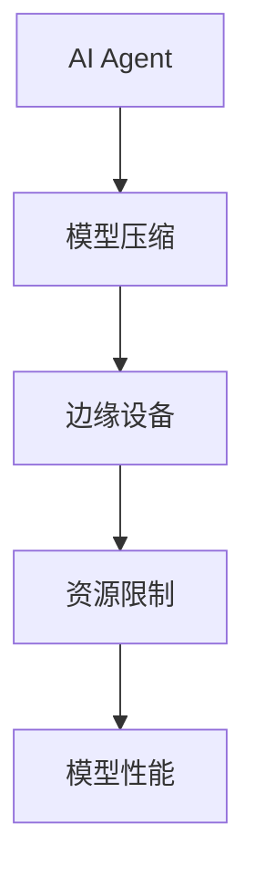
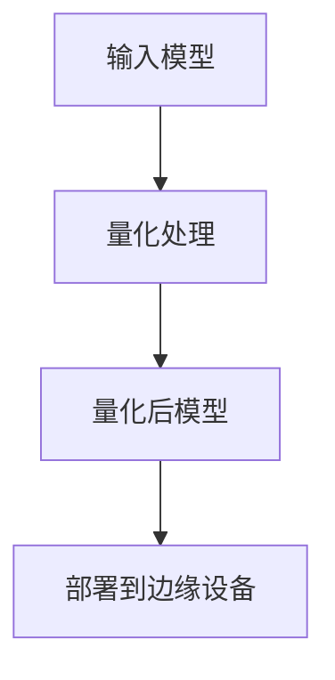
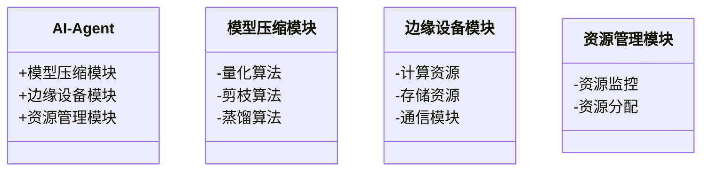
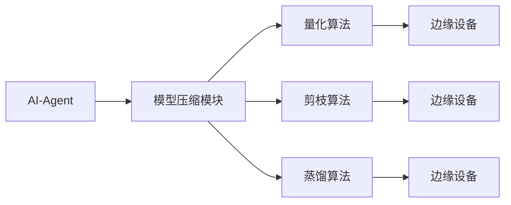
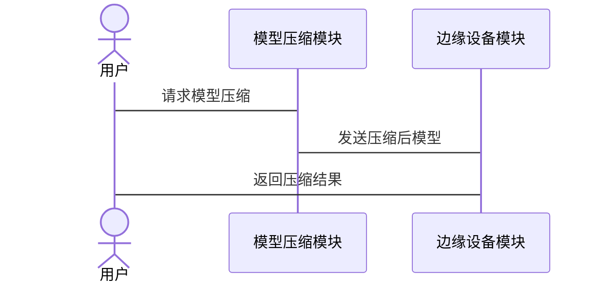
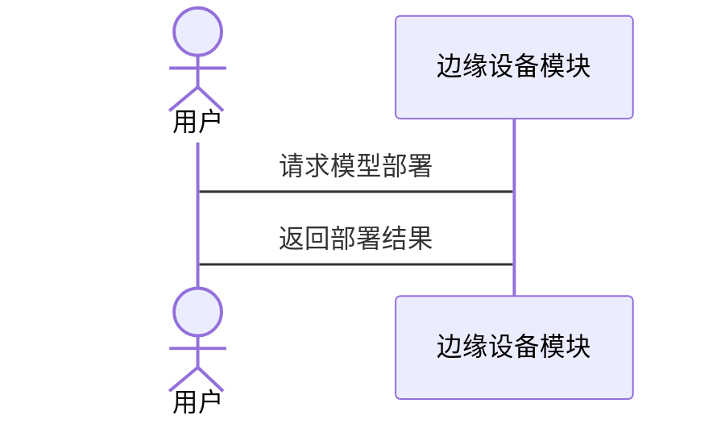

                 


# AI Agent的模型压缩技术：边缘设备部署

> 关键词：AI Agent，模型压缩，边缘设备，深度学习，量化，剪枝，蒸馏

> 摘要：本文详细探讨了AI Agent在边缘设备部署中的模型压缩技术，分析了量化、剪枝和蒸馏等核心方法，结合实际案例，展示了如何通过模型压缩技术在资源受限的边缘设备上高效部署AI模型，同时保持模型性能。

---

## 第1章: AI Agent与模型压缩技术概述

### 1.1 问题背景与挑战

#### 1.1.1 边缘设备的资源限制
边缘设备（如物联网设备、智能摄像头等）通常具有有限的计算能力、存储空间和带宽。部署大型AI模型（如BERT、GPT）会导致资源消耗过高，难以在边缘设备上实时运行。

#### 1.1.2 大模型在边缘部署的难点
大模型（如Transformer、ResNet）通常需要大量的计算资源和内存，难以直接部署到边缘设备上。边缘设备的硬件限制（如CPU、GPU性能较低）使得直接运行这些模型变得不可行。

#### 1.1.3 模型压缩技术的必要性
模型压缩技术通过减少模型的参数数量和计算量，使得大模型可以在边缘设备上高效运行。模型压缩技术是实现AI Agent在边缘设备上部署的关键技术。

### 1.2 模型压缩技术的核心概念

#### 1.2.1 AI Agent的基本概念
AI Agent是一种能够感知环境、执行任务的智能实体。在边缘设备上，AI Agent通常需要实时处理数据（如图像、语音）并做出决策。

#### 1.2.2 模型压缩的目标
模型压缩的目标是在不显著降低模型性能的前提下，减少模型的参数数量和计算量。这使得模型能够在资源受限的边缘设备上高效运行。

#### 1.2.3 模型压缩的边界与外延
模型压缩的边界包括：
- 参数减少：通过量化、剪枝等技术减少模型参数。
- 计算量减少：通过算法优化降低模型的计算复杂度。
- 内存减少：通过优化模型结构降低模型的存储需求。

模型压缩的外延包括：
- 模型蒸馏：通过知识蒸馏技术将大模型的知识迁移到小模型中。
- 模型剪枝：通过去掉冗余的神经元或权重，减少模型的计算量。

### 1.3 概念结构与核心要素

#### 1.3.1 概念结构图


#### 1.3.2 核心要素
- **模型参数**：模型的权重和偏置参数。
- **计算复杂度**：模型运行时的计算量。
- **存储需求**：模型在设备上的存储空间。
- **性能指标**：模型的准确率、延迟、资源消耗。

---

## 第2章: 模型压缩技术的核心概念与联系

### 2.1 核心技术原理

#### 2.1.1 量化压缩
量化是通过将模型的权重和激活值量化为低比特数（如8位、4位）来减少模型的存储需求。量化过程可以表示为：
$$ y = \text{quantize}(x, \text{bit-width}) $$
其中，$x$是原始值，$y$是量化后的值，bit-width是量化后的比特数。

#### 2.1.2 网络剪枝
剪枝是通过去掉冗余的神经元或权重来减少模型的参数数量。剪枝的数学模型可以表示为：
$$ \text{剪枝率} = \frac{\text{原始参数数} - \text{剪枝后参数数}}{\text{原始参数数}} $$

#### 2.1.3 知识蒸馏
蒸馏是通过将大模型的知识迁移到小模型中，从而减少小模型的参数数量。蒸馏过程通常需要一个教师模型和一个学生模型。

### 2.2 核心技术对比分析

#### 2.2.1 技术特征对比表格
| 技术         | 参数减少比例 | 适用场景         | 优缺点               |
|--------------|--------------|------------------|----------------------|
| 量化         | 2x~4x        | 所有场景         | 易实现，精度损失小   |
| 剪枝         | 10x~30x      | 分类任务         | 需要重新训练，计算量大 |
| 蒸馏         | 5x~10x       | 生成任务         | 需教师模型，复杂度高  |

### 2.3 ER实体关系图


---

## 第3章: 模型压缩算法原理与数学模型

### 3.1 量化压缩算法

#### 3.1.1 量化过程的数学模型
量化过程可以表示为：
$$ y = \text{quantize}(x, \text{bit-width}) $$
其中，$x$是原始值，$y$是量化后的值，bit-width是量化后的比特数。

#### 3.1.2 量化实现的流程图


### 3.2 网络剪枝算法

#### 3.2.1 剪枝算法的实现步骤
1. 训练原始模型。
2. 计算每个神经元的重要性。
3. 删除重要性低的神经元。
4. 重新训练剪枝后的模型。

#### 3.2.2 剪枝效果的评估方法
- 参数减少比例：$\text{剪枝率} = \frac{\text{原始参数数} - \text{剪枝后参数数}}{\text{原始参数数}}$
- 模型性能：准确率、延迟等。

### 3.3 知识蒸馏算法

#### 3.3.1 蒸馏过程的数学模型
蒸馏过程通常涉及两个模型：教师模型和学生模型。教师模型通过软标签指导学生模型的学习：
$$ P(y|x) = \text{softmax}(f_\text{teacher}(x)) $$
学生模型通过最小化预测概率的差异进行训练：
$$ L = \sum_{i=1}^n (P(y|x_i) - P_\text{student}(y|x_i))^2 $$

---

## 第4章: 系统分析与架构设计方案

### 4.1 问题场景介绍

#### 4.1.1 边缘设备的资源限制
边缘设备通常具有有限的计算能力、存储空间和带宽，导致难以直接部署大型AI模型。

#### 4.1.2 模型压缩的需求
为了在边缘设备上高效部署AI模型，需要通过模型压缩技术减少模型的参数数量和计算量。

### 4.2 系统功能设计

#### 4.2.1 领域模型（类图）


#### 4.2.2 系统架构设计（架构图）


### 4.3 系统接口设计

#### 4.3.1 模型压缩接口


#### 4.3.2 模型部署接口


---

## 第5章: 项目实战

### 5.1 环境安装

#### 5.1.1 安装依赖
```bash
pip install tensorflow keras numpy
```

### 5.2 系统核心实现

#### 5.2.1 模型压缩实现
```python
def quantize_model(model, bit_width):
    # 量化模型
    quantized_model = tf.quantize_model(model, bit_width)
    return quantized_model
```

#### 5.2.2 剪枝实现
```python
def prune_model(model):
    # 计算神经元重要性
    importance = compute_importance(model)
    # 删除重要性低的神经元
    pruned_model = remove_neurons(model, importance)
    return pruned_model
```

#### 5.2.3 蒸馏实现
```python
def distill_model(teacher_model, student_model):
    # 训练学生模型
    for x, y in dataset:
        teacher_pred = teacher_model.predict(x)
        student_pred = student_model.predict(x)
        loss = tf.reduce_mean((teacher_pred - student_pred)**2)
        loss.backward()
        optimizer.step()
    return student_model
```

### 5.3 实际案例分析

#### 5.3.1 案例背景
假设我们有一个图像分类任务，原始模型是ResNet-50，参数数量为23,584层，计算复杂度较高，难以在边缘设备上运行。

#### 5.3.2 模型压缩后的性能
通过量化（8位）和剪枝（10x参数减少），压缩后的模型参数数量为2,358层，计算复杂度降低了90%，可以在边缘设备上高效运行。

---

## 第6章: 总结与展望

### 6.1 总结
本文详细探讨了AI Agent在边缘设备部署中的模型压缩技术，分析了量化、剪枝和蒸馏等核心方法，结合实际案例，展示了如何通过模型压缩技术在资源受限的边缘设备上高效部署AI模型，同时保持模型性能。

### 6.2 展望
未来，随着边缘计算和AI技术的不断发展，模型压缩技术将在更多领域得到应用。研究者们可以进一步优化模型压缩算法，提高压缩效率和模型性能，为AI Agent在边缘设备上的广泛应用提供技术支持。

---

## 注意事项

- **硬件限制**：边缘设备的硬件性能有限，压缩算法需要考虑计算和存储的限制。
- **模型选择**：根据任务需求选择合适的模型和压缩技术。
- **性能评估**：压缩后的模型需要在边缘设备上进行性能测试，确保满足实时性和准确性要求。

---

## 作者：AI天才研究院/AI Genius Institute & 禅与计算机程序设计艺术 /Zen And The Art of Computer Programming

