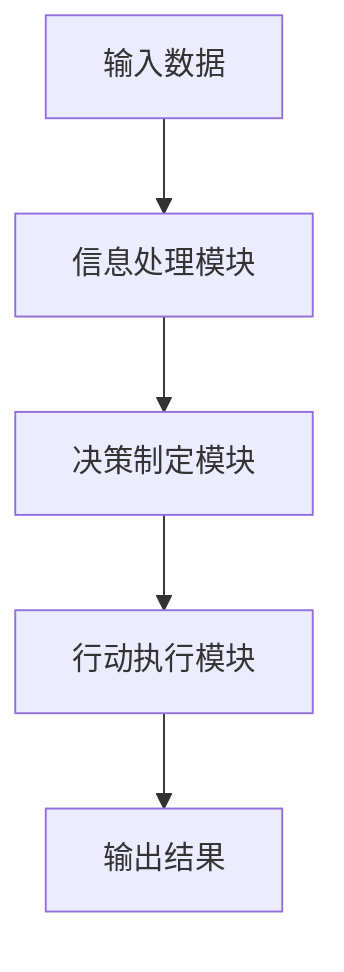
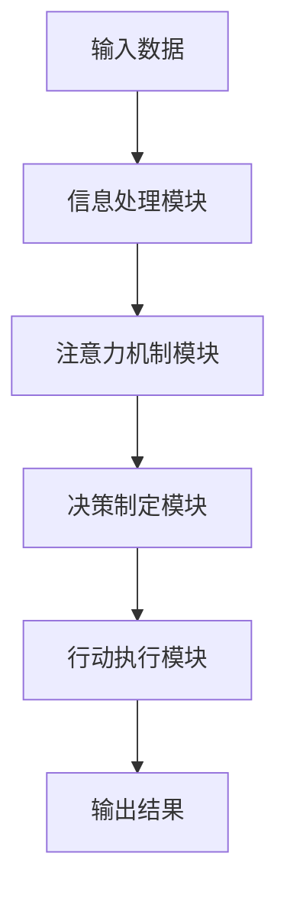

                 

# AI Agent的注意力机制：提升信息处理效率

> 关键词：AI Agent, 注意力机制, 信息处理效率, Transformer模型, 自注意力机制

> 摘要：本文详细探讨了AI Agent中的注意力机制，从基础概念到高级算法，再到实际应用，全面分析了其在提升信息处理效率中的作用。通过数学公式、算法实现和系统架构的设计，深入解析了注意力机制的核心原理，并结合项目实战和优化技巧，展示了如何在实际场景中优化信息处理效率。文章最后总结了注意力机制的发展现状，并展望了未来的研究方向。

---

# 第1章: 注意力机制的背景与概念

## 1.1 注意力机制的起源与演变

### 1.1.1 从传统机器学习到深度学习的演进
- 传统机器学习的特点与局限性
- 深度学习的崛起与Transformer模型的出现
- 注意力机制的提出背景与动机

### 1.1.2 注意力机制的提出与发展
- 神经机器翻译的挑战与需求
- 注意力机制的首次提出与论文《Attention Is All You Need》
- 注意力机制的后续改进与应用

### 1.1.3 AI Agent中的注意力机制应用背景
- AI Agent的核心任务与信息处理需求
- 注意力机制在信息筛选与优先级处理中的作用
- 注意力机制提升信息处理效率的必要性

## 1.2 AI Agent的基本概念

### 1.2.1 AI Agent的定义与特点
- AI Agent的定义
- AI Agent的核心特点：自主性、反应性、目标导向性
- AI Agent的分类与应用场景

### 1.2.2 AI Agent的核心功能与分类
- 信息处理、决策制定、行动执行
- 分类：简单反射型、基于模型的反应型、目标驱动型、实用驱动型
- AI Agent的复杂性与挑战

### 1.2.3 信息处理效率的提升需求
- 信息过载的挑战
- 高效信息处理的必要性
- 注意力机制在信息处理中的关键作用

## 1.3 注意力机制的核心作用

### 1.3.1 信息处理效率提升的必要性
- 信息处理效率的定义
- 高效信息处理的重要性
- 注意力机制在提升效率中的作用

### 1.3.2 注意力机制在信息筛选中的应用
- 信息筛选的核心问题
- 注意力机制在信息筛选中的应用案例
- 注意力机制的优势与局限性

### 1.3.3 注意力机制与AI Agent的结合
- AI Agent中的信息处理流程
- 注意力机制在信息处理中的具体应用
- 注意力机制与其他信息处理技术的结合

## 1.4 本章小结
- 本章主要介绍了注意力机制的背景、AI Agent的基本概念以及注意力机制的核心作用
- 为后续章节的深入分析奠定了基础

---

# 第2章: 注意力机制的核心概念与原理

## 2.1 注意力机制的基本原理

### 2.1.1 注意力机制的数学表达式
- 注意力机制的定义与公式
- 查询（Query）、键（Key）、值（Value）的定义与作用
- 自注意力机制的数学表达

### 2.1.2 查询、键、值的概念与作用
- 查询的作用与意义
- 键的定义与在注意力机制中的作用
- 值的定义与在注意力机制中的作用
- 查询、键、值的关系与相互作用

### 2.1.3 自注意力机制的工作流程
- 自注意力机制的基本流程
- 查询、键、值的计算过程
- 注意力权重的计算与应用

## 2.2 注意力机制的计算方法

### 2.2.1 缩放点积注意力的计算公式
- 缩放点积注意力的公式推导
- 缩放因子的作用与意义
- 点积计算的实现细节

### 2.2.2 多头注意力机制的原理
- 多头注意力的提出背景
- 多头机制的实现流程
- 多头机制的优势与应用场景

### 2.2.3 位置编码与序列建模
- 位置编码的定义与作用
- 常见的位置编码方法：绝对位置编码、相对位置编码
- 位置编码在注意力机制中的应用

## 2.3 注意力机制与传统方法的对比

### 2.3.1 传统特征提取方法的局限性
- 传统特征提取方法的特点与不足
- 传统方法在信息处理中的局限性
- 注意力机制的创新点与优势

### 2.3.2 注意力机制的优势与创新
- 注意力机制的核心优势
- 注意力机制的创新点与突破
- 注意力机制在信息处理中的独特作用

### 2.3.3 两种方法的对比分析
- 传统方法与注意力机制的对比
- 两种方法的优缺点分析
- 适用场景的对比与选择

## 2.4 本章小结
- 本章详细介绍了注意力机制的核心概念与基本原理
- 探讨了注意力机制与传统方法的对比，为后续章节的深入分析提供了理论基础

---

# 第3章: 注意力机制的算法实现与数学模型

## 3.1 Transformer模型的结构解析

### 3.1.1 编码器的组成与功能
- 编码器的基本结构
- 编码器的输入处理与嵌入层
- 编码器中的自注意力机制与前馈网络

### 3.1.2 解码器的结构与作用
- 解码器的基本结构
- 解码器中的自注意力机制与交叉注意力机制
- 解码器的输出层与最终结果

### 3.1.3 自注意力机制的实现细节
- 自注意力机制的实现步骤
- 查询、键、值的计算过程
- 注意力权重的计算与应用

## 3.2 注意力机制的数学公式推导

### 3.2.1 查询、键、值的矩阵表示
- 查询、键、值的矩阵形式
- 点积计算的矩阵表示
- 缩放因子的引入与应用

### 3.2.2 缩放点积注意力的公式推导
- 缩放点积注意力的公式推导
- 各部分的数学表达与推导
- 最终注意力权重的计算公式

### 3.2.3 软最大函数的应用
- 软最大函数的定义与作用
- 软最大函数的数学表达式
- 软最大函数在注意力机制中的应用

## 3.3 多头注意力机制的实现

### 3.3.1 多头机制的引入原因
- 单头注意力机制的局限性
- 多头机制的提出背景
- 多头机制的优势与应用场景

### 3.3.2 多头注意力机制的实现流程
- 多头机制的实现步骤
- 多头注意力权重的计算与应用
- 多头机制的并行计算与优化

### 3.3.3 多头机制的数学模型
- 多头机制的数学表达式
- 多头机制的矩阵表示
- 多头机制的优化与改进

## 3.4 本章小结
- 本章详细介绍了Transformer模型的结构与实现细节
- 推导了注意力机制的数学公式，为后续章节的深入分析提供了理论基础

---

# 第4章: 注意力机制的数学模型与公式

## 4.1 注意力机制的数学表达式

### 4.1.1 自注意力机制的公式推导
- 自注意力机制的数学表达式
- 查询、键、值的计算公式
- 注意力权重的计算公式

### 4.1.2 多头注意力机制的公式推导
- 多头注意力机制的数学表达式
- 多头机制的权重计算公式
- 多头机制的输出结果公式

### 4.1.3 位置编码的数学模型
- 位置编码的定义与作用
- 常见的位置编码方法
- 位置编码的数学表达式

## 4.2 注意力机制的数学推导与分析

### 4.2.1 注意力机制的矩阵表示
- 注意力机制的矩阵形式
- 点积计算的矩阵表示
- 缩放因子的矩阵表示

### 4.2.2 注意力机制的优化与改进
- 注意力机制的优化方法
- 注意力机制的改进方向
- 注意力机制的数学推导与分析

## 4.3 本章小结
- 本章详细推导了注意力机制的数学公式
- 分析了注意力机制的数学模型，为后续章节的深入分析提供了理论基础

---

# 第5章: 注意力机制的系统分析与架构设计

## 5.1 AI Agent的系统架构

### 5.1.1 AI Agent的系统组成
- AI Agent的系统组成与功能模块
- 各模块之间的关系与交互
- 系统架构的设计原则

### 5.1.2 系统功能设计
- 信息处理模块的功能设计
- 决策制定模块的功能设计
- 行动执行模块的功能设计

### 5.1.3 系统架构的Mermaid图

## 5.2 系统架构设计

### 5.2.1 系统架构的Mermaid图

### 5.2.2 系统架构的优化与改进
- 系统架构的优化方向
- 系统架构的改进方法
- 系统架构的数学模型与分析

## 5.3 系统接口设计

### 5.3.1 系统接口的设计原则
- 系统接口的设计原则与规范
- 系统接口的定义与实现
- 系统接口的优化与改进

### 5.3.2 系统接口的Mermaid图

## 5.4 系统交互设计

### 5.4.1 系统交互的Mermaid图

### 5.4.2 系统交互的优化与改进
- 系统交互的优化方向
- 系统交互的改进方法
- 系统交互的数学模型与分析

## 5.5 本章小结
- 本章详细分析了AI Agent的系统架构与设计
- 绘制了系统的Mermaid图，为后续章节的深入分析提供了系统设计的基础

---

# 第6章: 注意力机制的项目实战

## 6.1 项目环境配置

### 6.1.1 环境安装与配置
- 项目所需的环境与工具
- 环境的安装与配置步骤
- 环境的优化与改进

### 6.1.2 项目依赖管理
- 项目的依赖管理方法
- 依赖管理工具的选择与使用
- 依赖管理的优化与改进

## 6.2 系统核心实现

### 6.2.1 信息处理模块的实现
- 信息处理模块的核心实现
- 信息处理模块的代码实现
- 信息处理模块的优化与改进

### 6.2.2 注意力机制模块的实现
- 注意力机制模块的核心实现
- 注意力机制模块的代码实现
- 多头注意力机制的实现与优化

## 6.3 代码实现与功能解读

### 6.3.1 代码实现的详细解读
- 代码实现的详细步骤与解读
- 代码实现的关键点与难点
- 代码实现的优化与改进

### 6.3.2 功能解读与分析
- 功能实现的核心思想
- 功能实现的关键点与难点
- 功能实现的优化与改进

## 6.4 项目实战案例分析

### 6.4.1 案例分析与详细解读
- 案例分析的核心思想
- 案例分析的关键点与难点
- 案例分析的优化与改进

### 6.4.2 案例分析的数学模型与公式
- 案例分析的数学模型
- 案例分析的公式推导
- 案例分析的优化与改进

## 6.5 本章小结
- 本章详细介绍了项目的环境配置与核心实现
- 给出了代码实现与功能解读，为后续章节的深入分析提供了实践基础

---

# 第7章: 注意力机制的优化与提升

## 7.1 注意力机制的优化方法

### 7.1.1 注意力机制的优化方向
- 注意力机制的优化方向与目标
- 注意力机制的优化方法与策略
- 注意力机制的优化效果与评估

### 7.1.2 注意力机制的优化实现
- 注意力机制的优化实现步骤
- 优化实现的关键点与难点
- 优化实现的数学模型与公式

## 7.2 注意力机制的提升策略

### 7.2.1 注意力机制的提升方向
- 注意力机制的提升方向与目标
- 注意力机制的提升方法与策略
- 注意力机制的提升效果与评估

### 7.2.2 注意力机制的提升实现
- 注意力机制的提升实现步骤
- 提升实现的关键点与难点
- 提升实现的数学模型与公式

## 7.3 本章小结
- 本章详细介绍了注意力机制的优化与提升方法
- 给出了优化与提升的数学模型与公式，为后续章节的深入分析提供了理论基础

---

# 第8章: 总结与展望

## 8.1 总结

### 8.1.1 本章总结
- 本文的核心内容与主要结论
- 本文的创新点与突破
- 本文的局限性与不足

### 8.1.2 注意力机制的发展现状
- 注意力机制的最新研究进展
- 注意力机制的应用现状
- 注意力机制的未来发展方向

## 8.2 展望

### 8.2.1 未来研究方向
- 未来的研究方向与目标
- 未来的研究重点与难点
- 未来的研究趋势与预测

### 8.2.2 注意力机制的未来应用
- 注意力机制的未来应用场景
- 注意力机制的未来发展潜力
- 注意力机制的未来挑战与机遇

## 8.3 本章小结
- 本章总结了本文的核心内容与发展现状
- 展望了注意力机制的未来发展方向与应用潜力

---

# 作者：AI天才研究院/AI Genius Institute & 禅与计算机程序设计艺术 /Zen And The Art of Computer Programming

