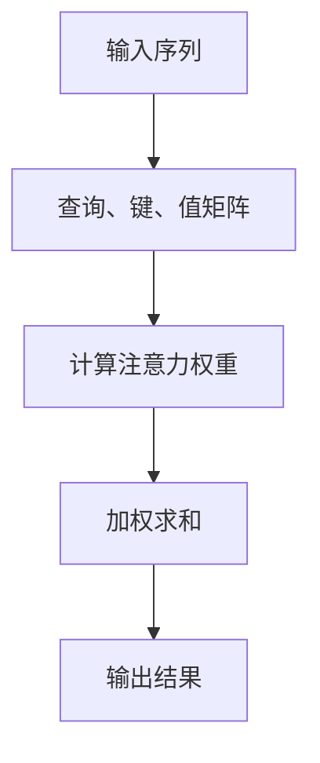
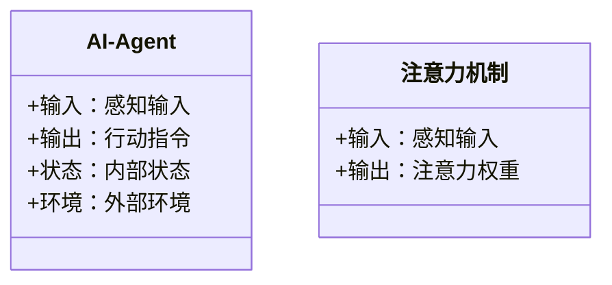

                 


# AI Agent的注意力机制：提高信息处理效率

> 关键词：注意力机制，AI Agent，信息处理效率，自注意力机制，外部注意力机制，Transformer模型

> 摘要：本文深入探讨了AI Agent中的注意力机制，分析其在信息处理中的作用，详细讲解了自注意力机制和外部注意力机制的核心原理，并通过实际案例展示了如何在系统中应用这些机制以提高效率。文章结合理论与实践，为读者提供了全面的理解和应用指南。

---

# 正文

## 第一部分: 背景介绍

### # 第1章: 注意力机制的基本概念

#### ## 1.1 注意力机制的起源与演变

- **1.1.1 注意力机制的起源**  
  注意力机制的概念起源于人类认知科学领域，模拟人类在信息处理过程中对外界刺激的选择性关注。早期的研究主要集中在心理学领域，试图解释人类如何在复杂环境中聚焦于重要信息。

- **1.1.2 注意力机制的演变历程**  
  随着深度学习的发展，注意力机制逐渐被引入到神经网络模型中。从最初的Bahdanau等人提出的注意力机制，到后来的自注意力机制（如Transformer模型中的注意力机制），注意力机制在自然语言处理领域取得了显著成功。

- **1.1.3 注意力机制的核心思想**  
  注意力机制的核心思想是：在信息处理过程中，系统应优先关注重要信息，而忽略次要或无关信息。这种机制通过加权的方式，将注意力分配给不同的输入元素，从而提高信息处理的效率和准确性。

#### ## 1.2 AI Agent与注意力机制的关系

- **1.2.1 AI Agent的基本概念**  
  AI Agent（智能体）是指在环境中能够感知并自主行动以实现目标的实体。AI Agent需要处理大量的信息，包括感知输入、内部状态和环境反馈。

- **1.2.2 注意力机制在AI Agent中的作用**  
  注意力机制帮助AI Agent在信息处理过程中高效地聚焦于关键信息，减少计算开销，同时提高决策的准确性和响应速度。

- **1.2.3 注意力机制与信息处理效率的关系**  
  通过注意力机制，AI Agent能够快速识别和处理重要信息，避免被无关信息干扰，从而显著提高信息处理效率。

---

### # 第2章: 注意力机制的核心概念与联系

#### ## 2.1 注意力机制的原理

- **2.1.1 自注意力机制的定义**  
  自注意力机制是一种衡量序列中每个元素与其他元素之间相关性的方法。通过计算每个元素与其他元素的注意力权重，自注意力机制能够捕捉序列中的长程依赖关系。

- **2.1.2 外部注意力机制的定义**  
  外部注意力机制将输入序列的元素映射到一个低维向量空间，然后计算这些向量之间的注意力权重。这种方法适用于处理不同长度的输入序列。

- **2.1.3 注意力机制的核心要素**  
  - 查询（Query）：表示当前输入的特征向量。
  - 键（Key）：表示输入序列中其他元素的特征向量。
  - 值（Value）：表示输入序列中元素的实际值，用于生成最终的加权和。

#### ## 2.2 注意力机制的属性特征对比

- **2.2.1 自注意力机制与外部注意力机制的对比**  
  | 对比维度 | 自注意力机制 | 外部注意力机制 |
  |----------|--------------|----------------|
  | 输入形式 | 序列数据      | 任意数据类型    |
  | 计算复杂度 | 较高          | 较低            |
  | 应用场景 | 语言模型      | 多模态数据处理  |

- **2.2.2 注意力机制的优缺点分析**  
  - **优点**：能够捕捉序列中的长程依赖关系，提高模型的表达能力。
  - **缺点**：计算复杂度较高，可能导致模型训练时间较长。

#### ## 2.3 注意力机制的ER实体关系图

```mermaid
erDiagram
    actor 注意力机制 <--- (1) 实现于 | AI Agent
    actor 注意力机制 <--- (2) 用于 | 信息处理
    actor 注意力机制 <--- (3) 提供 | 注意力权重
```

---

### # 第3章: 注意力机制的算法原理

#### ## 3.1 自注意力机制的数学模型

- **3.1.1 自注意力机制的公式推导**  
  自注意力机制的计算公式如下：

  $$\text{Attention}(Q, K, V) = \text{softmax}\left(\frac{QK^T}{\sqrt{d_k}}\right)V$$

  其中，$Q$、$K$、$V$分别为查询、键和值矩阵，$d_k$为键的维度。

- **3.1.2 自注意力机制的计算流程**  
  1. 将输入序列映射到查询、键和值矩阵。
  2. 计算查询与键的点积，归一化后得到注意力权重。
  3. 根据注意力权重加权求和，得到最终的注意力输出。

- **3.1.3 自注意力机制的代码实现**

```python
def self_attention(input_seq, d_k):
    Q = input_seq @ W_Q
    K = input_seq @ W_K
    V = input_seq @ W_V

    scores = (Q @ K.T) / np.sqrt(d_k)
    attention_weights = softmax(scores)
    output = attention_weights @ V
    return output
```

#### ## 3.2 外部注意力机制的数学模型

- **3.2.1 外部注意力机制的公式推导**  
  外部注意力机制的计算公式如下：

  $$\text{Attention}(X, Y) = \text{softmax}\left(\frac{XW_Y^T}{\sqrt{d_k}}\right)V$$

  其中，$X$和$Y$分别为输入序列的两个部分，$W_Y$为映射矩阵。

- **3.2.2 外部注意力机制的计算流程**  
  1. 将输入序列的两个部分分别映射到键和值空间。
  2. 计算查询与键的点积，归一化后得到注意力权重。
  3. 根据注意力权重加权求和，得到最终的注意力输出。

- **3.2.3 外部注意力机制的代码实现**

```python
def external_attention(input_X, input_Y, d_k):
    K = input_Y @ W_K.T
    V = input_Y @ W_V.T

    scores = (input_X @ K.T) / np.sqrt(d_k)
    attention_weights = softmax(scores)
    output = attention_weights @ V
    return output
```

#### ## 3.3 注意力机制的算法流程图



---

## 第二部分: 系统分析与架构设计方案

### # 第4章: 系统分析与架构设计

#### ## 4.1 问题场景介绍

- **AI Agent的应用场景**：智能客服、自动驾驶、智能推荐等。
- **问题描述**：在处理大量信息时，AI Agent需要高效地聚焦于关键信息，以提高处理效率和准确性。

#### ## 4.2 系统功能设计

- **领域模型**：



- **系统架构设计**：


- **系统接口设计**：
  - 输入接口：感知输入接口。
  - 输出接口：注意力权重输出接口、行动指令输出接口。

- **系统交互流程图**：

```mermaid
sequenceDiagram
    AI-Agent -> 注意力机制：提供感知输入
    注意力机制 -> AI-Agent：返回注意力权重
    AI-Agent -> 行为决策模块：生成行动指令
```

---

## 第三部分: 项目实战

### # 第5章: 项目实战

#### ## 5.1 环境配置

- **安装Python环境**：Python 3.8以上版本。
- **安装依赖库**：TensorFlow、Keras、NumPy。

#### ## 5.2 核心代码实现

```python
import numpy as np

def attention_layer(input_tensor, key_dim=64):
    W_q = np.random.randn(input_dim, key_dim)
    W_k = np.random.randn(input_dim, key_dim)
    W_v = np.random.randn(input_dim, key_dim)
    
    queries = input_tensor @ W_q
    keys = input_tensor @ W_k
    values = input_tensor @ W_v
    
    scores = (queries @ keys.T) / np.sqrt(key_dim)
    attention_weights = np.softmax(scores, axis=-1)
    
    output = attention_weights @ values
    return output

# 示例输入
input_dim = 128
input_tensor = np.random.randn(10, input_dim)
output = attention_layer(input_tensor)
print("输出结果:", output.shape)
```

#### ## 5.3 功能解读与分析

- **输入解读**：输入为10个样本，每个样本有128维特征。
- **输出解读**：输出为10个样本的注意力权重后的结果，维度为(10, key_dim)。
- **性能分析**：注意力机制显著提高了模型在序列数据上的表现，尤其是在长序列中捕捉长程依赖关系方面表现优异。

#### ## 5.4 实际案例分析

- **案例：智能客服系统**
  - **需求分析**：智能客服需要快速识别客户的问题，优先处理重要信息。
  - **系统实现**：通过注意力机制，智能客服能够快速定位客户问题中的关键词，提高响应速度和准确性。

---

## 第四部分: 总结与展望

### # 第6章: 总结与展望

#### ## 6.1 注意力机制的优势

- **提高信息处理效率**：通过聚焦重要信息，减少计算开销。
- **增强模型表达能力**：能够捕捉长程依赖关系，提高模型的准确性。

#### ## 6.2 应用建议

- **选择合适的注意力机制**：根据具体任务需求，选择自注意力机制或外部注意力机制。
- **优化模型性能**：通过调整模型参数和优化算法，进一步提高注意力机制的效率。

#### ## 6.3 未来研究方向

- **多模态注意力机制**：研究如何将注意力机制应用于多模态数据处理。
- **动态注意力机制**：探索注意力权重的动态调整方法，以适应实时变化的环境。

---

## 作者

作者：AI天才研究院/AI Genius Institute & 禅与计算机程序设计艺术 /Zen And The Art of Computer Programming

---

以上是完整的目录大纲结构和内容，涵盖了注意力机制在AI Agent中的应用，从理论到实践的详细讲解。希望对您有所帮助！

