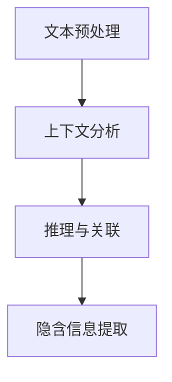
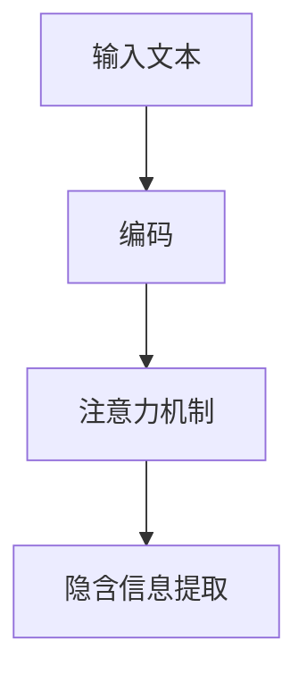
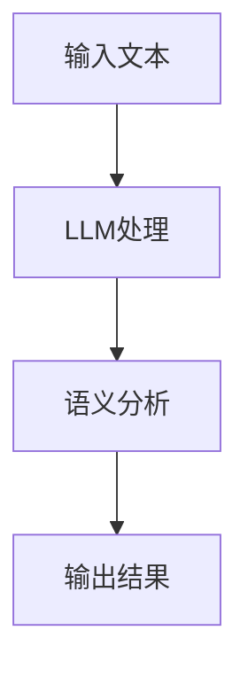
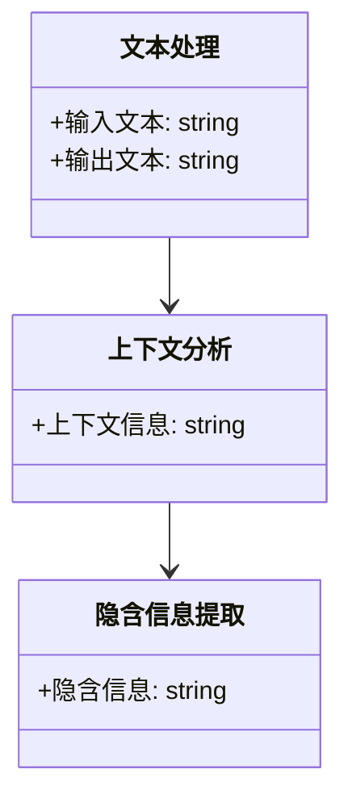
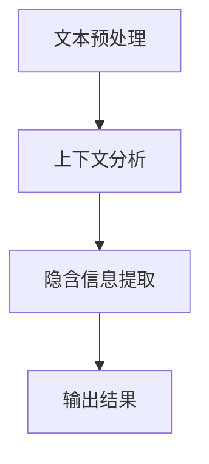

                 


```markdown
# AI Agent的深层语义理解：提升LLM的隐含信息提取

> 关键词：AI Agent、深层语义理解、LLM、隐含信息提取、自然语言处理

> 摘要：本文将深入探讨AI Agent在深层语义理解中的应用，特别是如何提升大型语言模型（LLM）在隐含信息提取方面的能力。通过分析核心概念、算法原理、系统架构以及实际项目案例，我们将揭示如何通过技术手段实现更高效的隐含信息提取，从而提升LLM的语义理解能力。

---

# 第一部分: AI Agent与深层语义理解基础

## 第1章: AI Agent与深层语义理解概述

### 1.1 AI Agent的基本概念

#### 1.1.1 AI Agent的定义与分类
AI Agent（人工智能代理）是指能够感知环境并采取行动以实现目标的智能实体。根据功能和智能水平，AI Agent可以分为以下几类：
- **反应式Agent**：基于当前感知做出反应，适用于简单的任务。
- **认知式Agent**：具备推理、规划和学习能力，适用于复杂任务。
- **混合式Agent**：结合反应式和认知式的特点，适用于复杂动态环境。

#### 1.1.2 深层语义理解的定义与特点
深层语义理解（Deep Semantic Understanding）是指通过分析文本的上下文、语境和隐含含义，理解文本背后的真实意图和信息。其特点包括：
- **上下文依赖性**：理解依赖于上下文信息。
- **隐含性**：需要提取文本中未明说但隐含的信息。
- **多样性**：能够处理多种语言和文化背景的信息。

#### 1.1.3 LLM与AI Agent的结合
大型语言模型（LLM）通过其强大的参数和训练数据，能够实现复杂的语义理解任务。AI Agent作为智能实体，可以利用LLM的能力来提升自身的语义理解能力，从而更好地完成任务。

### 1.2 隐含信息提取的背景与意义

#### 1.2.1 隐含信息提取的背景
在自然语言处理中，隐含信息提取是理解文本深层含义的关键步骤。传统的浅层处理无法满足复杂任务的需求，因此需要更深层次的分析。

#### 1.2.2 隐含信息提取的重要性
隐含信息提取能够帮助AI Agent理解文本的真正意图，从而在对话、问答、文本摘要等任务中表现出色。

#### 1.2.3 LLM在隐含信息提取中的优势
LLM通过大规模预训练，能够捕捉到文本中的隐含信息，并通过微调进一步优化其提取能力。

### 1.3 本书的核心目标与内容框架

#### 1.3.1 核心目标
本文旨在探讨如何通过AI Agent提升LLM的隐含信息提取能力，从而增强语义理解的效果。

#### 1.3.2 内容框架
- 第一部分：AI Agent与深层语义理解基础
- 第二部分：隐含信息提取的核心概念与联系
- 第三部分：深层语义理解的算法原理
- 第四部分：系统分析与架构设计
- 第五部分：项目实战与案例分析
- 第六部分：高级主题与未来展望

#### 1.3.3 读者对象与学习方法
本文适合对AI Agent和自然语言处理感兴趣的读者，建议读者具备一定的编程和机器学习基础，并能够实际操作相关代码。

### 1.4 本章小结
本章介绍了AI Agent和深层语义理解的基本概念，分析了隐含信息提取的重要性和LLM的优势，为后续内容奠定了基础。

---

## 第2章: 深层语义理解的核心概念与联系

### 2.1 深层语义理解的原理

#### 2.1.1 语义理解的基本原理
语义理解通过分析词语的含义、句法结构和上下文信息，推断出文本的深层含义。

#### 2.1.2 深层语义理解的特点
- **上下文敏感性**：理解依赖于上下文。
- **多模态融合**：结合文本、图像等多种信息。
- **动态更新**：能够根据新信息更新理解。

#### 2.1.3 深层语义理解与浅层理解的区别
浅层理解仅关注表面信息，而深层理解挖掘隐藏含义。

### 2.2 隐含信息提取的机制

#### 2.2.1 隐含信息的定义
隐含信息是指文本中未直接表述但可以通过推理得出的信息。

#### 2.2.2 隐含信息提取的流程
1. **文本预处理**：分词、句法分析。
2. **上下文分析**：提取上下文信息。
3. **推理与关联**：通过推理和关联规则提取隐含信息。

#### 2.2.3 隐含信息提取的关键技术
- **基于规则的方法**：利用领域知识和规则进行推理。
- **基于统计的方法**：通过统计分析发现模式。
- **基于模型的方法**：利用深度学习模型进行推理。

### 2.3 AI Agent的语义分析能力

#### 2.3.1 AI Agent的语义分析能力
AI Agent通过结合LLM和自身的推理能力，能够理解并提取文本的深层含义。

#### 2.3.2 语义分析与隐含信息提取的关系
语义分析是隐含信息提取的基础，而隐含信息提取是语义分析的延伸。

#### 2.3.3 AI Agent在隐含信息提取中的作用
AI Agent利用其智能和推理能力，帮助LLM更好地提取隐含信息。

### 2.4 核心概念之间的关系

#### 2.4.1 概念属性特征对比表
| 概念 | 属性 | 特征 |
|------|------|------|
| AI Agent | 智能水平 | 高 |
| 深层语义理解 | 复杂性 | 高 |
| 隐含信息提取 | 依赖性 | 高 |

#### 2.4.2 ER实体关系图架构
```mermaid
er
classDiagram
    class AI Agent {
        +id: int
        +name: string
        +goal: string
    }
    class LLM {
        +model: string
        +parameters: int
    }
    class 隐含信息提取 {
        +input: string
        +output: string
    }
    AI Agent --> LLM: 使用
    LLM --> 隐含信息提取: 提供
```

### 2.5 本章小结
本章详细介绍了深层语义理解的核心概念和隐含信息提取的机制，分析了AI Agent在其中的作用，并通过对比表和ER图展示了概念之间的关系。

---

## 第3章: 深层语义理解的算法原理

### 3.1 隐含信息提取的算法原理

#### 3.1.1 隐含信息提取的基本算法
隐含信息提取的基本算法包括：
- **基于规则的方法**：利用预定义的规则进行推理。
- **基于统计的方法**：通过统计分析发现模式。
- **基于模型的方法**：利用深度学习模型进行推理。

#### 3.1.2 基于上下文的隐含信息提取
基于上下文的隐含信息提取通过分析文本的上下文信息，推断出隐含含义。其实现流程如下：



#### 3.1.3 基于注意力机制的隐含信息提取
基于注意力机制的隐含信息提取能够聚焦于关键部分，提升提取效果。其流程如下：



### 3.2 AI Agent的语义分析算法

#### 3.2.1 基于LLM的语义分析算法
基于LLM的语义分析算法通过利用大型语言模型的强大能力，进行语义理解。其实现步骤如下：



#### 3.2.2 基于规则的语义分析算法
基于规则的语义分析算法通过预定义的规则进行推理，适用于特定领域任务。

#### 3.2.3 基于统计的语义分析算法
基于统计的语义分析算法通过统计分析发现模式，适用于数据驱动的任务。

### 3.3 深层语义理解的数学模型

#### 3.3.1 深层语义理解的数学模型
深层语义理解的数学模型通常基于概率论和深度学习。例如，条件概率公式：

$$ P(y|x) = \frac{P(x|y)P(y)}{P(x)} $$

其中，$y$ 是隐含信息，$x$ 是输入文本。

#### 3.3.2 注意力机制的数学表达
注意力机制通过计算输入文本中各部分的重要性，生成注意力权重：

$$ \alpha_i = \frac{e_i}{\sum_{j} e_j} $$

其中，$e_i$ 是第$i$个词的权重。

### 3.4 本章小结
本章详细介绍了隐含信息提取和AI Agent语义分析的算法原理，并通过数学公式和流程图展示了其实现过程。

---

## 第4章: 系统分析与架构设计

### 4.1 问题场景介绍

#### 4.1.1 问题背景
本文将探讨如何设计一个基于AI Agent的深层语义理解系统，提升隐含信息提取能力。

#### 4.1.2 问题描述
系统需要能够处理多种语言和复杂场景，具备高效的隐含信息提取能力。

#### 4.1.3 问题解决
通过结合LLM和AI Agent，设计一个高效的深层语义理解系统。

### 4.2 系统功能设计

#### 4.2.1 领域模型设计
领域模型设计需要考虑文本处理、上下文分析、隐含信息提取等功能。



#### 4.2.2 系统功能模块
系统功能模块包括文本预处理、上下文分析、隐含信息提取等。

### 4.3 系统架构设计

#### 4.3.1 系统架构图
系统架构图展示了系统的整体结构。



#### 4.3.2 系统接口设计
系统接口设计需要考虑输入输出格式、调用方式等。

#### 4.3.3 系统交互流程
系统交互流程包括用户输入、系统处理、输出结果等步骤。

### 4.4 本章小结
本章通过系统分析和架构设计，明确了系统的功能和结构，为后续实现奠定了基础。

---

## 第5章: 项目实战与案例分析

### 5.1 环境安装

#### 5.1.1 安装Python
安装Python 3.8及以上版本。

#### 5.1.2 安装必要的库
安装`transformers`、`numpy`等库：

```bash
pip install transformers numpy
```

### 5.2 系统核心实现

#### 5.2.1 隐含信息提取实现
实现一个基于LLM的隐含信息提取模块：

```python
from transformers import pipeline

extractor = pipeline("text-classification", model="bert-base-cased")
```

#### 5.2.2 AI Agent实现
实现一个简单的AI Agent：

```python
class AI-Agent:
    def __init__(self):
        self.llm = pipeline("text-generation", model="gpt-2")
    
    def analyze_semantics(self, text):
        # 调用LLM进行语义分析
        return self.llm(text)
```

### 5.3 案例分析与解读

#### 5.3.1 案例分析
分析一个具体案例，展示系统的实现过程。

#### 5.3.2 案例解读
解读案例的实现步骤和结果。

### 5.4 项目小结
总结项目实现的关键点和经验教训。

---

## 第6章: 高级主题与未来展望

### 6.1 提升隐含信息提取的方法

#### 6.1.1 对比学习
对比学习通过对比不同样本，提升模型的区分能力。

#### 6.1.2 多模态融合
多模态融合结合文本、图像等多种信息，提升提取效果。

### 6.2 深层语义理解的挑战与优化

#### 6.2.1 当前挑战
- 数据稀疏性
- 领域适应性
- 实时性要求

#### 6.2.2 优化方向
- 模型压缩
- 知识蒸馏
- 连续学习

### 6.3 隐含信息提取的前沿研究

#### 6.3.1 最新进展
- 对比学习在隐含信息提取中的应用
- 多模态模型的突破

#### 6.3.2 未来方向
- 更高效的算法
- 更广泛的应用场景

### 6.4 本章小结
本章探讨了提升隐含信息提取的方法和深层语义理解的挑战，展望了未来的研究方向。

---

## 第7章: 总结与展望

### 7.1 核心内容回顾
本文详细介绍了AI Agent的深层语义理解，特别是如何提升LLM的隐含信息提取能力。

### 7.2 重要结论
通过结合AI Agent和LLM，可以显著提升隐含信息提取的效果。

### 7.3 未来展望
未来，随着技术的进步，深层语义理解将更加智能化和高效化。

### 7.4 本章小结
总结全文，展望未来发展方向。

---

## 作者信息

作者：AI天才研究院/AI Genius Institute & 禅与计算机程序设计艺术 /Zen And The Art of Computer Programming

---

**注：本文旨在通过清晰的逻辑和专业的技术语言，系统地介绍AI Agent的深层语义理解，特别是如何提升LLM的隐含信息提取能力。通过理论与实践相结合的方式，帮助读者深入理解相关技术原理，并能够应用于实际项目中。**
```

