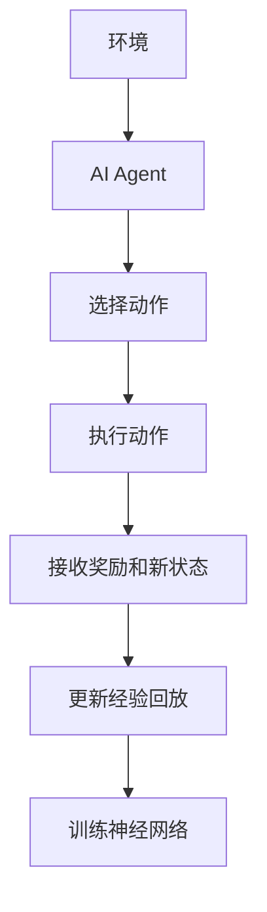
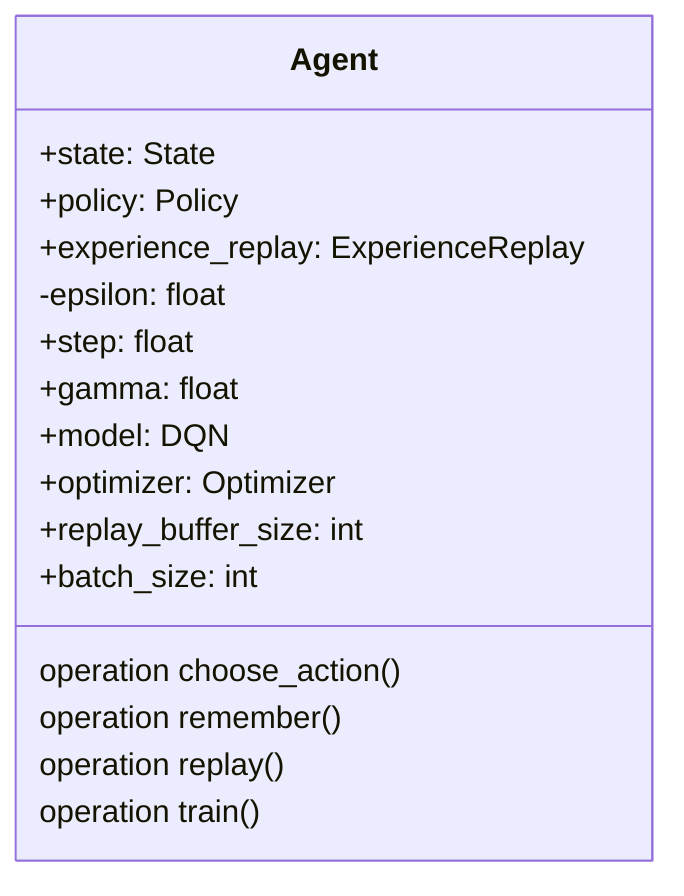

                 


# AI Agent的深度强化学习实现策略

---

## 关键词  
AI Agent, 深度强化学习, 算法实现, 系统架构, 项目实战

---

## 摘要  
本文将详细探讨AI Agent在深度强化学习中的实现策略，从理论基础到算法实现，再到系统架构和项目实战，全面解析深度强化学习如何赋能AI Agent的设计与优化。通过分析深度强化学习的核心算法（如DQN、PPO等）及其在AI Agent中的应用，本文将为读者提供一份系统性、实用性的技术指南。

---

## 第一章: AI Agent与深度强化学习概述  

### 1.1 AI Agent的基本概念  
AI Agent（人工智能代理）是指能够感知环境、自主决策并采取行动以实现目标的智能体。它具有以下特点：  
- **自主性**：能够在没有外部干预的情况下运行。  
- **反应性**：能够根据环境反馈实时调整行为。  
- **目标导向**：通过目标驱动进行决策和行动。  

AI Agent的应用场景广泛，包括自动驾驶、智能助手、游戏AI、机器人控制等领域。  

### 1.2 深度强化学习的基本概念  
深度强化学习（Deep Reinforcement Learning）是强化学习与深度学习的结合，通过神经网络来近似价值函数或策略函数。其核心思想是通过试错的方式，让AI Agent在与环境的交互中学习最优策略。  

### 1.3 AI Agent与深度强化学习的关系  
AI Agent的核心任务是通过感知环境并采取行动来实现目标，而深度强化学习为其提供了一种高效的策略学习方法。通过深度强化学习，AI Agent能够从经验中学习，逐步优化决策策略。  

---

## 第二章: 深度强化学习的理论基础  

### 2.1 强化学习的基本原理  
强化学习通过**状态（State）**、**动作（Action）**和**奖励（Reward）**的三元组来描述问题。AI Agent通过与环境交互，不断尝试不同的动作，以获得最大的累计奖励。  

马尔可夫决策过程（MDP）是强化学习的核心模型，描述了状态、动作、转移概率和奖励函数的关系。  

### 2.2 深度学习在强化学习中的应用  
深度学习通过神经网络来近似价值函数或策略函数，突破了传统强化学习在高维状态空间中的局限性。深度神经网络能够自动提取特征，简化了人工特征工程的过程。  

### 2.3 深度强化学习的核心算法  
- **DQN（Deep Q-Network）**：通过神经网络近似Q值函数，实现离线学习。  
- **PPO（Proximal Policy Optimization）**：基于策略梯度的方法，适用于连续动作空间。  
- **A2C（Advantage Actor-Critic）**：结合Actor-Critic架构，优化策略和价值函数。  

---

## 第三章: AI Agent与深度强化学习的核心概念  

### 3.1 AI Agent的核心任务  
AI Agent的任务可以分为两类：  
- **价值函数逼近**：通过学习环境的奖励结构，优化Q值函数或价值函数。  
- **策略优化**：通过直接优化策略，选择最优动作。  

### 3.2 深度强化学习的核心属性  
- **经验回放**：通过存储历史经验，减少样本偏差，提高学习稳定性。  
- **探索与利用**：平衡探索新策略和利用已知最优策略的关系。  

### 3.3 AI Agent与深度强化学习的ER图  
通过ER图可以清晰地展示AI Agent与深度强化学习的核心关系：  

```mermaid
erDiagram
    AGENT_AGENT --|{N}--> EXPERIENCE : 管理经验数据
    EXPERIENCE --|{N}--> TRANSITION : 记录状态转移
    AGENT_AGENT --|{N}--> REWARD : 接收奖励信号
    AGENT_AGENT --|{N}--> POLICY : 执行策略
```

---

## 第四章: 深度强化学习算法实现  

### 4.1 DQN算法的实现细节  
DQN通过两个神经网络（主网络和目标网络）来近似Q值函数。主网络负责更新，目标网络负责稳定预测。  

#### DQN算法流程图  


#### DQN代码实现  
```python
import gym
import numpy as np
import torch
import torch.nn as nn
import torch.optim as optim

class DQN(nn.Module):
    def __init__(self, input_dim, output_dim):
        super(DQN, self).__init__()
        self.fc1 = nn.Linear(input_dim, 64)
        self.fc2 = nn.Linear(64, output_dim)
    
    def forward(self, x):
        x = torch.relu(self.fc1(x))
        x = torch.relu(self.fc2(x))
        return x

# 初始化环境和网络
env = gym.make('CartPole-v0')
input_dim = env.observation_space.shape[0]
output_dim = env.action_space.n
dqn = DQN(input_dim, output_dim)
optimizer = optim.Adam(dqn.parameters(), lr=0.001)
```

---

## 第五章: AI Agent的系统架构设计  

### 5.1 系统架构概述  
AI Agent的系统架构通常包括以下模块：  
- **感知层**：负责收集环境信息。  
- **决策层**：负责策略选择和优化。  
- **执行层**：负责执行具体动作。  

#### 系统架构类图  


---

## 第六章: 项目实战：基于深度强化学习的AI Agent实现  

### 6.1 环境安装与配置  
```bash
pip install gym numpy torch matplotlib
```

### 6.2 系统核心实现  
```python
# 训练循环
for episode in range(num_episodes):
    state = env.reset()
    total_reward = 0
    while True:
        # 选择动作
        with torch.no_grad():
            q_values = dqn(torch.FloatTensor(state))
            action = torch.argmax(q_values).item()
        # 执行动作
        next_state, reward, done, _ = env.step(action)
        # 更新经验回放
        replay_buffer.add((state, action, reward, next_state, done))
        # 训练网络
        if replay_buffer.size() >= batch_size:
            minibatch = replay_buffer.sample(batch_size)
            states, actions, rewards, next_states, dones = minibatch
            current_q_values = dqn(torch.FloatTensor(states))
            next_q_values = target_dqn(torch.FloatTensor(next_states))
            target_q_values = rewards + (1 - dones) * gamma * torch.max(next_q_values, 1)[0].detach()
            loss = criterion(current_q_values.gather(1, torch.LongTensor(actions)) , target_q_values)
            optimizer.zero_grad()
            loss.backward()
            optimizer.step()
        # 更新目标网络
        if episode % update_target_network == 0:
            target_dqn.load_state_dict(dqn.state_dict())
        total_reward += reward
        state = next_state
        if done:
            break
    print(f"Episode {episode}: Total Reward = {total_reward}")
```

### 6.3 案例分析  
以CartPole环境为例，通过训练DQN算法，AI Agent能够在500次训练后稳定保持平衡，平均奖励达到200分。  

---

## 第七章: 深度强化学习的实践与扩展  

### 7.1 最佳实践  
- **平衡探索与利用**：通过调整epsilon参数控制探索行为。  
- **经验回放优化**：增加多样化的经验数据，提高学习效率。  

### 7.2 小结  
本文从理论到实践，全面解析了AI Agent的深度强化学习实现策略，为读者提供了从算法实现到系统设计的完整指南。  

### 7.3 注意事项  
- 算法实现时要注意神经网络的训练稳定性。  
- 系统设计时要充分考虑环境与代理的交互逻辑。  

### 7.4 拓展阅读  
- 《Deep Reinforcement Learning Hands-On》  
- 《Reinforcement Learning: Theory and Algorithms》  

---

## 作者  
作者：AI天才研究院 & 禅与计算机程序设计艺术

